1. BB：突破块。MSB形成了一个新的Bos后，原来的OB就会形成BB，支阻互换
    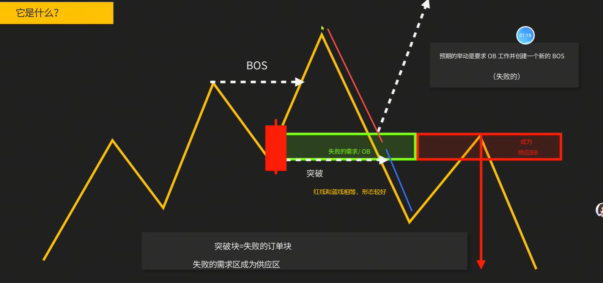
2. BB就是失败的ob
    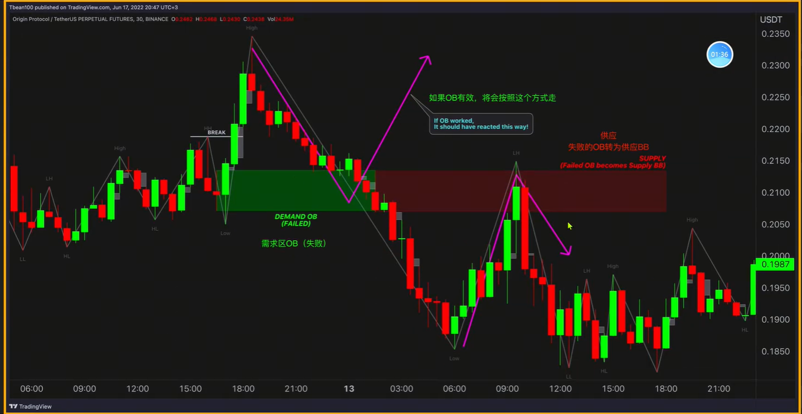
3. MSB突破后，回调回来在突破那一腿的0.5的位置是比较标准的
4. MSB突破后的回调，继续原有突破MSB的腿，目标为可以ab=cd，即等于突破MSB的那一腿
    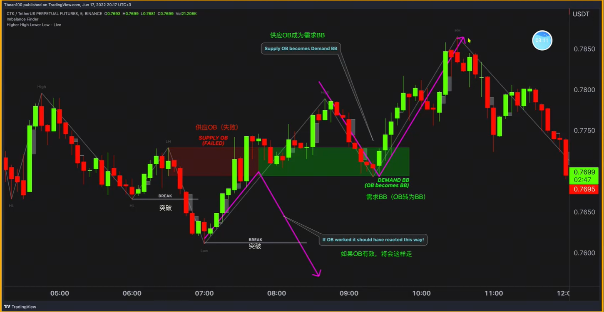
5. OB与BB形成S/B翻转，即支阻互换
    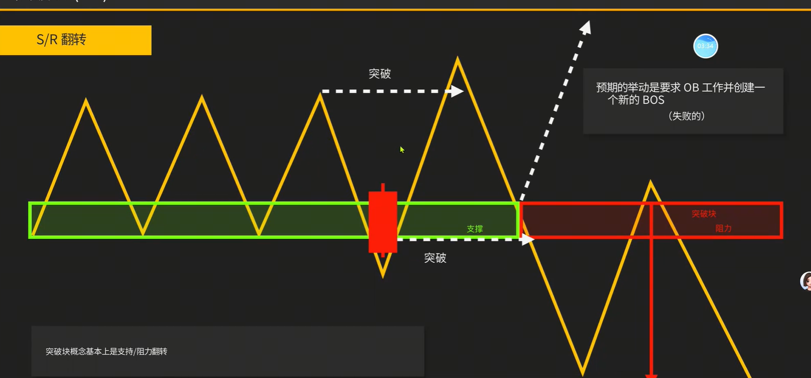
    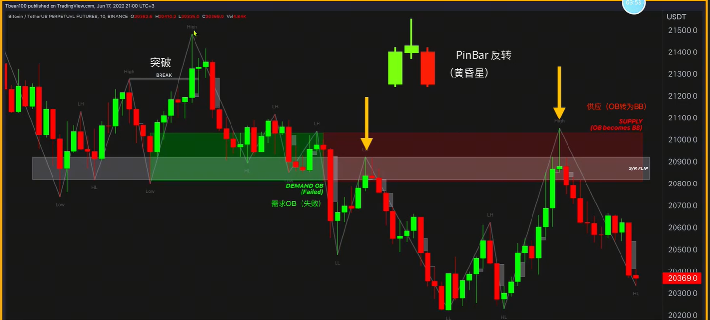
6. 最佳突破块：弱Bos、强力突破、存在FVG缺口、强烈的S/R翻转
    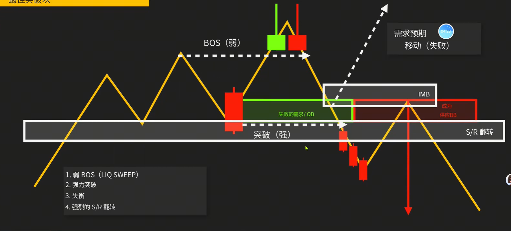
    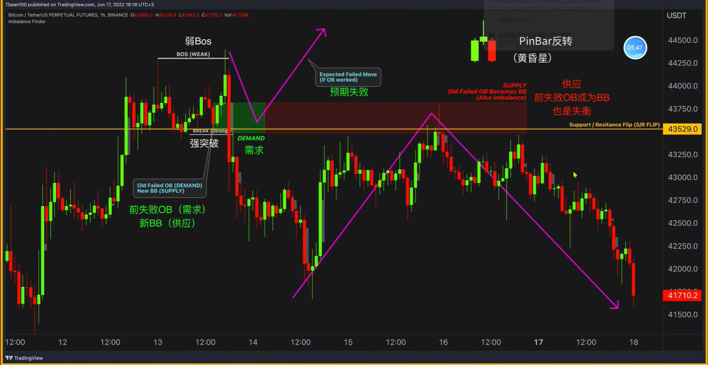
7. 高质量的突破
    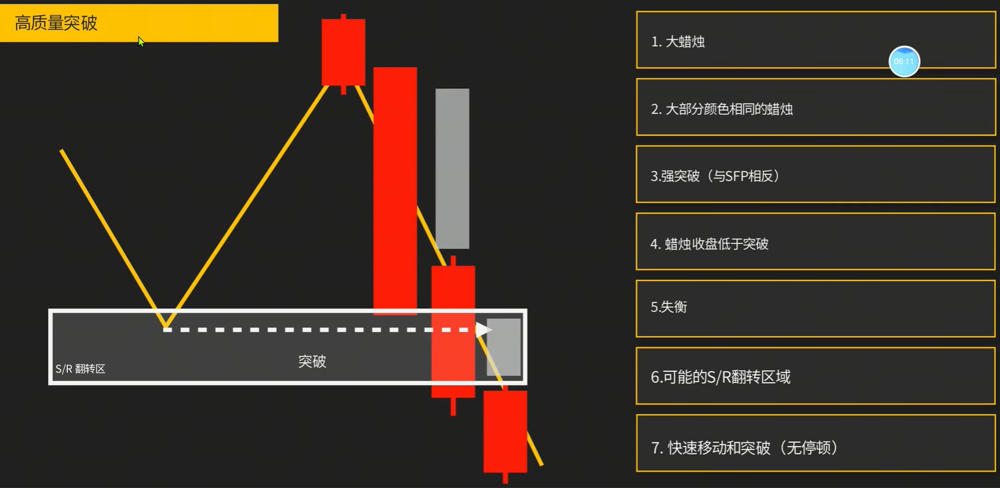
    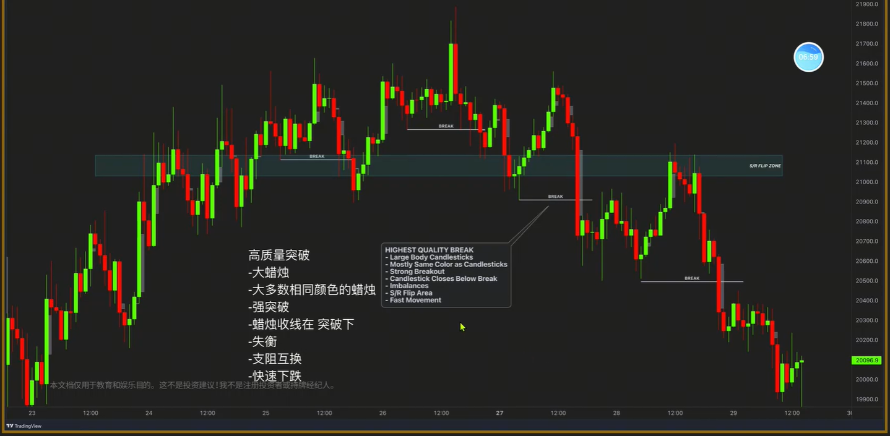
8. 高品质的MSB
    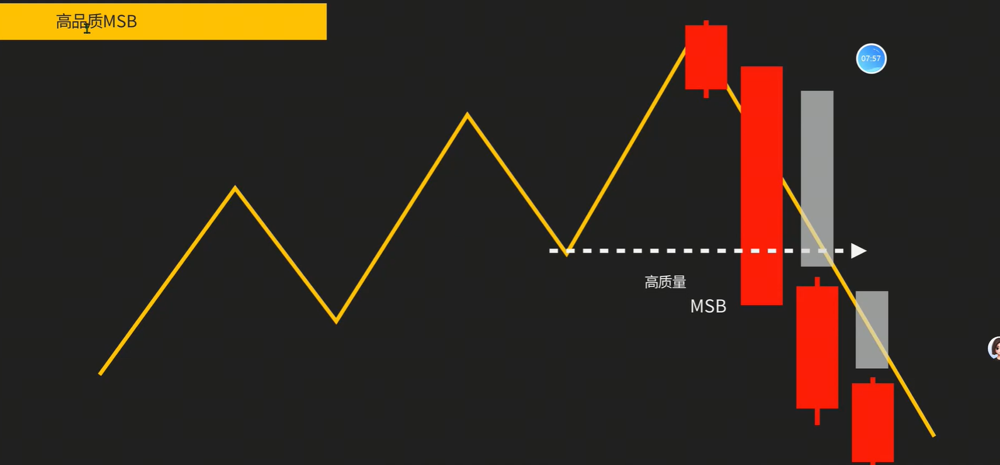
    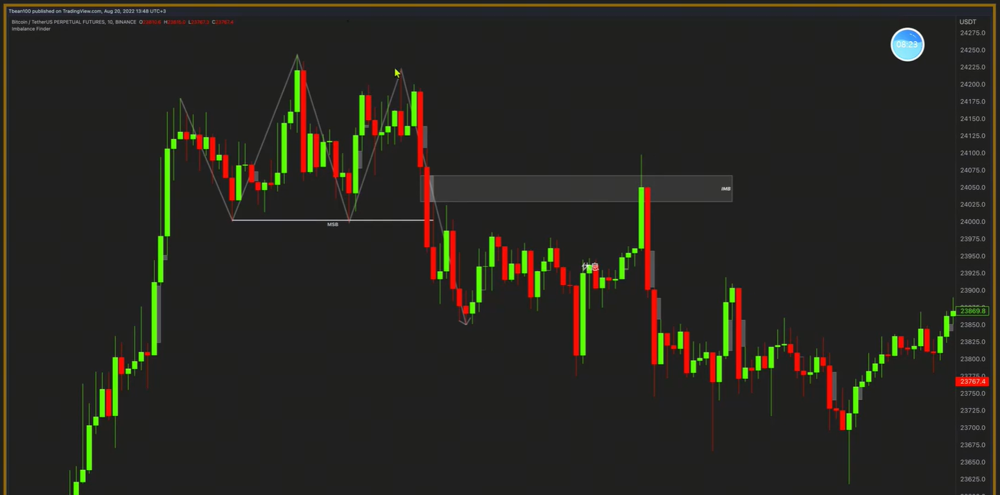
9. 高品质的BOS，形容趋势延续
    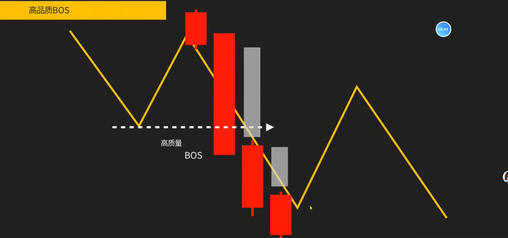
    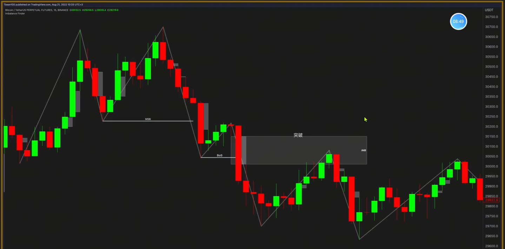
10. 高品质的S/R翻转
    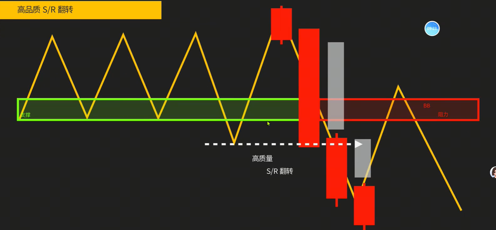
    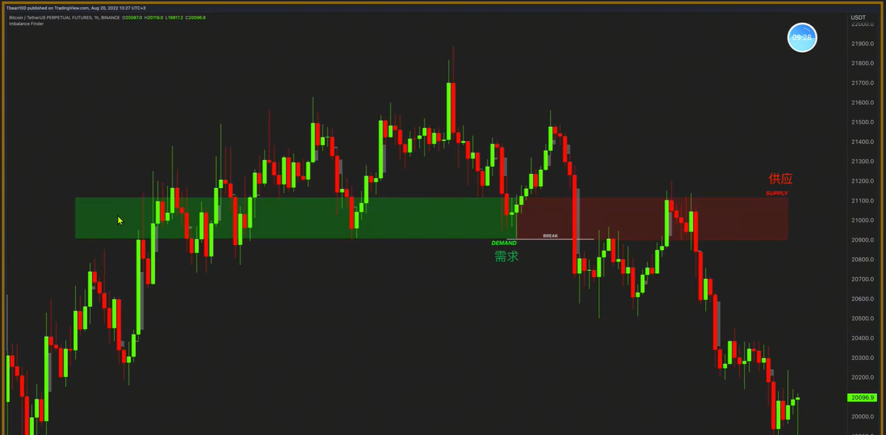