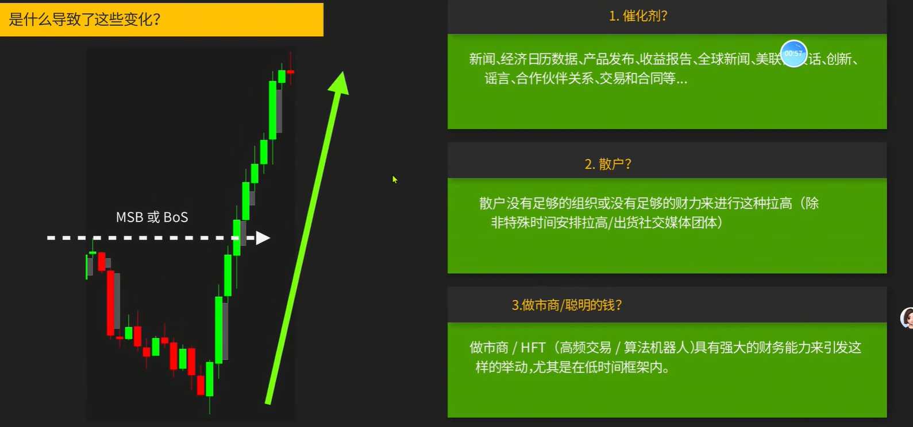
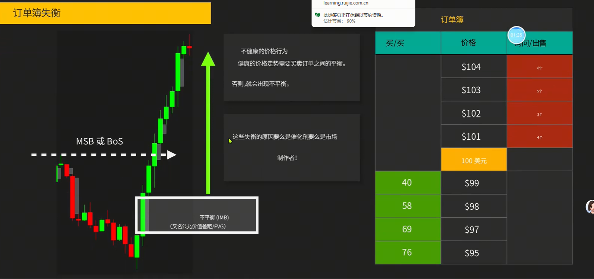
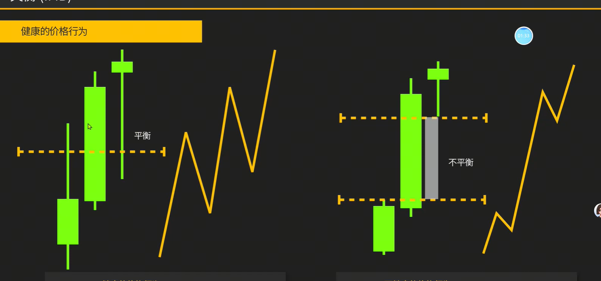
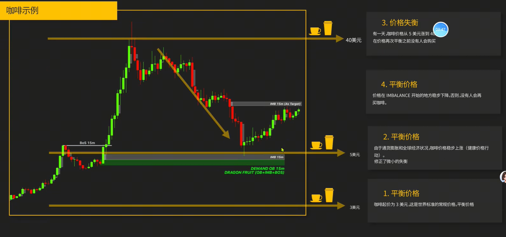
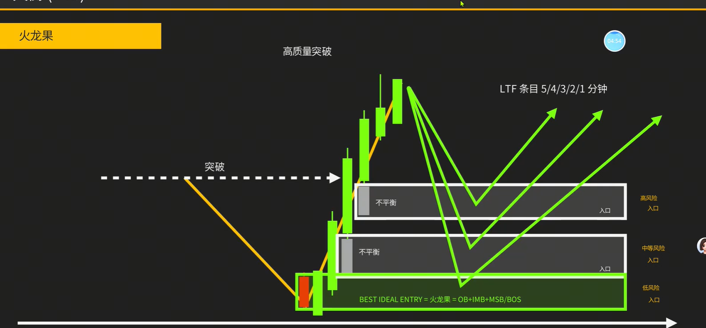
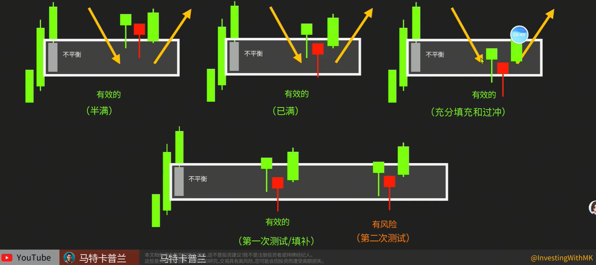
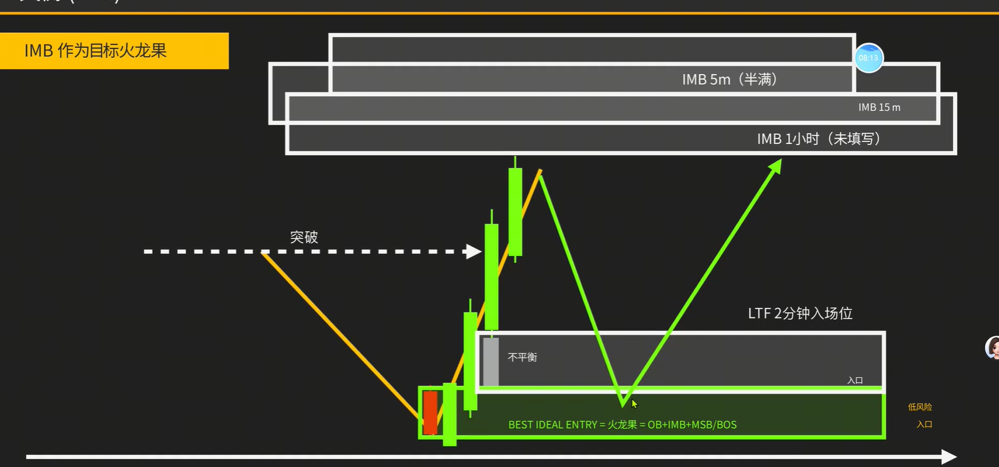
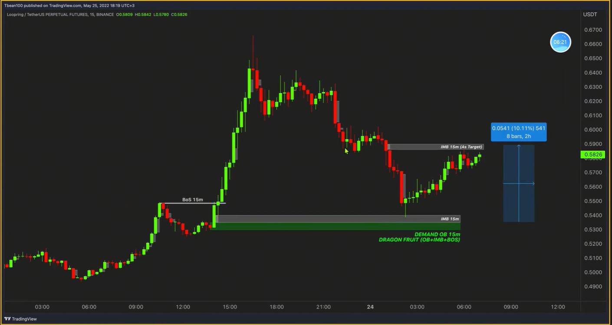
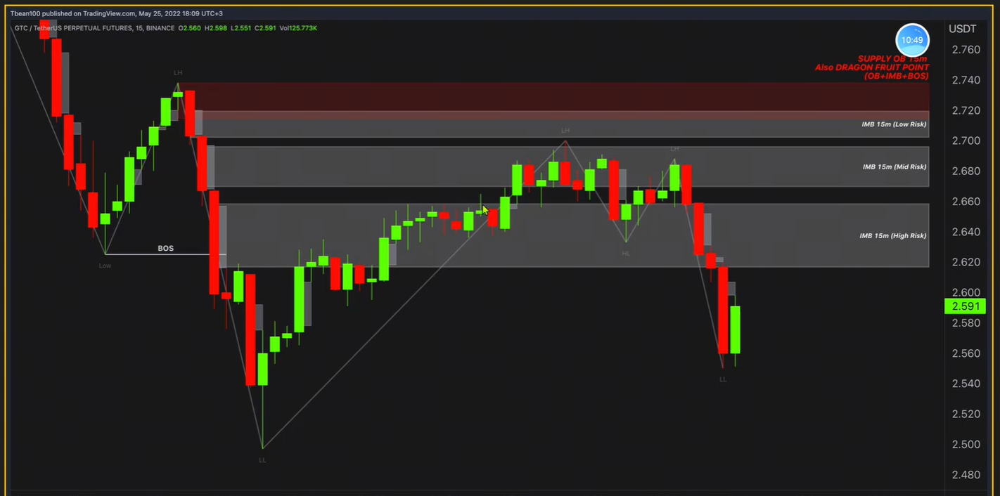
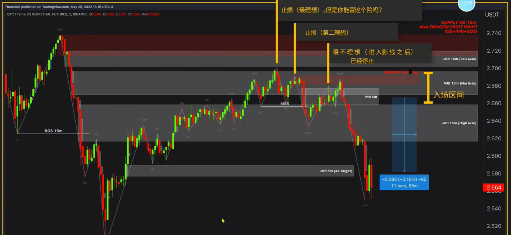

1. IMB和FVG是同一个意思，即连续的大阳线or大阴线，纯散户无法构成失衡。俗称缺口
    
    > FVG会吸引价格回来进行测试
2. 订单簿失衡
    
    > 理解为移动的支撑位或阻力位，且只能用一次
3. 平衡与失衡的对比
    
    > 有缺口通常代表趋势强势
4. 用咖啡举例，容易理解缺口
    
5. FVG缺口的用法
    
6. 缺口的特性：
    - 一次性的
    - 要一眼让人就能看到（挨着ob的不平衡是好的）
    > 大家用的最多的是，挨着OB的缺口
7. 如何利用缺口入场？
    
    
    
    
    