1. OB：Order Block，俗称外包。价格行为中叫Order Size Bar。
2. 核心：先有MSB，后有OB
3. 看涨OB：哪个摆动使MSB？因此，最后一个红色烛台开始摆动我们的牛势订单块（需求）
    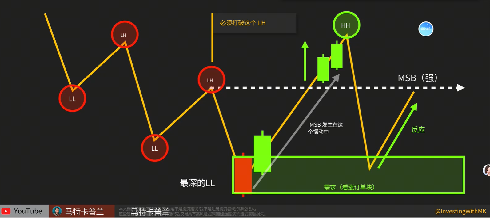
    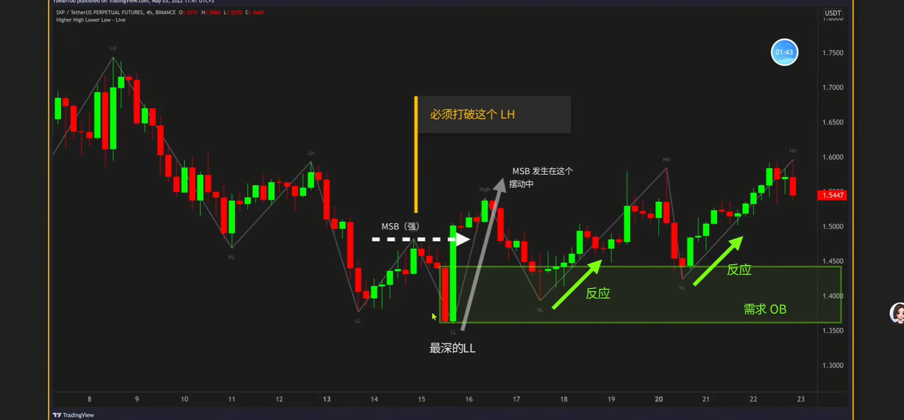
4. 看跌OB：哪个摆动使MSB？因此，最后一个绿色烛台开始摆动我们的熊势订单块（需求）
    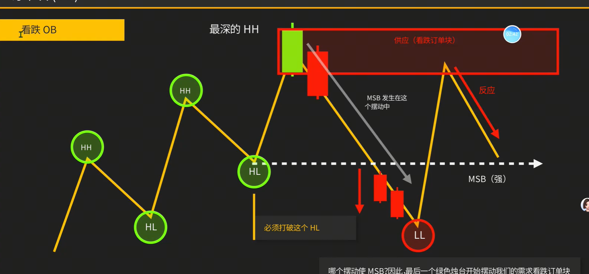
    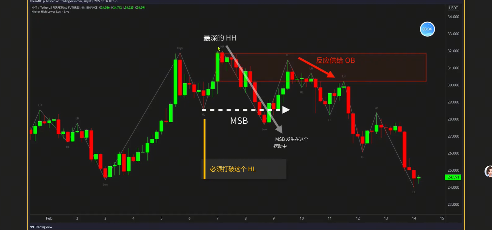
5. 整合形成的MSB，寻找OB
    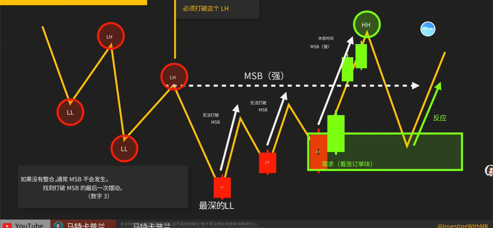
    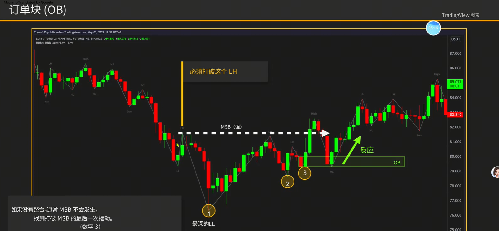
6. 绘制OB时，绘制的是一个区域。如果烛台较小，那么将影线也框起来
    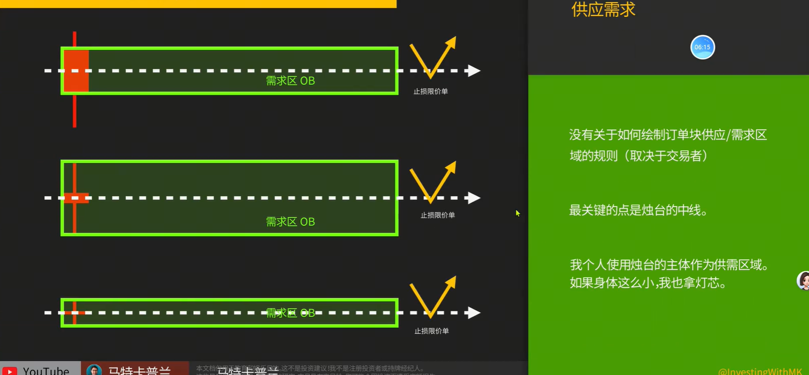
7. 结构破坏：Bos，或称为ChoCH，一些交易者也将其称为MSB。名称并不重要
    MSB是第一个可能的趋势反转点，Bos是趋势的延续
    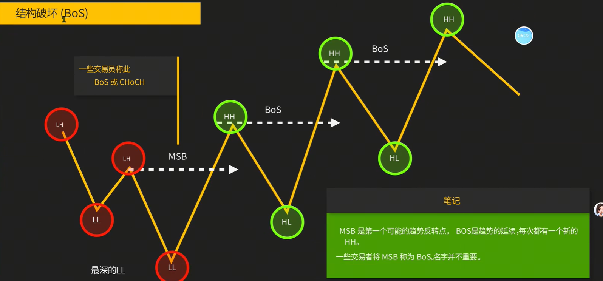
8. 评判Ob的有效程度
    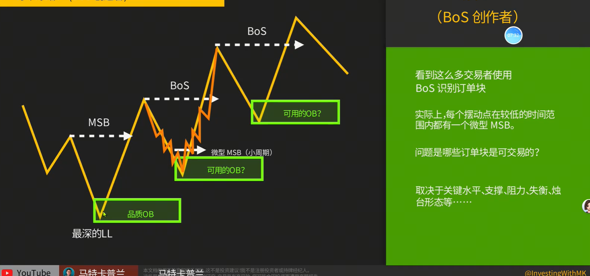
9. 吞噬模式用作Ob，只有摆动高低点（LL、LH、HL、HH）才是有用的
    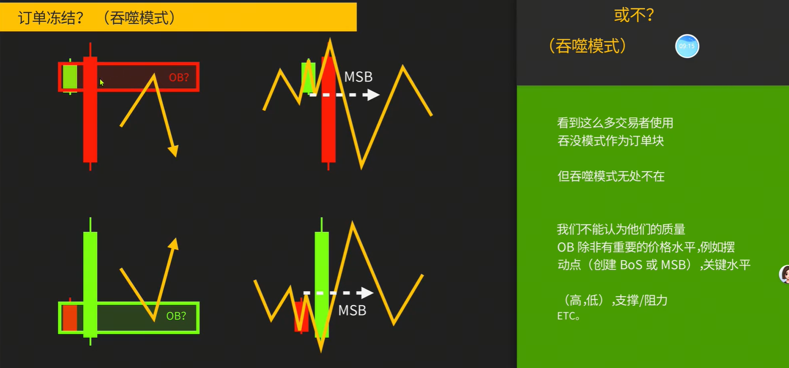
    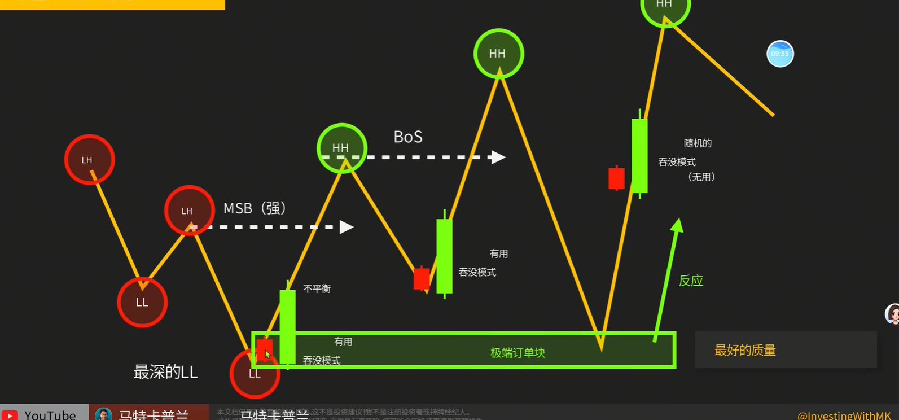
10. 高质量OB：形成MSB的过程中快速拉升，俗称操纵性，普通散户投资者无法做到
    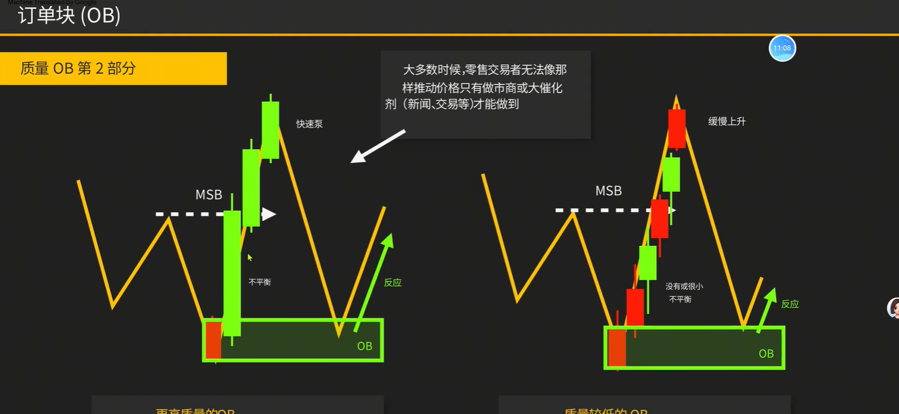
    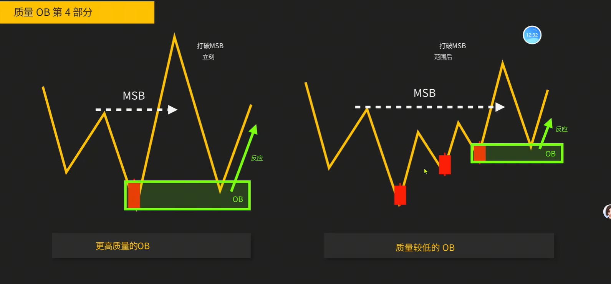
11. 高质量OB：形成MSB后缓慢回撤至OB位置
    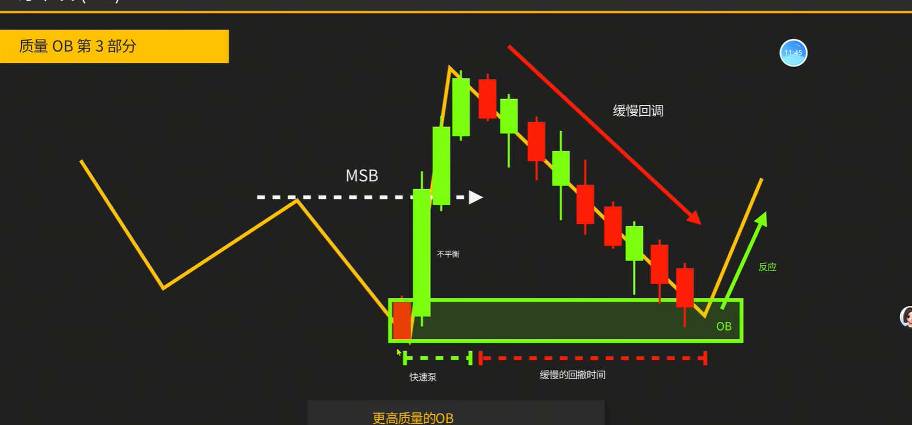
12. 高质量OB：支阻互换形成的OB
    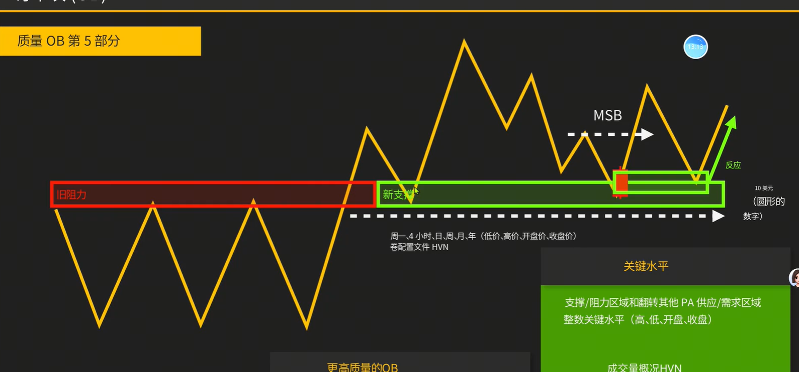
13. 高质量OB：首次测试OB时质量较高，再次测试质量未知，通常多次测试后破的概率很大
    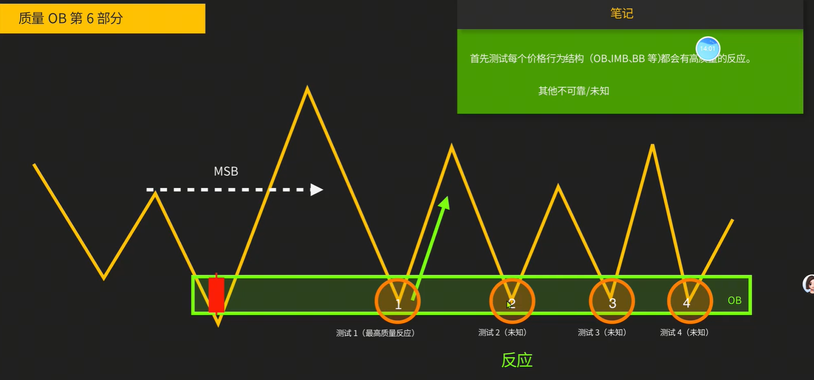
14. 高质量OBVS低质量OB
    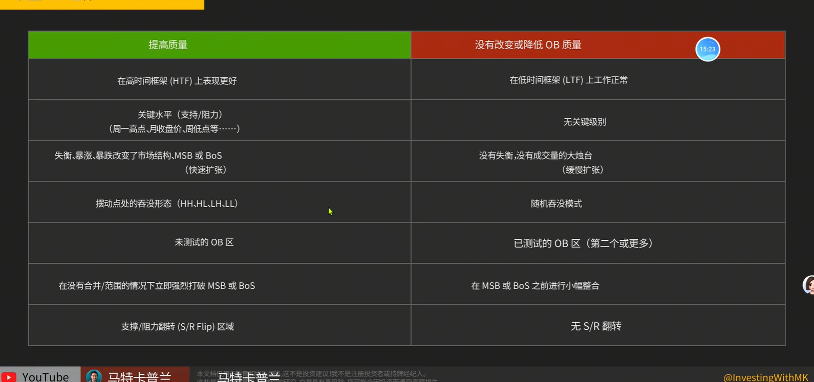
15. 超级订单块
    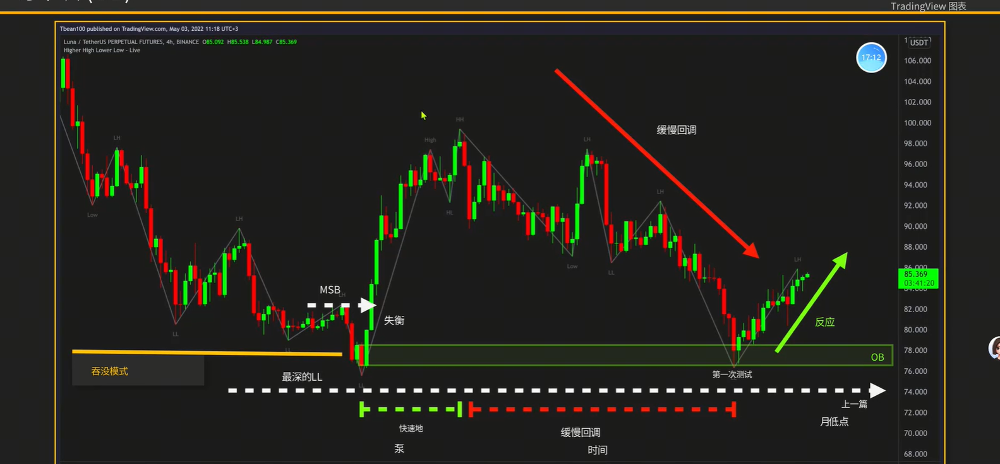
    
16. 左侧进场：OB订单块中间挂限价单入场
    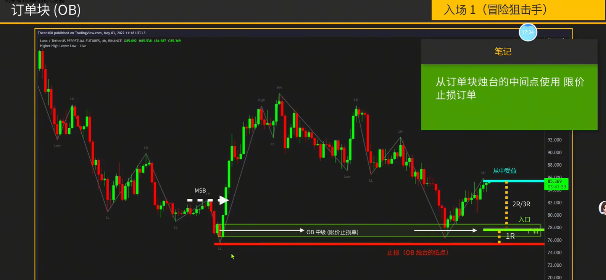
    > 急升缓跌属于大底结构，适合拿长线
    右侧进场：OB订单块有反应后，等下一根同颜色K，收盘入场
    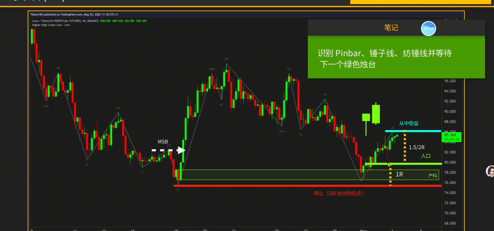
17. 多周期入场：大周期中找到OB，然后在小周期中找入场结构
    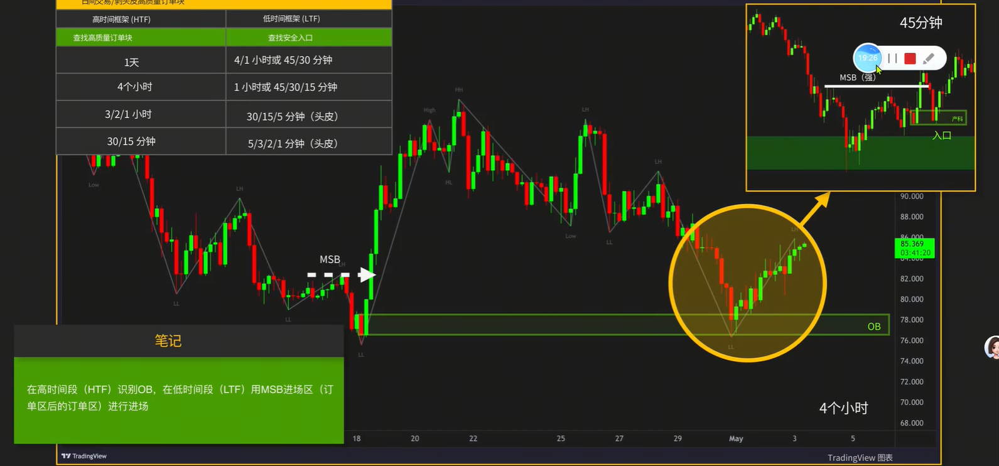
    > 通常大小周期是4倍原则