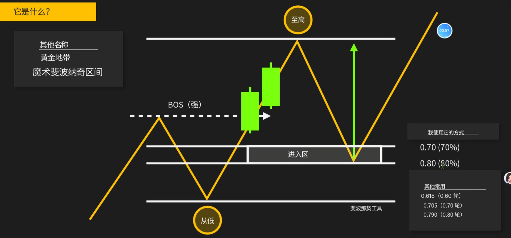
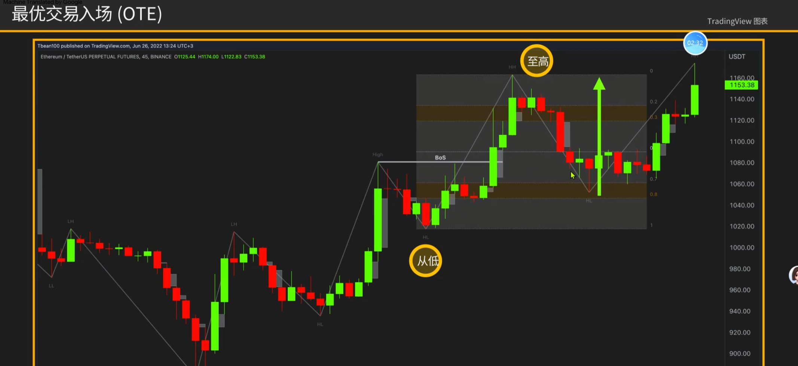
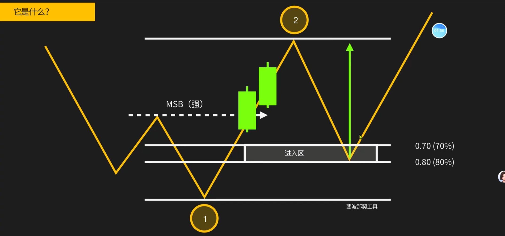
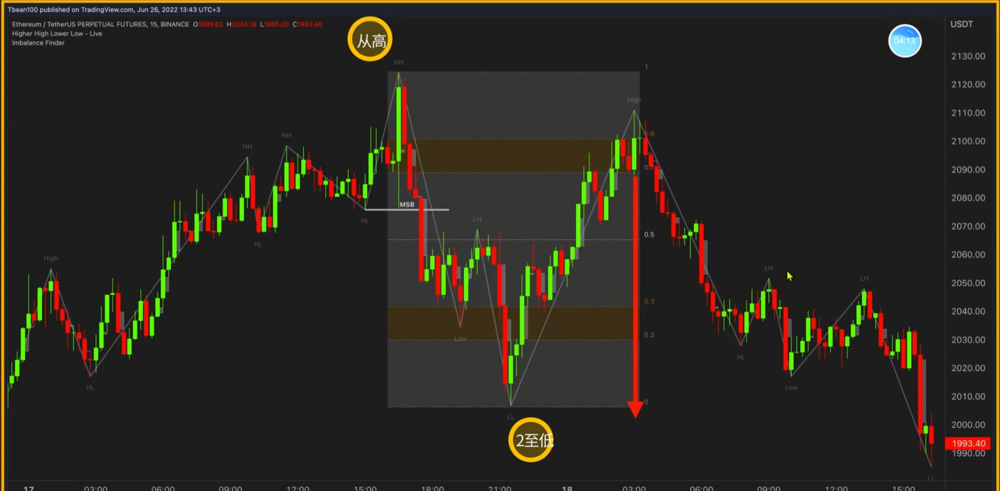
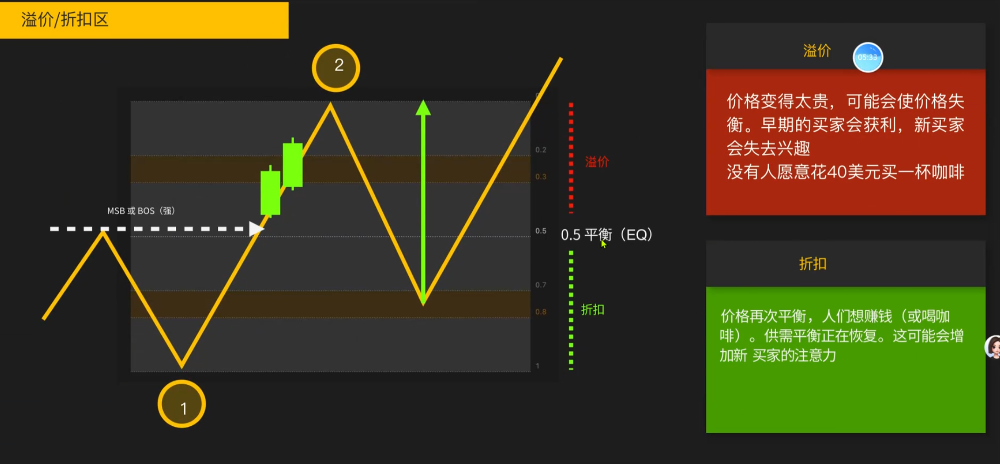
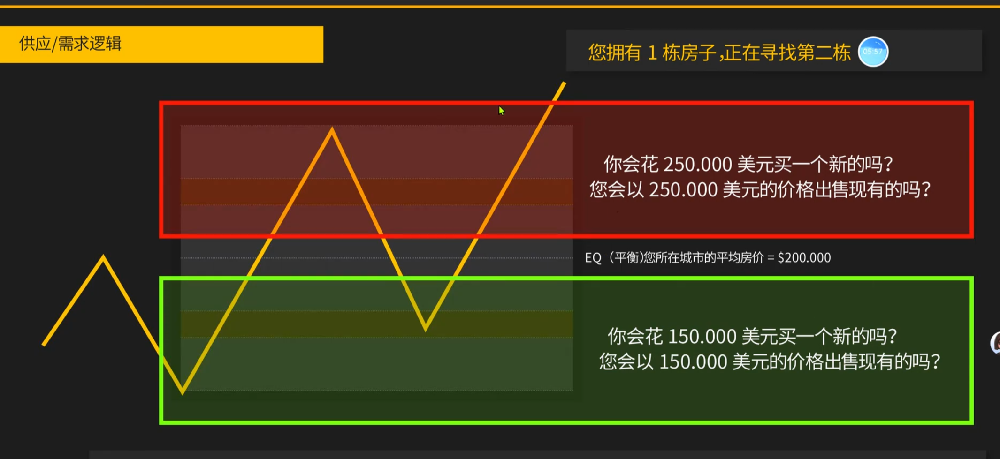
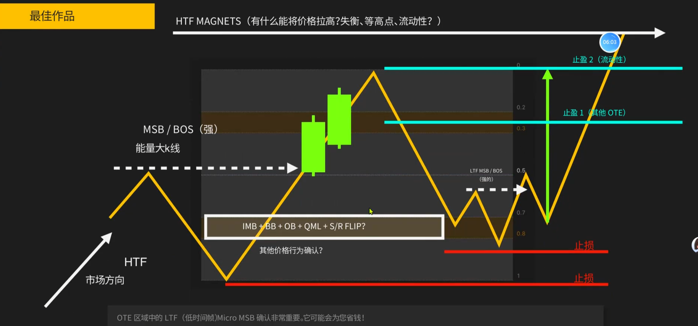
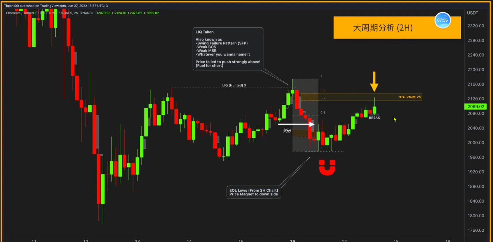
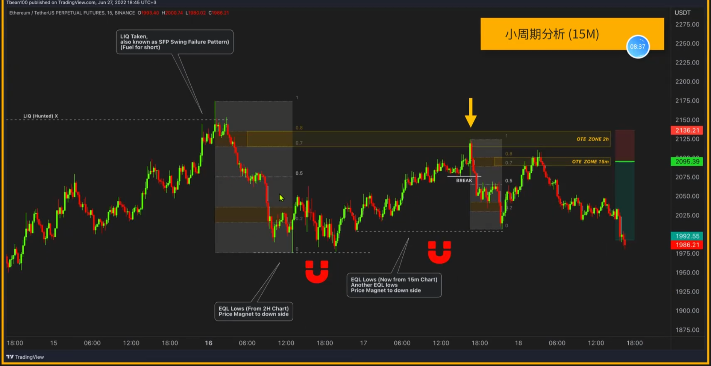

1. OTE：最佳入场位。更多的是一种目标位的选择，后面还是要根据k线反应来决定，并不直接用
2. 强的突破形成BOS后，回撤大约在0.7-0.8的位置结束
3. 用法1：顺势回调
    
    
4. 用法3：MSB反转后的回调
    
    
5. 溢价/折扣区
    
    
6. OTE：最佳入场位，止盈位置
    
7. 大周期分析，小周期进场
    
     