**流动性清扫之后，回调超过0.5（意味着力量不强），然后再次回抽到0.7-0.8位置就可以左侧交易了**
**本质上是认为回调达到了0.618甚至更差，那么可能是一个区间，因此在HSLB**
1. 杂乱行情下，交易假突破。目标位放在启涨点
    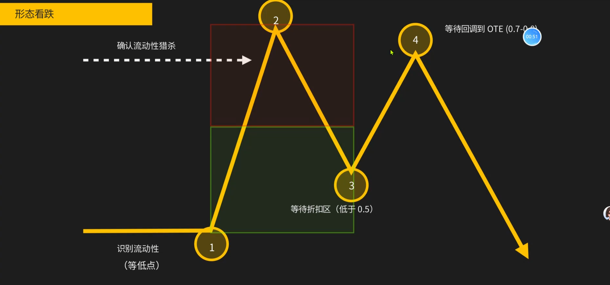
    > 最好在扫过2的损之后入场（2位置未画出扫损，实际上是一个2B形态）
2. 看涨形态
    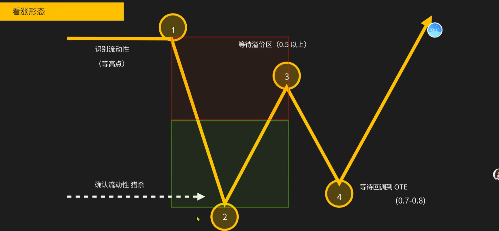
3. 止损狩猎，交易区间越乱越适合，明确假突破后直接入场即可
    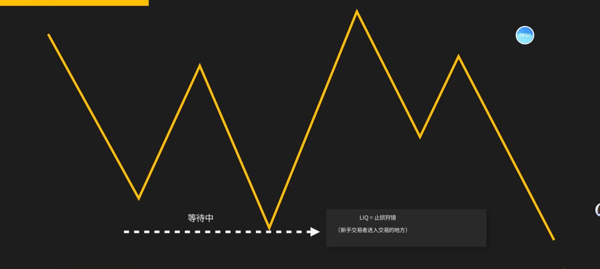
> 频繁的假突破是反向ROTE交易的最佳方式
4. 反向ROTE最佳入场，要看到假突破的吊锤
    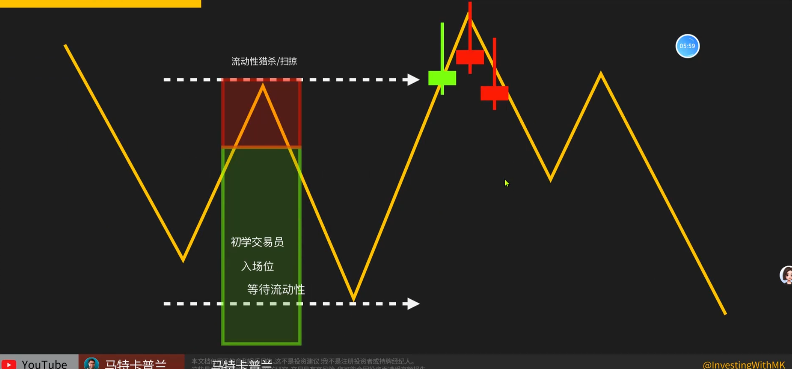
5. 流动性猎杀，影线扫止损。结合FVG、MSB突破、溢价区，所以直接收盘做空
    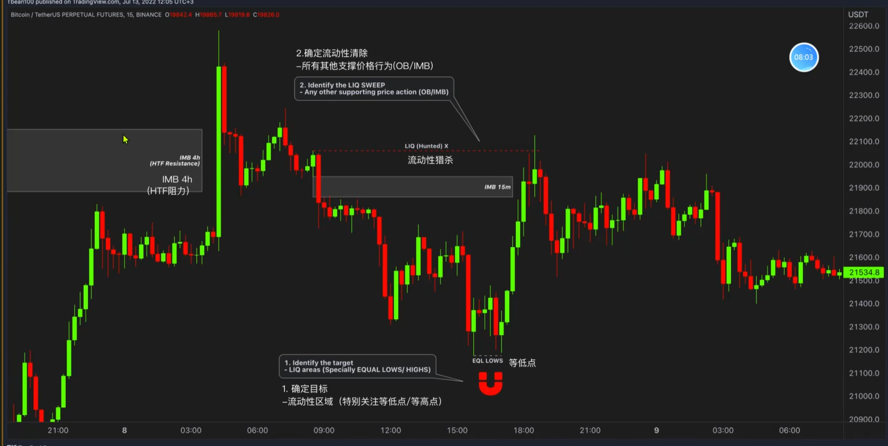
6. 绘制斐波那契数列
    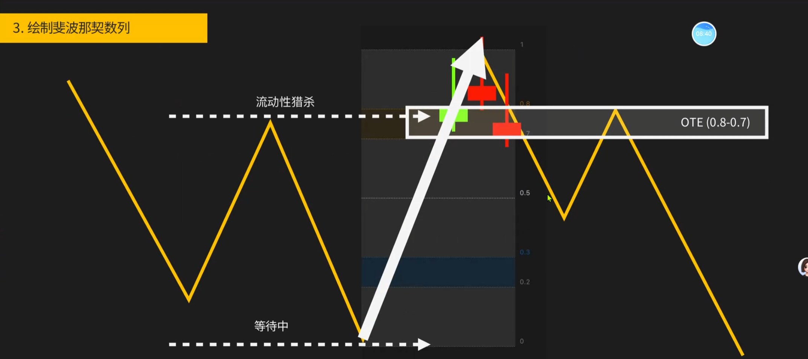
    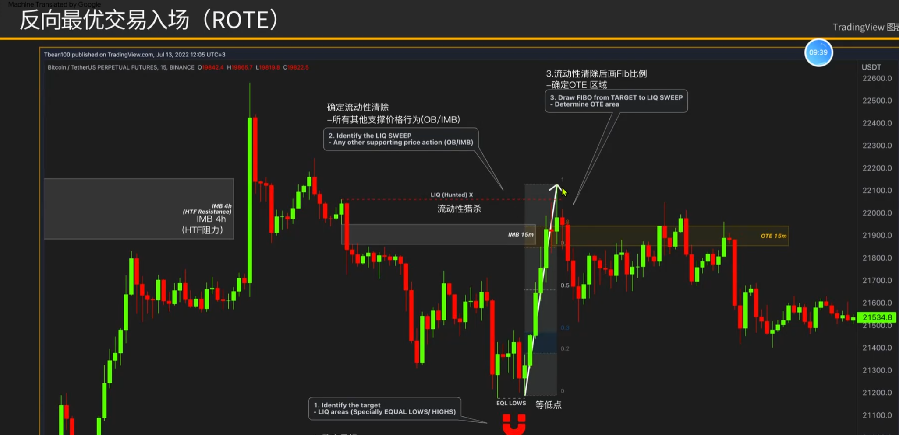
7. 最优ROTE反向交易
    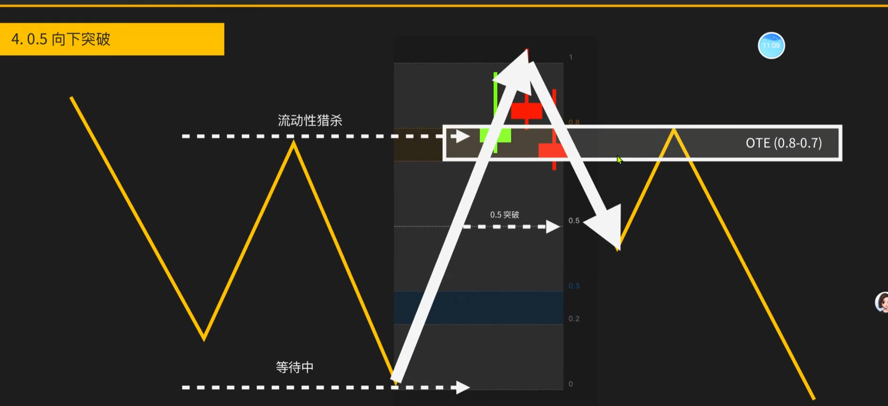
    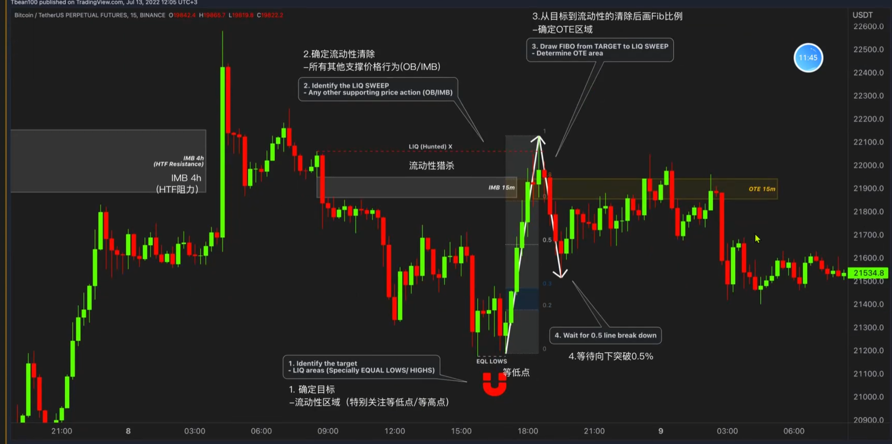
    > 反转一波缓慢跌下来，通常会回调到0.618左右
8. 多周期看形态，小周期入场
    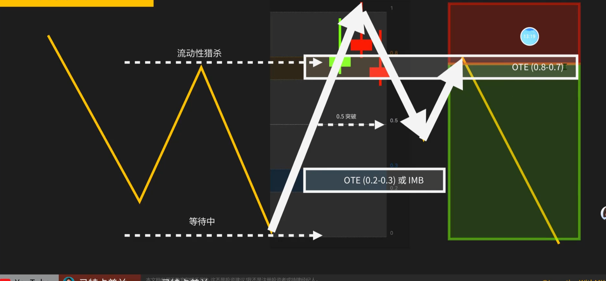
    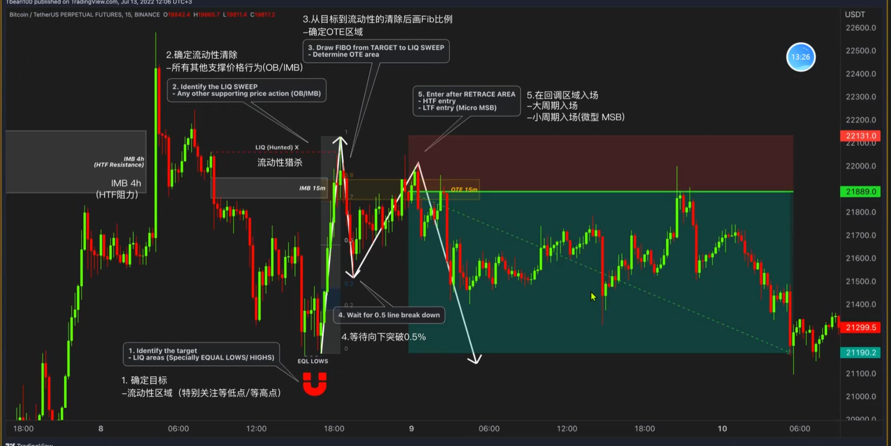
    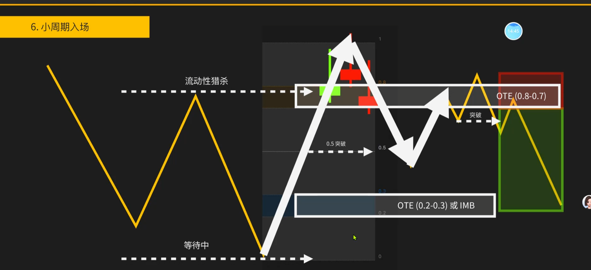
9. 反向最优交易入场（ROTE）
    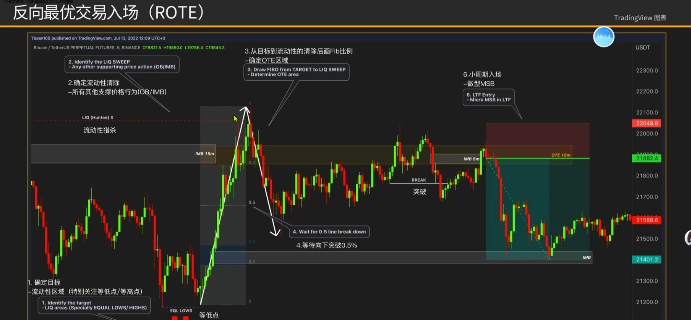