1. 专业交易者不会在阶段高点1个tick放止损，而是会让出一个atr，防止止损猎杀
    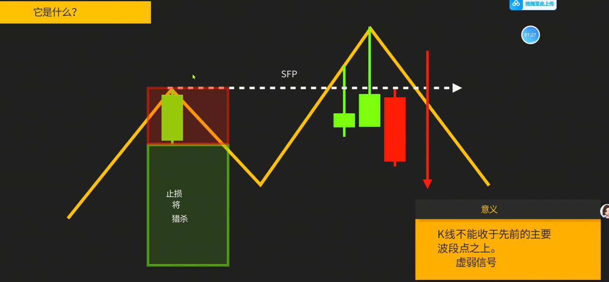
2. 流动性猎杀的关键：看影线超出前高后，收盘是否在前高以内。然后等一个信号K，入场做空
    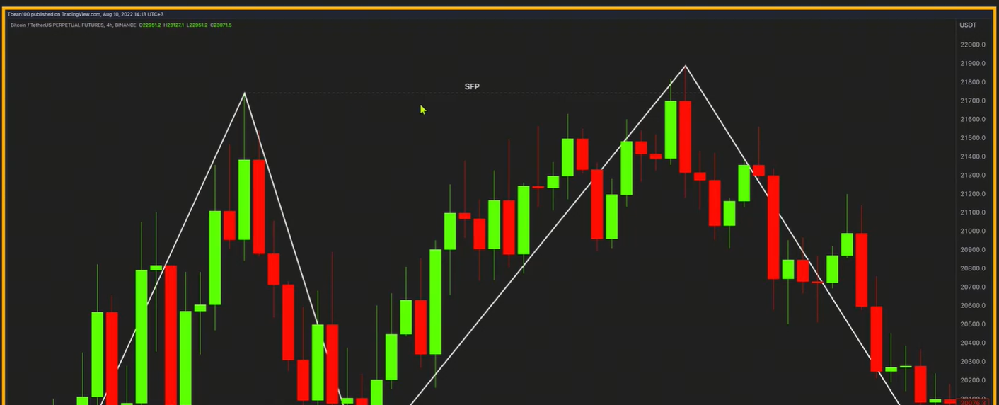
3. SFP是什么？弱的突破、弱的BOS或SMB、弱的趋势、流动性/止损猎杀SFP
    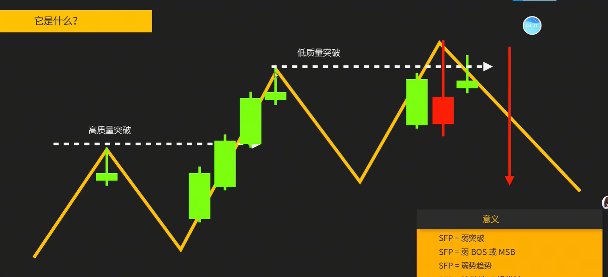
    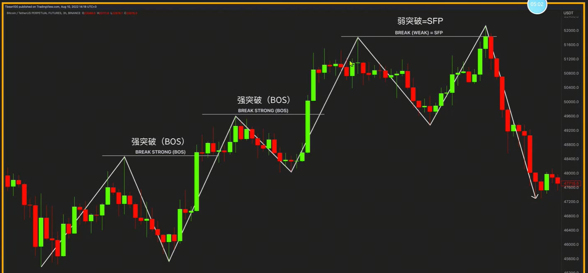
    > SFP多出现在杠杆合约里，越是吊锤的最高点，被扫止损的概率越大
4. 如何识别SFP？
    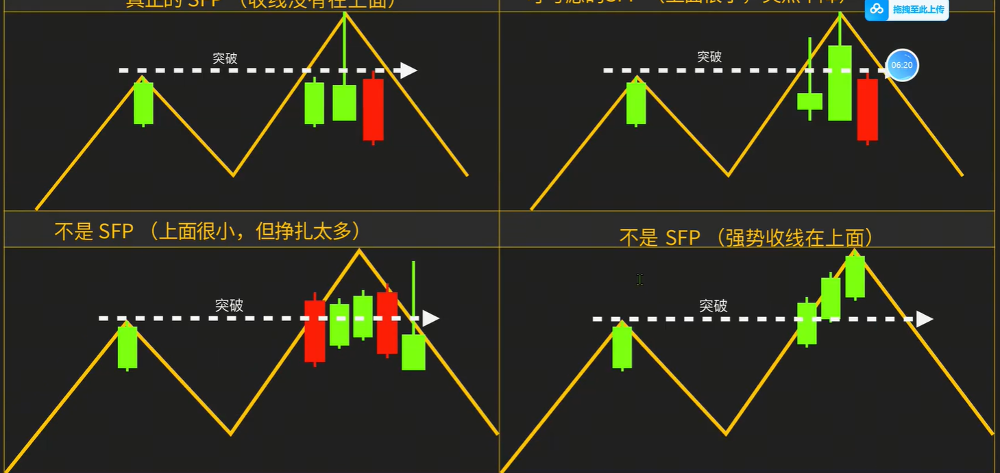
5. 优质的SFP1
    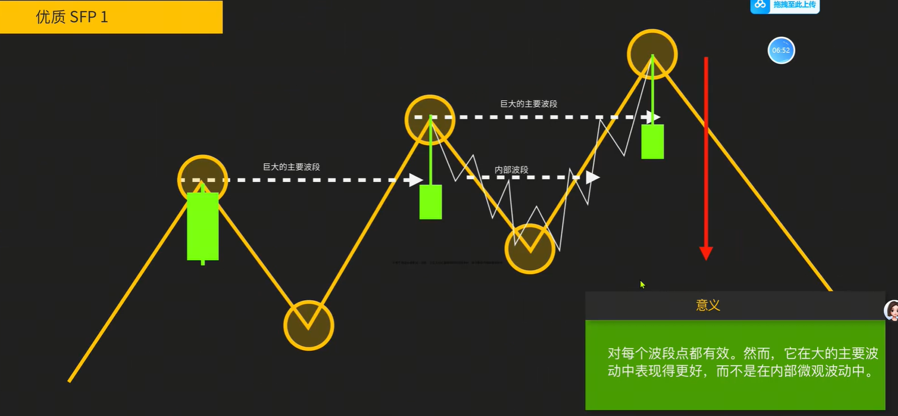
    > SFP只考虑大的主要波段中有效，内部微观不考虑
6. 优质SFP2
    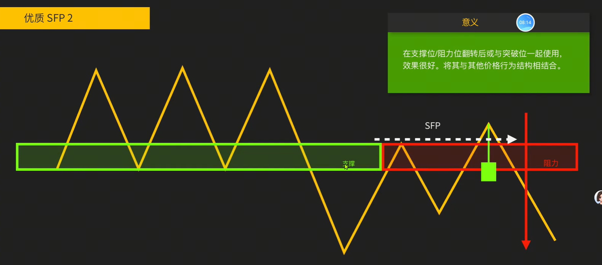
7. 优质SFP3
    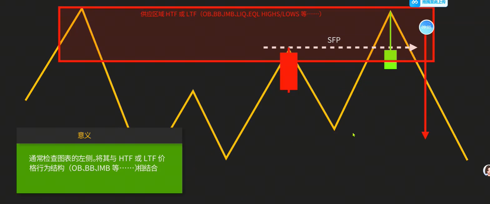
> 所有参与支撑阻力的位置都可以使用SFP，作为开仓信号
8. 扫止损入场（看不明白危险在哪里）
    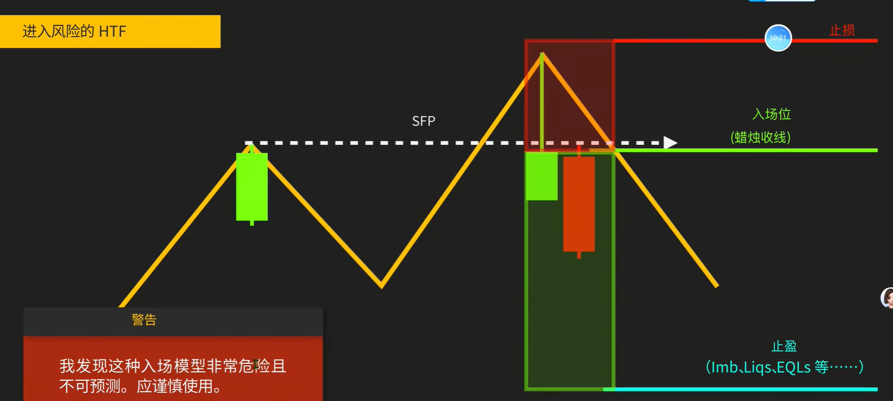
9. 扫止损入场
    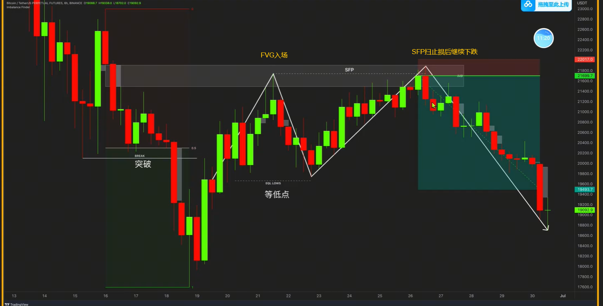
10. 扫止损入场
    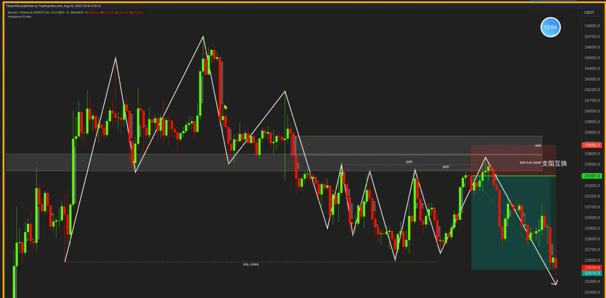
11. 安全入场扫止损模型1
    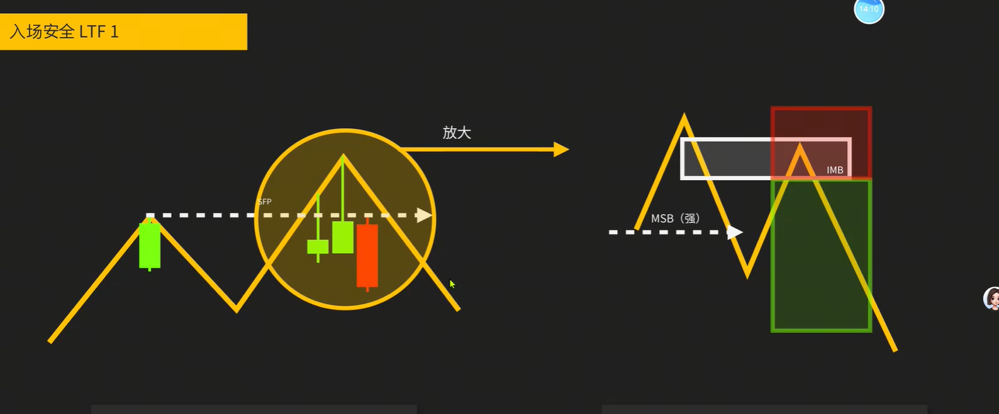
12. 安全入场扫止损模型2
    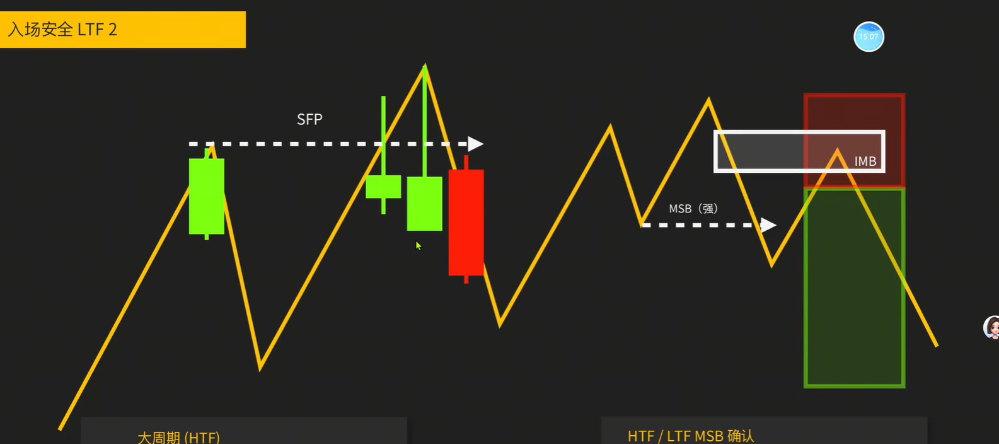
13. 多周期扫止损入场（大周期扫止损，小周期入场）
    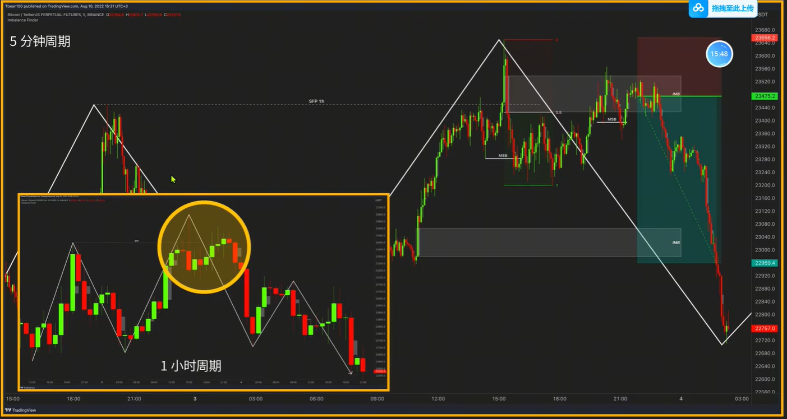
14. 