1. MSB=ChoCH，通用的东西不同叫法，俗称形态改变/市场结构破坏
    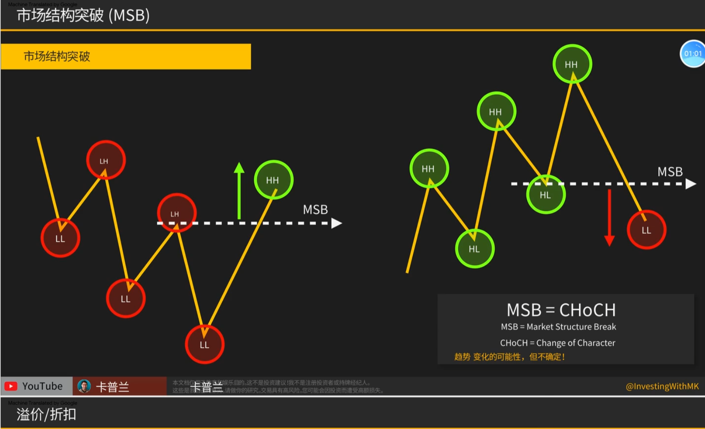
2. 要从最低价往上找，误区：不是最低价找没有意义
    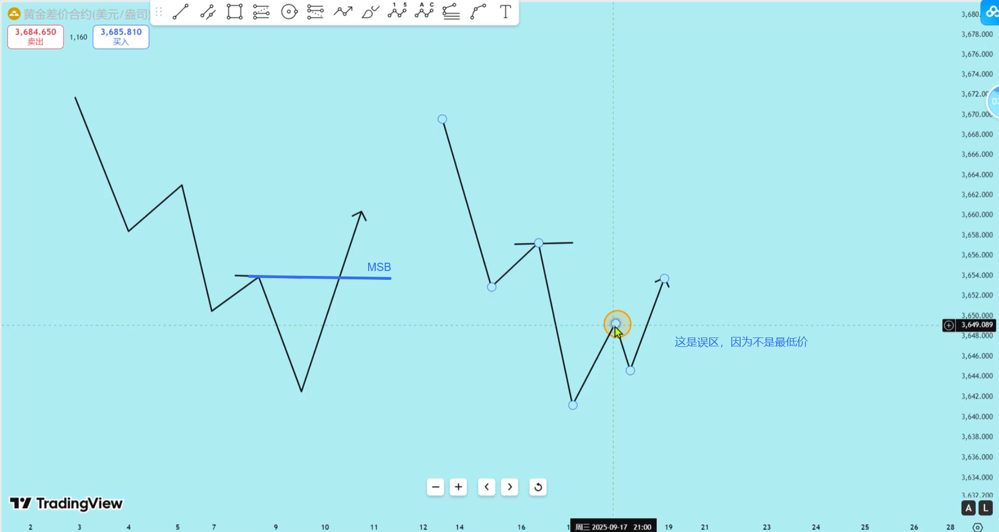
3. 如何判断强MSB还是弱MSB？突破的那一腿强还是不强，那一腿必须强才能称作MSB
4. 强MSB：从LL直接突破LH，中间没有回调
    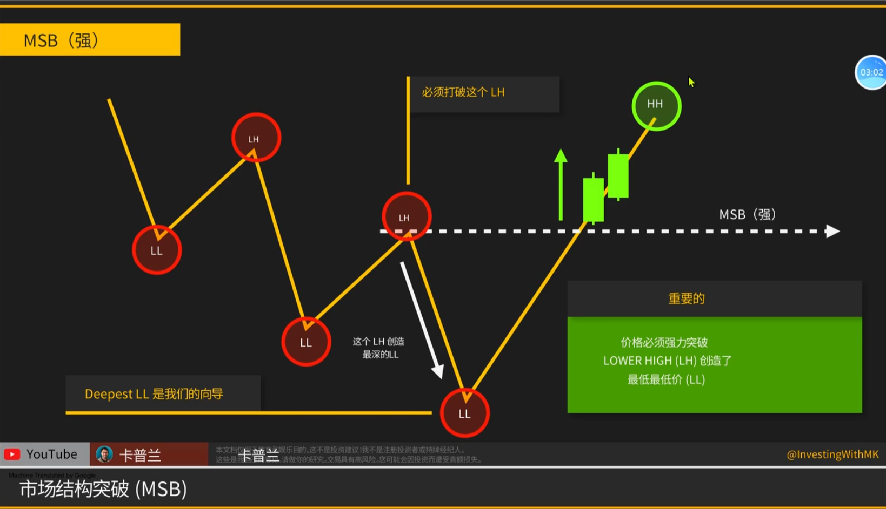
    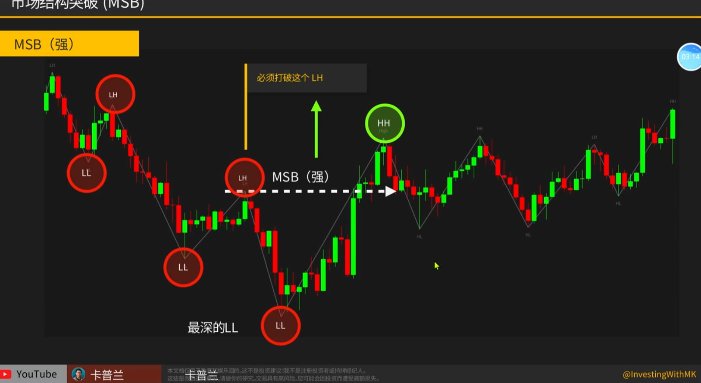
5. 一个强MSB剥头皮Setup：上涨突破MSB的这一腿，找一个弱势信号k（如吊锤、吞没、十字星等形态），进行做空。然后在下方斐波那契回撤0.618附近离场。注意：左侧进场，右侧止盈，盈亏比可以1.5。胜率较高，顺大逆小
    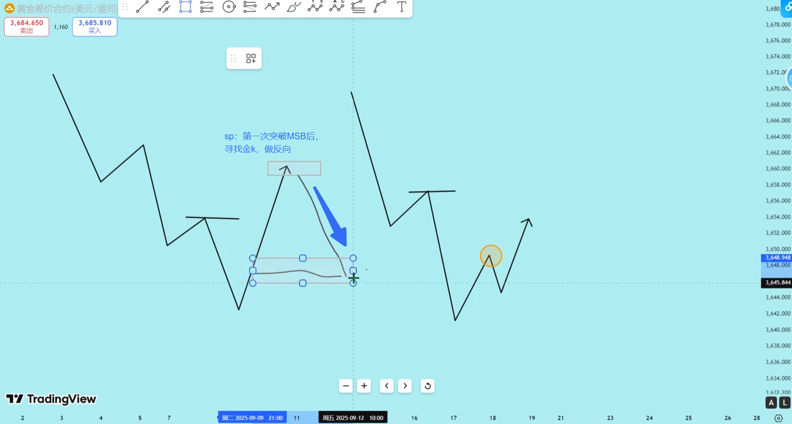
    > 因为突破LH后的最高点也是强阻力位，回踩需求区，再次突破这个位置才开启上涨
6. 弱MSB（第一种）：从LL突破LH，但虽然突破LH但形成了一个吊锤或反转k
    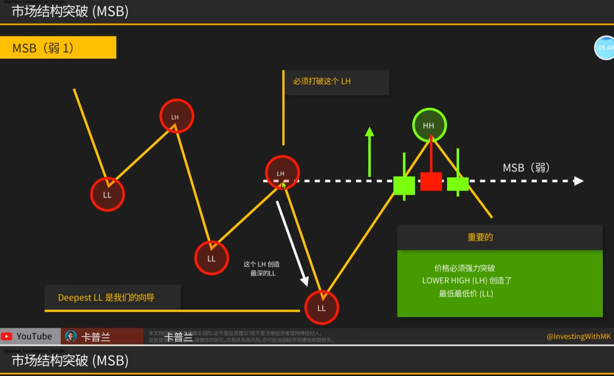
    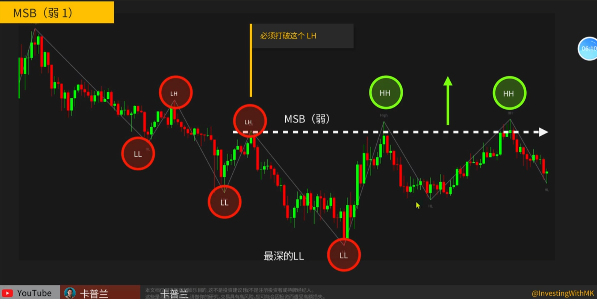
    > 弱势MSB不是一种很好的做上涨的形态
7. 弱MSB（第二种）： 并非从LL突破LH，而是从HL突破LH，但并未突破上一个LH，又跌回LH下
    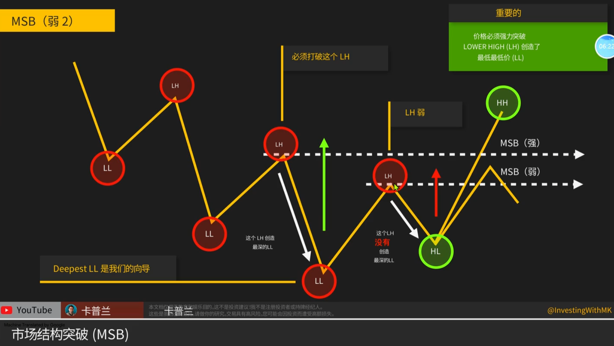
    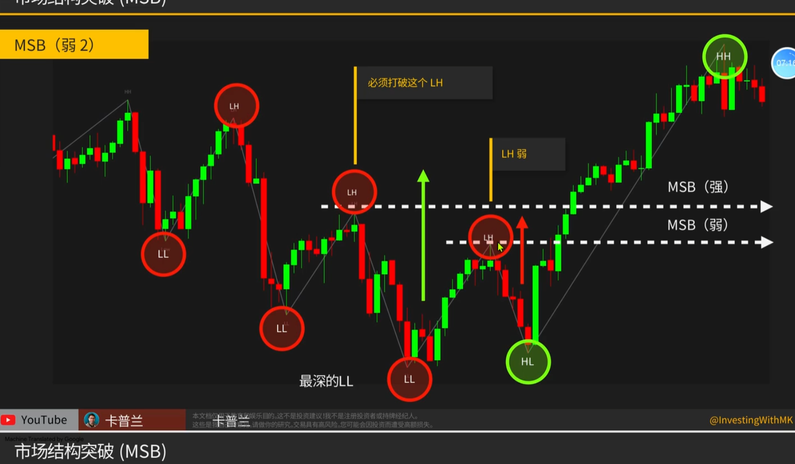
    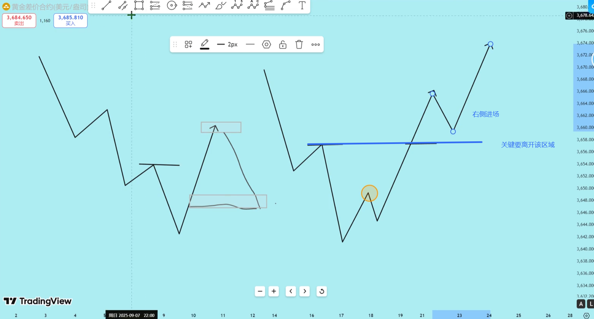
    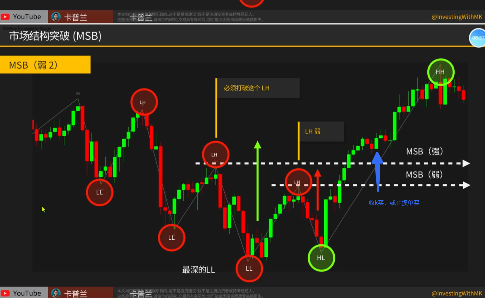
    > 对于弱MSB（第二种）采用右侧进场交易，但必须看的是很大空间，才会使用右侧交易，否则很垃圾
8. 如何交易强MSB：回调进入LL和LH的区域，左侧交易，一般 信号k收盘入场
    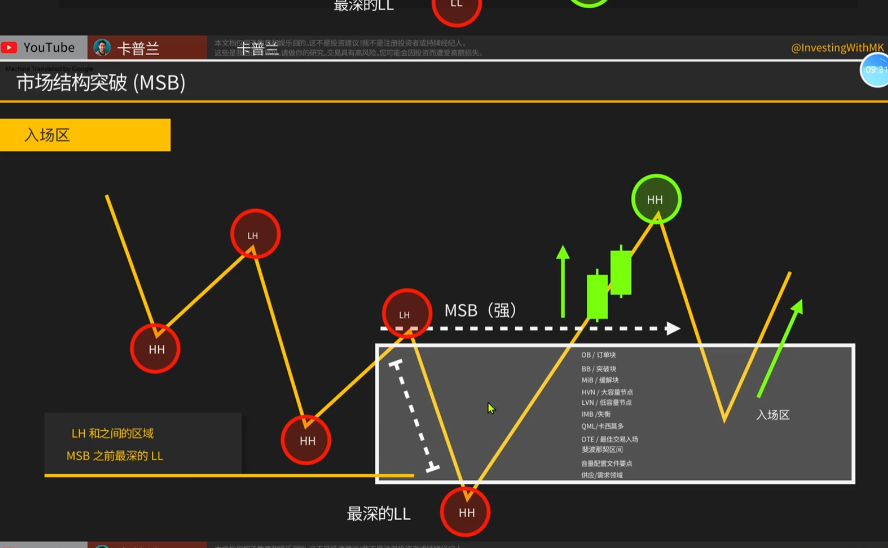
    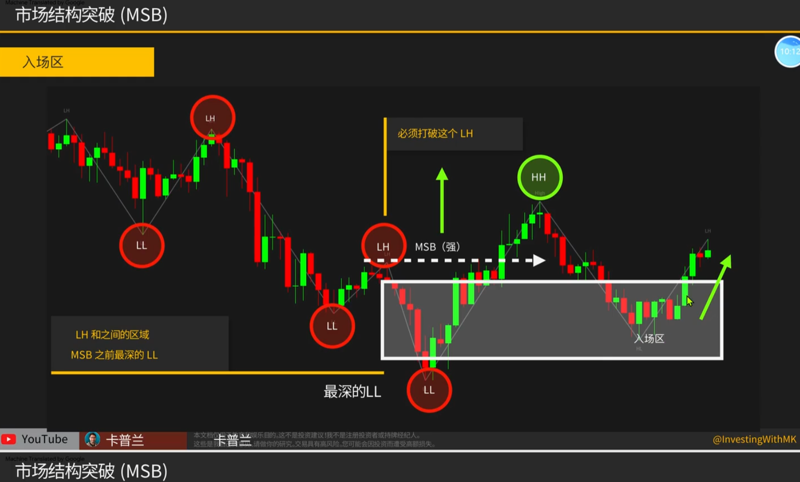
    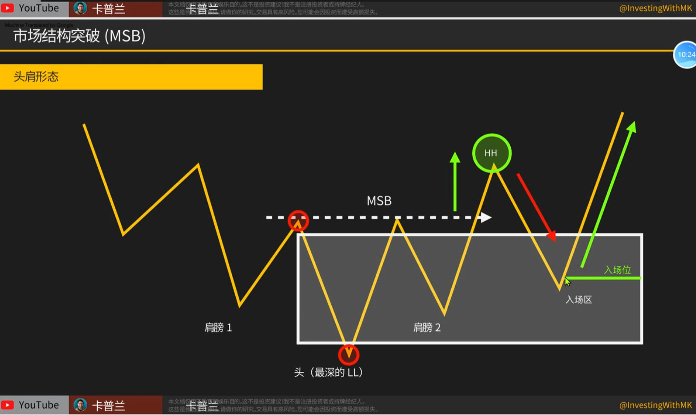
    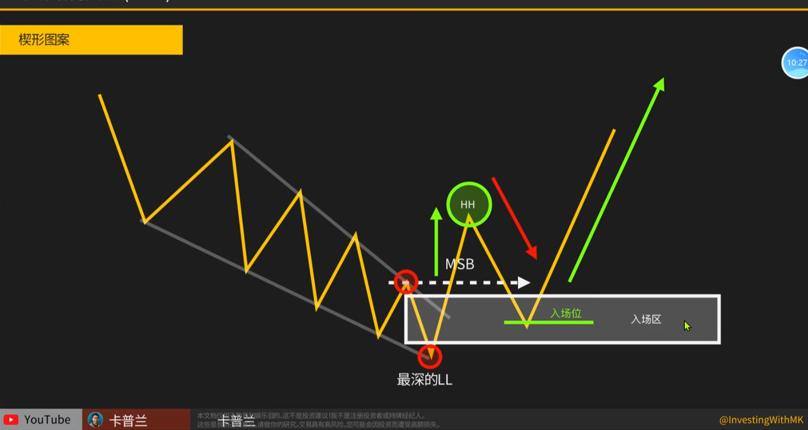
    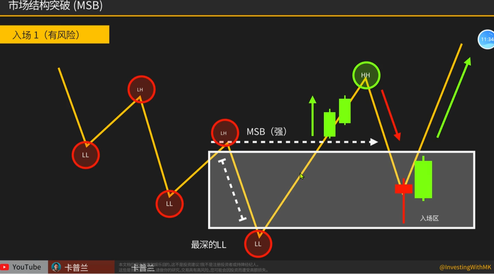
    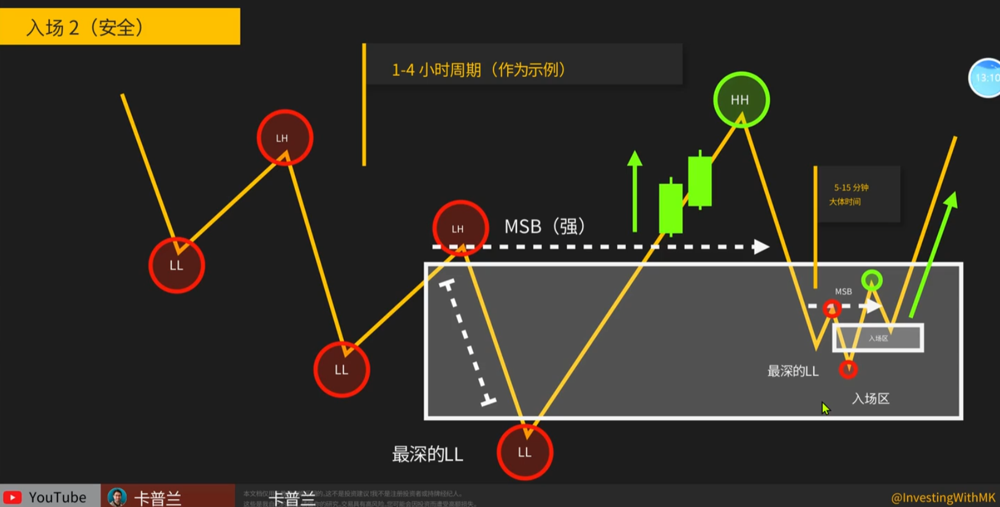
    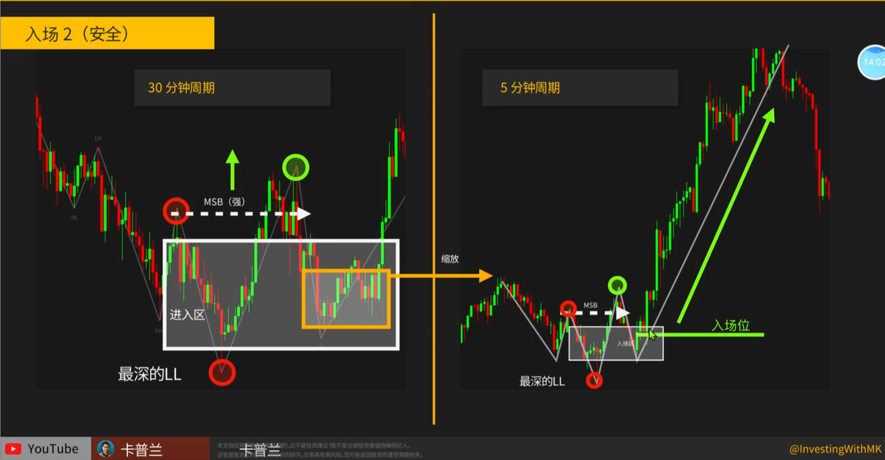
    > 止损放在LL下方