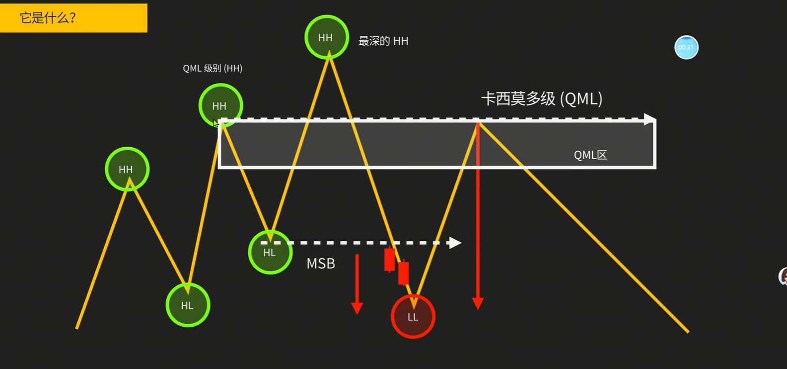
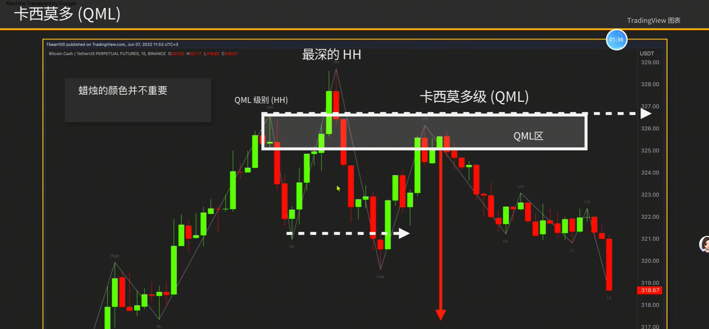
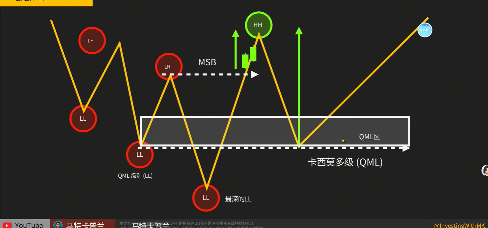
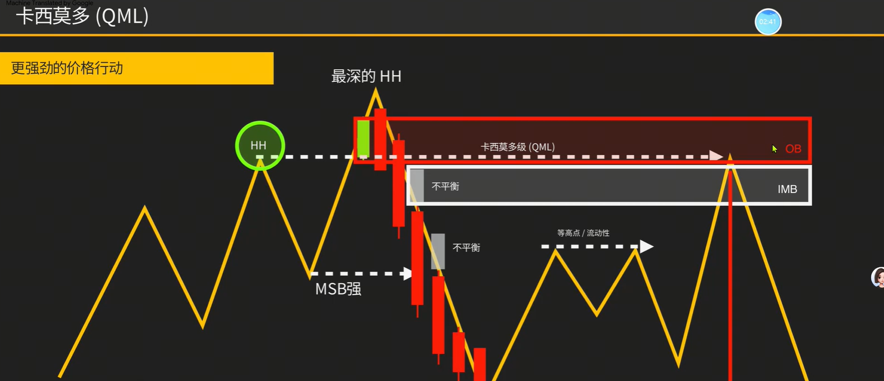
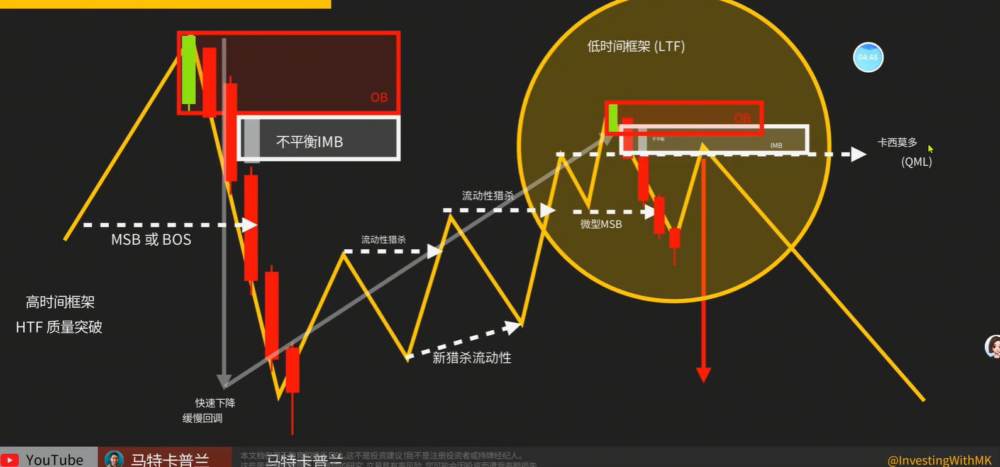
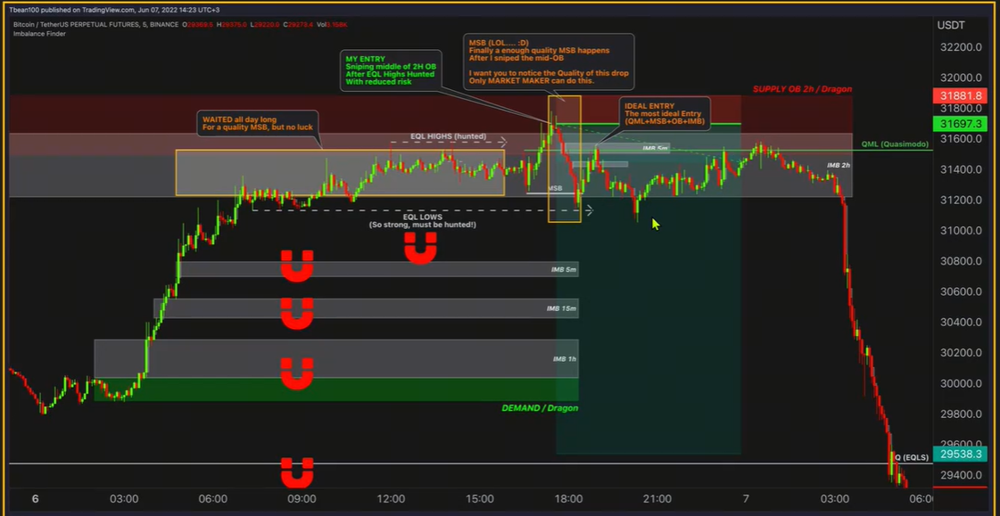
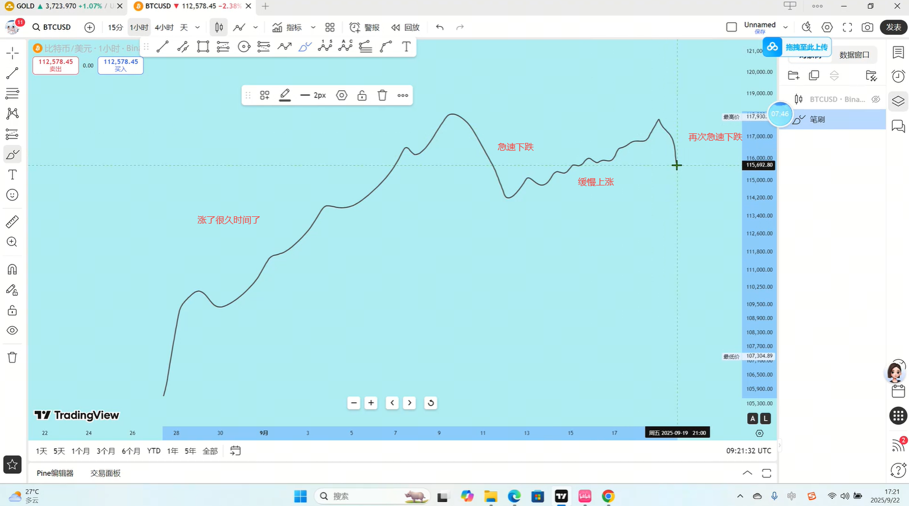

1. 卡西莫多左眼：形成MSB之后，回踩左侧次高位，形成了一个头肩顶。将左肩当作压力位
    
    
    
2. 多形态叠加的胜率更高
    
    > 各种看下跌的因，是MSB打破了原有趋势
3. 缺口可作为止盈的位置
4. 如何利用卡西莫多入场
    
    > 高时间框架是一个MSB，市场回调是一个熊旗，在低时间框架上找进场
    > 如1小时看跌了，在15分钟找进场位置
    
5. 急涨缓跌可能是大底结构，急跌缓涨可能是大顶结构。可能发生在波浪理论的第五个阶段，形成一个大级别的反转
    