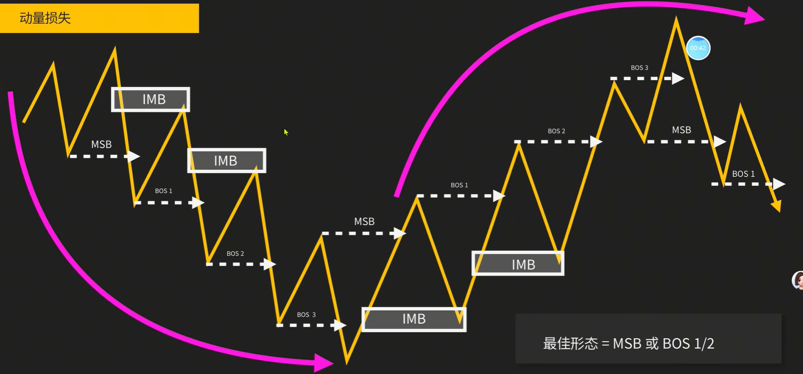
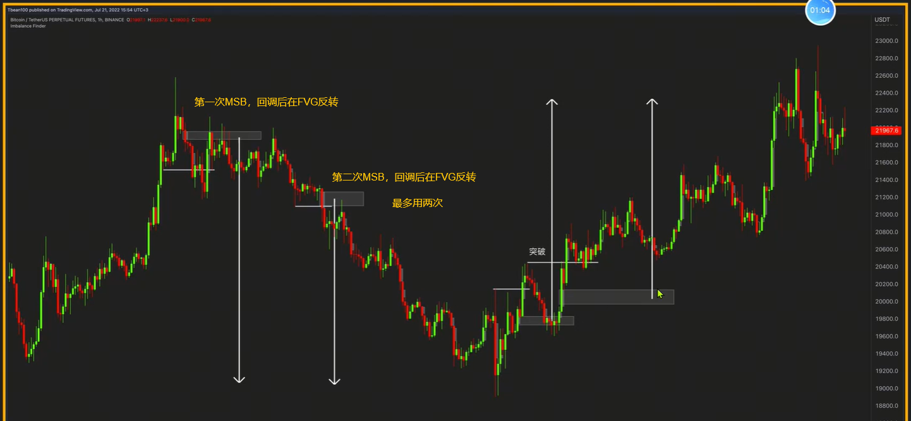
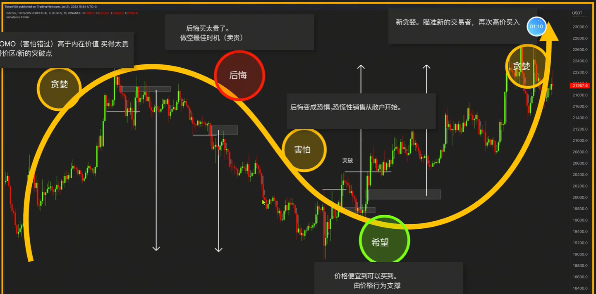
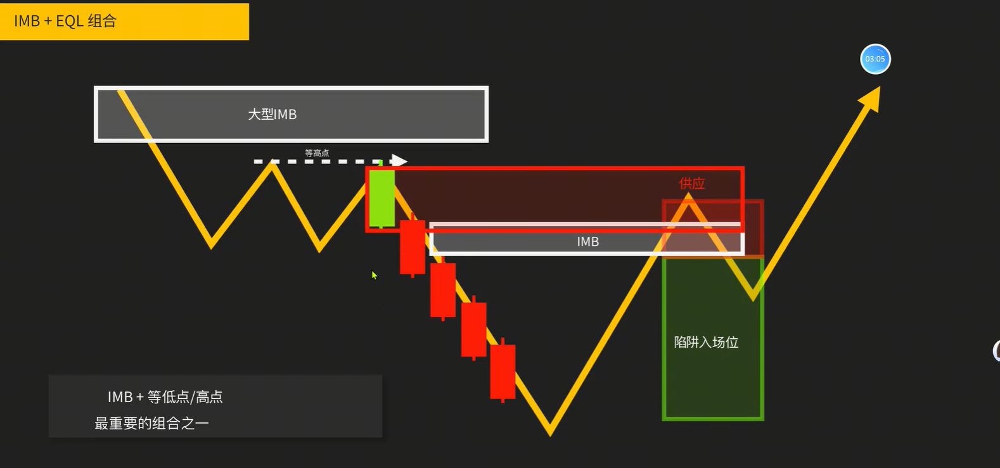
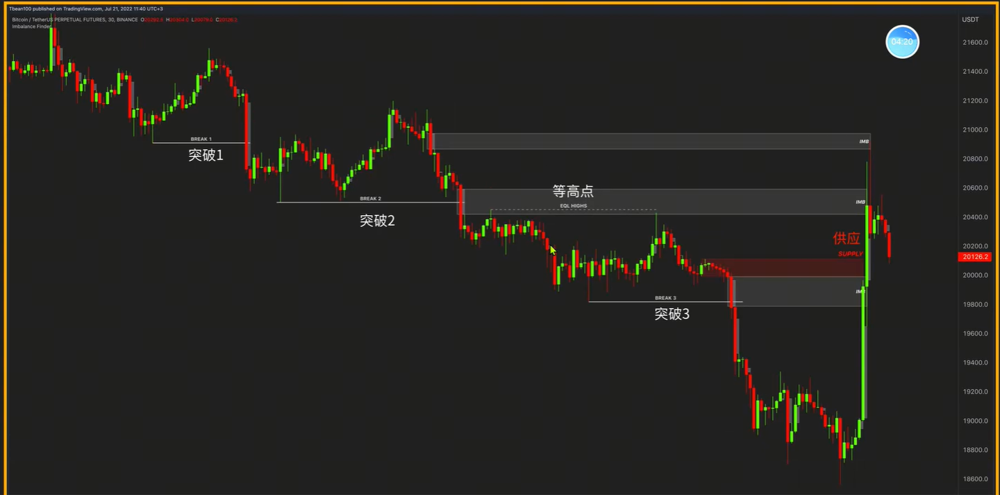
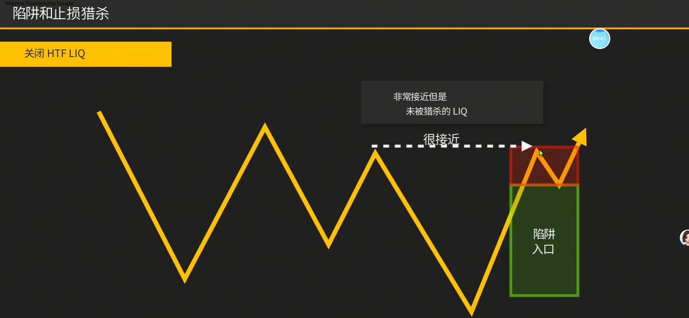
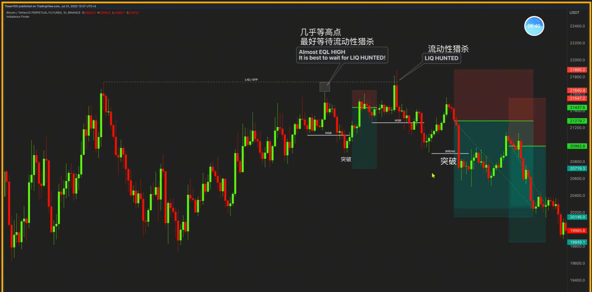
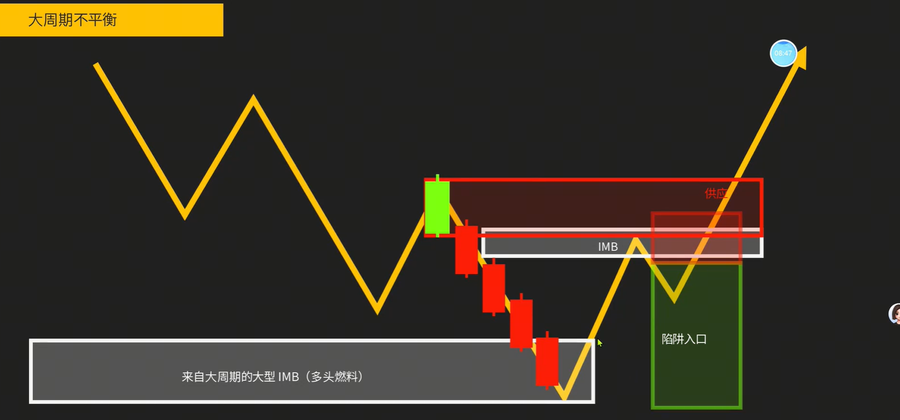
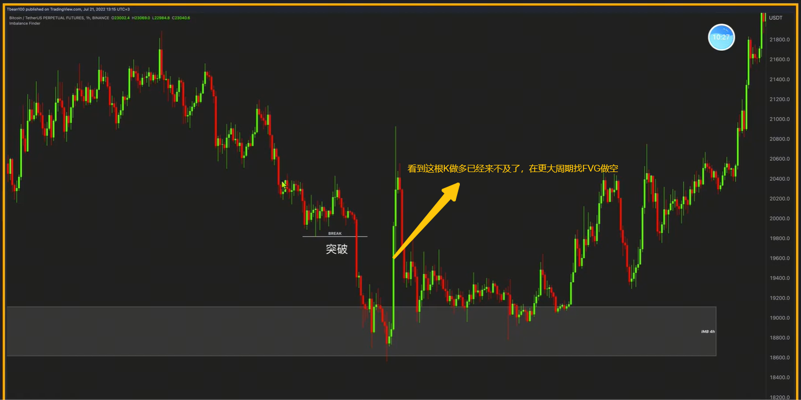

1. 动量损失，在刚出现MSB是找FVG是有用的，最多2次
    
    
    
2. IMB+EQL组合：强突破下来的OB订单块更好，当回调到OB/BB时做反转，延续做空突破
    不要在下方做空，因为那是折扣区
    
3. 上方的FVG会吸引价格上去，回到FVG
    
    > 连续的被FVG吸引，形成了真空大K线
4. 陷阱与流动性猎杀，假突破
    
    
    > 在几乎登高点，最后不要入场，等流动性猎杀后入场。等高点入场人的止损会放在最高点上方，猎杀完他们再下来
    > 打了止损就下来的吞没，是很好的做空点位
5. 高潮反转，原趋势走了很长一段时间出现大的FVG，当前趋势也出现大的反向FVG
    
    
    > 看到当前趋势大的FVG已经来不及时，可以先做空，将目标位放到前面颈部线的位置