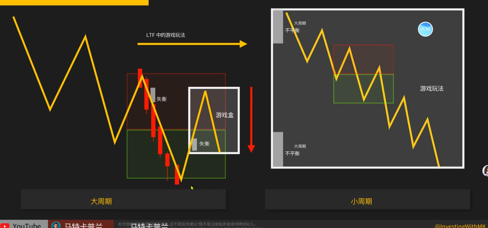
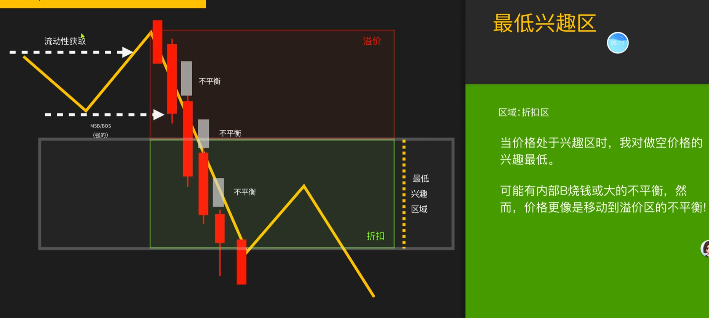
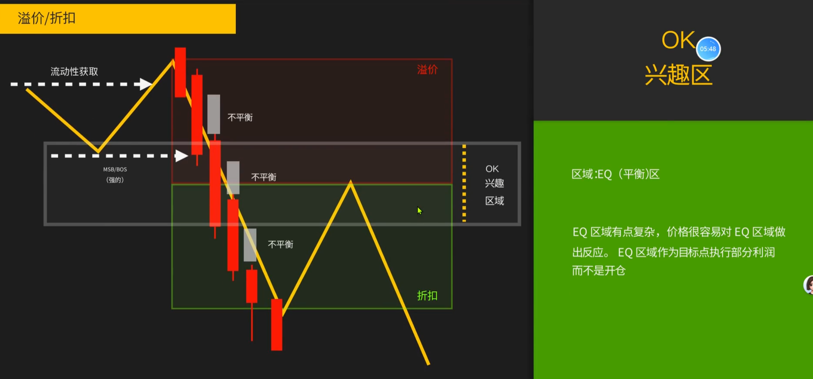
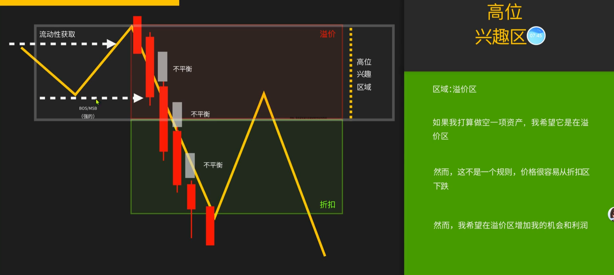
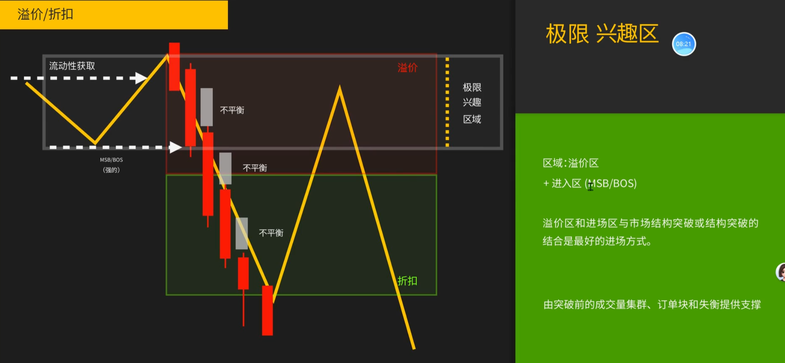
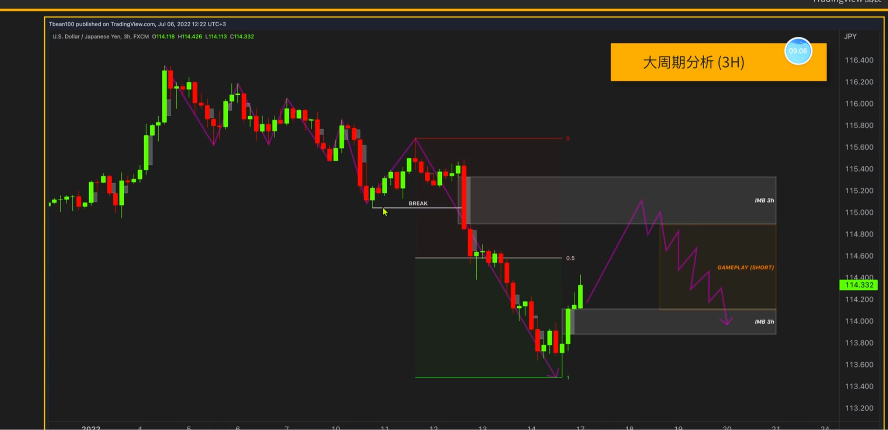
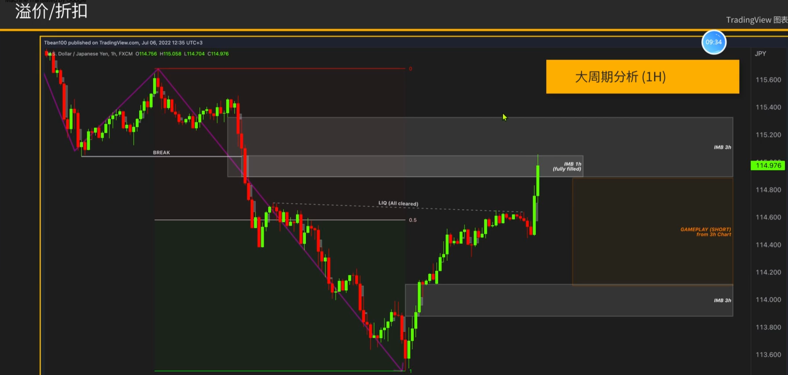
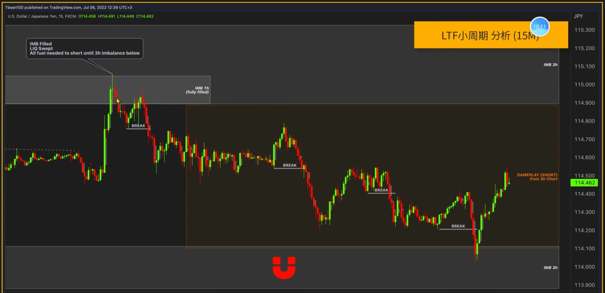
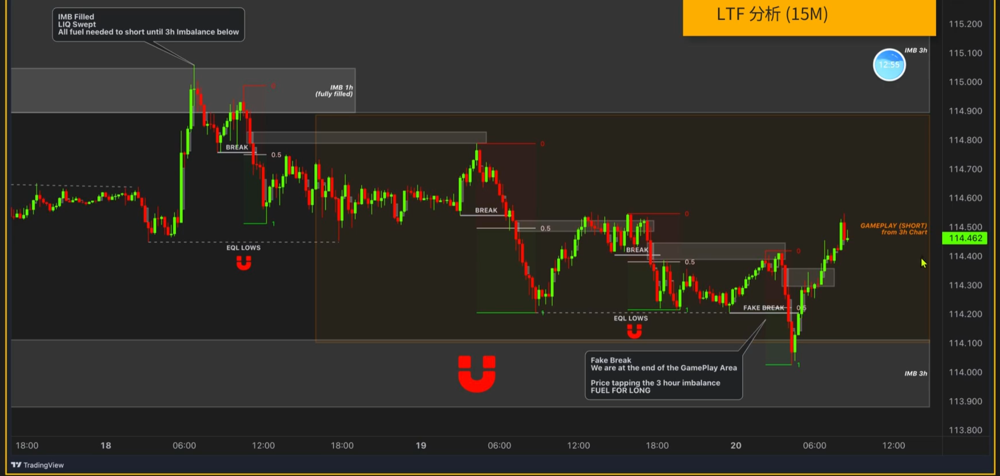

1. 溢价和折扣是应用于左侧交易的，在震荡区间最好用
2. 从回调的深度判断当前的行情是震荡还是趋势，当是震荡行情里只能使用左侧进行交易
3. 震荡行情要允许假突破，震荡的高低点之间，让出0.382出来，允许假突破
4. 上一腿的50%为分界线，分开溢价区和折扣区
    
5. 折扣区，折扣区追空不聪明。在0.382位置就延续趋势的话，趋势会有一段大的延续
    
6. 平衡区，平衡区较为复杂，常用作部分止盈区域，而非开仓区域。当在平衡区抗住，随后延续趋势的话，就会是顺着趋势震荡的行情
    
7. 溢价区，当回撤来到溢价区，甚至回撤更多，将会形成横盘，局势复杂
    
    
8. 寻找溢价区进行交易机会。MSB、BB、OB、FVG、0.7-0.8的斐波那契
    
    
    
    