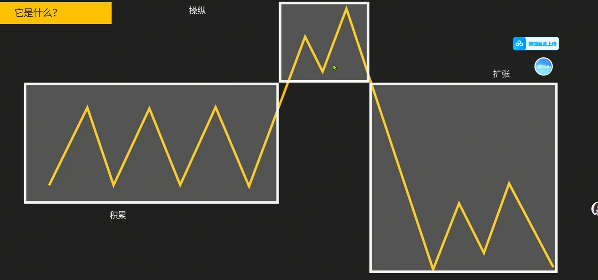
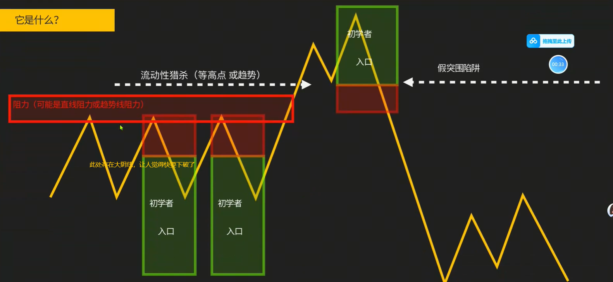
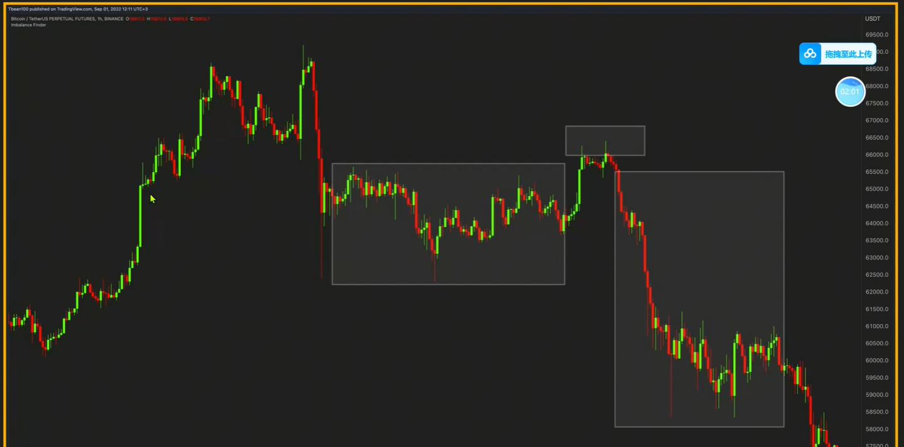
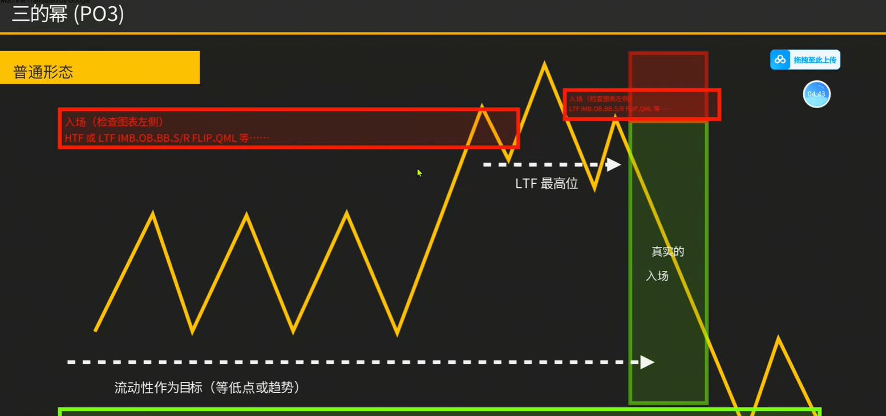
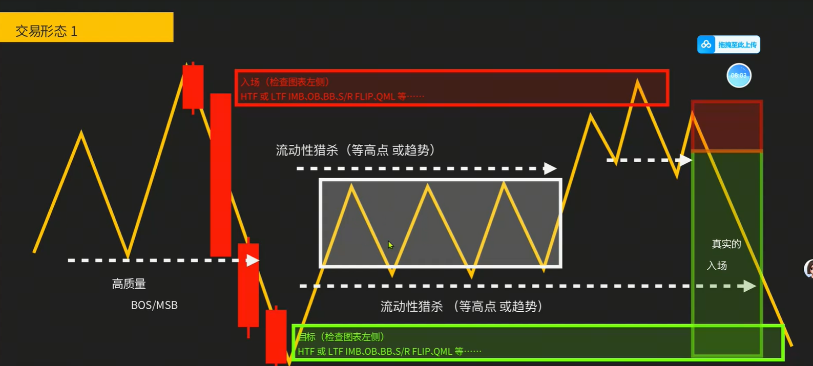
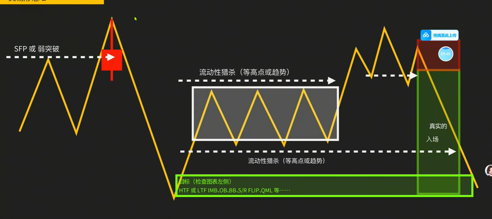
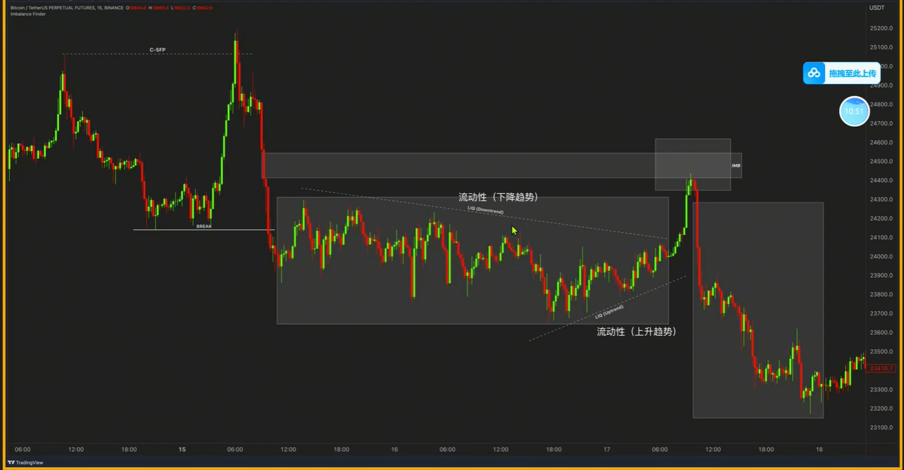
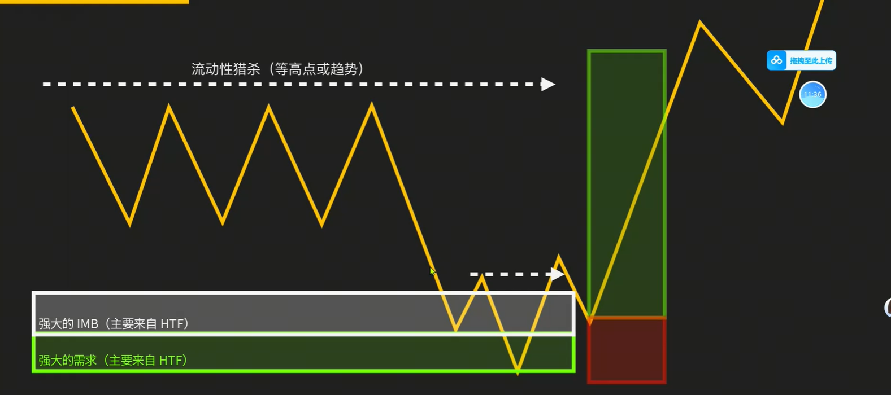
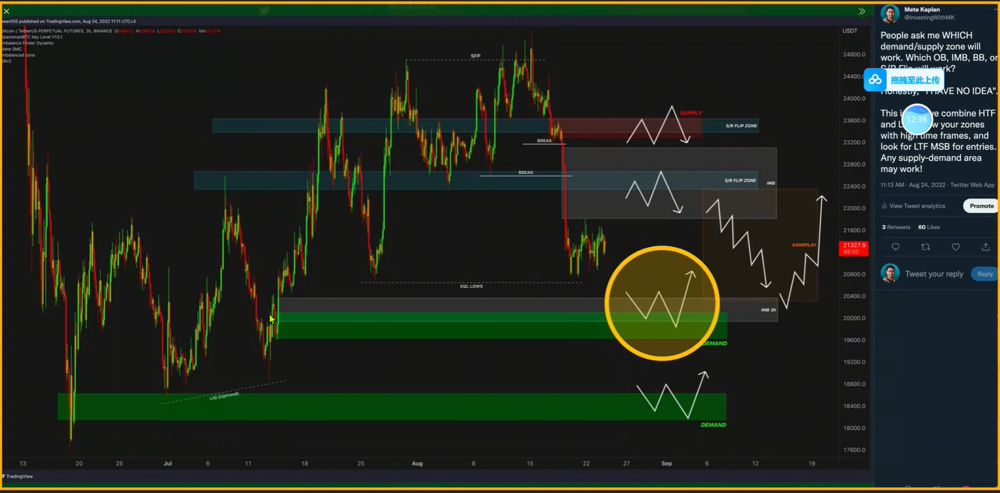
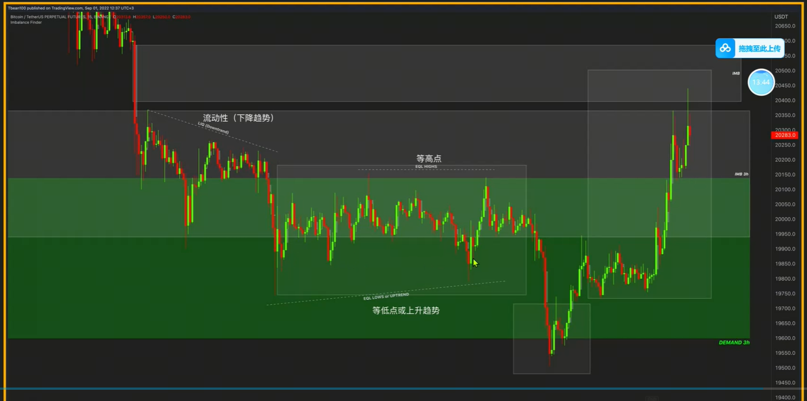

1. ICT中由加密货币引申出的模型
    
2. 积累阶段大量大阴线，给人觉得要继续下跌了，积攒大量空头订单
    
    
3. 普通PO3形态
    
> 所有的PO3形态都不是小行情，都是有大行情的
4. PO3交易形态1，通常前面涨了很久了
    
5. PO3交易形态2
    
    
6. PO3交易形态3，流动性猎杀
    
7. 例子，和PO3没关系
    
8. 例子
    