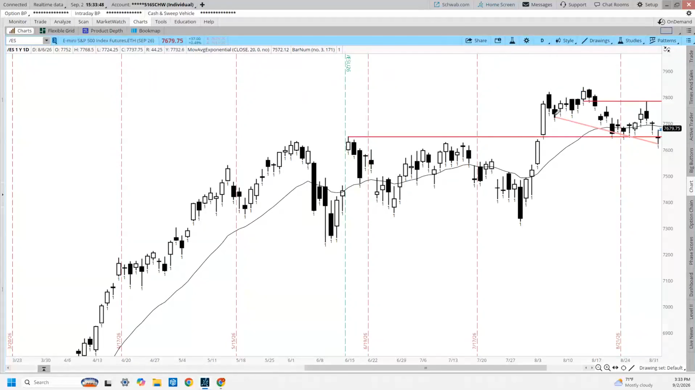
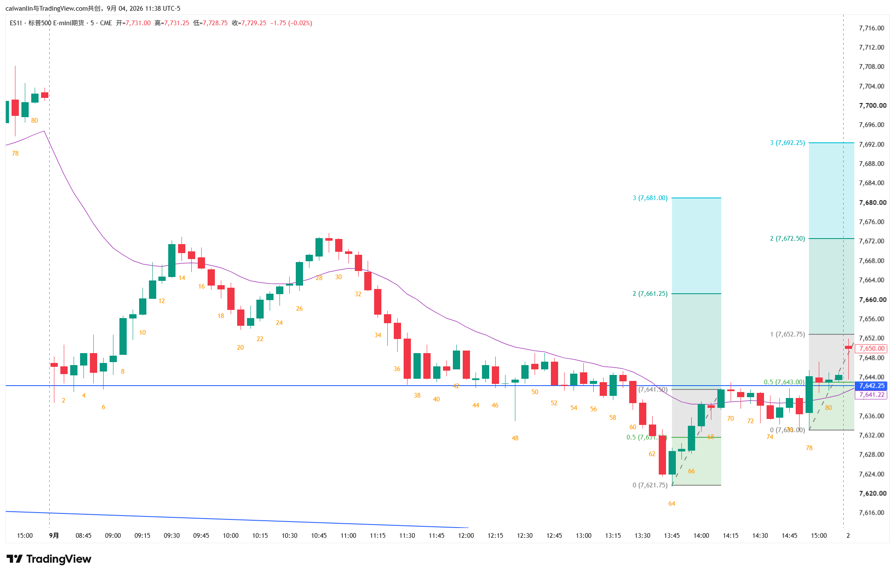
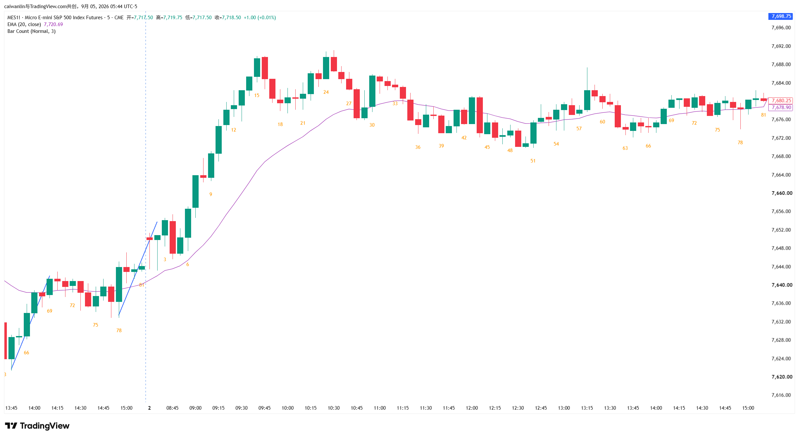

# emini-20260902
## 1. 分析日线

1. 首先打开日线图，拉长到最近半年-1年
2. 判断当前日k图，多空双方的意图
    - 多头希望这是一个楔形牛旗，在测试区间上沿，希望出现多头突破趋势延续
    - 空头来说是三次下跌，希望意外跌破空头通道线，回到区间内
3. 下跌第三腿是一个下跌窄通道，日k线数字星，代表这是一个交易区间，上影线上方有更多卖盘
4. 背景对多头有利

## 2. 分析5min昨日尾盘

1. 昨日尾盘一直多头状态，今日开盘小幅跳空高开
2. 强势窄通道上涨，直到k60，然后形成楔形牛旗
3. k78看起来可能趋势延续，使得ab=cd

## 3. 今日逐k分析

4. 第一根k达到昨日交易区间高点，且距离mm目标位很近，可能遇到阻力
5. k2时，处于交易区间顶部，其他多头交易者在等待突破，然后买入
6. k3突破，观察是否有延续，随后k4跌破区间（刚好打到mm目标位）
7. k4对空头是不错的k线，但cd段都是窄多头通道，所以看到k4最好不要直接做空，应寻求二次做空
    > k4下方做空是在逆势交易，对抗更高时间框架上的窄多头通道突破
8. 空头在k4后期待双顶，但出现强劲多头突破
9. 空头未能达成双顶，多头形成窄通道，可能重置波段计数，三波段上涨
10. 突破很强，看起来有吸力指向昨日高点
11. k8收盘十字星，但动能很强，不要做空，k8下方大概率买方更多。大概率有mm第二腿
12. 虽然预期昨天高点附近有卖盘，但k10收在昨日高点之上，这对多头有利
13. k11代表多头获得跟进k线，明确突破了，所有在昨日高点的空头都被困住了
14. k12收盘在中点附近，多头在这止盈很蠢，因为下方都是潜在的买家，可能进一步上涨
15. k15收盘时，已经有了三波上涨，距离ema很远，风险很高了
16. k15附近大概率会有一波回调，但因为多头趋势很强，大概率不会直接形成反转走熊
17. 反转走熊时，需要先突破趋势线，然后在真正反转出现前，对高点进行测试
14. k16空头突破，但做空成功概率很低，但是强度很足。买k15收盘的人被套住了 
15. k17空头突破获得好的跟随，大概率空头可能会有第二腿
16. k18依然阴线，进入到k12附近的交易区间，多头在此处获得支撑，进去交易区间
17. k19时，虽然连续三根空头k，但考虑到更大时间周期，多头仍占优
18. 交易区间内，潜在的多头并不着急买， 而k15-k18被套住的多头在等待价格回到入场价平仓
    - 多头希望趋势延续，继续上涨
    - 空头希望迎来空头突破，交易区间是一个熊旗，价格继续下跌
    - k19-k20意味着市场试探前高的概率更高
> 在熊市反转发生前，市场会从强势多头转向弱势空头 
19. k22牛市突破，将涨的更高一点点，然后将来对前高的测试，将会有卖家出现
20. k23是突破后的回调测试，大概率走出第二波 上涨
21. k24达到阻力位，此时买入不是好位置
    - 多头，k15和k16买入的多头因为被套住了，会在k24打平离场
    - 空头，k16-k18的熊市突破，回调超过了100%，可能正在做深回调的空单
    > 市场要么在通道内，要么在震荡区间内，交易者会在高位做空，大概率能赚到利润，且对之前的多头来说是不错的止盈区域
22. k25反转k收在最低点，是多头跌破离场的参照线，多头看到这根k就会考虑离场，也是空头的入场信号k。但胜率还不算高，因为还处于小型上升通道内
    - 多头大概率会在跌破k25时离场
    - 空头可以直接做空，也可等待后续卖压确认/突破后再进场，胜率更高
23. k25-k27形成三根k的窄通道，可以尝试在k27收盘价限价单做空、或k线上方做空
    > 三根k的熊市窄通道大概率会有第二波下跌
24. k28像是多头投降k，但因为到了交易区间底部，这不是理想的做空位置，更偏向买入区域。市场可能回调，但大概率还是会走出第二波下跌
25. k29支撑位的反弹，不是很强，因为长上影线
26. k30看起来很强，但收盘在震荡区间顶部（k24低点，k25低点）。虽然很强，但收k位置不好
    - 前面是一波很强的抛售后，市场预计还会有第二波下跌
    - 位于交易区间顶部
    - 高位会有更多交易者想做空
27. k31-k33横盘，震荡区间中部，交易者在争夺方向。空头想要第二波下跌，多头想要第二波上涨
28. k35空头胜利，得到了第二波下跌。这形成了一个下跌三波，测试区间底部
    - 对空头来说，在k35处直接入场做空位置不好，可能会反弹
    - 对多头来说，虽然在交易区间底部但没什么可买的，只有在k19下方买入限价单买入的能挣到钱
    - 部分多头会在k29下方限价买入，打赌是一个楼梯形态，或者楔形牛旗，在震荡区间内出现几波上涨，甚至重启趋势
29. k36的出现，让k35下方的买入止损单失望，k36根后大概率会有第二波下跌
30. k37虽然阳线，但k36上方大概率还有空头继续进场，在k36上方买入是低胜率交易，更可能回调后出现第二波下跌
31. k39确实出现了第二波下跌，但要注意此时价格已经回到昨日的区间顶部，且是昨天高点
32. k40阳线，k36下方一些空头在此处获利了结，多头获得支撑
    > 你觉得某个价位是阻力，市场一旦突破上去，那个价位通常就会变成支撑
33. 那些在昨日高点上方做空的交易者，会怎么做：也许会使用宽止损在k10上方在加仓。但理性做法是在原来做空的地方平仓空单，昨日高点就成了套牢区的支撑。之前没上车的多头会等回调进场，也在该位置买入
33. k40作为止损单入场信号不太好，因为实体不大，且上影线较长。但k40属于二次入场
34. k41是更好的买点，在k41上方挂止损单买入。原因：楔形牛旗、二次入场、良好的信号k
35. k42让人失望，在k41上方的剥头皮买入者可能会离场
36. 看到k42时思考，k30-k39是一个窄空头通道，空头可能还会再推一波下跌
37. k43多头收获上涨，但这波下跌回调回撤了通道的50%左右，且因为k42的存在，所以在该k43上方存在卖压
38. k31-k39窄空头通道，k40-k43两段式回调，然后k44一根大空头突破k
39. k44很强，但处于支撑位。注意此时是对支撑位的第三次测试。观察空头突破，能否有后续
40. k45继续横盘，空头无法跟进。
41. k46是空头突破k44的第二腿，但随后k47是十字星k线，所以测试未能强势突破左侧k线下方
    - 此处局势不明朗，最好在此处等待
42. k48下方可能有多头买入，做多上方不理想，是一根弱势的信号k
43. k49有是一根空头k，至此从k19、k36、k49形成一个嵌套楔形下跌。这波下跌至少3推甚至4推
    - 此处因为是楔形下跌，所以下行空间可能有限，空头希望得到下行突破概率较低
    - 对多头来说，认为这可能是多头趋势的楔形牛旗
44. k50是弱势止损买入信号k，最好等待更强信号
45. k51多头得到了强信号k，这是合理的止损单买入信号k
    - 空头在上方离场，多头在上方买入，押注楔形或多回调几腿
46. 可能需要10根k两个腿横盘到上涨，这波下跌可能是一个楔形牛旗
47. k52多头得到跟进k线，但上影线较长，是糟糕的止损单。下方的多头可能预期会有第二波上涨
48. k54、k55形成了第二段上涨，开始形成多头通道。但此处有很多k线重叠横盘，k线左侧有阻力。但此处没用可以做空的机会，因为该通道较紧凑
49. k56能否做空？技术上看k44、k52、k56形成双顶，且k线质量足够，但因为这是一个紧凑的多头通道，在更高周期就是多头突破，k56也可能是第二段下跌前的回调
    - 止损单做空k56是合理的，但概率还不够高
50. k58触及更大交易区间的顶部，且形成了三段上涨。k58在区间上方30%处遇到卖盘，三段上涨后也会预计反转下行。但考虑到仍然在交易区间内，上行通道很窄，所以这是较大时间周期上的多头突破。
    - 即使k59出现反转或几段下跌，区间底部大概率仍有买方
51. k59上方挂买单比较糟糕，上方大概率还有卖单。k58的上影线+k59在较小时间周期上是一次空头突破
    - 一些交易者会在k59下方止损单做空
52. k60意味着空头反转获得跟进
53. k61是更好的卖出时机，连续的空头k且微通道。可以选择在收盘时卖出或推动位卖出。因为大的楔形下跌在涨到区间顶部后，预期会有第二波下跌
53. k62强劲空头k，但收盘在昨日高点支撑位，且在测试k54和k55低点的支撑。力度很强但卖出背景不佳。认为是一个比较强劲的微通道，可能会回调然后出现第二段下跌
54. k63小k线，市场在犹豫
55. k64形成外包多头k线，虽然紧跟着微通道后的买入成功率通常不高，但k64出现的时机是合理的，最好等待二次入场机会
56. 空头希望从k65后能形成第二段持续的下跌，k65-k66是第二波下跌
57. k67是多头二次入场做多机会，多头认为可能形成从k51-k58的第二段上涨
    - 在k67上方挂止损买单是合理的
58. k67-k69形成一个微通道，但已接近阻力，且上方空间可能有限，上方很可能有卖压，此时有了做空的理由，窄通道k67-k69可能是第二波下跌前的回调
59. 因为k67-k69是窄通道，因此k71第一次下跌胜率不高，寻找第二次下跌
60. k73是第二次下跌，在k73下方止损做空是合理的，但最好是等一根收盘接近低点的空头k
61. k74是处于k66-k77的区间中部，直接做空也不理想，但你的理由可以是k67-k69是k58-k63窄通道下跌的回调，可能会有第二腿下跌
62. k75阳线，重新检视过去几根k线，重叠很高横盘整体，处于一个窄幅交易区间内，预计上方卖盘，下方买盘
> 任何对双底的向下突破都起到楔形的作用

# 4. 今日交易机会分析
1. k7收盘市价单或止损单买入是合理的，因为强势突破并跟进
2. k9-k15收盘买入或止损单买入都是合理的
3. 不会在k16反转直接做空，因为这么强的趋势，第一次反转大概率是小幅的，很可能会有第二波上涨
4. 因为趋势很强，所以回调后的k线上方都可以买入
    - k19(high1)止损买入，虽然信号k若但背景较好
    - k20(high2)止损买入也是合理的
5. k25做空是合理的，概率不高，最好有连续的空头k
6. k33（low1）下方做空是合理的
7. k41上方止损买入是合理的，那么k42买入也是合理的
8. k51上方止损买入是合理的
9. k55做多是不合理的，因为达到了区间顶部 
10. k61做空是合理的，因为这是做空三波上涨的顶部
11. k65做多还行，但因为前面窄通道，所以更愿意二次入场
12. k67买入是合理的，k68收盘买入也是合理的，预期第二波上涨
13. k74做空合理，因为这是二次入场，因为可能构成了双顶，但位置处于区间中部
14. k3下方买入是合理的，期待k78-k3窄通道出现第二波上涨
15. k8下方买入也是合理的，但没有被触发
16. k14、k15下方买入也都是合理的，在k25获利了结
17. k25做空，可能有点激进，因为没有前面是一个微通道上涨
18. k29止损买入是糟糕的，因为前面也是一个下跌微通道
19. k43收盘直接卖出是合理的，因为这回撤达到了前方窄通道下跌的50%
20. 如果在k50上方做空，要在k51收盘退出，或反手做多
21. 市场在k51转为持续做多
22. k71上方做空是合理的，因为靠近阻力位
23. k71之后k线重叠，形成窄幅交易区间，使用限价单，高卖低买，赌突破失败是合理的

         