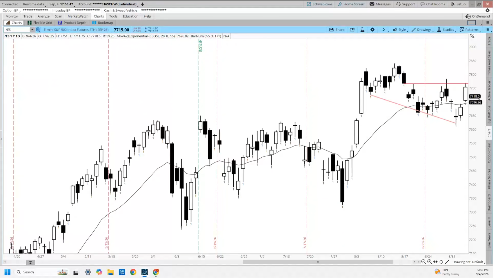
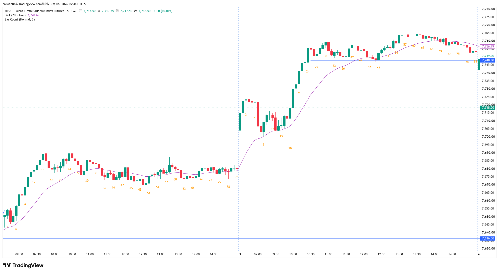
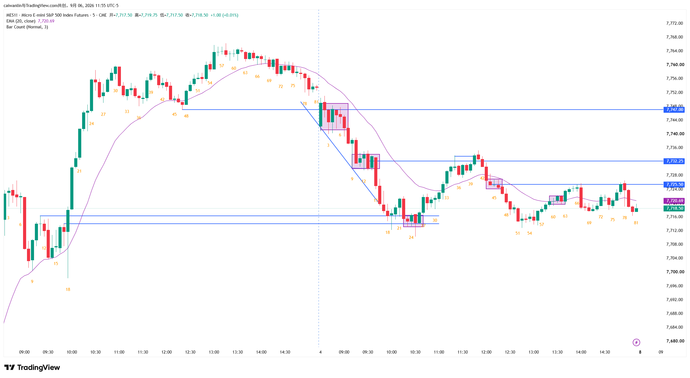

# emini-20260904
## 1. 分析日线

1. 目前位置处于震荡区间内，先达到前高压力位
2. 此处买入并不理智因为处于阻力位，交易者更愿意等到回调再买
3. 对多头有利看起来是一个楔形牛旗
4. 期昨日高点上方有卖盘昨日高点下方有买盘
5. 在昨日高点上方如果买入必须要有动能因为上方是一个压力位

## 2. 分析5min昨日尾盘

1. 对突破区间上沿后一路向下直至今日早盘第一根k线跌破昨日区间下沿
2. 因为已经破了昨日区间下沿那么昨日区间下沿将变成阻力位上方大概率有卖盘
3. 因为昨日一路向下几乎没有反弹那么在更高时间周期上就是一段连续空头突破
4. 因为这是一段窄空道的空头突破那么大概率会有第二腿

## 3. 今日逐k分析

1. k1属于开盘的第一根k线它很强劲，那么就有可能有一段横盘甚至上行
2. 从k1到k3看起来像是一段震荡区k3 很长的下影线下方大概率有买盘上方大概率有卖盘
    - 仍然预期空头会突破走出第二腿
3. k4再度尝试反转向上但达到昨日k47的阻力位
4. k5-k7意味着k4的再次尝试又失败了，且构成了一个微型通道
5. k8延续了微型通道， k8跌破了前面的小型交易区间， k1、k3、k8构成了一个楔形底部预计会有反弹然后再次走出第二波下跌
    - k5到k8的微型通道大概率还会有第二腿
6. k9是一根不错的反转k线但直接在上方买入不理想，因为k6到k9仍然是一个空头的微型通道大概率会有第二腿
    - 将k9的下影线看成一多头反转尝试，但因为这是一个窄的空头通道那么预计会有第二腿
    - 在第二腿走完后做多更合适
7. k10大阴线是空头的第二腿
8. k11、k12位于的下方触发了买盘，但上方仍有卖盘，上涨力度不足
9. k13跌到k9的下方，意味着k11、k12的反弹力度很弱
    - k9下方和k12上构成了一个窄的交易区间
10. k14在交易区间内，交易区间可能是一个熊旗
11. k15直接跌破交易区间趋势延续，空头得到了他们的第二腿。因为k15几乎收到最低，那么更有可能继续延续
12. k15到k17k实体越来越小，此时追空并不理想因为空投正在失去动能
    - 仍然是一个窄的空头通道，那么预计19上方仍然是有卖盘的
    - 但此时直接追空并不合适
13. k18接近下跌通道线此时追空并不合适
14. k19-k21三根k线的微型通道， k19、k20下方大概率有买盘
    - 空头已经走完了三段下跌，此时出现多头的微通道。那么预计会有两段多头回调也就是意味着多头会有第二腿
15. k22大阴线但前面是一个微型的多头通道k19下方有买盘
    - 那么可能会横盘或者第二段上涨
16. k23到k26下方接近支撑位出现横盘，我们可能进去了交易区间
17. k27多头得到了他们的第二腿，空头则希望这是一个第二波陷阱
    - 第一波回调，第二波测试
    - 阻力位是21根的高点或者均线
18. 对多头来说k25确实很强但k26更强也是一个突破k，k27比k26更强。从左侧看此时来到了k11或者k17的支撑位，因为那是多头的突破k线，空头在那里被套住
    - k19下方的位置确实起到了支撑作用
19. k26下方可能有买盘，不确定此时有足够的买压来期待大级别的反转，但k26下方的支撑对多头有利
20. k28下方做空是一个low2，双顶、熊旗、且接近均线压力位
    - 但在k25-k27这个微通道后，k28力度并不强是个弱势信号k，且距离下方下方买盘区域位置空间很小
    - 这不是一个理想的卖空位置
21. k29-k31在空头回调后，出现连续的窄多头通道
22. k33多头回升到k12附近的交易区间，开始测试该交易区间，大概率会出现阻力
    - 在该交易区间中部设置限价单进行做空，剥头皮
23. k35触发压力位，形成十字星，但直接做空不可取。因为前面是一波窄通道上涨，几乎每根k都收到最高点
    - k35下方做空，风险回报比虽好，但概率较低。概率偏向回调后开启第二波上涨
    - 限价单交易者在k35下方做空不如在k34下方限价单做多
24. k36-k39进入通道阶段
25. k40突破k36上方时，预期有卖盘出现，多头获利了结。但因为是窄的多头通道涨上来的，预计卖盘不会太多
26. k41强反转k线，收在低点，和前方k35共同构成双顶
    - 在k41下方做空比k35下方做空概率更高，是Low2做空进场点
    - 但此时k41还没突破，概率没有k42高，但风险回报比很好
27. k42空头突破k40，此时做空概率比k41更高
28. k43像是空头投降k线，形成微通道
    - 此时做空概率更高，但风险回报比更差了
29. k45停顿，预计接下来会有空头的第二腿
30. k46-k49，空头得到了他们的第二腿，且达到了ab=cd的mm目标位
    - k49此时虽然达到目标位，但微通道很窄，第一次反转向上大概率失败
    - 在k49上方做空大概率能赚钱
31. k52是多头的十字星，达到前方支撑位，仍由于微通道很窄不是合适的买点，但风险回报比不错
    - 多头可以等待第二个做多信号入场，类似双重底信号。或者等待多头突破
32. k52-k54进入横盘，这对多头有利
    - 多头期望这是一个更高的低点，形成大级别趋势反转
    - k54第一次触发买入，但概率不高
33. k56力度足够，且是第二次买入，是合理的止损单买入，比在k54买入概率更高
    - 想要提高概率，还能再等突破信号
34. k57多头有延续，技术上算有突破且有跟进，k57下方大概率有买盘
35. k59形成三根k线的微型通道，价格走的更远，但止损也更远，概率在增加
    - 可以买k58收盘，或在k58下方限价单买入，期待第二腿
36. k56-k61构成多头微型通道，k61大概率有买盘
37. k62跌破k61下方，形成一次回调，预计下方仍有买盘，形成交易区间，后续形成多头第二腿
    > 交易区间/共识区域突破后会形成后续的阻力位
38. k63趋势延续，但接近前面共识区/阻力位
39. k65是个糟糕的卖点，概率低，最好等待第二次入场机会，或第三条入场腿
40. k66十字星k线，测试阻力，但由于仍然是窄空头通道，也不是很好的卖点
41. k67强劲的空头突破k，困住了上方做多的交易者，大概率有第二腿向下
    - 对空头来说不是理想卖出位置，k63下方是支撑位置可能有买盘
    - 窄通道反转前，通常会测试高点
    - 对空来说等回调，继续卖更合理，激进交易者在50%回撤限价单卖
    - 因为这是多头宅通道，那么k67的回调可能会达到k67的上半部分
42. k68-k69空头获得跟进，对空头有利
    - 但因为前面是窄通道多头，因为更可能横盘，此处都不算好的止损单k
43. k72达到k67上半部分
    - 预计会有卖压，因为k67-k70看起来可能是窄的空头通道
    - 从k70反弹的k72的力度也很强，预计k72下方也有买盘
    - 此时让人困惑，更可能进入交易区间
44. k72-k74进入交易区间
45. k75-k76三根k微型通道对多头有利，但位置不好，达到前面交易区间顶部
    - 更可能遇到卖盘，因为交易区间的突破80%都会失败
46. k78-k80是k67-k69的第二腿

## 今日交易机会
1. 因为昨日窄空头通道下跌所以今日k1上方限价单买入概率不高
2. k4上方止损单未触发
3. 止损卖出k8可能可以，但很困难，因为和k1、k3、k8构成三推下跌后的支撑
4. k13下方卖出合理，因为可以看到这是一个窄的下跌通道，回调都很小
5. k15下方卖出合理，因为是k15是趋势方向的强势空头突破k
6. k22下方卖出不理想，因为k19-k21三k微型通道可能有第二腿，应寻找Low2做空
7. k24或k26是合理的止损单买入，因为这是昨日支撑位置，且这是交易区间横盘了9根或10根
8. k27止损单买入，是合理的，虽然止损更远，但可能有第二腿
9. k46-k48收盘是合理的
10. k49不应卖出，因为达到mm，且和支撑位重合 
11. k52和k54上方不应买入，k56是合理的止损单买入，因为支撑位做多，且是强势信号k
12. k66不是高概率止损买点
13. k67大概率有第二波横盘下行，但位置不好

> 使用限价单交易时，要在多头k线下方买入，空头k线上方卖出