1. 强劲的趋势 = 突破 = 尖峰spike
2. 市场周期，突破->通道->交易区间->新的突破
3. 图表中的每一根趋势K线，既是一次突破，也是一个尖峰，也是一个缺，也是一个高潮
4. 突破可能是一根不起眼的趋势K线，也可能是一根大趋势K线，也可能是一系列大趋势和小趋势K线
5. 突破是指突破什么？
    - 突破交易区间
    - 突破趋势中的回调
    - 突破趋势线
    - 突破移动平均线
    - 突破任何周期上的高点或低点
    - 突破前一根K线的高点和低点
6. 看不出来突破从哪里开始， 并不重要。当你看到一根趋势k时，这就是突破
7. 随着经验累计，将能够看到突破从哪里开始
8. 了解突破行情及如何交易突破行情非常重要，是交易者可培养的最重要技能之一
9. 突破行情强劲且成功时，通常会有第二波行情，根据价格飙升幅度或突破时的交易区间大小，有某种计划性的操作
10. 如何管理交易？
    - 非常自信的下单时机时，盈亏比1比1
    - 犹豫不决时，盈亏比2比1
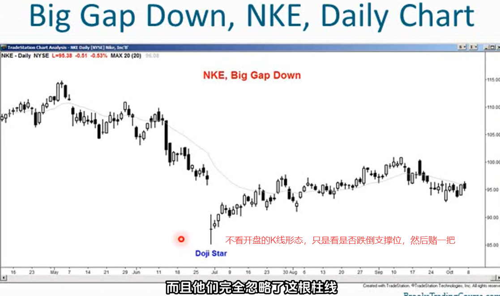
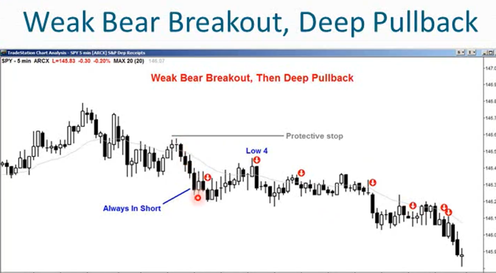
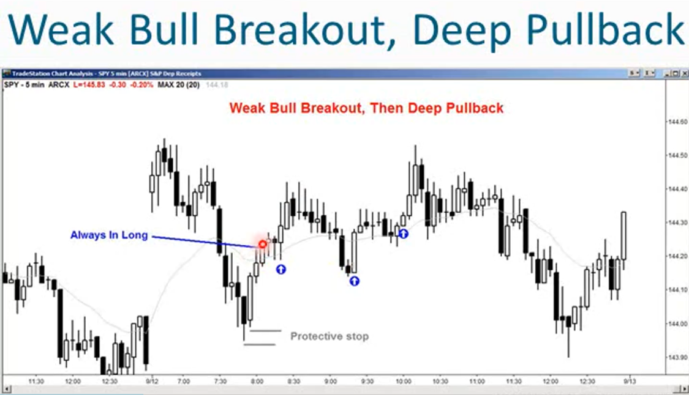
11. 突破行情的好处：延续的概率很高，回报丰厚
12. 突破行情的坏处：风险很大，需要减小仓位，交易情绪上非常困难
13. 交易情绪上很难困难：
    - 随着尖峰行情越来越远，风险也越来越大
    - 必须减少仓位
    - 让人很有压力
    - 必须随着每一个价位变动，随时改变决策
    - 必须非常清楚止损位在哪里，盈利目标在哪里
    - 常感觉没有足够的时间做出交易管理决策
14. 管理交易决策
    - 是否要跟随趋势入场
    - 止损位设在哪里（牛市尖峰的底部、尖峰的一半，某根大K线的下方）
    - 仓位大小
    - 盈利目标（应该设置一个比平时大得多的目标）
15. 突破非常常见，反转就是一个突破（反向突破的尝试，但80%的反转会失败，形成回调随后趋势继续，空头旗形）
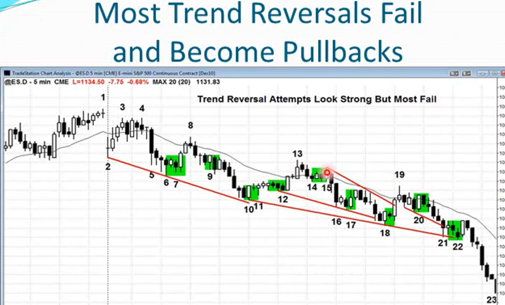
16. 在交易区间内，突破是高潮常会导致反转，冲向交易区间的顶部，随后反转又冲向交易区间的底部
17. 突破发生时，精明的交易者在每根K线上方买入，期望实现成功的突破，通常有更多交易者持相反态度选择卖出，因此大多数突破都会失败
18. 如果市场突破前一根K线的高点，大多数情况下，上方的卖方会多于买方
19. 判断一次突破是会成功还是失败？这是所有交易者做出任何决策的基础
    - 所有的趋势K都是某种突破
    - 所有的突破很快都会失败
    - 所有的影线都是一次失败的突破
20. 当突破失败时，行情要么反转，要么重新开启新趋势
21. 需要不断判断，突破失败时，行情是会反转，还是在小幅回调后趋势延续。如果能够大概率判断出是反转还是延续，那么就有了交易机会
22. 交易者在每根K线收盘时，最重要的问题都是问自己，k线的上访和下方是买家更多还是卖家更多
23. 突破很重要，可能引发趋势行情。在形成趋势行情时，不应该进行scalp交易，应该进行波段交易，此时胜率很高
24. 突破有三步过程，1. 首先是突破（一根或一系列趋势k） 2.突破失败（反转k） 3.暂停形成多头旗形然后趋势恢复，或形成反转趋势
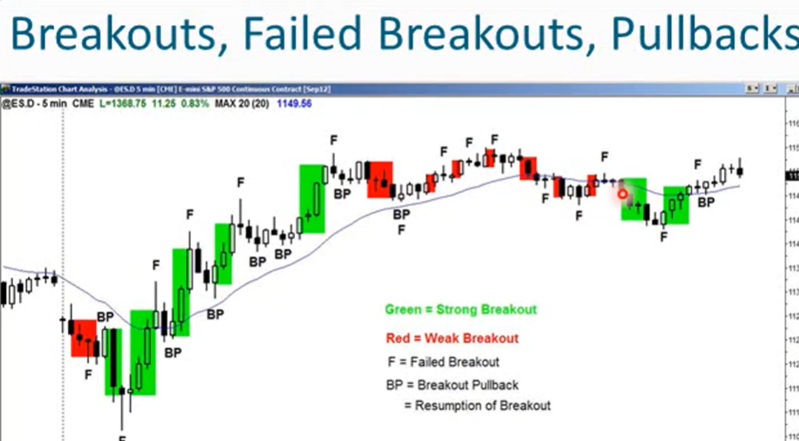
26. 如何判断突破会成功，还是会反转？
    - 将突破的力度和反转尝试的力度进行比较
    - 必须判断多头和空头谁更强
        - 如果一方更强那么更有可能掌控后续走势
        - 如果双方实力相当，那么就需要更多信息，查看下一根或接下来几根k
        - 耐心等待，直到情况明朗
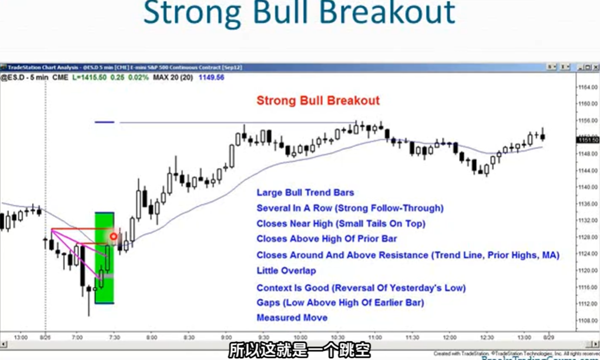
27. 强势多头突破有哪些迹象：
    - 有大型牛市趋势k
    - 趋势k连续多根，有跟随
    - 收盘价接近高点，很小的上影线
    - 收盘价在前一根K线高点之上
    - 收盘价接近并高于阻力位（趋势线、前高、移动平均线）
    - k线之间，重叠部分很小
    - 合理的交易背景（如：反转昨日前低）
    - 存在跳多缺口（低点高于前一根K线的高点）
    - 测量移动位置（预测价格目标位）
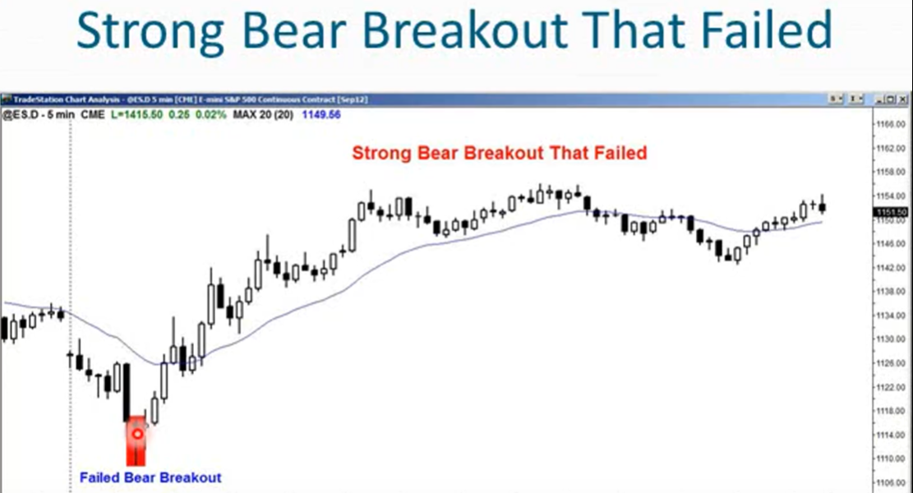
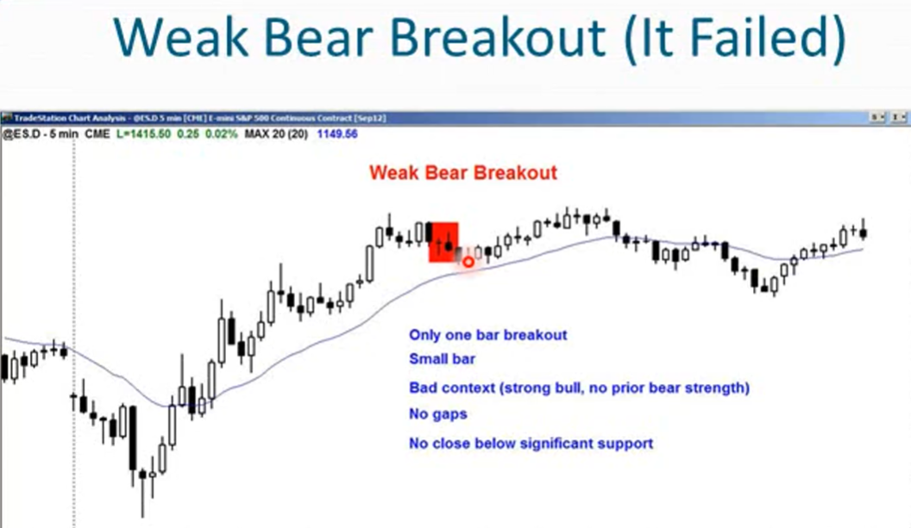
28. 失败的弱势空头突破：
    - 只有1根强劲的阴线，而不是2-3根
    - 阴线不强壮
    - 不合理的交易背景（如：强劲的多头趋势，没有明显的抛售压力，没有跌破移动平均线，之前没有强劲的阴线尖峰）
    - 没有跳空缺口
    - 收盘价没有低于前期低点
29. 如果出现了强劲的多头突破，那么就买入
    - 直接市价买入
    - 多头k线收盘价买入，空头k线收盘价买入
    - 前一根K线的上方或下方买入
    - 任何形式多头旗形突破时买入
30. 在一个牛市回调时买入，在回调看起来要重新恢复牛市趋势时（看涨旗形即将向上突破），在前k高点上方1个tick处设置买入条件单
31. 所有牛市旗形都是空头的反转尝试，必须假设空头会失败，趋势将延续（80%概率）
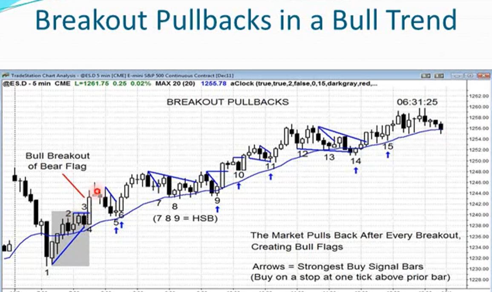 
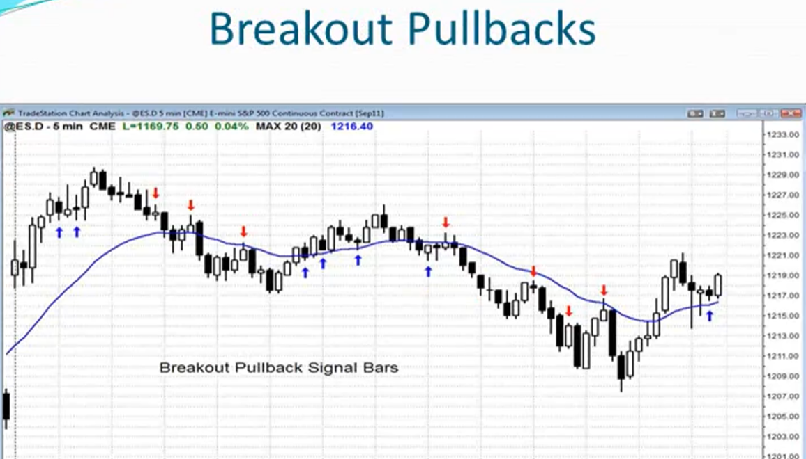
32. 在长期趋势的末端出现一根非常强劲的趋势K线可能意味着趋势耗尽
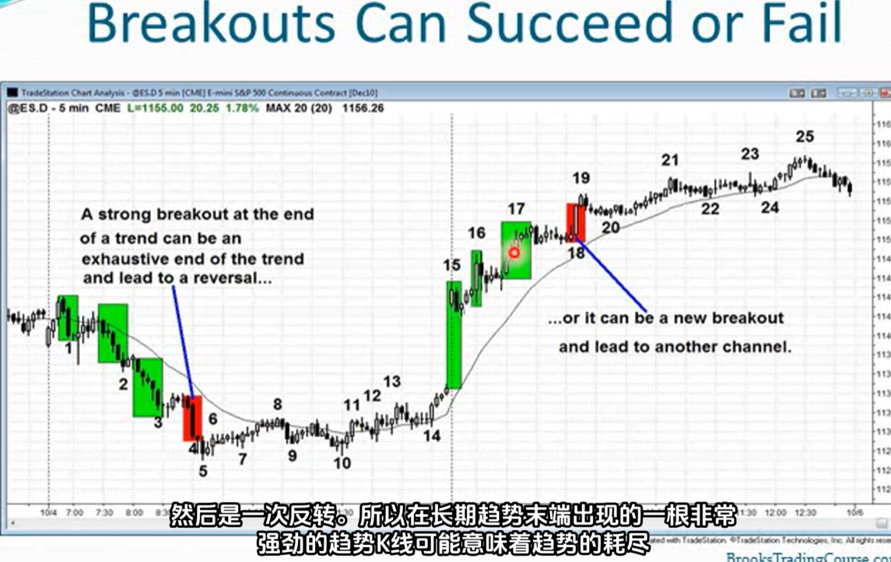
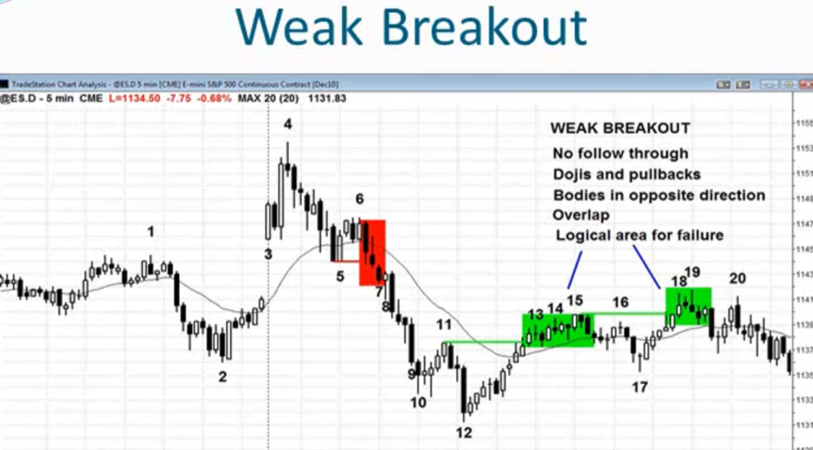
33. 每根趋势K和每组趋势K都是：（不同环境，扮演下面4种角色）
    - 某种突破
    - 强劲突破：尖峰
    - 跳空（无论是否明显）
    - 高潮（多头趋势k是多头高潮，空头趋势k是空头高潮），也是一个衰竭缺口
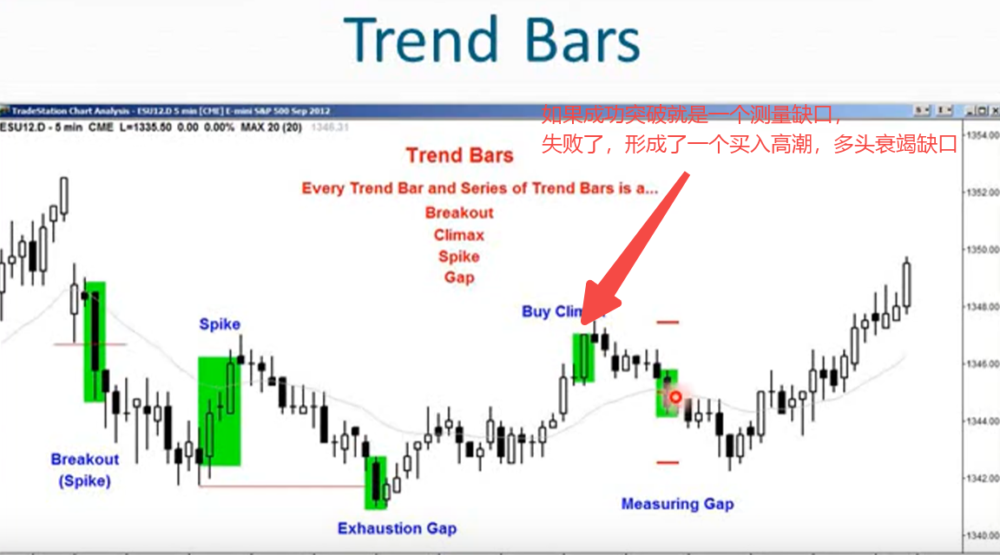
34. 将每根趋势k看作一个缺口，把每个缺口看作一根趋势k（流动性充足时，缺口就是趋势k。流动性不足时，趋势k就是缺口）
35. 缺口的类型
    - 突破缺口
    - 测量缺口（常会引发可测量行情的缺口）
    - 衰竭缺口（行情末期，衰竭缺口之后行情反转）
    - 常见缺口（趋势运行过程中，是不是出现的缺口）
    - 微型缺口
36. 三根K线（abc）组合形成测量缺口。市场出现牛市突破时，会有一根趋势k（记作b），且收盘价在前一根k线（记作a）最高价上方。下一根趋势k（记作c）的最低价高于K线a的最高价。这两个价格之间存在一个缺口，形成小的测量缺口。由于处于牛市突破阶段，这个缺口也是一个突破缺口
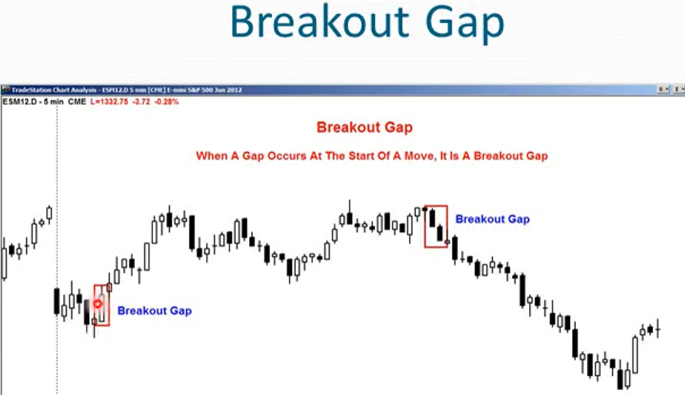
37. 牛市中期测量缺口，首先假设多头趋势已经形成了10-30根k线，出现一根趋势k，前一根k的最高价等于后一根k的最低价，这跟多头趋势k就是一个缺口，经常会引领一波大幅的可测量走势。这可能处于一轮非常大的牛市趋势中期，市场可能还有很大的上涨空间
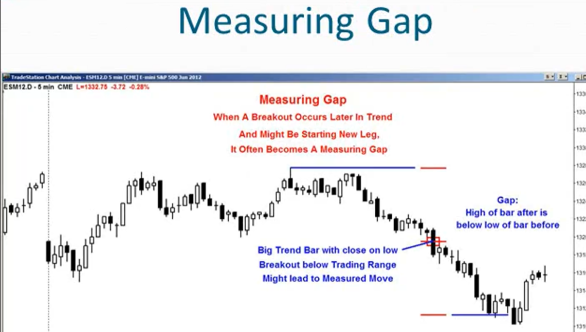
38. 长熊趋势的起点和趋势中期出现的测量缺口的中点，将这段长度投射到测量缺口中点往下，就是预期价格趋势结束的位置
39. 牛市衰竭缺口，首先假设多头趋势已经形成了10根或更多k线，并且市场达到了一个阻力位，市场背景可能出现大幅回调，随后出现一根牛市趋势k线（大幅收高，几乎触及阻力位），接着在1-2根k线内趋势失败，并反转下行。此时这根大幅牛市趋势k线可能就是一个衰竭缺口/买入高潮。
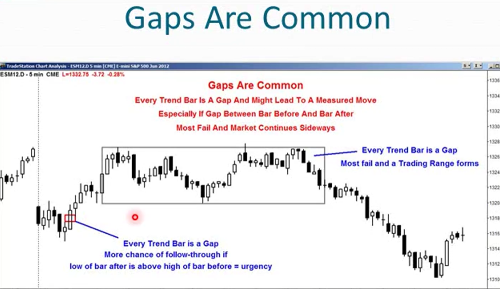
40. 记住，每一根趋势k也是一次高潮，所以上图中有很多的抛售高潮（常见缺口/Common Gap），一旦出现一连串的抛售高潮，就必须开始寻找趋势可能结束并反转的信号
41. 每个趋势k都有普通缺口，一段长的趋势中有很多的趋势k，因此有很多普通缺口，大多数没有特别的预测价值，他们在交易区间中非常常见

42. 微型缺口，对于每根趋势k，观察前后的k线的高点和低点，如果他们不重叠，那么延续趋势的可能性更大
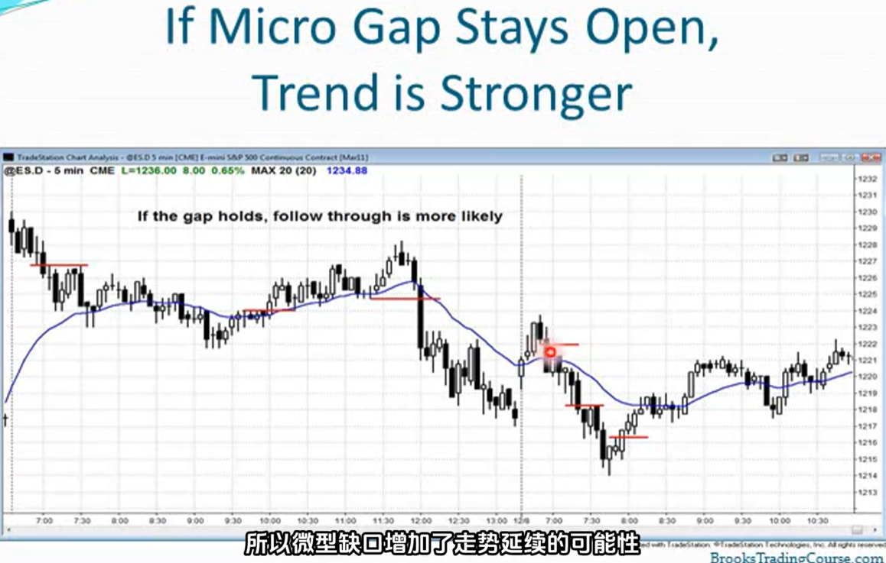
43. 如果微型缺口持续保持开放，那么微型缺口就是趋势强势的信号，如果微型缺口闭合后续走势延续的可能性就会降低
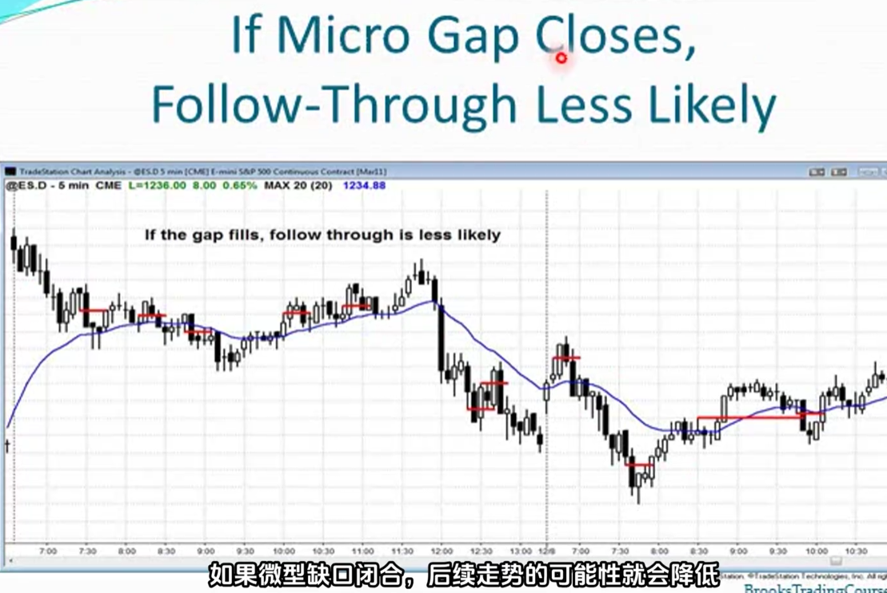
44. 连续高潮，如果遇到连续高潮（趋势k）且没有回调，那么很快就会预计有TBTL（Ten Bars Two Legs，10根k线两波回调）,至少有10根k线的回调，至少会有两波回调，也可能3波或4波，也有可能是反转。
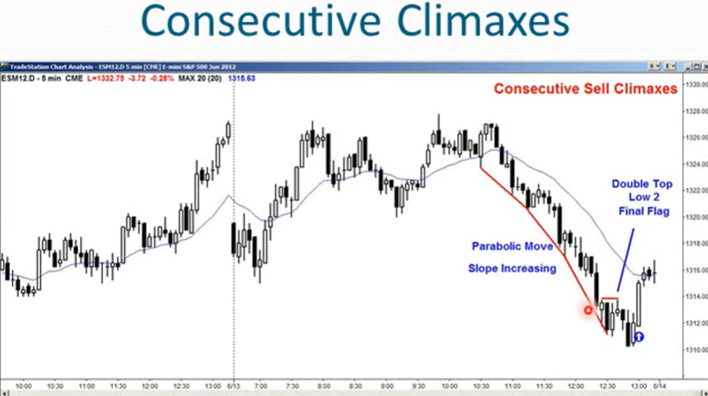
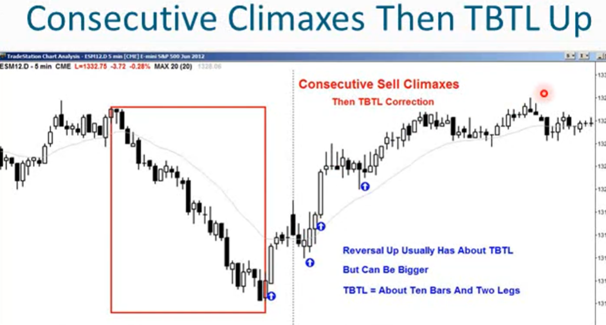
45. 高潮是什么？在多头趋势的晚期（持续了30-40-50根k线），突然出现了整个趋势中形态最好的1-3根多头趋势k线，就得想到这会吸引大量获利了结，或开仓做空者。多头空头可能都会卖出，而这构成了趋势的终结
46. 高潮举例：一个持续约40根k的多头趋势，此时突然出现强劲的多头突破，且这是整个趋势中形态最佳的1-3根多头趋势k，这意味着可能是多头趋势的尾声，特别是多头趋势k收盘在高位且非常强劲时。多头有大量未平仓的利润，寻找离场的理由，他们将这视为大礼，一份丰厚的最终利润。如果多头看到的只是小幅回调，就不会获利了结。多头获利了结，且价格在大幅下跌之前不会考虑买入，因此图标上远低于当前位置的价格将缺乏买家，市场将跌至某个支撑位。空头视为绝佳做空机会，市场直到大幅下跌之前都不会有买家
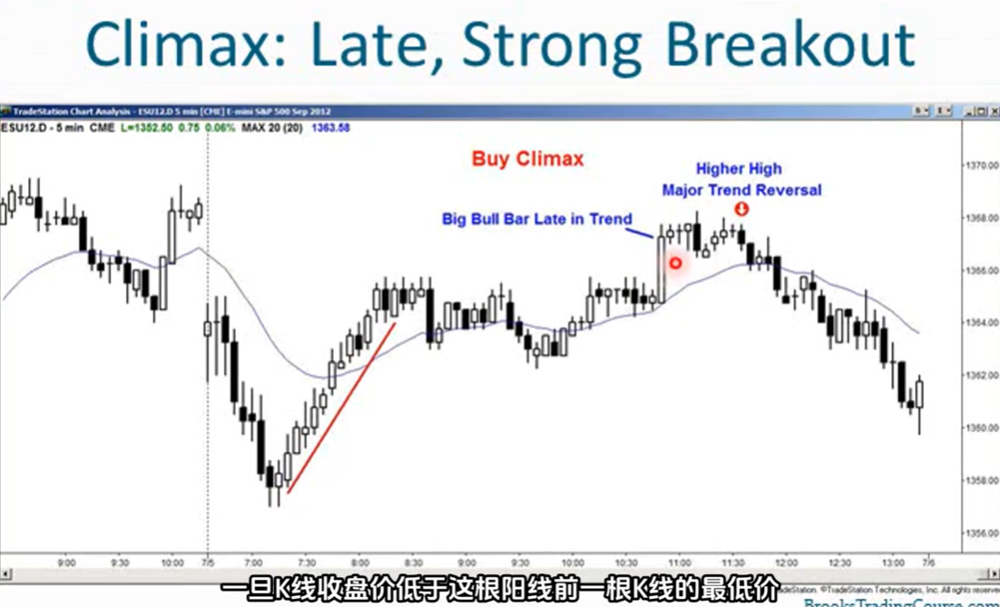
47. 当遇到趋势高潮，试图反向操作（交易回调/反转）时，高潮k（1-3根合并）可用作测量移动的止损位
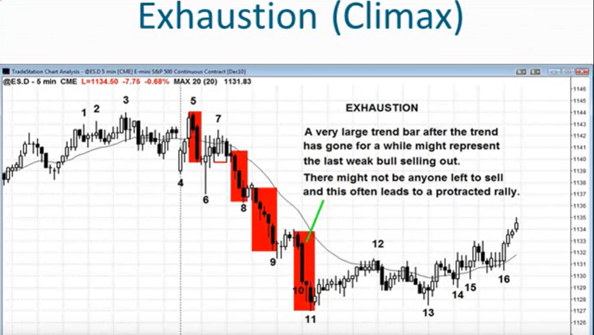
49. 趋势高潮后，形成回调/反转，高潮发生的尖峰行情的起始点，可能会有反弹
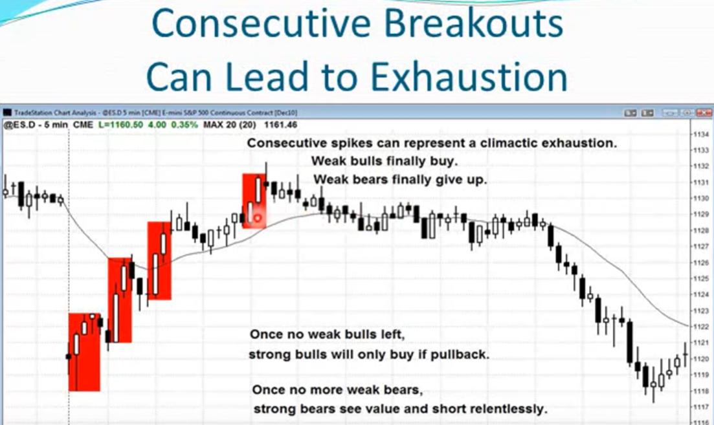
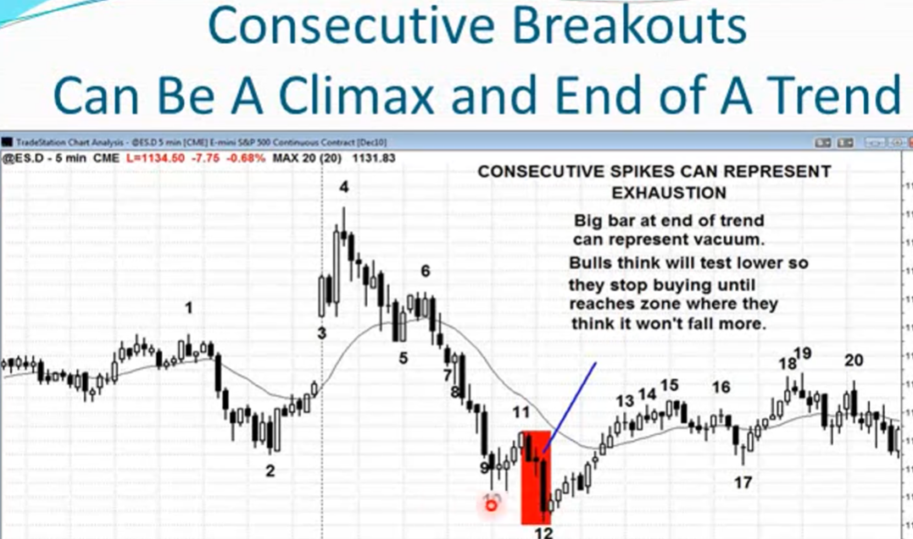