1. 最强劲的趋势对初学者很可怕，往往会出现非常大的K线
2. 大的K线往往市场波动迅速，没有足够的时间做决策。意味着止损位更远，风险更大
3. 初学者总是希望止损位比强劲趋势所需的更窄，他们在等待回调，但回调却一直没来。初学者意识到之前，已经错失了大部分趋势和大部分利润。他们一心等待回调，这样可以设置更窄的止损位
4. 一旦最终出现回调，行情通常不太明朗，更具不确定性
5. 对于新手而言，回调看起来像反转，回调趋势中信号柱往往较弱，新手总是会不选择进行回调交易，这样他们错过了回调入场时机
6. 当趋势继续发展，新手交易者们继续等待，他们认为趋势已经够远了，他们押注会回归均值。既然风险小，为什么不尝试捕捉反转。遇到强劲的趋势和明显的反转K线，可以在其下方做空，将止损设在上方，这样仅需承担1根k线高度的风险。但他们没有意识到的是，趋势具有惯性，80%的反转都会失败。反转交易的成功概率非常低，所以在趋势强劲的时间里反而亏损，这本该是大赚的时间。这是一种糟糕的交易模式
7. 趋势提供了绝佳的交易机会，但是必须了解它们的运行规律
8. 所有趋势都始于一根长K线（趋势K线、一系列趋势K先、飙升行情，随便怎么称呼）
9. 最终趋势开始回调，并进入一个通道，随着时间推移，通道变得更平缓更宽阔，演变成一个交易区间
10. 此时反方向的动能增强，可以进行双向交易
11. 交易区间持续足够长的时间，交易者就不确定突破方向是向上还是向下。最终会出现向上还是向下的突破
12. 然后市场周期又会以新的飙升行情重新开始进入趋势
13. 飙升就是突破，两个词意思完全相同。代表强劲的趋势
14. 通道是弱势的趋势，存在双向交易，也有一些回调（如在牛市趋势中，偶尔会出现回调，在回调期间，空头至少会在一两个k线内占据主导）
15. 大部分强劲趋势始于大幅突破
    - 开盘跳空，然后再有一两根大幅趋势k线
    - 连续的一系列大幅趋势K线
16. 什么是大幅趋势K线？实体大且影线小的k线
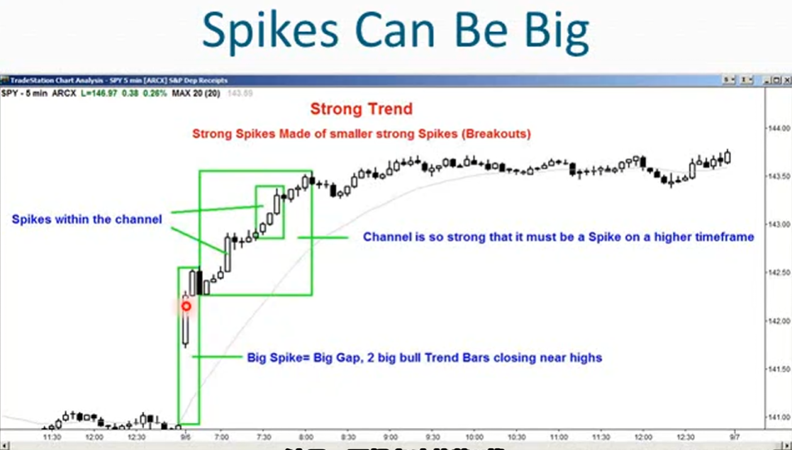
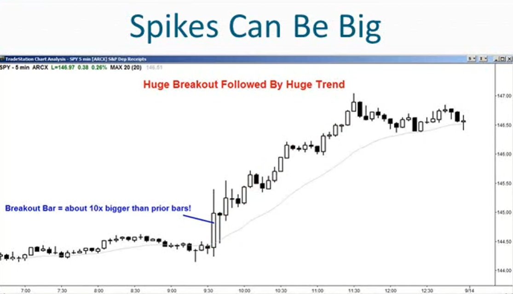
17. 大趋势可能始于一个小的尖峰行情Spike。如果趋势形成的条件具备，一根毫不起眼的趋势K线也能成为引发趋势的开端，随后会形成一个通道，通道可以延续30或者更多根而几乎没有回调。随着趋势的发现，通道可能会加速，然后出现强劲突破。所以有时通道会加速形成抛物线形态
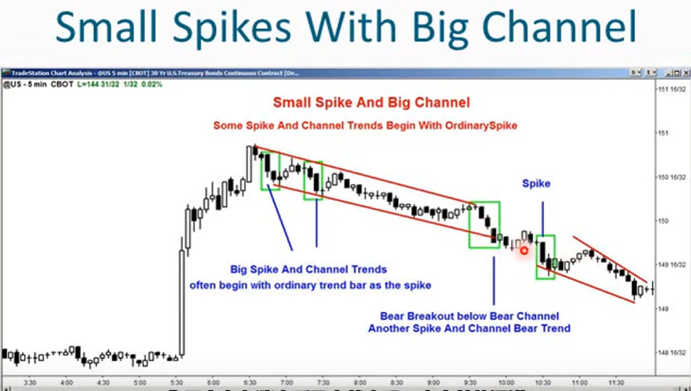
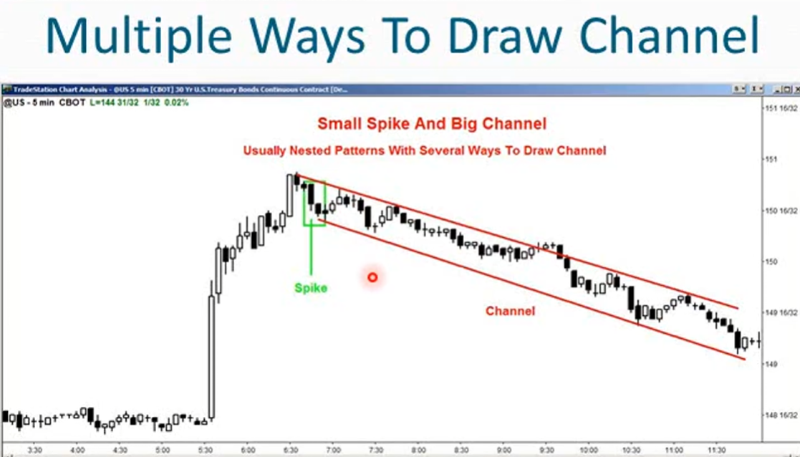
18. 无论何时看到，空头长钉形态（Spike或者叫尖峰）都要想到它可能是空头趋势的开端，随后可能会出现一个通道。此处是一个抛物线通道
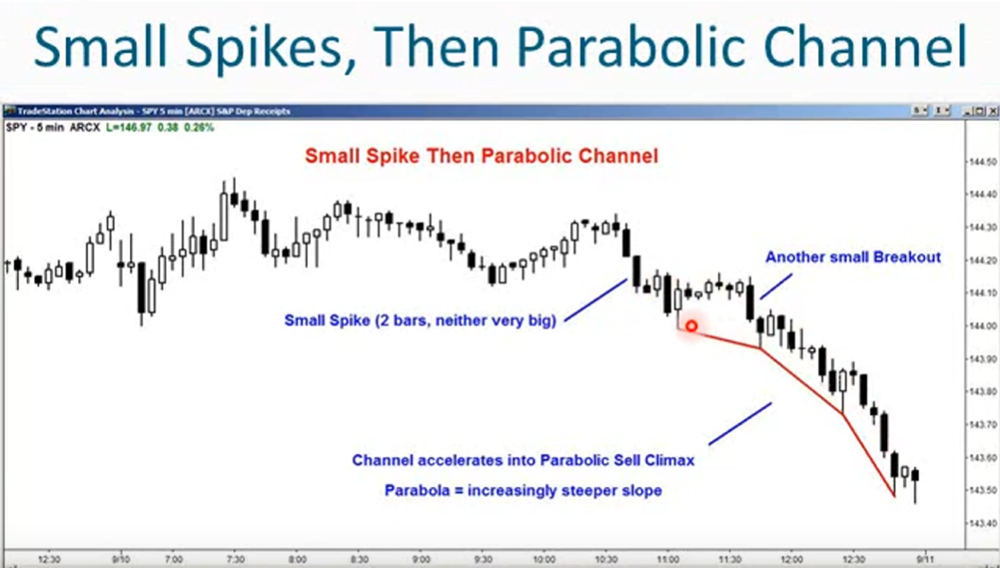
19. 抛物线通道：如果画一条连接低点的线，该线会越来越陡峭。次数是一个抛物线式的空头高潮，这通常会引发相当强劲的反弹
20. 假设看到一个通道非常狭窄，你无法判断它是长钉形态还是通道，那么就按照突破的形式进行交易，即使他是一个通道，你也要按照尖峰行情进行交易
21. 当通道非常狭窄时，和突破行情相比仍然是弱势趋势。
22. 当通道非常强劲，几乎和突破行情一样强劲时，就当成突破行情交易。只顺着趋势方向进行交易，并尝试波段操作
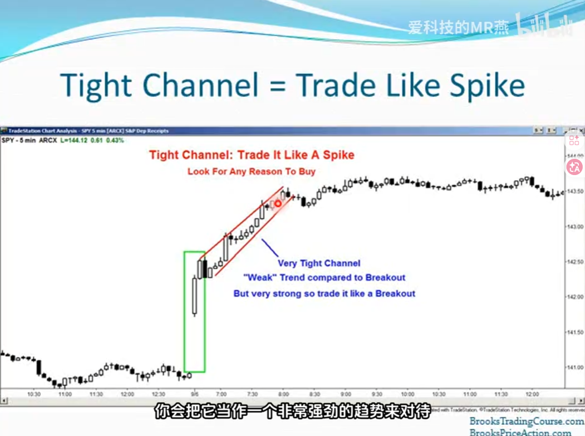
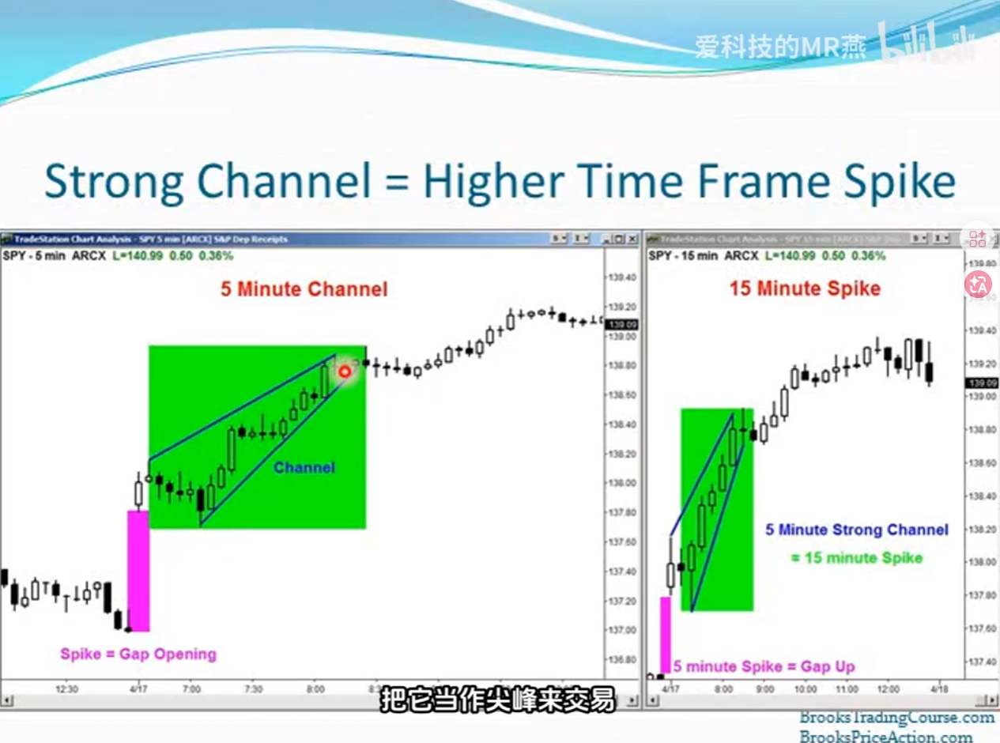
22. 记住，趋势要么是弱势的要么是强势的，强势趋势就是突破行情，弱势趋势等同于通道行情。但有时通道可能非常陡峭且狭窄，回调幅度很小，本质上就是尖峰行情，而且再更高时间框架的图标上，他们通常就是尖峰行情
23. 当一个通道非常平坦时，它很像是一个有轻微斜率的交易区间，把他当成交易区间来交易，双向交易，低买高卖超短交易
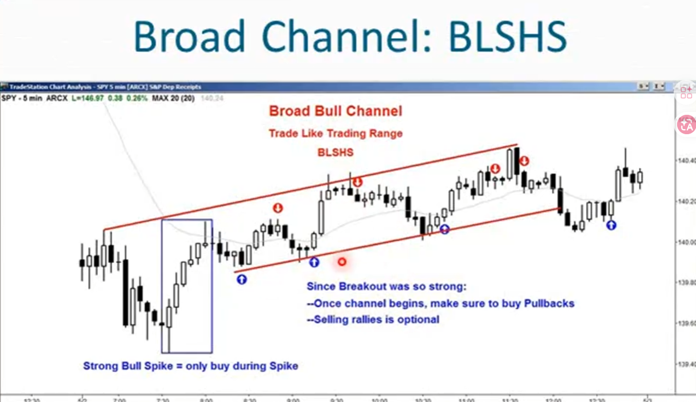
25. 为什么要将趋势分为不同类型？
    - 不同的趋势表现不同
    - 不同的趋势提供不同的交易机会
    - 一旦确认这是一个趋势，那么就将大部分仓位顺应趋势
26. 趋势的类型：
    1. 开盘趋势日。开盘的第一根K或最初几根K时，市场在当前剩余时间内保持趋势（这种情况大概每周发生一次）
    2. 趋势性交易区间日。市场处于交易区间内，然后突破区间形成另一个交易区间，有时会继续突破形成第三个或第四个交易区间（非常常见，每周会出现几次）
    3. 趋势恢复日。市场先下跌，再横盘4个小时再下跌（每月出现一次）
    4. 宽幅通道趋势，包括宽幅楔形或阶梯形态（每周出现一次）
    5. 小幅回调趋势，趋势全天都在发展，回调绩效（每月出现一次）
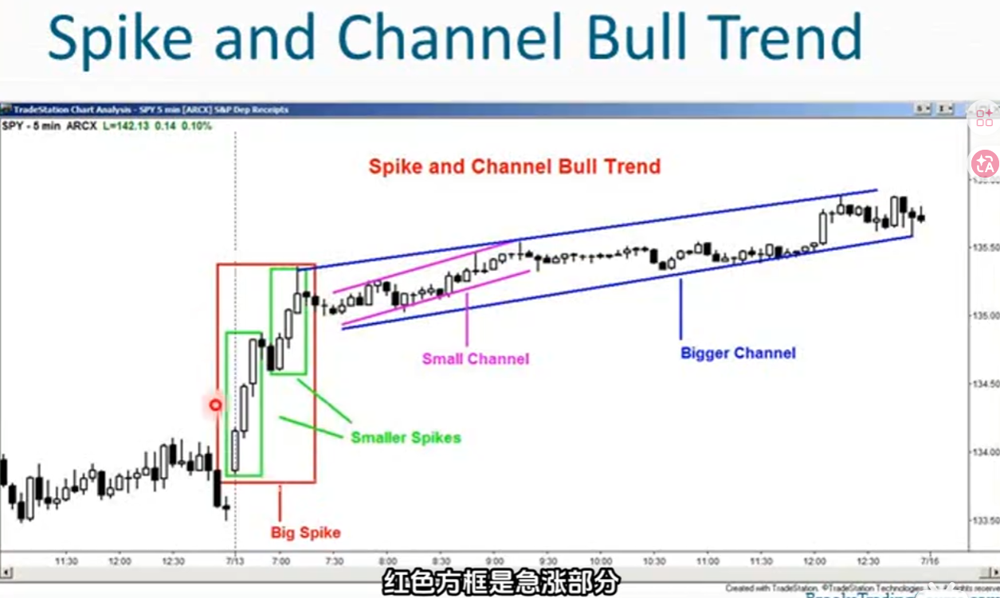
27. 一旦确认可能是一个牛市趋势，不要陷入做空陷阱，不要总想抓顶部，不要在做多时被洗出局，每次看到小反转不要以为反转一定会成功而平掉多单，80%的反转只会持续几根K，然后形成一个多头旗形
28.  所有通道最终都会演变成交易区间，通道通常会反转，随后市场回调到通道起点进行测试，此时既不存在通道也不存在趋势，而是进入了交易区间
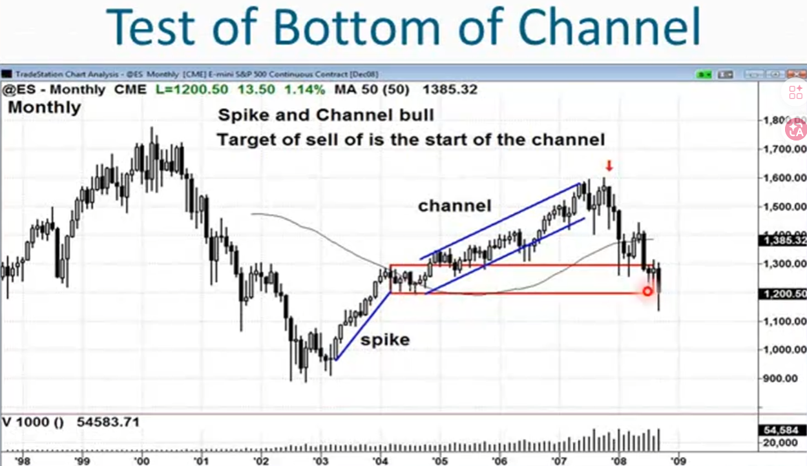
29. 无论何时看到上涨通道，尤其是明显的通道都可假设其为看跌旗形，随后会进入交易区间
30.在通道形成交易区间后，市场通常会回调至通道起点进行测试，价格可能在那里反弹，使趋势得以延续，也可能横向发展进入交易区间
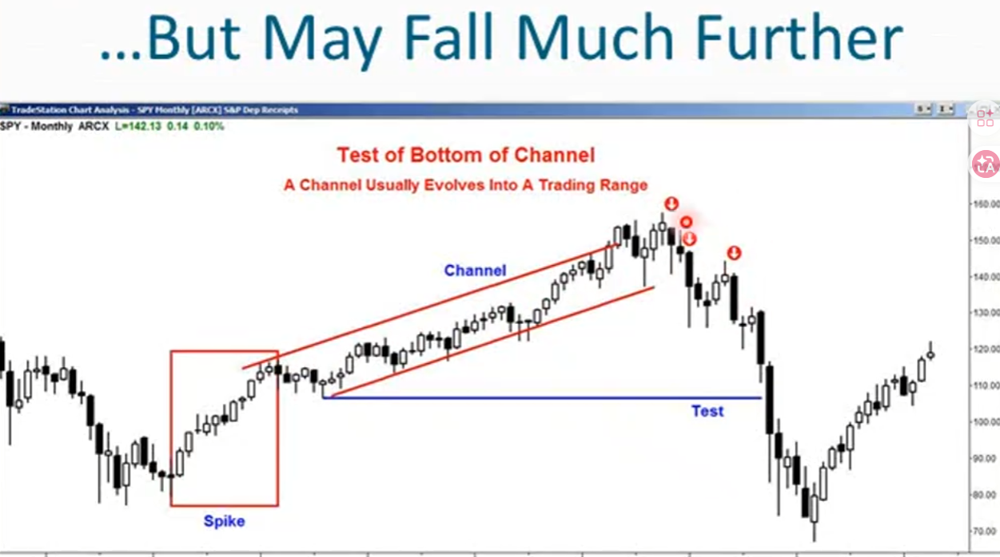
31. 开盘趋势日，这通常是一种强劲的趋势
    - 市场通常会在开市的一两个小时内形成趋势
    - 有时，该趋势的高点或低点可能从第一根k线就开始形成
    - 有时，它会一整天都保持为当日的极值，整天持续上涨或下跌
    - 这是一种急迫信号，所以通常都会是强劲的趋势
    - 有时市场会进入交易区间，但大多数情况下，市场开盘形成趋势是非常强劲的
    - 每日的前几根k线往往能预示当日行情
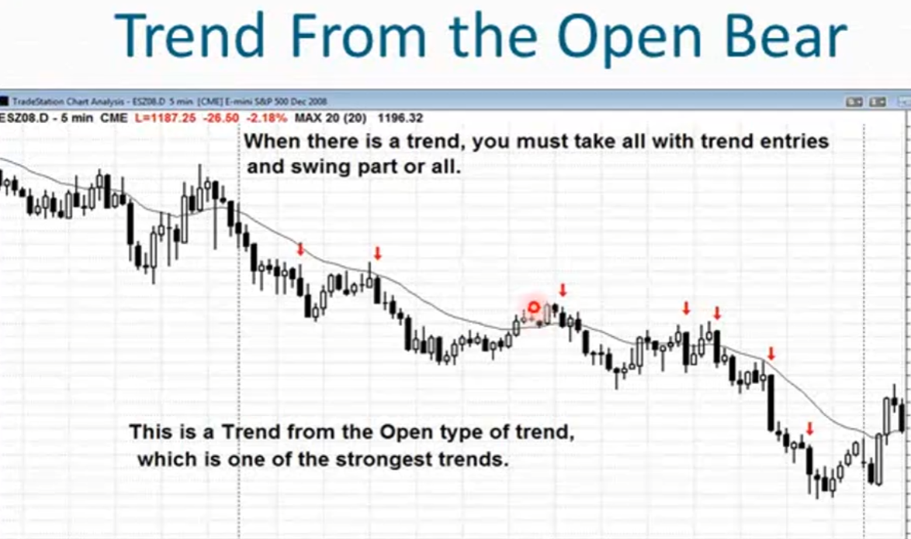
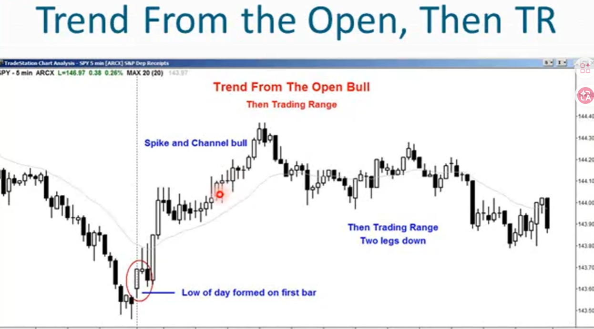
32. 趋势性交易区间日，这是一种非常常见的趋势交易日类型
    - 市场在最初的1-3小时内会形成一个盘整区间
    - 然后市场会突破该区间，通常不会有大幅突破（一般1-3根k）
    - 然后进入另一个盘整区间
    - 较少会出现第三次或第四次突破和盘整区间
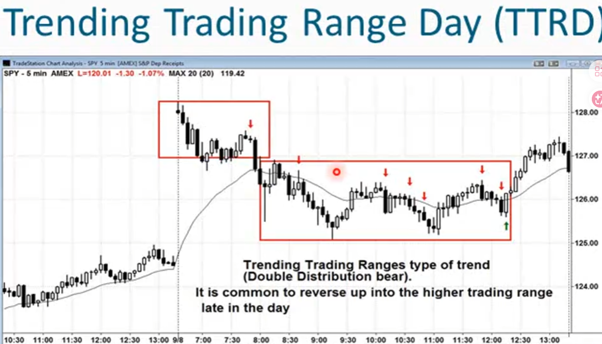
33. 大多数反转日都源于某种盘整区间，大多数反转日都来自趋势性盘整区间交易日
34.  市场经常会在早盘形成趋势，然后午盘横盘，收盘时会形成两种情况
    - 趋势延续日，下跌->横盘->下跌
    - 趋势反转日，下跌->横盘整理->上行
35. 如果遇到一个导致反转的交易区间，当天就会成为反转日。大多数反转日开始时都是趋势性交易区间日
36. 每当遇到趋势性交易区间日，就必须意识到它最终可能成为反转日
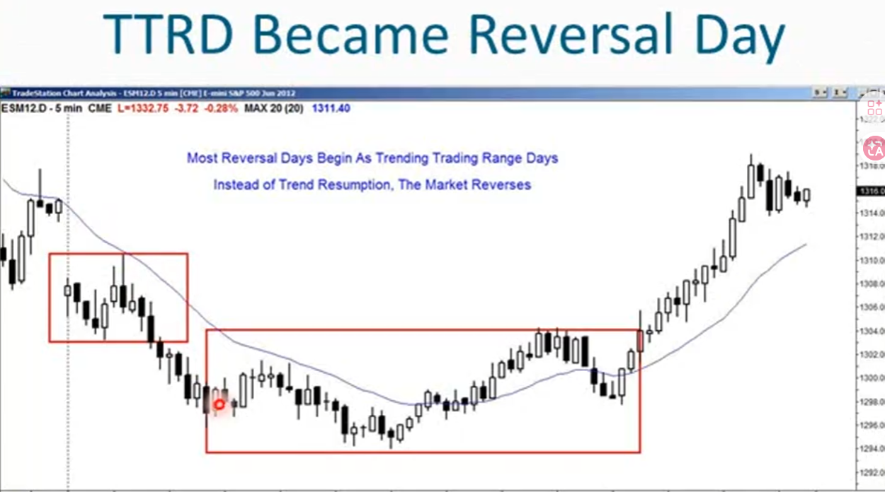
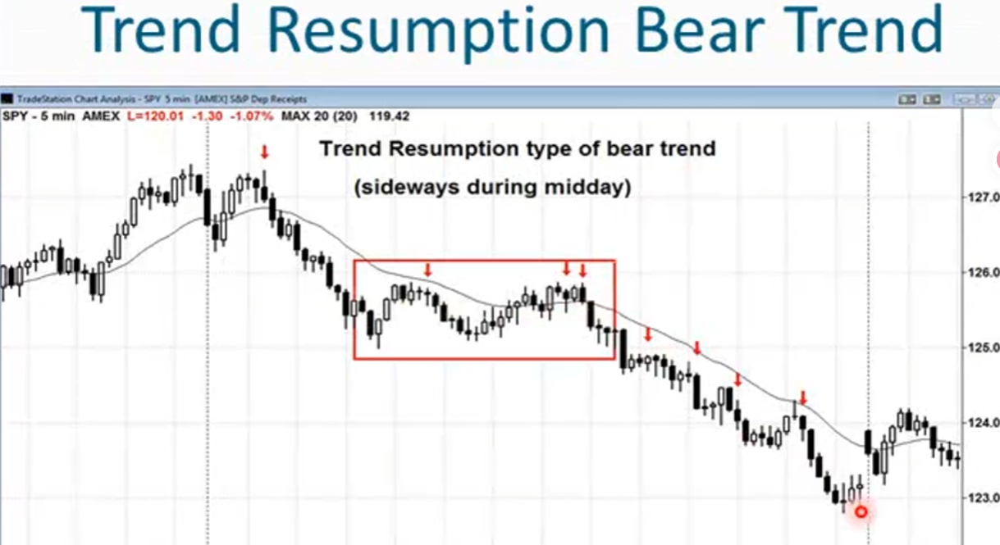
37. 宽幅通道趋势，很难判断市场处于交易区间还是弱势趋势时，不确定市场处于趋势还是交易区间时，就按照交易区间来做，低买高卖进行超短交易
38. 如果是宽幅通道，且市场处于交易区间内，在某个时候会看到有趋势特征的高低点，即使市场处于交易区间，趋势也会逐渐明朗
39. 一旦你觉得市场明显形成了趋势，即使仍处于交易区间内，也可以对部分仓位进行波段操作
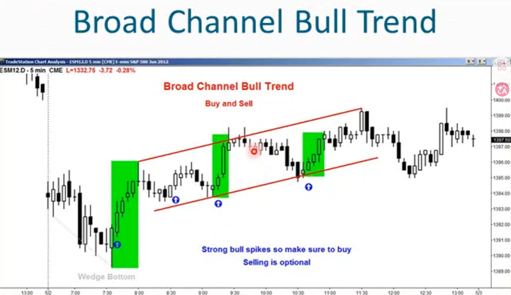
40. 特殊的宽幅通道：收缩阶梯（Shrinking Stairs）,不太重要
    - 会有一系列的突破，牛市趋势中一波上涨然后停顿，接着一波上涨然后停顿
    - 每次突破的幅度越来越小
    - 市场呈阶梯式上涨，但阶梯在不断收缩
    - 这是动能减弱的信号
    - 对于该模式，可以对突破走势进行反向操作，等待对突破点的回测
41. 小幅回调趋势日（最强劲的趋势类型）
    - 开盘后的趋势通常包含急涨和通道走势
    - 其中包含一些小的交易区间
    - 往往是一个小幅的、带有多个小交易区间的趋势交易日
    - 通常在开盘后的一两个小时内开始
    - 回调幅度相当小，小于平均k线实体的两倍
    - 通常在11点或11点30分之后会出现一个比之前回调幅度大50%到100%的回调
    - 在收盘时恢复涨势（利用这一点，在大回调后买入，期待创出新高）
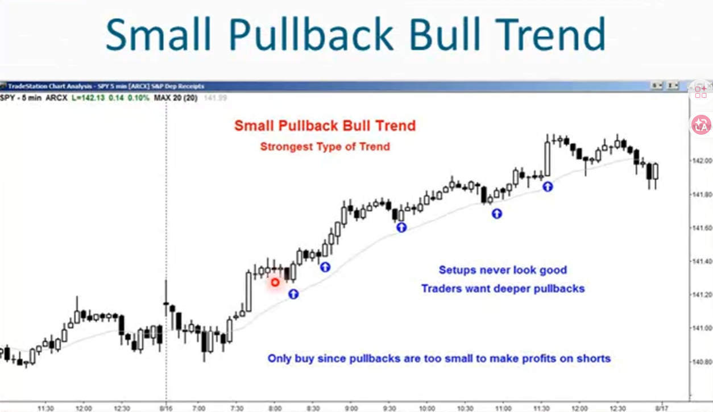
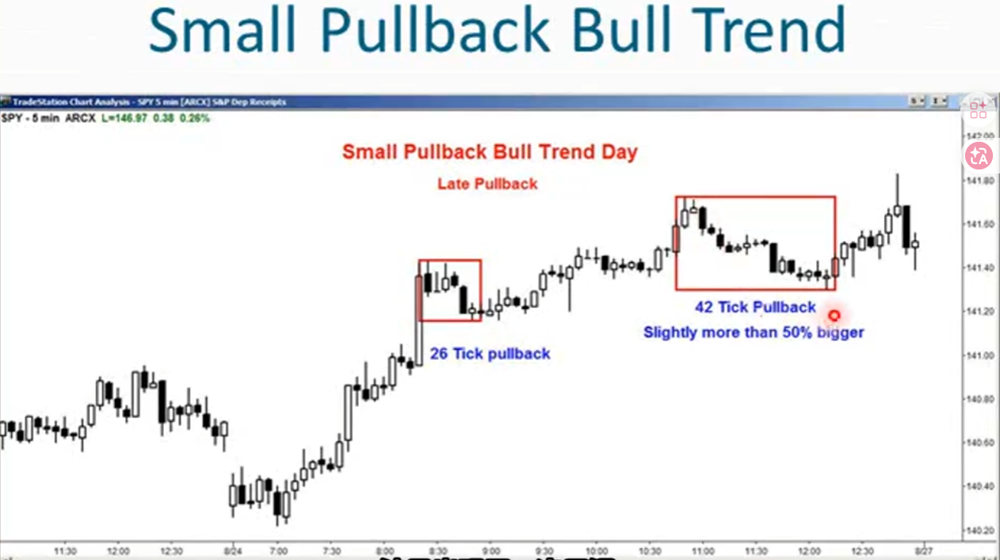
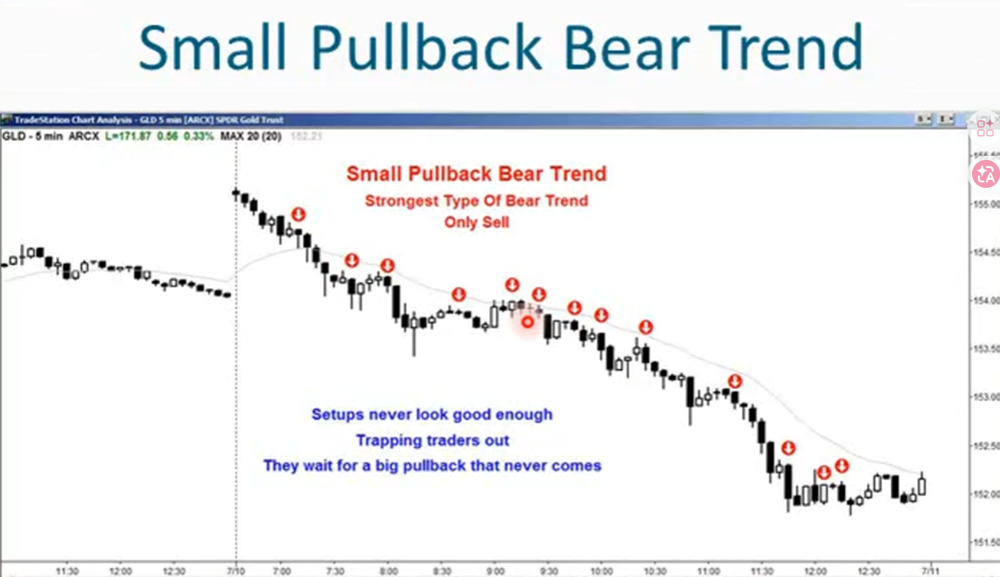

    