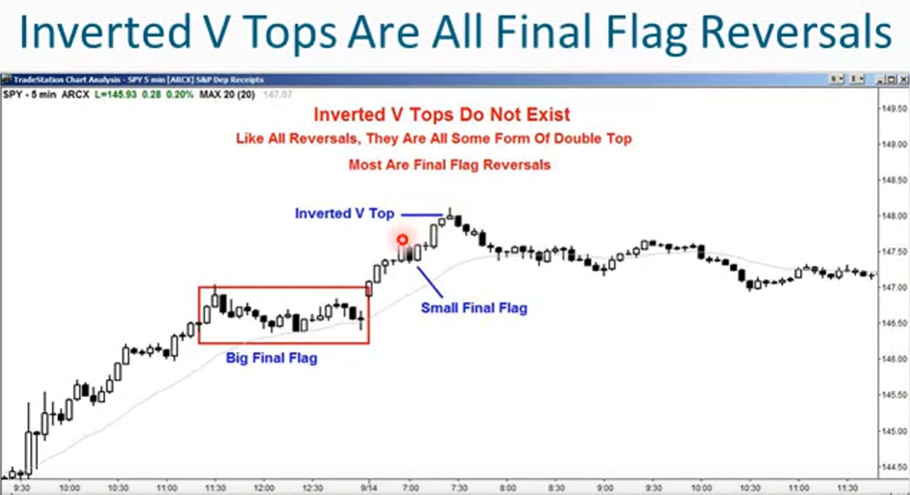
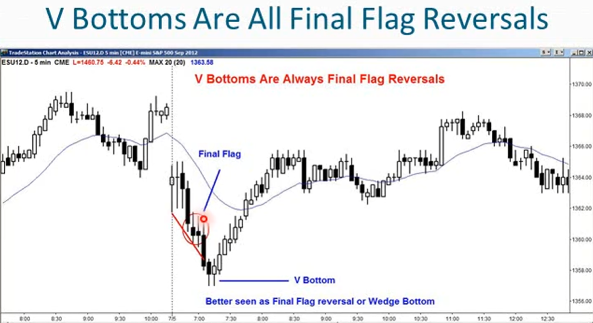

1. 市场处于趋势中时，大多朝一个方向移动，且总是包含在一个通道内
2. 牛市趋势：更高的高点、更高的低点，被包含在一个通道中
3. 牛市趋势应当关注阻力位，尽管大多数阻力位无法阻止牛市趋势，但所有牛市趋势都在阻力位结束
4. 交易反转时，要注意支撑位和阻力位，观察市场表现，看看是否存在反转模式
5. 反转：从一种趋势转变为相反的趋势，牛市转熊市，熊市转牛市
6. 牛市趋势线在通道下方，熊市趋势线在通道上方
7. 所有反转的第一步都是突破趋势线，也就是突破通道
8. 下一步是一系列更低的高点、更低的低点
9. 一些交易者只交易趋势，不交易反转
    - 强趋势内的概率有60%甚至更高
    - 趋势交易时，需要设置更宽的止损，这意味着获取高概率的代价
    - 回报通常风险相当
10. 一些交易者只交易反转行情
    - 潜在回报远大于风险
    - 愿意接受较低的成功概率来换取丰厚的回报
11. 大多数反转都会失败，大多数反转尝试都会演变成交易区间，而非反向趋势
12. 即使反转成功出现，通常反转也会形成一个较大的交易区间
13. 所有反转实际上都是某种类型的双重顶或双重底
14. 反转总是伴随着某种测试
15. 大多数反转也会涉及某种交易区间，所有顶部都是双重顶的变体、所有底部都是双重底的变体
16. 有时双重顶或双重底形态难以辨认，这是用另一个术语：比如最终旗形反转
17. 并没有什么V型底和倒V型顶
18. 每一种反转其实另有原因，通常是小型最终旗形或楔形

19. 主要趋势反转：
    - 主要趋势反转通常发生在交易区间内
    - 主要趋势反转是双重顶和双重底的变体，横盘市场
    - 以最终旗形或其他失败的突破形态或高潮呈现
    - 双重顶、双重底、三角形、头肩形态、楔形都是潜在的反转形态
    - 圆形顶和圆形低也是交易区间
    - 高潮通常是交易区间突破失败的情况
20. 