1. 大多数反转形态都是交易区间（如双重顶、头肩顶、头肩底、圆形顶、圆形底、楔形、最终旗形）
2. 主要趋势反转通常是双重顶或双重底的变体，其中第二个顶或底不一定与第一个完全处于同一水平，但从功能上来说基本是双重顶或双重底形态
3. 所有趋势反转都是从一种趋势转变为相反的趋势，相反的趋势足以进行波段交易，大多数时候会形成一个大的交易区间
4. 趋势反转所需的步骤：
    1. 首先有一次回调（打破趋势线的走势）
    2. 回调测试移动平均线，最好能突破
    3. 趋势恢复
    4. 一旦接近旧趋势（上一波趋势）的极值，另一次回调开始
    5. 这次回调，随后演变成反转
5. 主要趋势反正并不确认新趋势的形成，他只是可能引发新趋势的一种情况
6. 确认反转的条件：
    - bull to bear: 价格跌破趋势通道线，然后出现一系列更低的高点和低点
    - bear to bull: 价格突破趋势通道线，然后出现一系列更高的高点和低点
7. MTR：主要趋势反转，Major Trend Reversal
8. MTR并不重要，只是众多反转类型中的一种 
9. MTR并不是真正的反转，只是一种SetUp布局，而非反转。能够让交易者在反转得到实际确认之前入场
10. MTR的概率在40%-50%之间，但确是很高的布局
11. MTR对于新手是最好的布局，也是每个新手的关注重点，当然也是专家最好的布局    
12. MTR是非常不错的交易策略，回报通常是风险的两倍，而且这种情况经常出现，熟练掌握可以交易为生
13. 任意给定的5min图表上，每天至少出现一次
14. MTR的好处：
    - 时间对你有利，通常可以很多根K线预判MTR的形成，充足时间评估，压力小的多
    - 和很多交易相比，更加容易管理，无需过多思考，一系列简单的规则即可管理
15. MTR的弊端：
    - 相比于丰厚的回拨，概率往往只有40%
    - 60%的交易要么小亏，要么小赚
    - 不会有重大亏损，因为止损幅度并不大
    - 很容易提前离场
16. MTR比大多数交易策略更容易管理：
    1. 初始止损位设置在保护信号柱之外（向上反转时，信号柱是多头信号柱）
    2. 一旦盈利达到风险的两倍（即1：2盈亏比），平掉一半的仓位
    3. 将止损移动到盈亏平衡点（保本止损）
    4. 接着持有该交易，直到出现反向反转，或持续到收盘
17. 为什么MTR是好的交易？
    - 大多数情况下，胜率为40%-50%，收益至少是风险的两倍
    - 胜率有时更高，可能回报更小或风险更大
18. 任何高潮、突破或反转都是MTR，最小目标应当是TBTL（Ten Bars, Two Legs）。在相反反向上运行10根K线、两波走势
19. 如果遇到一个典型下跌趋势，然后出现一个MTR底部，应该寻找至少两段上涨行情和至少10根K线
20. 如果趋势反转形态比典型形态大的多，可能会看到超过10根上涨K线。即如果扩展或覆盖30、40、50根k线，在15分钟图表上就可能是一个主要趋势反转。而且在15分钟图表上可能看到10根上涨K线
21. MTR并不是反转，只是一种反转的形态，形态由两部分构成
    - Context背景，反转发生必现合乎逻辑
        1. 跌破牛市趋势线，突破牛市通道
        2. 对移动平均线进行测试（并非绝对需要）
        3. 牛市趋势的恢复
    - 信号K
        4. 一旦市场达到之前的牛市高点，触发强劲的看跌信号k
22. MTR的顶部，都是双重顶的变体
    - Higher High(HH MTR，略高)
    - Lower High(LH MTR，相等)
    - Double High(DT MTR，略低)
    - 原理是市场正在测试原有趋势的低点，决定是应该突破并恢复原有趋势还是反转
    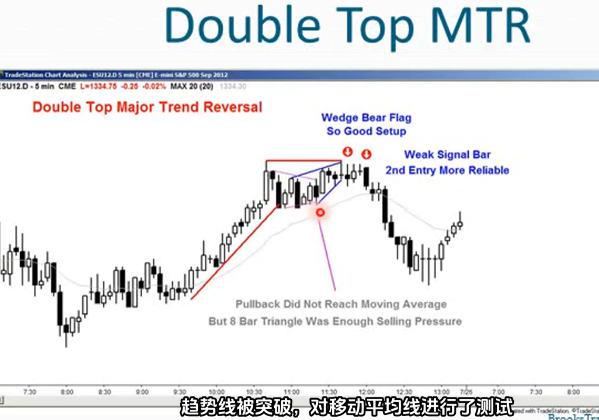
23. 在一段长期的牛市趋势之后，出现的三角形形态通常会成为牛市趋势的最后一个旗形
24. 在市场从bull趋势转向bear趋势，对于一次重大的趋势反转顶部而言
    1. 交易：需要在牛市趋势线卖出止损（跌破牛市通道的底部）
    2. 价格接近或达到到移动平均线
    3. 其他方式展示抛售压力：几根非常大的bear趋势线，或者出现10根或更多较弱的bear趋势线（这些证明空头开始掌控市场）
25. 每当出现强劲的牛市趋势时，在任何抛售发生前，都要先画出趋势线（提醒自己，跌破趋势线后可能出现MTR）。在跌破bull通道后，如果bull恢复，但是在测试牛市高点后再次反转下行，那么这次反转就是一次MTR
26. 测试牛市高点是指什么？
    - Higher High(HH MTR，略高)
    - Lower High(LH MTR，相等)
    - Double High(DT MTR，略低)
27. 如果反转是一个HH MTR或DT MTR，那么通常会跟随一个LH MTR
28. Moving Average Gap Bar：移动平均线缺口柱线，最高价低于移动平均线的柱线
29. 如果你遇到牛市趋势，价格跌破牛市通道底部和移动平均线，并且出现一根最高价低于移动平均线的柱线 ，这往往会导致牛市趋势的最后一波行情。这往往会导致价格上冲测试之前的牛市高点，随后开始反转下行
    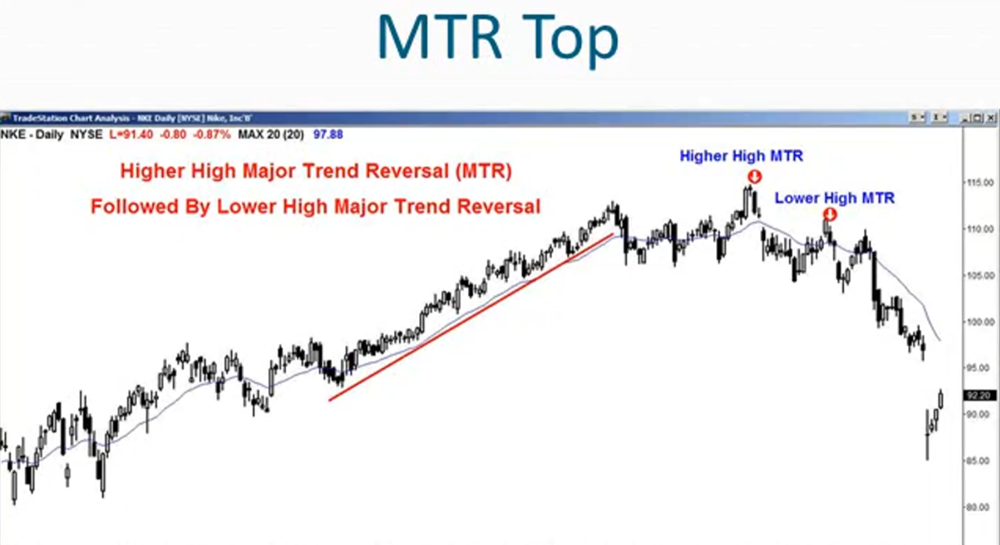
    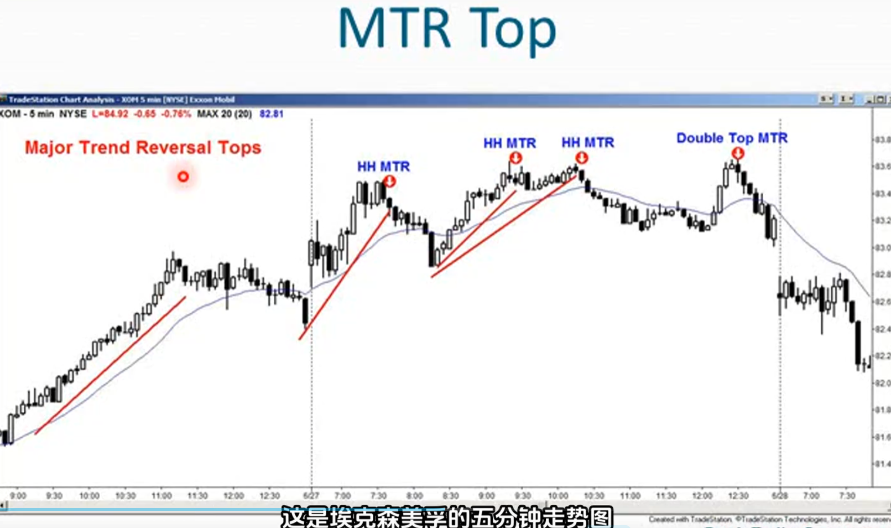
30. 每当牛市趋势突破前一个高点后，市场很可能下跌，这意味着正从牛市趋势过度到交易区间。在交易区间内LBHS
31. 每当牛市趋势道道前一个高点后，下跌幅度越强，在回调测试时，出现反转的概率就越大。而且应当期望反弹时有卖盘压力
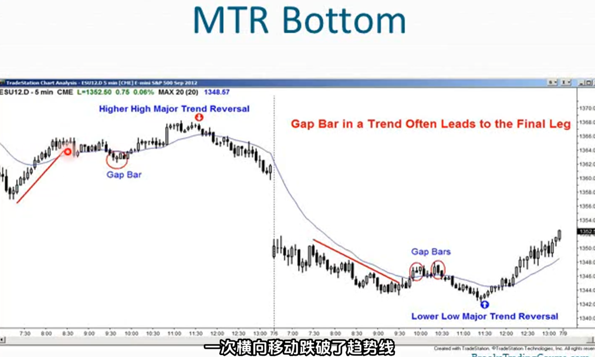
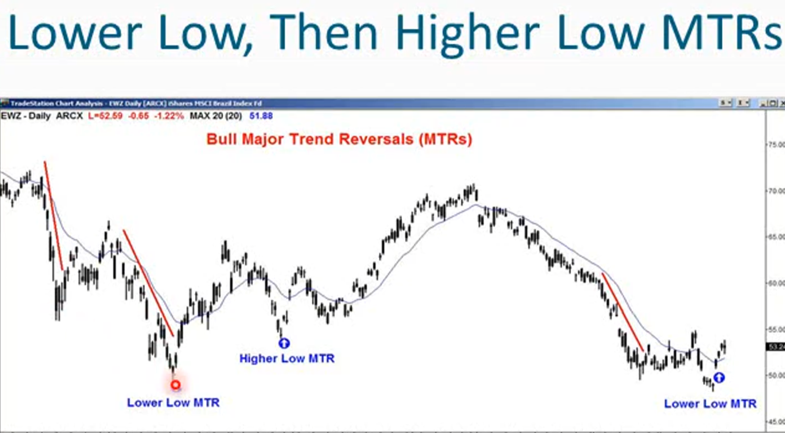
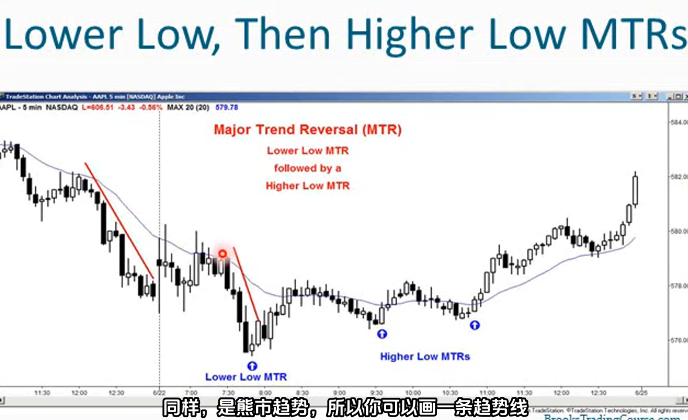
32. 趋势末端的扩张三角形ET均是MTR形态，都是MTR的变体，一旦看到ET都当作MTR对待
33. 有时在传统的MTR中，波段的力度并不如我期望的那样强劲，但总体而言，三角形的第二个、第三个、第四个波段总会突破趋势线并接近移动平均线，即便它没有突破趋势线，仍将其视为主要趋势反转
34. ET是什么：一种逐渐变宽的三角形
    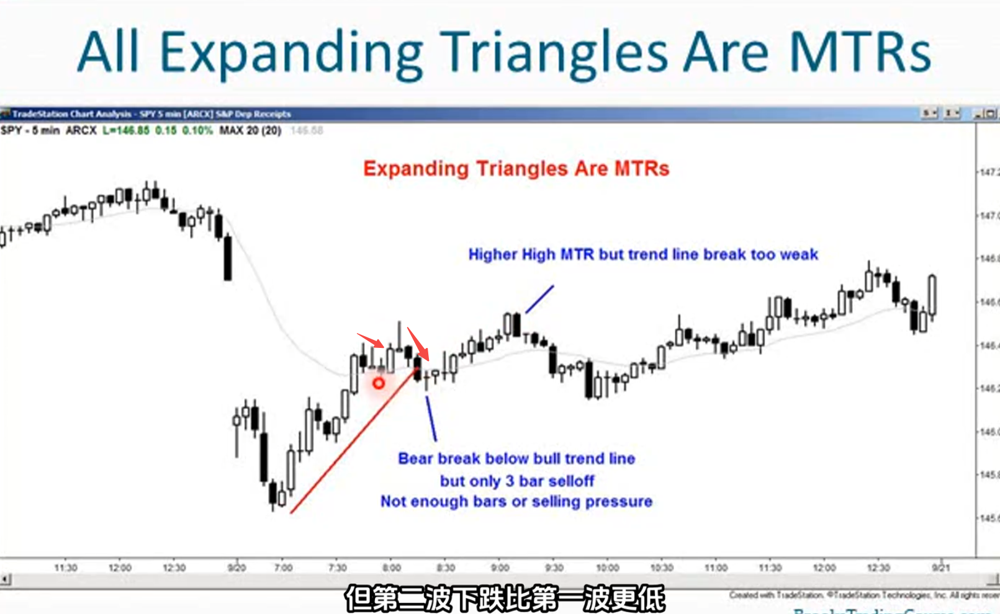
    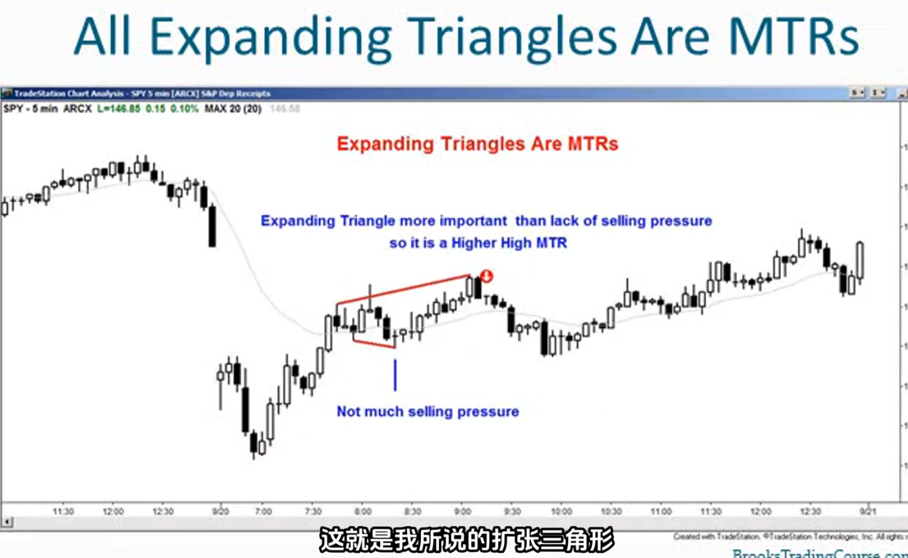
    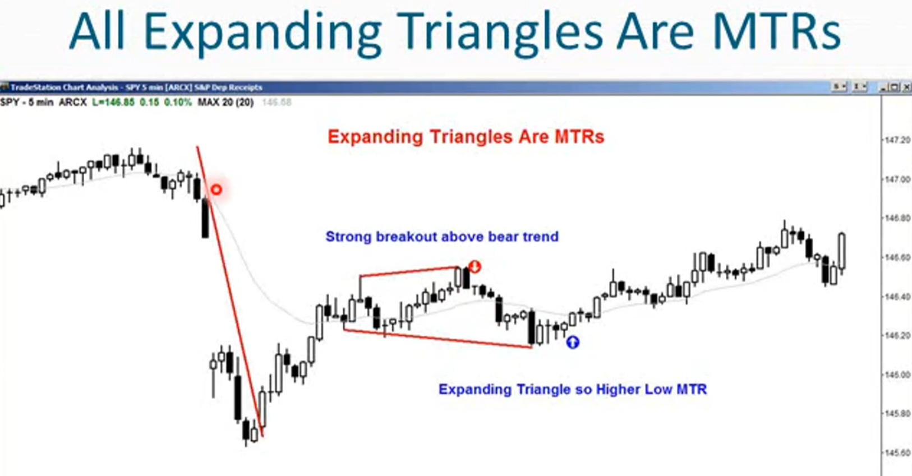
    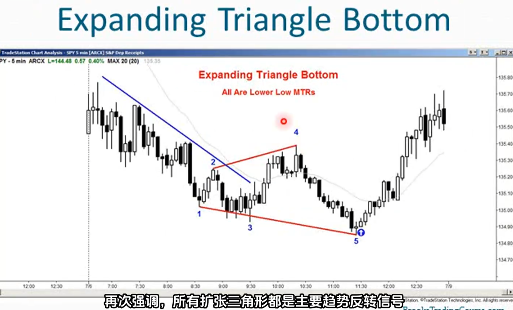
35. 大多数反转都会失败，最常见到的形态是头肩形态，但那是陷阱。头肩顶很可能是多头旗形，头肩底可能是空头旗形
36. 大多数头肩形态都会变成旗形导致趋势延续，只有少部分会形成反转
37. 保护性止损：无论选择多大的止损幅度，始终要确保所冒的资金风险在可承受范围内，如果超过了承受范围就立即将持仓减半
38. 如果你担心会亏钱，你就不会遵守你的交易规则，这样就会最终真的亏钱，因为你将情绪化无法保持客观
39. 如果一笔交易需要设置非常大的止损幅度，比如比通常使用的止损幅度大三倍，那么相应的仓位的规模应当也缩小三分之一
40. 如果止损幅度大三倍，那么收益目标也得比平时高三到六倍，最终交易规模很小，最终受益也能保持不变
41. 大多数时候，MTR带来的亏损和盈利都不大，盈利情况不到50%，但需要偶尔出现的大幅盈利才能让MTR变得值得。所以必须当作波段进行操作，确保能抓住哪些大幅盈利的机会（受益至少是风险的两倍，才能弥补较低的盈利概率）
42. 每笔交易中，至少确保盈亏比1：1 ，永远不要追求低于止损幅度的盈利
43. 如果交易信号K过大，但又不想冒险交易到信号K之外的区域，风险至少要设置到信号K中部之后
    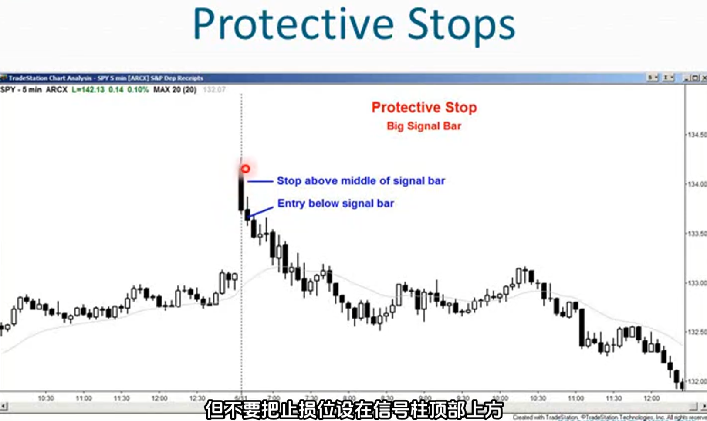
44. 利用ET设置止损：扩张三角形ET的最小目标始终是三角形的对边
    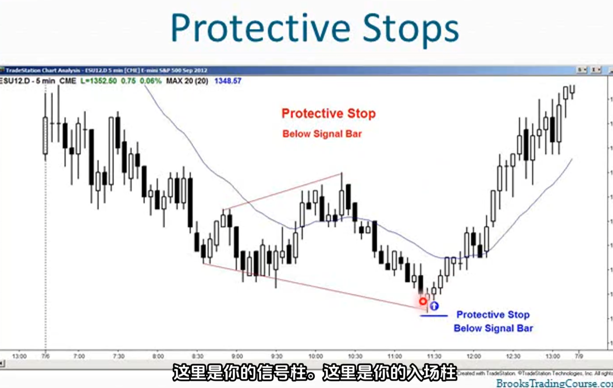
    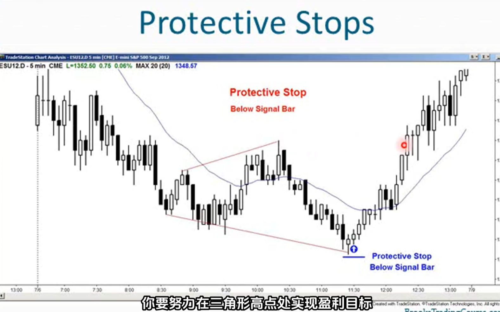
