1. FF：Final Flag（最终旗形）
2. 最终旗形：在趋势反转后，你可以回溯并在趋势上找到最后一个旗形
3. 牛市反转进入熊市之前，牛市趋势中的最后一个牛市旗形就是最终旗形
4. 即使是交易区间内的一小段趋势也可能以最终旗形反转结束（可能是一个小的最终旗形、一次突破，然后是一次失败的突破和反转）
5. 最终旗形有一些特征会让交易者们怀疑这是否已经是趋势上的最后一个旗形了，一旦他们确认这是最终旗形，将会寻找突破失败和反转的交易机会
6. 最终旗形有如下特征：
    - 旗形通常呈现横向走势，类似交易区间，通常为三角形
    - 因为类似交易区间，因此具有磁吸效应
    - 磁吸效应增加了突破失败的风险
    - 大多数的交易区间的突破都会失败，并被拉回区间内
7. 最容易区分出最终旗形的点：
    - 当一个旗形在交易后期以交易区间形式出现时
    - 如果一个趋势持续了超过30根K线，然后形成了一个交易区间，那么这个交易区间就很可能是该趋势的最后一个旗形
    - 该区间的突破将失败并导致反转，随后出现大幅回调或修正
8. 牛市趋势的最终旗形：
    1. 牛市趋势持续了超过30根K
    2. 然后在某个阻力位下形成了一个High 2形态或一个三角形态
    3. 这个旗形往往成为牛市趋势中的最后一个旗形
    4. 你必须怀疑市场可能会暴跌至阻力位，最好突破失败然后反转下跌的准备
9. 一次幅度较大、持续10根k及以上的双腿回调对于多头波段交易来说回调幅度已足够
10. 牛市趋势中，在阻力位下方出现了一个旗形形态，当市场向上突破时，要寻找向下反转的机会
11. 旗形形态的突破走势可能会一路涨至目标价位（阻力位），随后突破失败，市场反转
12. 最终旗形形态可大可小
    - 可能是单根K回调（单K最终旗形）
    - 可能是窄交易区间内的横盘50根K
    - 可能是三角形或其他类型的交易区间
    - 反转本身可能是MTR（所以有时TT会突破趋势线，测试MA，随后突破与反转形成MTR）
13. 交易TT时，需要Context和Signal Bar:
    1. 市场环境必须是合理的，信号K足够强
    2. 初始止损设置在信号K之外，最小目标是风险两倍（2：1盈亏比）
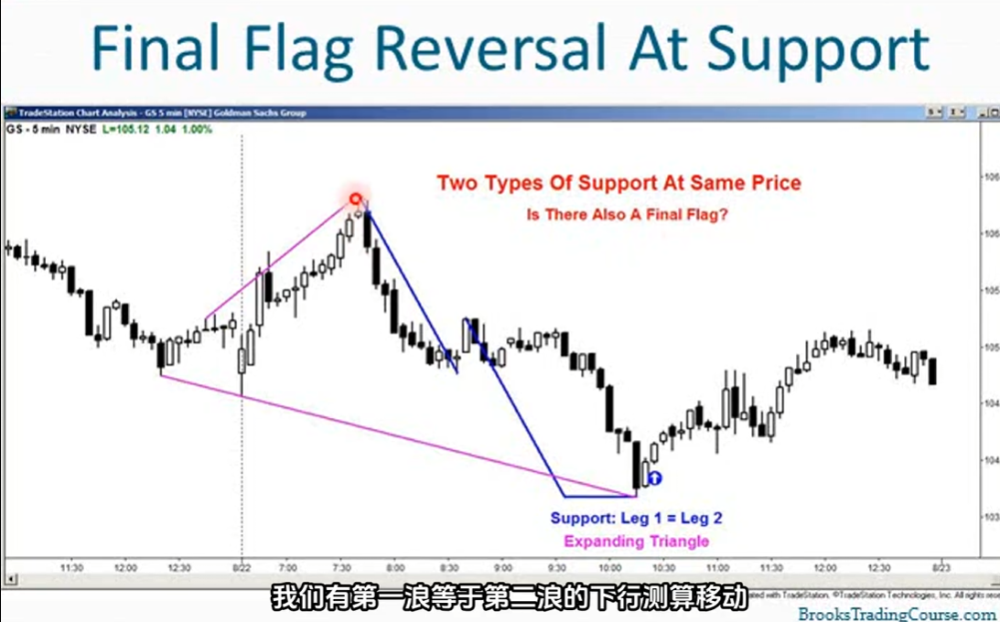
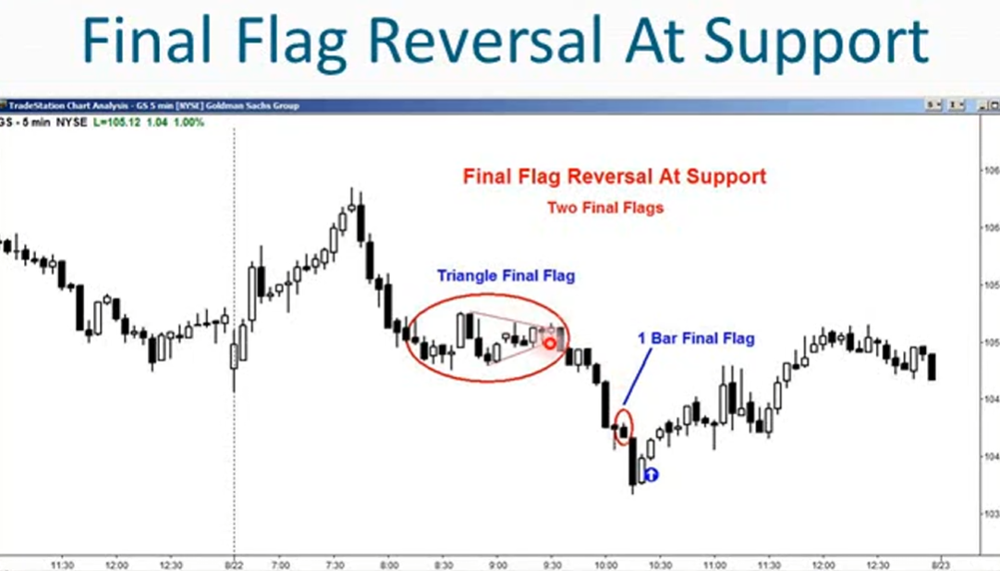
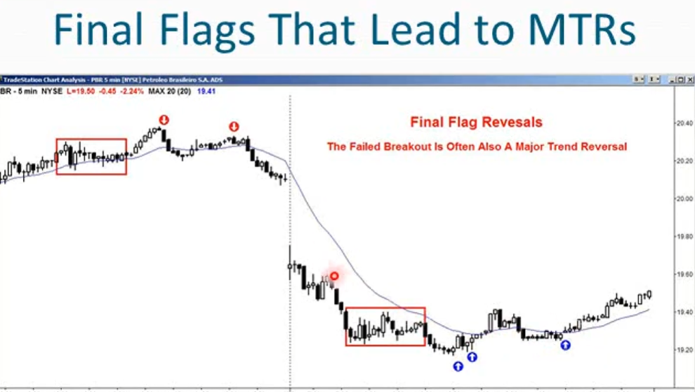
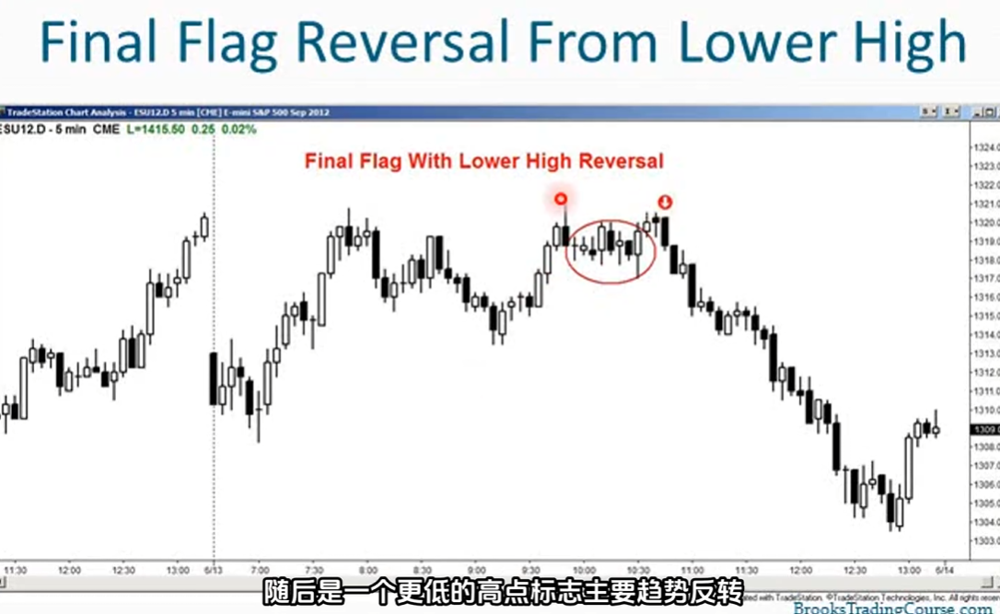
14. 在牛市趋势中，最后一个旗形形态的突破不一定会创出新高
    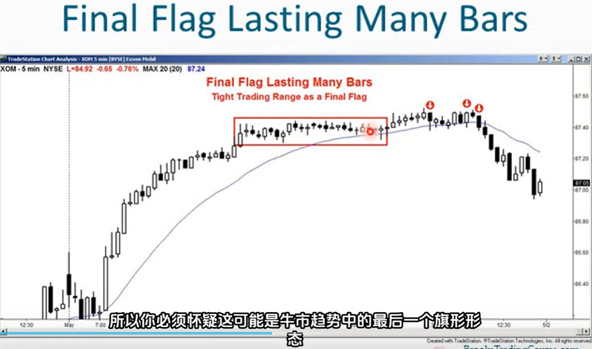
15. 大多数交易区间的突破都会失败，尤其是狭窄交易区间的突破
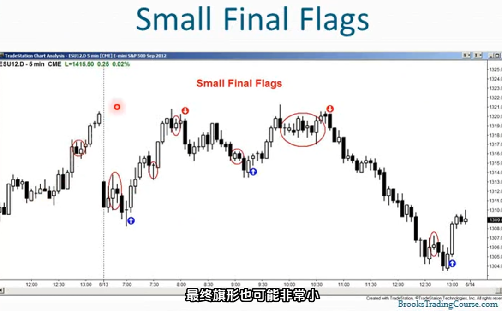
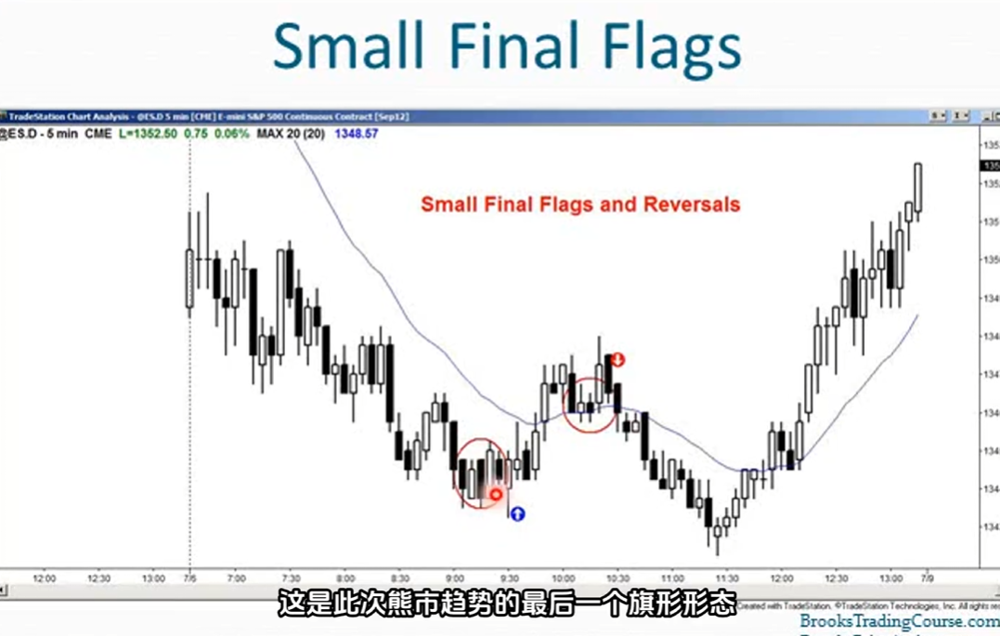
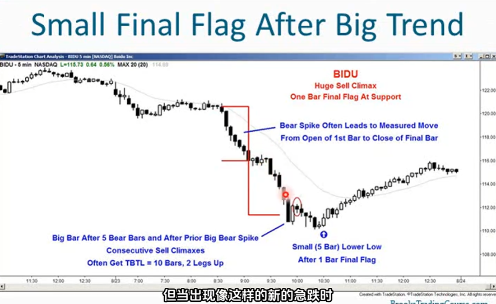
16. 通常只要出现连续的空头高潮，市场至少会尝试向上测试空头高潮顶部上方的一个价位
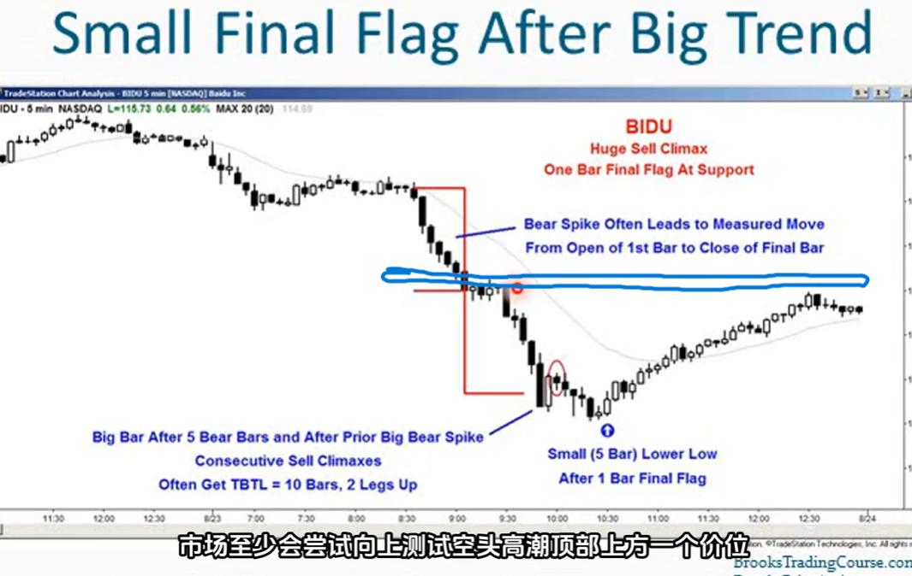
17. iiFF：ii最终旗形（一根k处于前一根k的内部、然后的k处于第一根k的内部，这样就有了连续的两根内包k线）
    - iiff是一种突破模式的setup，市场可以向任何一个方向突破，并向任何一个方向运行
18. 当在趋势后期中出现iiFF时，常常成为趋势中的最终旗形
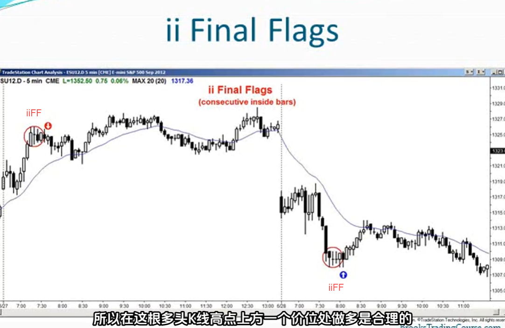
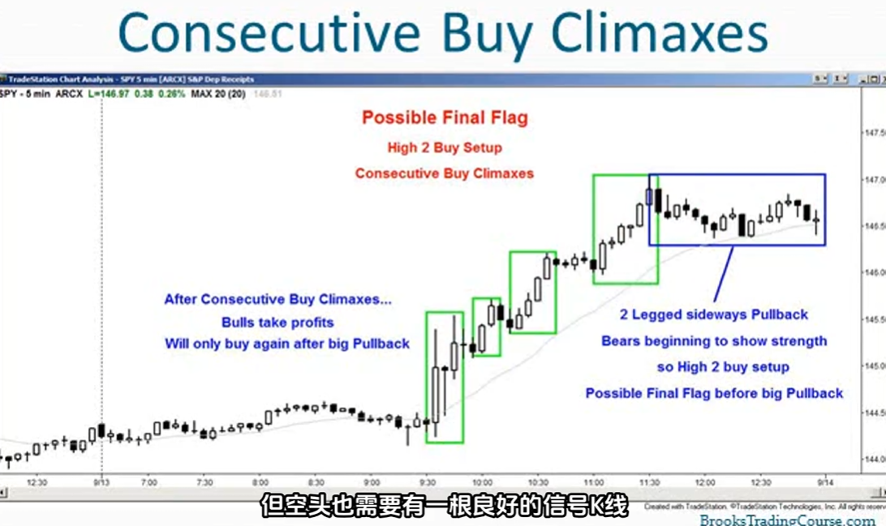
19. K线的收盘价低于中点，那么就是反转k线
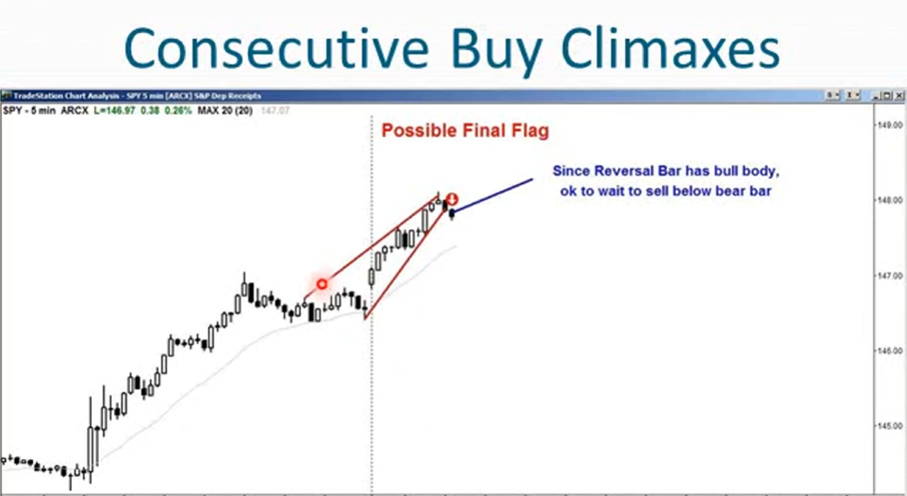
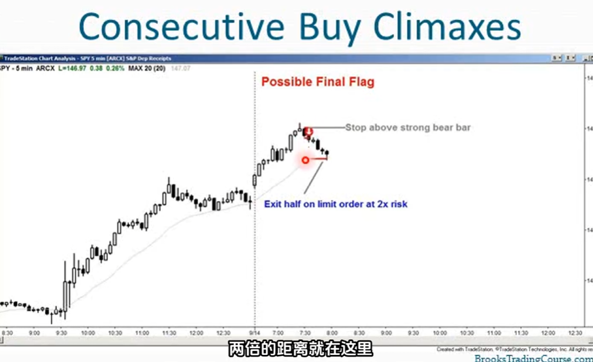
20. 在买入高潮后连续出现5-6根阴线，上方可能有卖家