1. 理想的楔形成楔形，一个线条收敛的通道。顶部楔形可向上倾斜、底部楔形可向下倾斜
2. 楔形的最低要求：
    - 通道内有三次推进
    - 若通道向上或向下倾斜，则称为楔形
    - 若通道大致呈现横向，则称为三角形（可以收缩，也可以扩张）
3. 在牛市趋势中，只要出现上升楔形，就可能形成顶部。
    1. 要寻找楔形顶部突破失败的情况（向上的一个小突破）
    2. 然后是向下反转，最好伴有一根强劲的反转阴线（这是一个不错的信号K）
    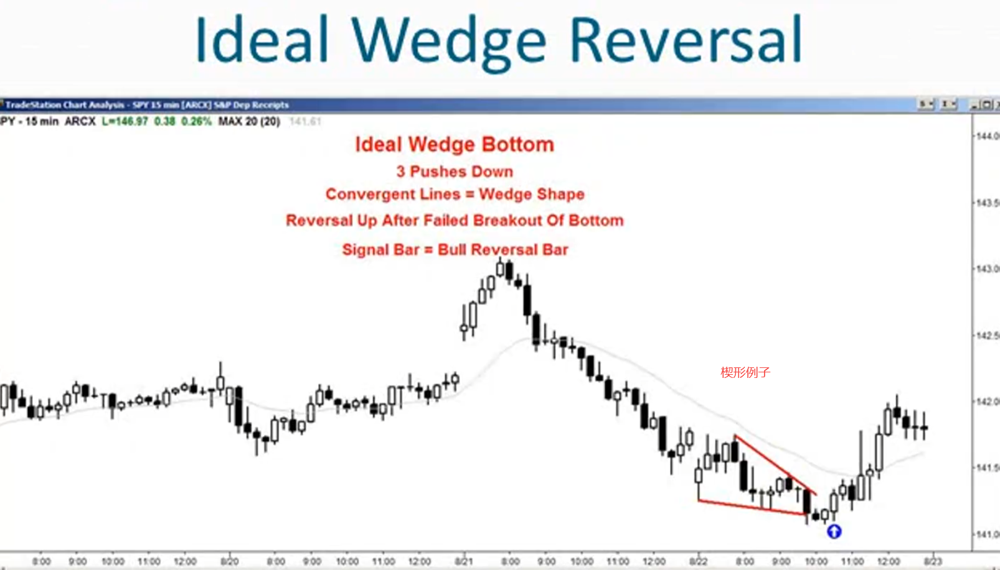
4. 很多楔形实际上并非真正的楔形形状，但这并不重要。很多时候只是一个简单的三推模式
    - 越接近理想形态，交易越可靠
    - 大多数时候楔形并非完美形态
    - 任何三推模式都符合条件
    - 许多通道内的尖峰形态以楔形结束
5. 通道通常有三波推进，这完全不是楔形形态，但功能上和楔形概念相同
    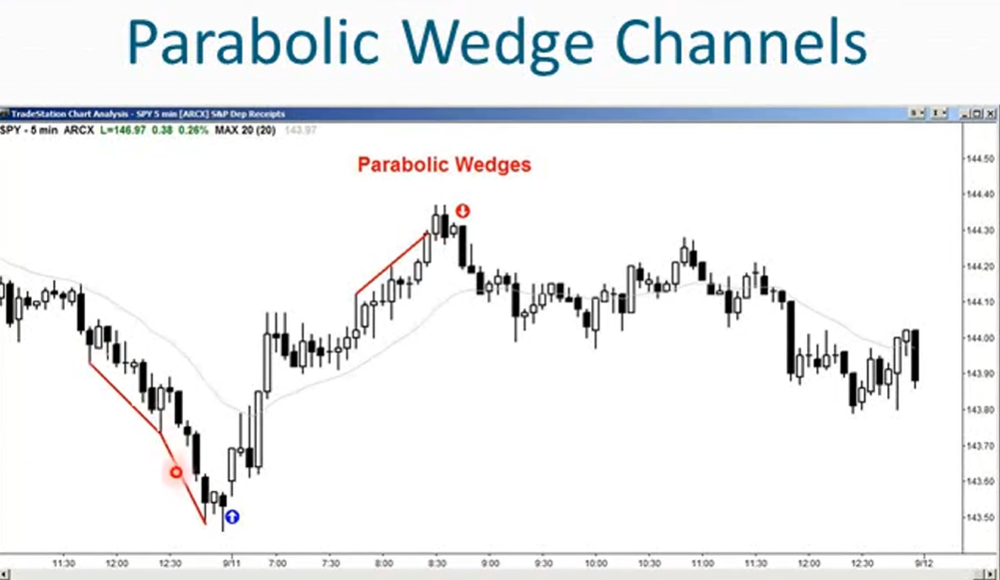
    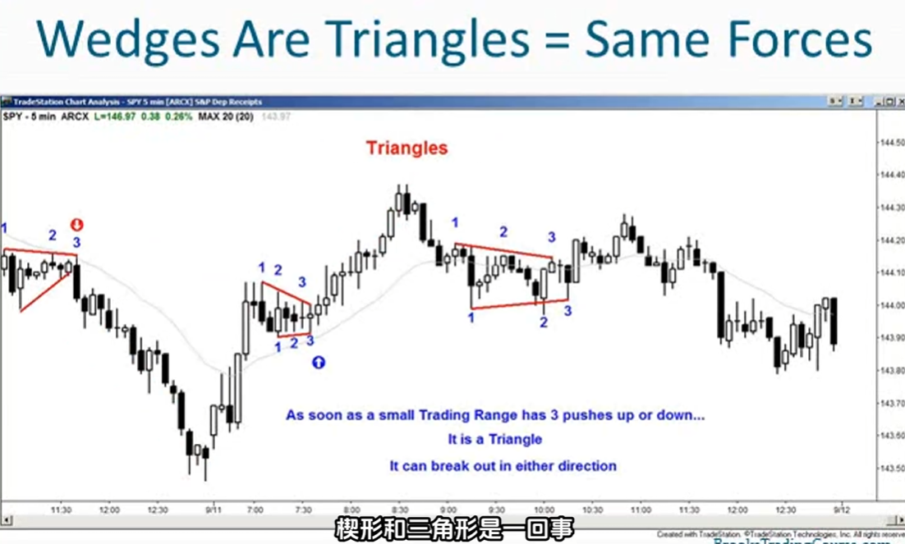
6. 三次上推可以在三次下探之前出现，三次下探也可以在三次上推之前出现，只要在交易区间内看到三次推动，就把它当作三角形形态，无论是否真的呈现三角形
    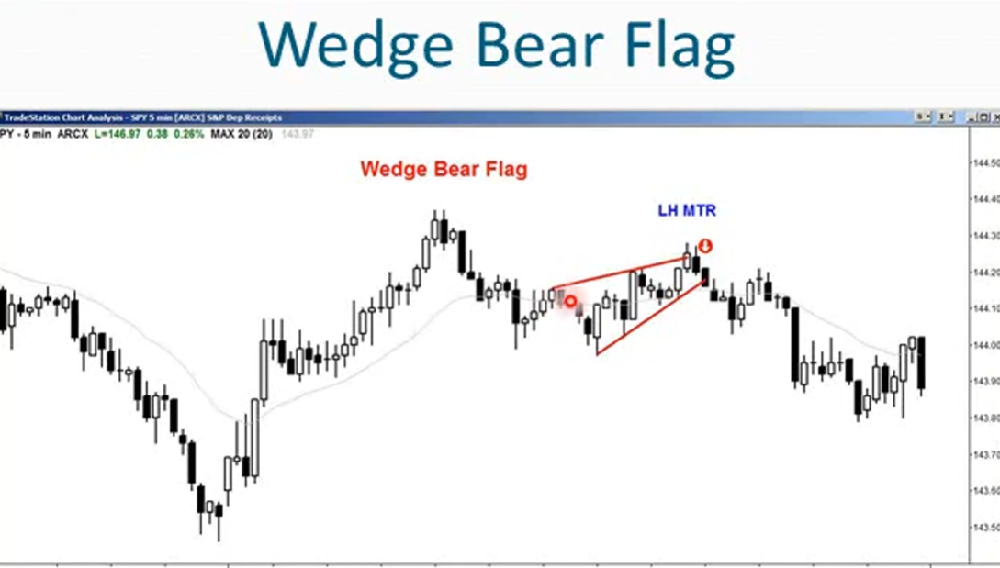
7. 第一次上推之后出现了新低也没关系，这在楔形形态中很常见
8. 双重顶很少是完全精确的
    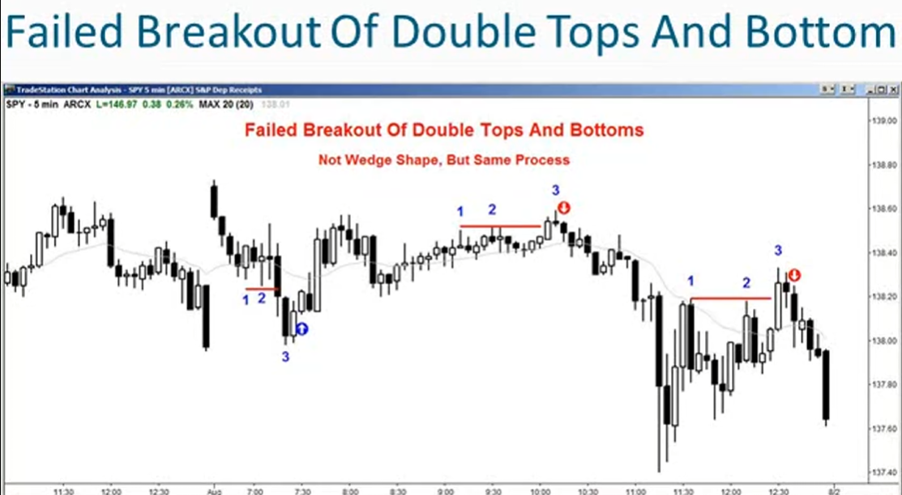
9. 楔形就是通道，任何被两条线包含的形态都是通道，两条线是收敛、平行、发散都无关紧要
10. 楔形就是通道，通道经常会演变成交易区间，市场通常回向通道相反的方向突破
    - 如果是上升楔形，通常会有一个熊市突破
    - 如果是下降楔形，通常会有一个牛市突破
11. 大约25%的情况下，楔形反转会失败而突破发生在了错误的方向（牛市楔形随后出现成功的牛市突破，从而开启新的上涨波段加速牛市行情）
12. 一般来说，只要市场选择了低概率的走向，就可以预期会出现加速趋势、快速突破、可测量的走势以及两段行情
13. 楔形底部向上突破的概率更大，但如果出现了成功的向下突破就可以预期至少会有两段下跌行情和可测量的走势（根据楔形高度），而且下跌可能会相当迅速
    （因为交易者预期会向上突破，所有人都为向上突破做好了布局）
14. 下降楔形形成时，多头在买入，如果价格跌破楔形那就是他们的止损点，多头会平掉多头仓位，而空头会做空并在任何回调时继续做空。一旦下跌达到测量位置，多头会再次进行买入，期待两段式的上涨行情
    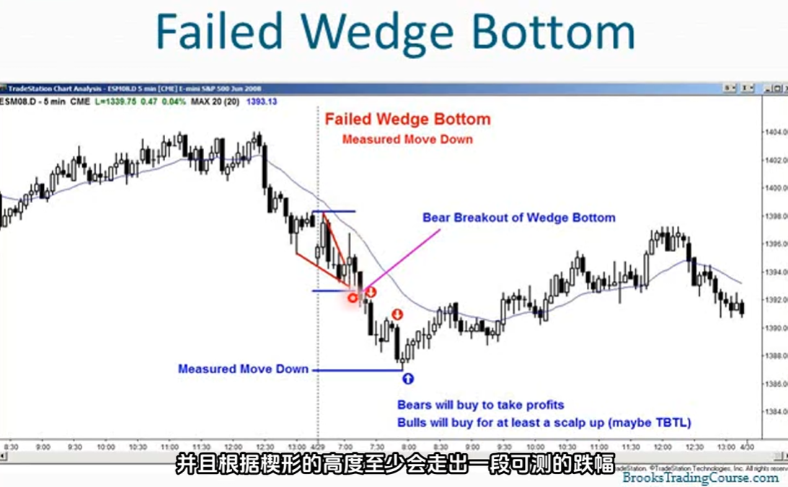
15. 楔形形态的盈利目标：
    - 第一目标价是楔形起点
    - 如果价格突破楔形起点，下一个目标价位是根据楔形高度测算出的下行幅度（measure move）
    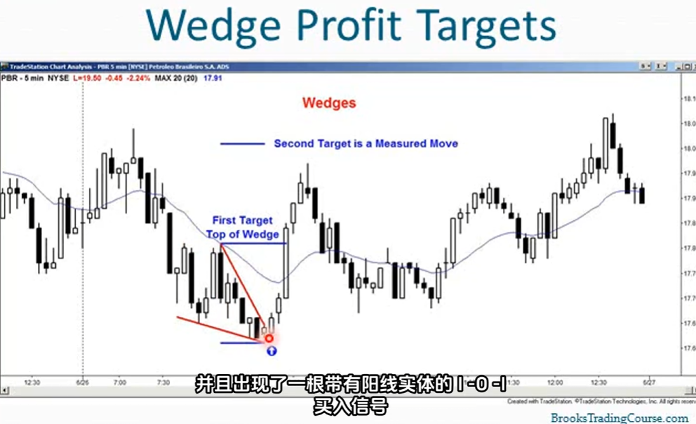
16. 楔形可以是一段趋势的终点、也可以是一段交易区间中一波走势的终点，无论哪种情况楔形都能作为反转形态
    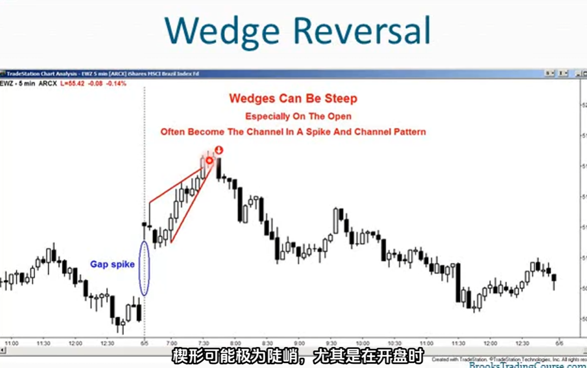
17. 楔形形态很少是完美的，任何的三推形态且市场环境适宜都成为楔形形态，即使它并不呈现楔形形状
    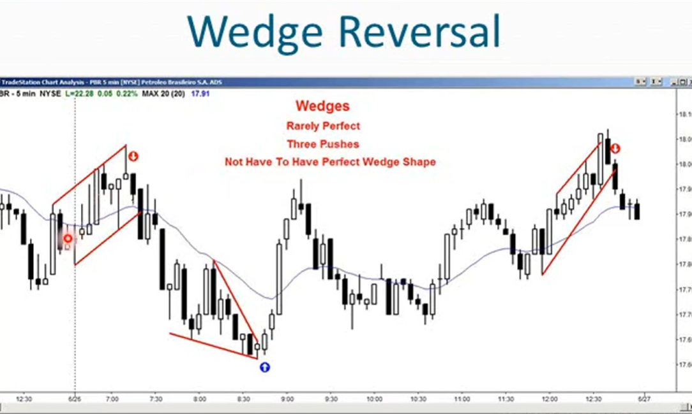
18. 楔形并不仅用于反转，还能作为趋势中的回调形态。牛市旗形可能呈现楔形，这是一种小型的空头趋势，楔形形态可能是该小型空头趋势的尾声，随后迎来上涨
    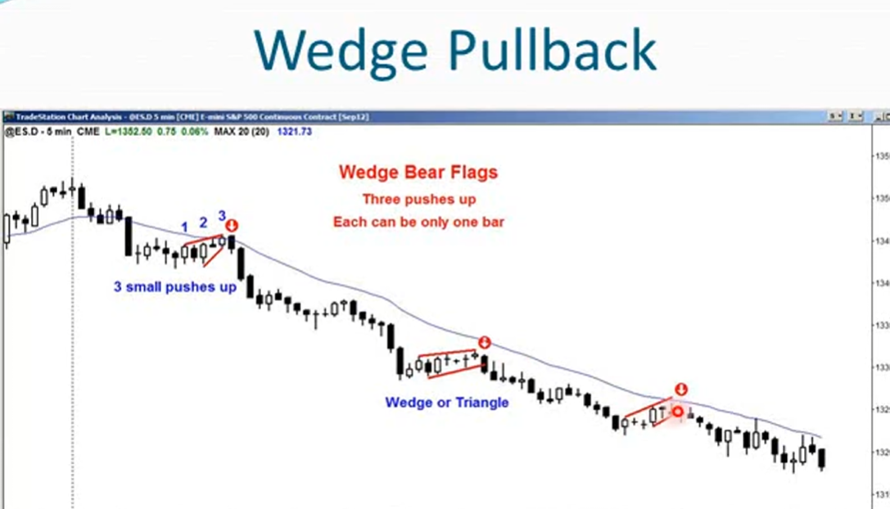
    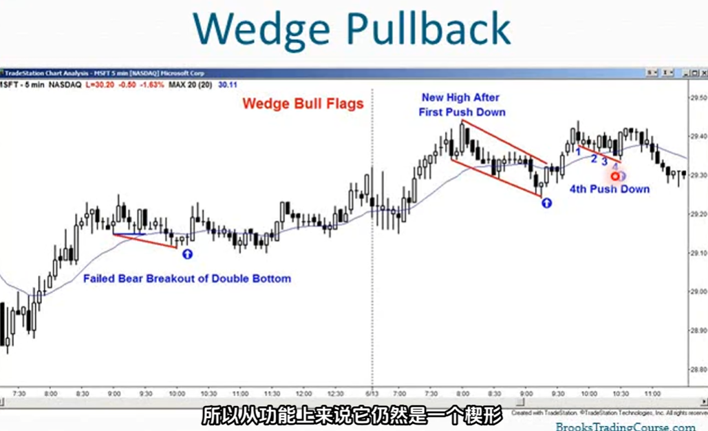
19. 

