1. 完美的双重顶和双重底十分罕见，完美的三重顶和三重底更为罕见，但接近就已足够
2. 大多数双重顶和双重底都是MTR的主要组成部分
3. 所以MTR都可视为双重顶/双重底
4. 双重顶反转中的两个顶部不完全相同并不重要，有时第二个高点略高，称为更高的高点（Higher High）或双重顶（Double Top）
5. 市场两次尝试上涨，第二次尝试是高于、低于还是等于第一个尝试都没关系，过程是相同的
    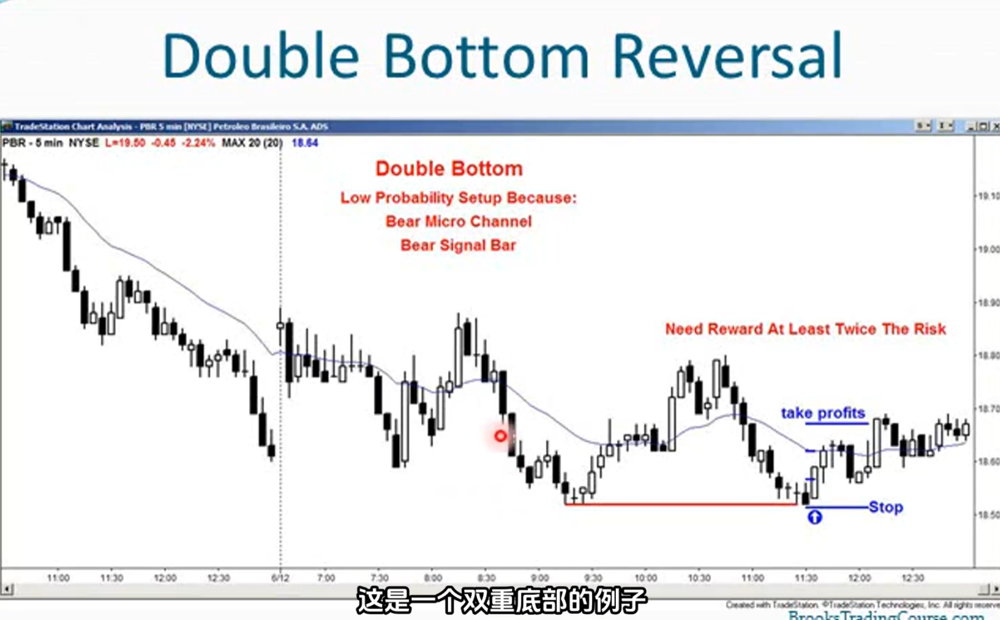
    上述双重底并不是一个高概率的形态，因为有一个相当狭窄的单K微通道下跌
6. 双重顶/底作为旗形形态更为常见，相比反转更像是回调
7. 旗形形态很少是完美的，且不要忘记目标（你正在回调结束时入场）
8. 当出现双重顶熊市旗形时，第二个高点会比第一个高点高很多或低很多，这无关紧要，仍然存在Low 2做空形态
9. 如果遇到多头趋势，回调反弹，然后再次回调（有时第二次回调会比第一次回调深很多或浅很多），这仍然是高2做多形态
10. 在趋势中的双重顶/底形态，意味着市场两次尝试反转都失败了，趋势得以延续
    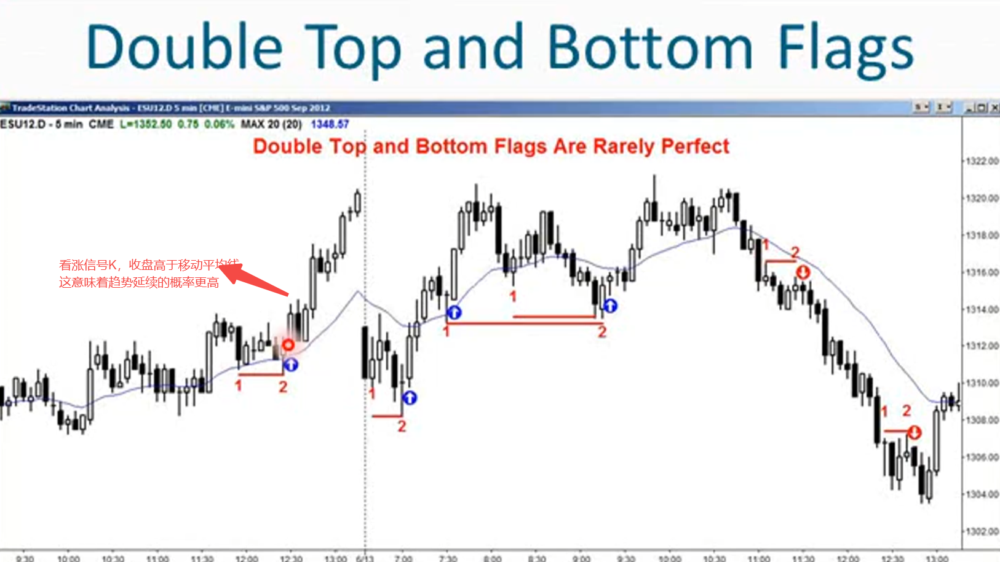
11. 任何双重底形态都是二次入场做多的机会，尤其是开盘时要留意在支撑位附近的向上反转
    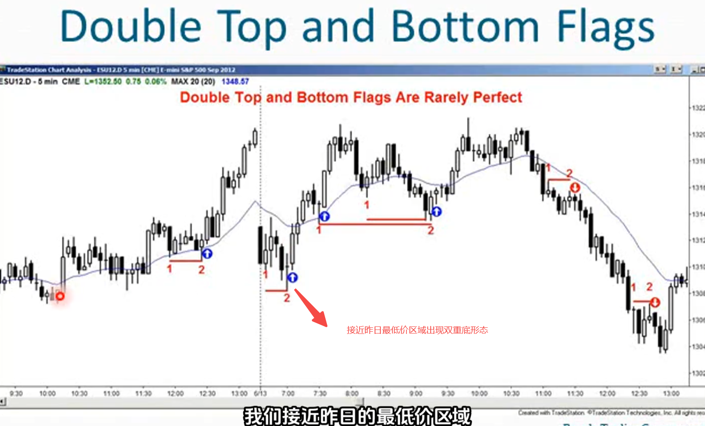
    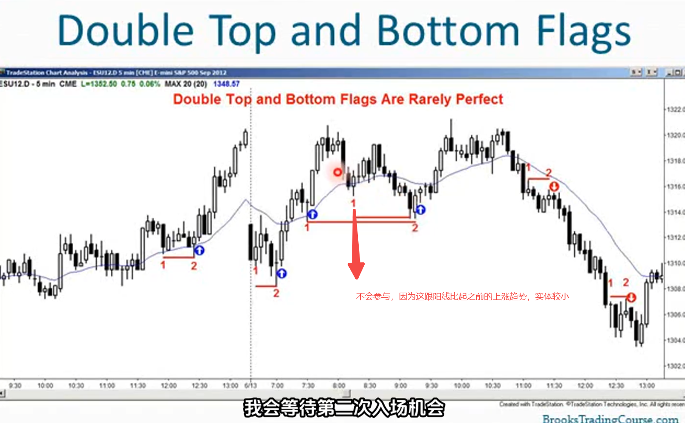
12. 双重顶和双重低通常时MTR的一部分
    - 较低高点的MTR往往会形成一个小的双重顶
    - 较高低点的MTR往往会形成一个小的双重底
    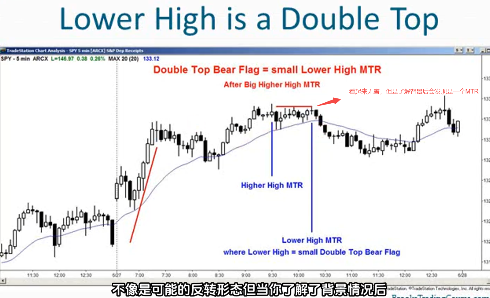
    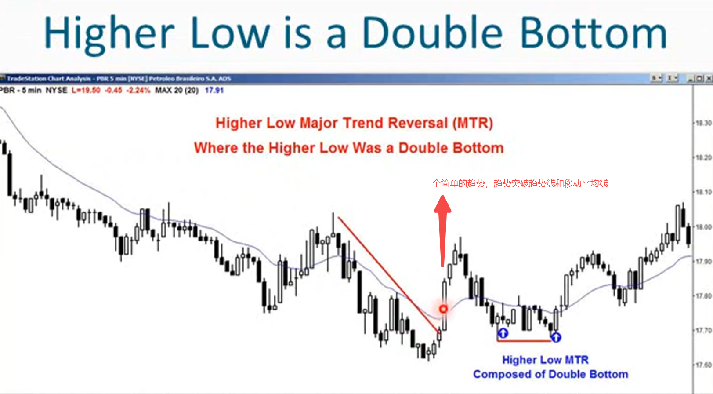
    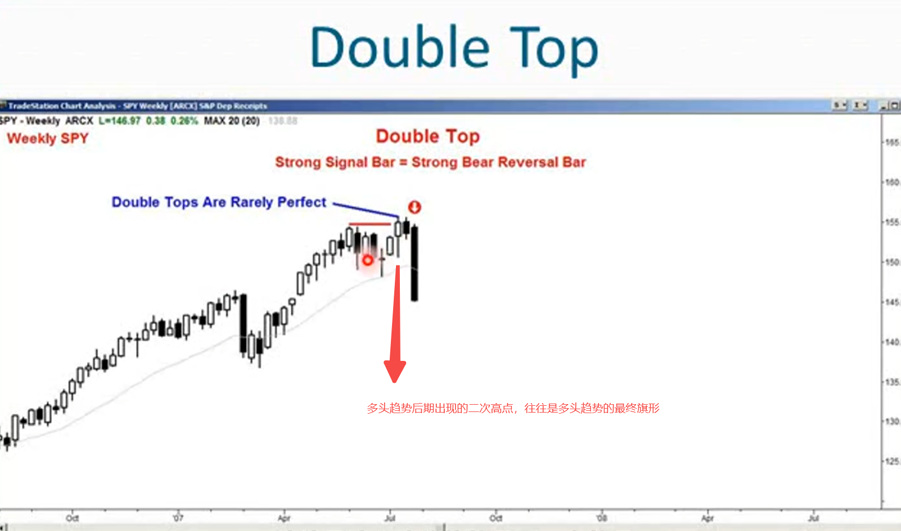
    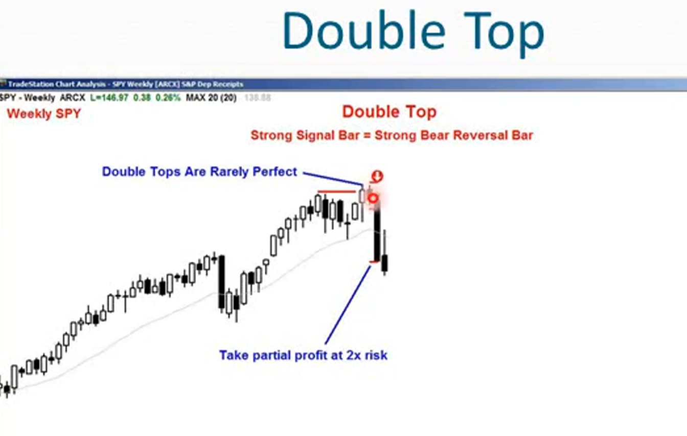
    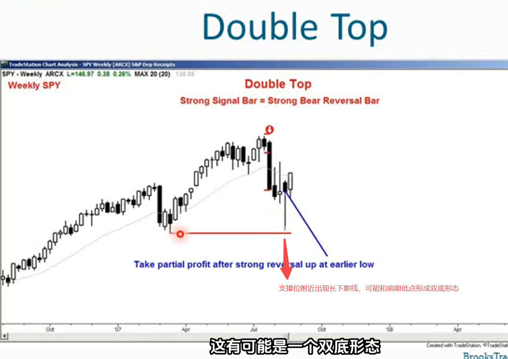
    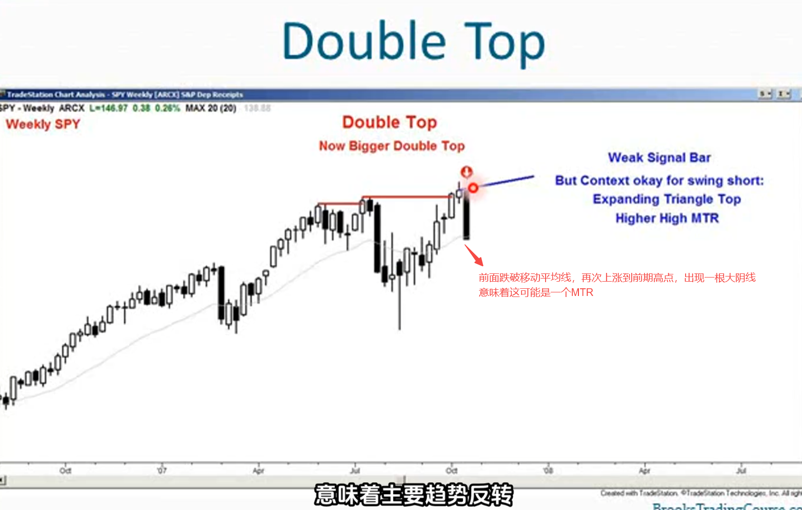
    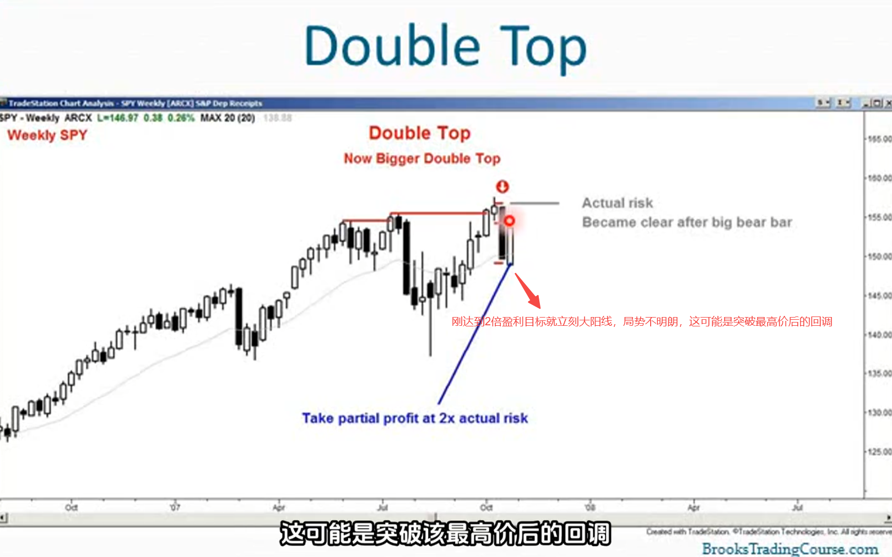
    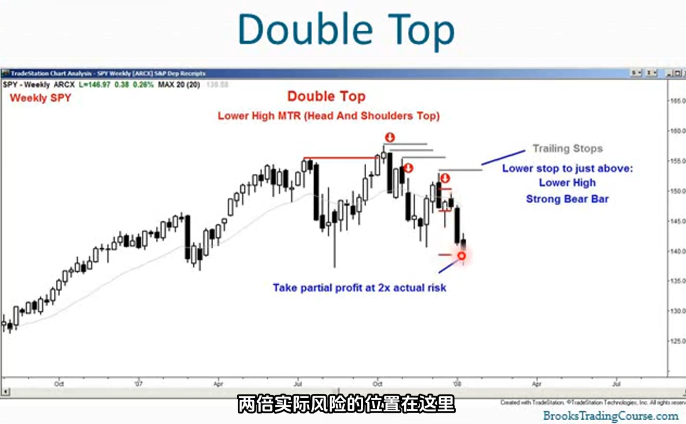
    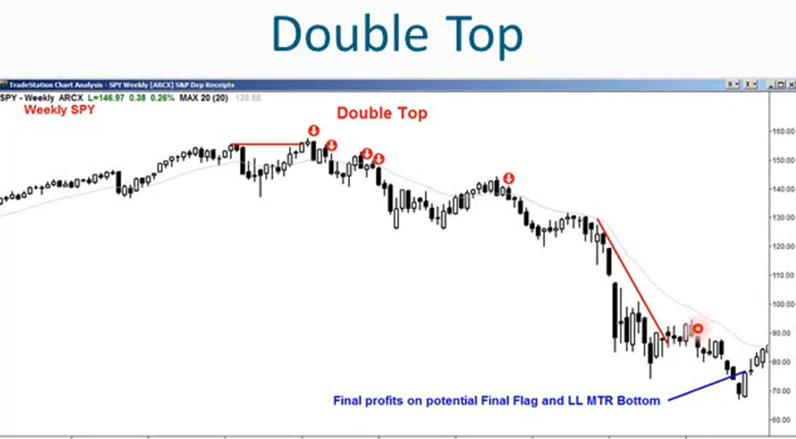
13. 每个顶部都是某种双重顶，有时第一个高点位置低很多，看起来不是双重顶，但每个顶部都是某种双重顶
14. 当双重顶不明显时通常意味着是一个小型的最终旗形