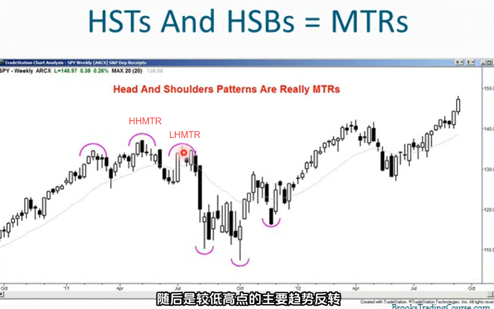
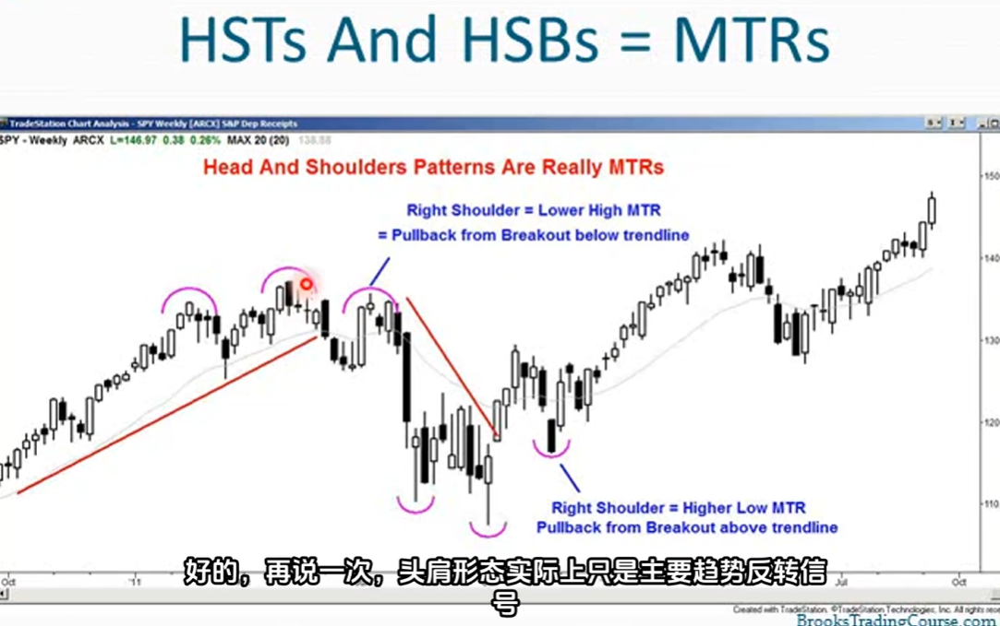
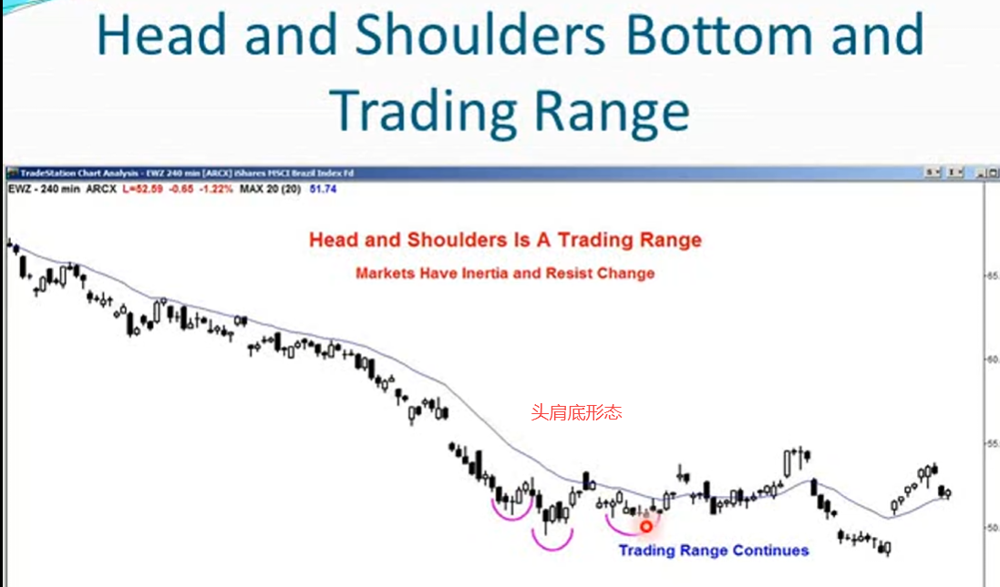
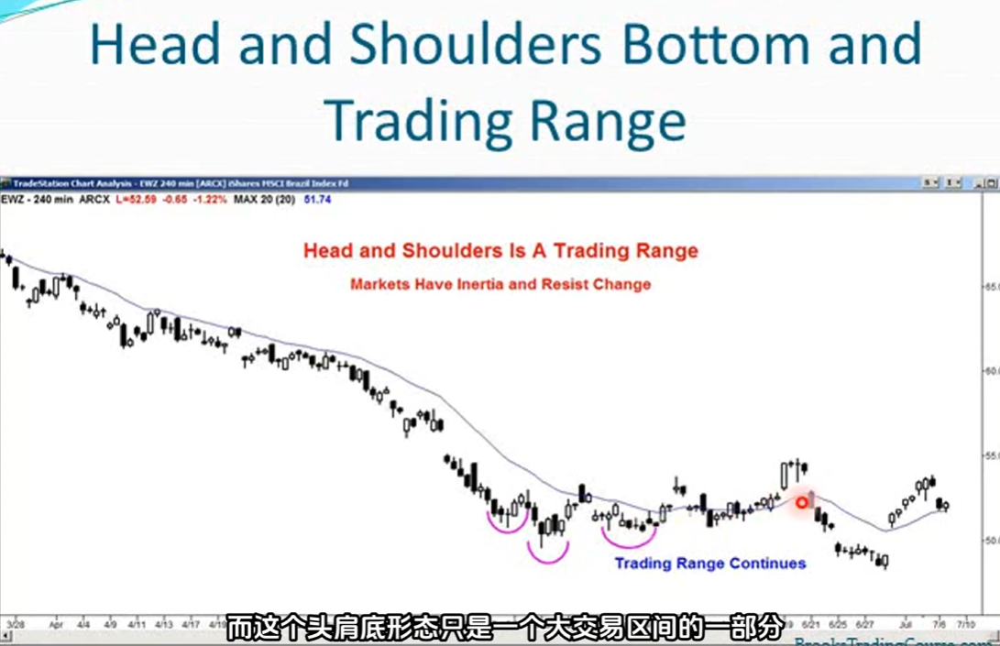
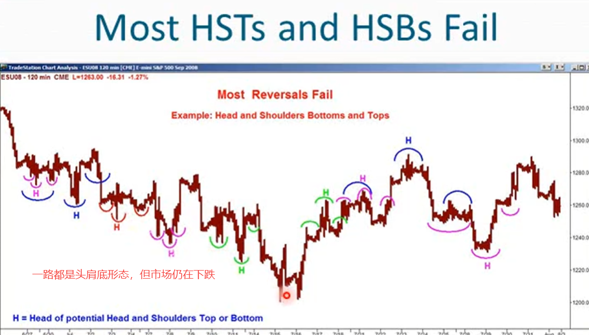
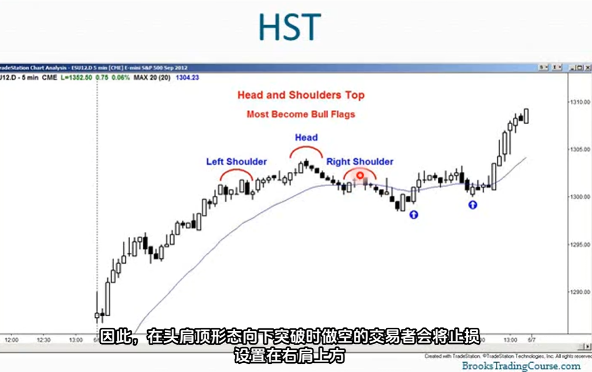
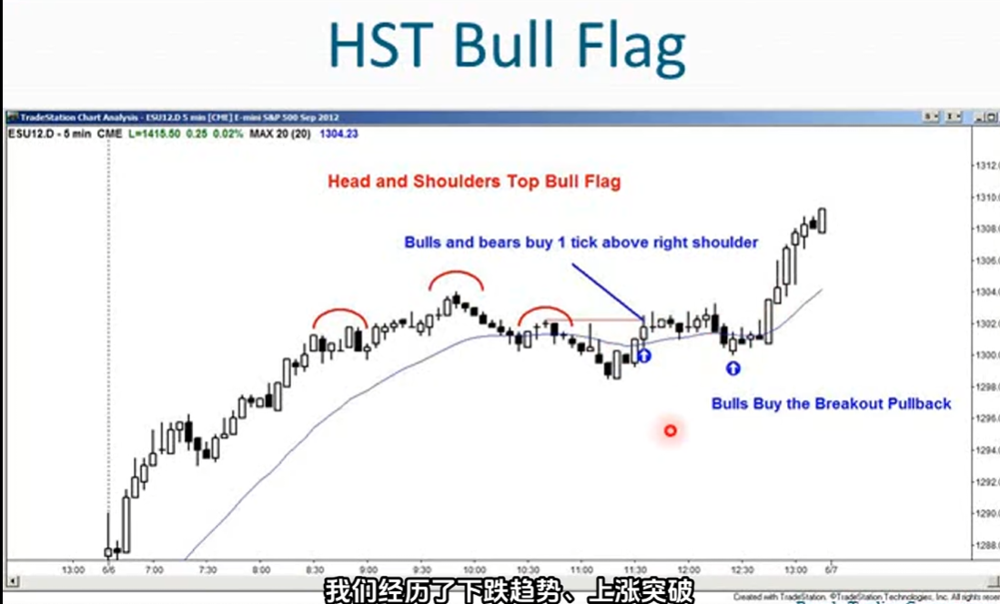
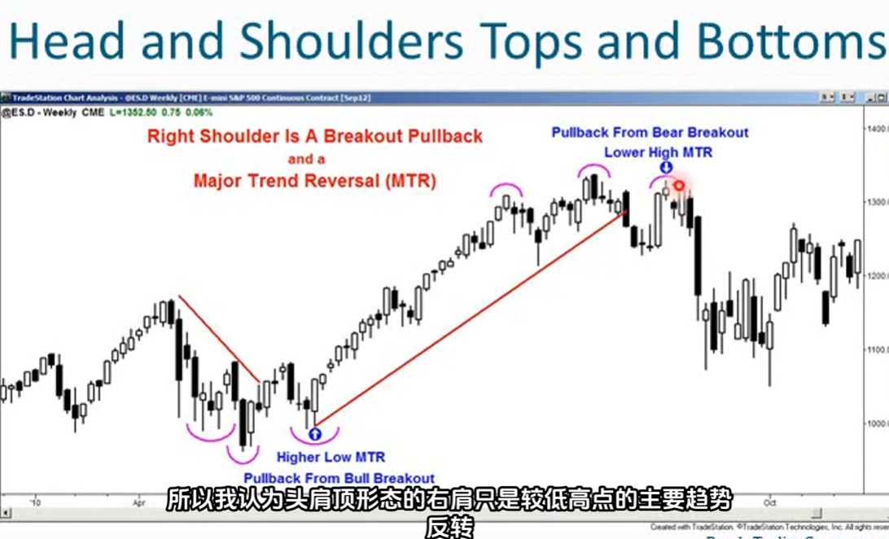

1. 头肩顶形态：简称HST（Head and Shoulders Top）
2. 头肩底形态；简称HSB（Head and Shoulders Bottom）
3. 头肩顶和头肩底术语，毫无意义，因为他们并不描述价格行为的实际情况
4. 最典型的头肩形态都是主要趋势反转形态，当头肩形态处于主要趋势反转时，更倾向于使用MTR反转这个术语
5. 如果你遇到一个头肩顶形态 ，从头部开始的下行走势会突破趋势线，随后涨至右肩的行情就成了突破后的回调，因此这是一个突破回调做空信号，也是一个较高高点的主要趋势反转（HHMTR）

6. 头肩形态实际上只是主要趋势反转信号
7. 大多数头肩形态都有人交易，他们都是交易区间，而且大多数交易区间突破都会失败
8. 大多数头肩顶和头肩底都无法实现反转，如果市场开始反转，通常也会失败，因为趋势往往会延续之前的走势，80%的反转尝试都会失败
9. 大多数头肩顶是多头旗形，大多数头肩底是空头旗形。而且时不时的无法起到旗形作用，反而导致趋势反转

10. 大多数头肩顶/底形态并不会形成反转趋势，更容易形成一个交易区间
11. 市场往往具有惯性，且抗拒变化

12. 头肩顶和头肩底是被过度使用的术语，一些交易者到处都能看到他们，并根据他们进行交易
    - 如果这样做，他们会亏损
    - 记住只有20%的反转形态会导致反转
    - 大多数头肩顶形态会变成看涨旗形
    - 大多数头肩底形态会变成看跌旗形
    
13. 到处使用头肩顶和头肩底的交易者是在强劲趋势中寻找反转，结果错过了趋势
14. 大多数头肩顶和头肩底并非反转形态，而且持续形态（旗形）
15. 头肩顶形态通常会出现的情况：通常会形成牛市旗形，并促使趋势延续。小概率才会形成反转

16. 在多头趋势头肩顶右肩上方1个tick的位置：
    - 空头未能持续形成更低的高点和更低的低点
    - 所以他们放弃了这是一个空头通道的前提
    - 空头在右肩上方买入以平掉空头头寸
    - 空头认为自己最初关于熊市趋势的假设是错误的
    - 多头买入期望趋势恢复（多头在突破右肩后，更高的低点处买入）
    - 上述多头买入，实际是买入的较低高点的MTR
    
17. 寻找MTR比寻找头肩顶形态更好
18. 头肩顶形态的右肩只是较低高点的主要趋势反转（跌破趋势线后的回调）
    