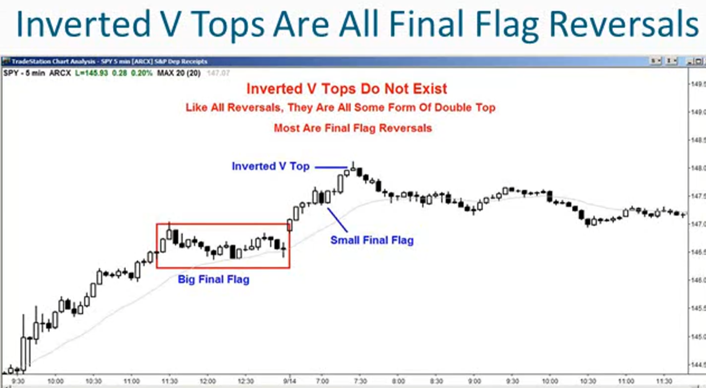
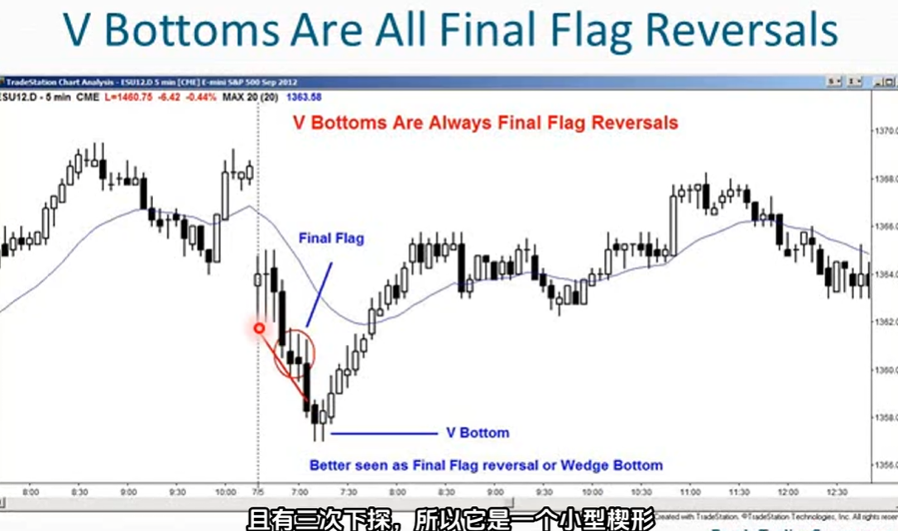
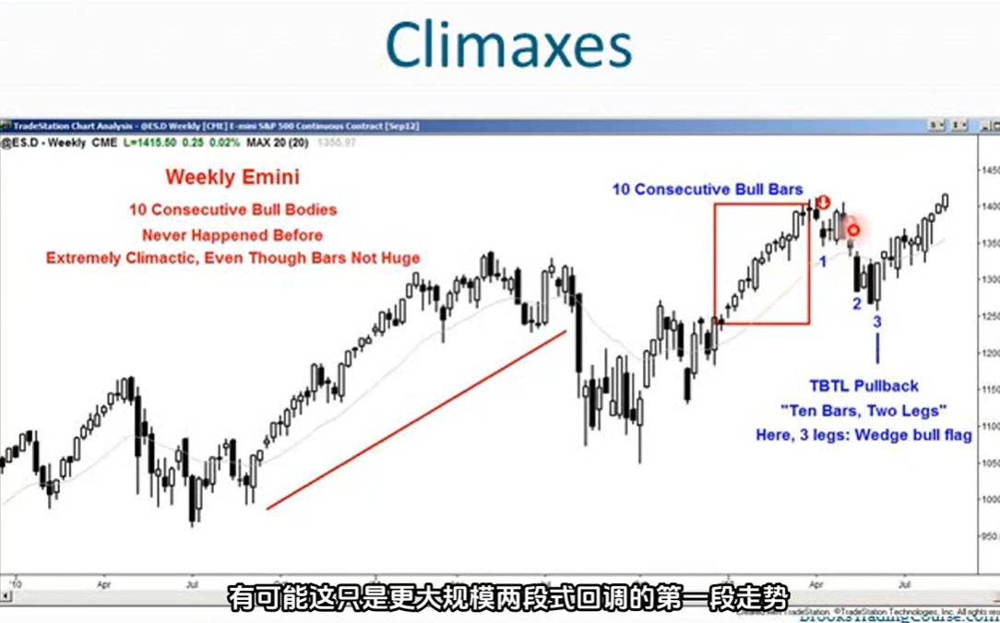
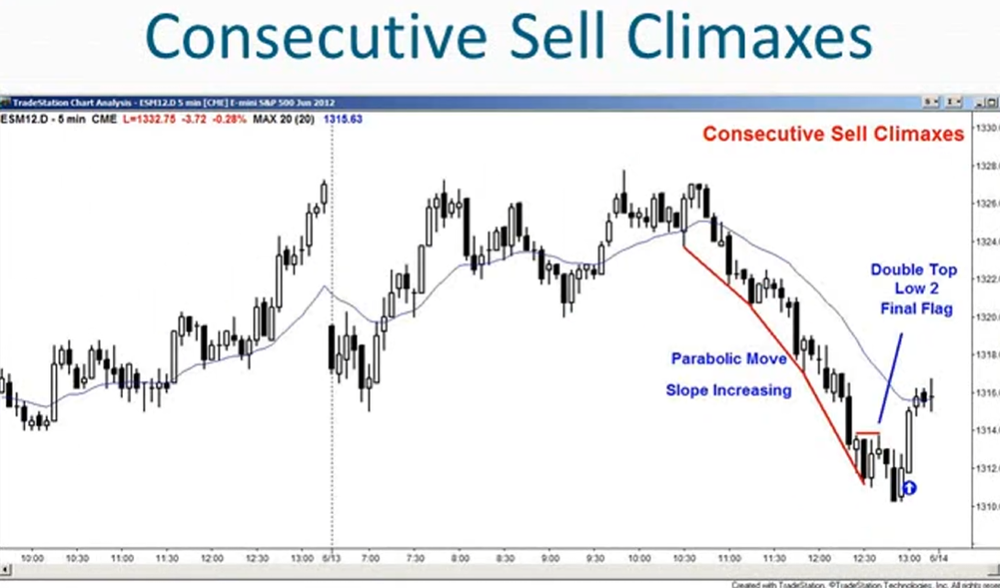
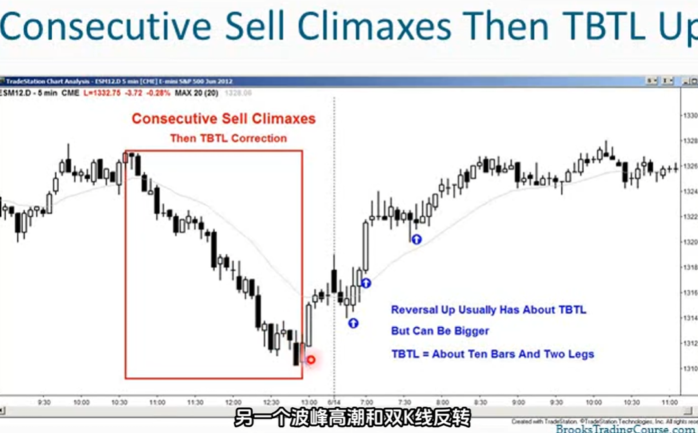
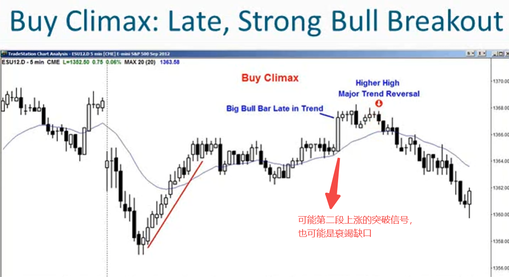

1. 高潮行情（Climaxes）：任何可能无法持续的行情表现，大多数情况下随后会出现回调
2. 买入高潮总是在阻力位结束，比如在测试移动目标位或在趋势通道线处
3. 卖出高潮总是在支撑位结束
4. 买入高潮形成的原因：
    - 如果多头打算在低几个价位或几根k线后再次买入，就不会离场
    - 多头认为市场只会回调几个价位，趋势将继续，多头就会继续持有多头头寸，不会离场
    - 多头离场的原因是因为预计会有更大幅度的回调，还有很多k线会呈横盘或下跌态势，可能会有两到三波下跌行情
    - 因此多头在市场连续多根k线下跌且跌幅较大之前不会考虑买入，所以下方没有买家
    - 因此多头力量不足以阻止空头控制市场，市场必须跌到更低的价格多头才会重新入场
    - 不仅要价格更低，而且多头还想再等10-20根k才会考虑再次买入
    - 多头获利了结的唯一原因是，他们认为之后能以低得多的价格买回
5. 一般来说，高潮阶段通常可以用其他术语更好的描述，比如楔形、最终旗形、主要趋势反转
6. V形底部和倒V型顶部，实际上并不存在，它们都是某种楔形或最终旗形，建议使用其他术语来描述，能更好捕捉价格走势

7. 高潮是一种趋势，由一根或多根k线组成，每根趋势k都是一个高潮，每根趋势k都是一次突破，每根趋势k都是一个缺口
8. 取决于具体情况，有时一系列趋势k会起到突破的作用，其他时候他会起到高潮作用，标志着趋势的结束
9. 高潮可能会非常迅速由一系列趋势k组成，这种情况往往很吓人，也可能很缓慢
    - 趋势有时会加速形成一条情绪化的抛物线
    - 例如单纯的趋势可能会越来越陡峭，几乎成自由落体状态然后急剧反转向上
10. 每根趋势k都是一个高潮，所以一根成为失败突破的单根趋势k就是一个高潮
11. 一系列不起眼但持续增长的趋势k，这也可能是一个高潮，这是不可持续的行为
12. 每当市场在高潮反转时，通常会跟随一个TBTL（Ten Bars，Two Legs）回调
    - 至少持续约10根k
    - 通常会有至少2段走势
13. 如何确认发生了高潮反转？TBTL，寻找至少10根k，以及相反方向上至少两段走势

14. 市场持续的高潮不可持续，一旦反转将出现相当大的回调，至少持续10根k，且至少有两波走势

15. 在趋势后期出现的强劲突破（其实也就是高潮），这可能是趋势中的衰竭缺口
16. 如果趋势已经持续了30根k，突然出现一根形态极佳的趋势k突破形成更强的趋势，这就是高潮。通常会吸引获利了结者和反向趋势交易者
17. 若处于强劲的多头趋势中，接着突然出现一根大的多头趋势k以做高价收盘，或两到三根强劲的多头趋势k以最高价收盘。多头离场空头卖出
