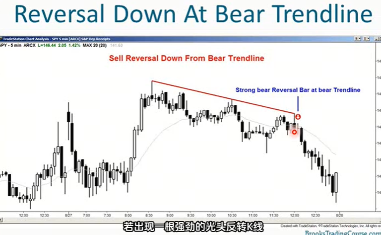
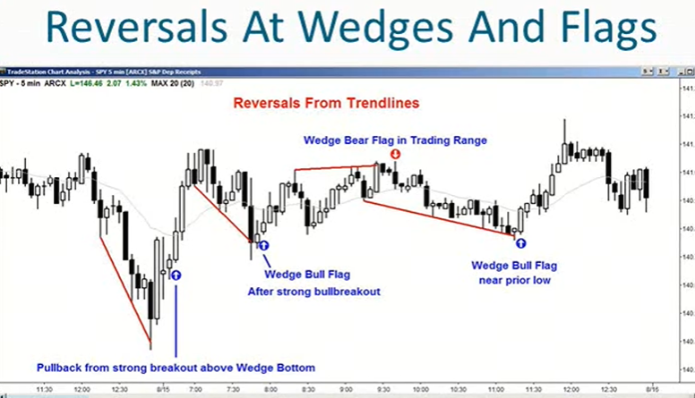
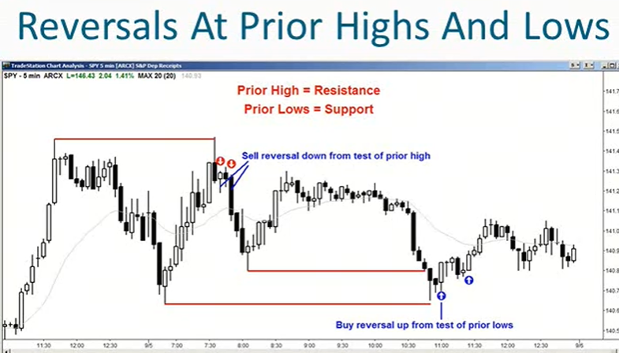

1. 支撑位是市场的一个价格水平，在此处买方力量可能强于卖方。阻力位是市场的一个价格水平，在此处卖方力量可能强于买方
2. 所有的反转都发生在支撑位和阻力位，观察市场到达这些位置的表现就有机会进行交易。要么寻找突破机会要么寻找反转机会
3. 大多数时候，市场并非出于强势突破状态，交易者在支撑位买入，阻力位卖出
4. 在强劲趋势中，交易者会在极小幅回调时买入，并预期途中的每个小阻力位都会被突破，当多头部分获利了结时，市场可能会在阻力位稍作停顿，但市场很可能突破所有阻力位继续上行，最终当市场反转时发生在阻力位
5. 在弱势突破时，交易者会找各种理由卖出
6. 大多数时候，市场处于若趋势和交易区间，无论哪种情况交易者都会寻求在支撑位买入、阻力位卖出
7. 如果市场处于强劲的趋势
    - 如果回调已经测试突破点，他们就会买入
    - 如果市场回调并测试之前的更高低点，他们就会买入
    - 如果市场回调并测试多头通道底部或趋势线，他们就会买入
8. 如果市场在看跌旗形或交易区间后出现下跌，若市场再次回升至该位置他们就会卖出
9. 交易大局观：蜡烛图形态不错，但重要性较低；大局是支撑位和阻力位，这远比蜡烛图形态重要·；理解这一点是交易的基石
10. 一个交易机会由背景context和信号柱signal bar构成
    - signal bar是末端的小蜡烛图形态
    - context是左侧所有k线所呈现的情况，主要包括支撑位、阻力位
11. 在强劲的牛市趋势中，蜡烛图形态毫无意义，你会因各种理由买入。即便出现强劲的看跌反转k线，有经验的交易者也会在其下方买入，预计这根k线会诱使缺乏经验的空头做空，而这个空头形态很快会转变为多头旗形，聪明的多头会在空头设置止损的位置入场，也就是空头会亏损离场的位置
12. 在支撑位和阻力位进行交易的优势在于交易方程非常有利，回报远大于风险，而且概率通常在40%-60%之间
13. 哪种支撑位和阻力位最有用？
    - 趋势线
    - 前高和前低
    - 测量移动幅度

14. 完整的支撑位和阻力位列表：
    - 趋势线
    - 前高前低
    - 测量移动幅度
    - 任何时间框架下的移动平均线
    - 多头入场k的地点和空头入场k的高点
    - 多头信号k的高点和空头信号k的低点
    - 今日、昨日、日线图、周线图、月线图上的高低开收
    - 每日枢轴点（可以不关注）
    - 斐波那契回撤位和投影（可以不关注）
    - 任何类型的带，如：布林带、肯特那通道（可以不关注）
15. 
