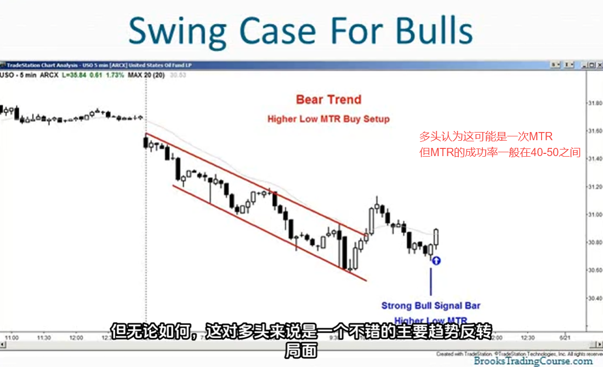
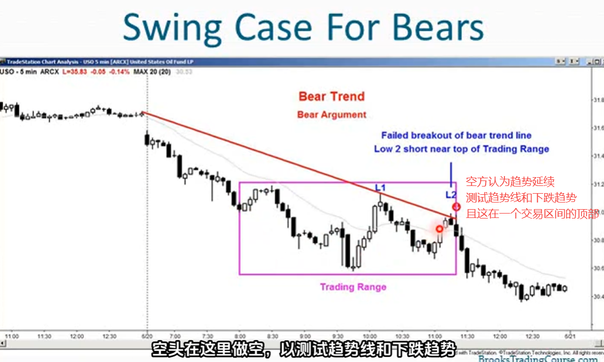
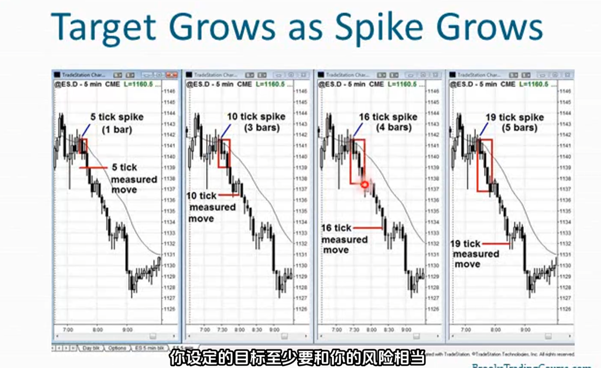
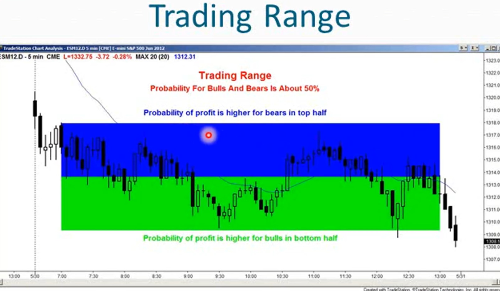
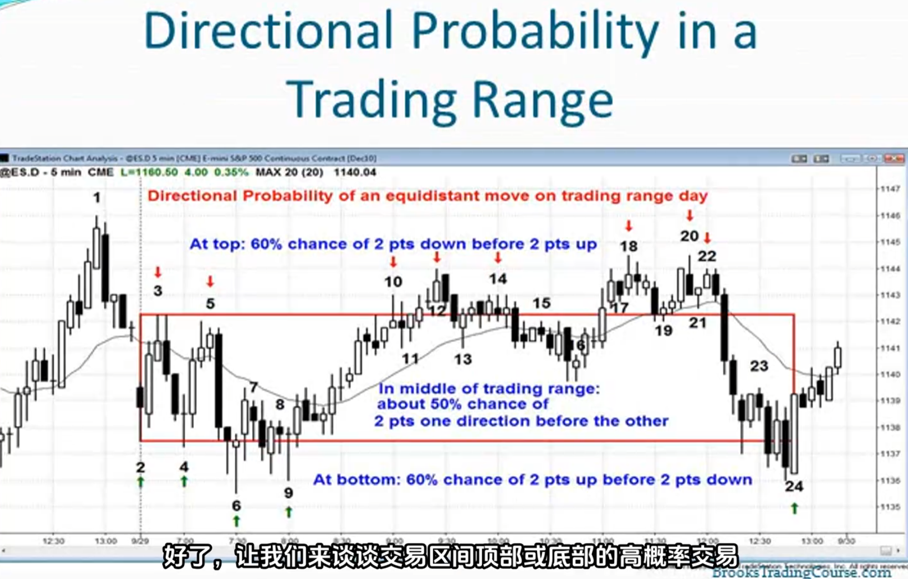

1. 交易中的优势转瞬即逝且十分微小，如果想要盈利就需要数学优势
2. 交易是试图从非常聪明的人那里赚钱的零和游戏
3. 所有交易都带有主观性，且难度大，所以不可能拥有巨大的优势
4. 当你拥有微弱的优势时，因为不会持续太久，所以必须采取行动
5. 不存在永远有效的交易秘诀，因为交易中必然有一方要站在相反的立场否则你无法成交
6. 交易中没有圣杯
7. 任何交易之前都问自己：这笔交易能赚钱吗 
8. 如何知晓胜率：使用计算机测试、基于自己多年的经验
9. 只有当成功概率x回报 显著大于 失败概率x风险时，才能进行交易
10. （Probability of Success）x （Reward） > （Probability of Failure）x（Risk）
11. 概率变量是最重要的，因为这是你唯一无法控制的因素
12. 交易中你所作的一切都是不确定的，你永远无法确定任何事情
13. 如果你确定那一笔交易那就不要进行这笔交易，因为这肯定是错的，因为不会有人来接盘
14. 概率是最重要的变量，也是交易难以做好的原因，而管理是成功的关键
15. 概率会让新手错过大行情，也会让新手过早退出强势行情
16. 概率是引发情绪的原因，情绪会造就失败者，再摆脱情绪之前，你会一致亏损
17. 在适应不确定性之前，你无法盈利。作为交易者，在不确定性的海洋中遨游
18. 概率可以无法确定，但可以做出假设，从而减轻交易中普遍存在的压力
19. 交易中概率给自己两个选择，40:60或者50:50
20. 执行你认为概率50:50的交易时，必须至少盈亏比2：1，交易才值得做
21. 执行你认为概率40:60的交易时，40概率时必须至少盈亏比4：1，60概率时（如超短交易且处于强劲趋势中，很确定交易能成功）至少盈亏比1：1，交易才值得做
22. 如果在进行MTR交易时，虽然情况不太乐观，成功率为40时，必须至少盈亏比2：1
23. 如果无法确定概率时，就认为是50：50，然后根据风险设置盈利目标
24. 因为你无法确定概率多少，所以必须根据个人经验做出假设：要么假设50：50，要么假设40：60
25. 市场中99%的时间中，交易概率处于40-60之间
26. 交易者们一直处于不确定的海洋中，清晰明朗的时刻只有一瞬间（强劲突破中），大多数时候相当模糊，概率很少超过60%
27. 市场具有惯性，当你想知道右侧k线会是什么样时？去看看左侧，这就是右侧走势最可能的预示
    - 如果市场处于趋势中，很可能会继续保持趋势
    - 如果市场处于盘整区间，很可能会继续盘整
    - 如果市场处于突破，很可能会继续突破
    - 如果突破看起来很微弱，很可能会失败
28. 新手总是在确定性和完美的交易，而他们并没一直到确定性并不存在，完美的交易也不存在，必须接收40-60的概率失败
29. 优秀的交易者判断正确的次数更多，而新手判断正确的次数更少
30. 你经常会认为交易胜利的可能性为90%，如市场在强趋势中，距离你的盈利目标相差1个tick，而你的风险在下方6个tick，此时你通常会继续持有
31. 你仅可以持有那些你觉得可能性大于90%的交易，否则你将陷入亏损交易者的困境，这并不理智
32. 交易的首要原则是，收益至少与风险相当
33. 不能为了保本而交易，必须为了盈利而交易
34. 大多数优秀的交易者，无法日复一日年复一年的保持70%以上胜率
35. 你不应追求风险大于回报的交易，因为这要求你达到70%的胜率，而这是大多数优秀交易者都做不到的
36. 没用什么测量永远有效，大多数策略都只是暂时有效，大多数策略的有效率在60%左右
37. 当有人说他的成功率远高于60%时，要么不诚实，要么试图卖东西给你
38. 成功率远高于60%时不可能如此确定，因为如果成功率90%时，市场会立刻涨到那个价格目标
39. 市场没用涨到他们所说的价位唯一的原因就是，成功率远没有他们所说的那么高
40. 在任何给定的时刻，多方和空方都在建仓，如果他们没有经过测试证明自己的交易方程时正向的，他们不会建仓的
41. 为什么多空双方都在建仓，他们的交易方程都是正向的呢？因为40/60法则，如果他们能够正确管理交易，他们都能盈利
42. 机构会在市场和他们的预期相反时逐步加仓，这会提高他们的成功率

43. 完美的交易：在承担极小风险的同时有很大概率获得巨大回报。完美的交易并不存在，因为必须要有机构来进行反向交易
44. 任何接近完美交易的时刻都会被机构抢着参与，导致一根巨大的多头趋势K，这会极大的增加风险
45. 市场处于不断的循环中，趋势突破->趋势通道->交易区间->趋势突破
46. 为什么突破交易很难？
    - 风险非常大，因为市场波动很大，止损位很远
    - 必须快速思考决策
    - 必须调整仓位大小
    - 必须计算出风险有多大，并相应减仓
    - 这些快速调整既可怕又困难
    必须正确调整，虽然盈利概率很高，但会有一种紧迫感，让交易者感到不适，常使交易者不敢交易 
    最终新手会错过趋势的突破阶段，而这是趋势中涨势最快，涨幅最大的部分
47. 为什么反转交易很难？
    - 反转是一个突破或者会引发突破
    - 反转通常并不令人信服，概率不理想
    - 直到市场大幅突破之前，反转交易情况都不乐观，而到那时已经错过很大一段行情，又会面临突破的问题
48. 为什么通道交易很难？
    - 强劲突破后进入通道阶段，开始出现回调。看起来要反转了，交易者不敢买入，所以交易者最终会被洗出局
    - 当出现小幅回调时，会让人觉得也许这不是回调，而是一次反转
    - 新手最终不会在回调时买入，因为他们觉得回调时，即便风险小，但概率很低，他们将回调视为反转，而非趋势中的停顿
    - 记住，通道会演变成交易区间，区间顶部买入和区间底部卖出的成功概率都很低，而且风险更大，因为止损位跨越整个交易区间
49. 为什么交易区间交易很难？
    - 交易区间总是会有强劲的多头尖峰触及顶部看似要突破，但突破行情80%都会失败
    - 市场在交易区间顶部出现强劲的多头尖峰后，试图向下反转，新手会觉得这么强劲的多头尖峰，这应该是上涨的第二浪，他们不会在顶部做空，认为概率太低
    - 在交易区间内，应当进行超短线交易，更加合适
    - 超短线交易需要高概率机会，所以在交易区间时，必须等待更高概率的机会
    - 在区间顶部或底部出现非常强劲的反转k线，这就是高概率机会
    - 也可以等待二次入场机会，如区间底部的小双底形态，或区间顶部的小双顶形态
50. 测量移动的概率是多少？
    - 在任何时刻，市场在下跌一个tick前，上涨一个tick的概率是多少？
    - 在任何时刻，市场在下跌3个tick前，上涨3个tick的概率是多少？
    - 或者15个tick？
    - 大多数是50:50的概率
    - 市场会在下跌3个tick前，上涨3个tick
    - 有时概率更高有60%，此时就有了交易优势，但优势转瞬即逝，必须立即行动
    - 要利用测量移动，来判断达到1：1盈亏比的概率
    - 举例：
51. 在交易区间顶部做空，底部做多的盈亏比很高，在区间中部概率为50：50，最好不进行任何交易
    
    
