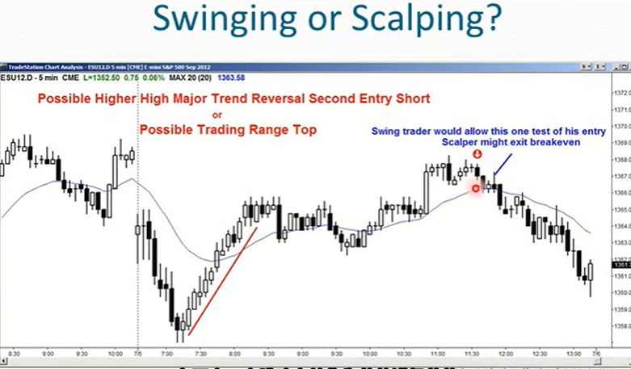
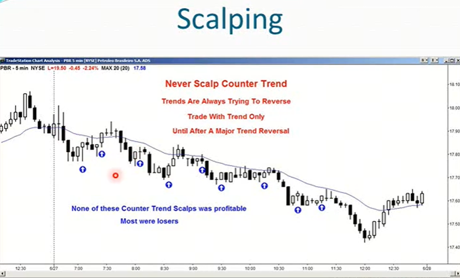
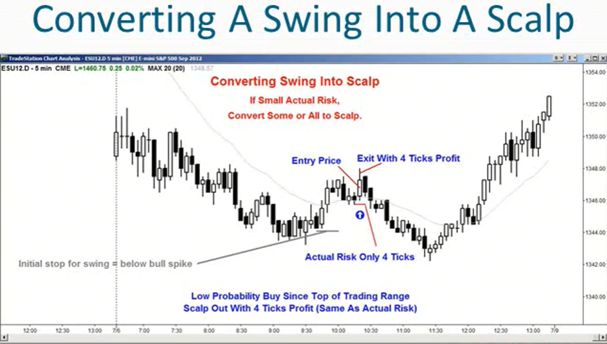

1. swing波段交易：所有追求的回报至少是风险两倍的交易
2. scalp剥头皮交易：所有追求的回报小于风险两倍的交易
3. 一般来说，波段交易者期望市场至少朝着他们预期的方向走出两段行情，也可能更多，但至少两波
4. 超短线交易通常只寻求一波快速行情
5. 一般来说超短线交易看起来容易，但想要从中获利极其困难，新手不应该尝试超短交易，新手应该只寻求波段交易机会
6. scalp交易者只追求快速波动，通常不允许价格回调，或者只允许非常小的回调
7. swing交易者会允许价格回调至入场价后再回升，但如果趋势朝预期方向恢复，将设置保本止损，不会让市场第二次回到他们的入场价
    
8. 当经验丰富的交易者进行超短线交易时，顺着趋势方向进行scalp交易要好得多，如果遇到一个宽泛的多头通道，一个非常微弱的趋势，可以进行双向scalp
9. 初学者绝不应该逆着趋势方向进行scalp，哪怕是很微弱的趋势
10. 当出现非常强劲的趋势时，交易者不应该进行超短线交易
    
11. 新手喜欢逆势scalp交易
    - 他们认为市场已经拖延太久，趋势不会延续下去了
    - 他们害怕亏损，以至于在交易等式中只考虑风险
    - 他们只看到风险很小，而忽略了盈利概率很低，且回报也很小的现实
12. scalp交易风险小，止损紧，因此必须高概率交易，才能最终盈利，这是关键
13. 风险
    - 初始风险：初始保护性止损的举例，从入场到止损的举例
    - 实际风险：当交易朝着有利方向发展时实际承担的风险
14. 大多数波段交易的胜率都较低，但如果市场朝着你预期的方向发展，而且你发现实际承担的风险非常小，可以将部分波段交易转化为超短线交易，并仍然遵循合理的交易者公式
15. scalp交易时，必须确保回报至少和风险一样大
16. 如何计算实际风险?
    - 统计市场在朝着有利你的方向发展之前，与你预期反向波动的点数
    - 一旦市场再次朝着对你有利的方向发展，你查看市场与你预期反向波动的点数比这个点数多一个点，就是你的实际风险
    - 将你的目标收益调整为与你的实际风险一致，可以将部分或全部波段交易全部转化为超短线交易，从而实现交易等式为正
    