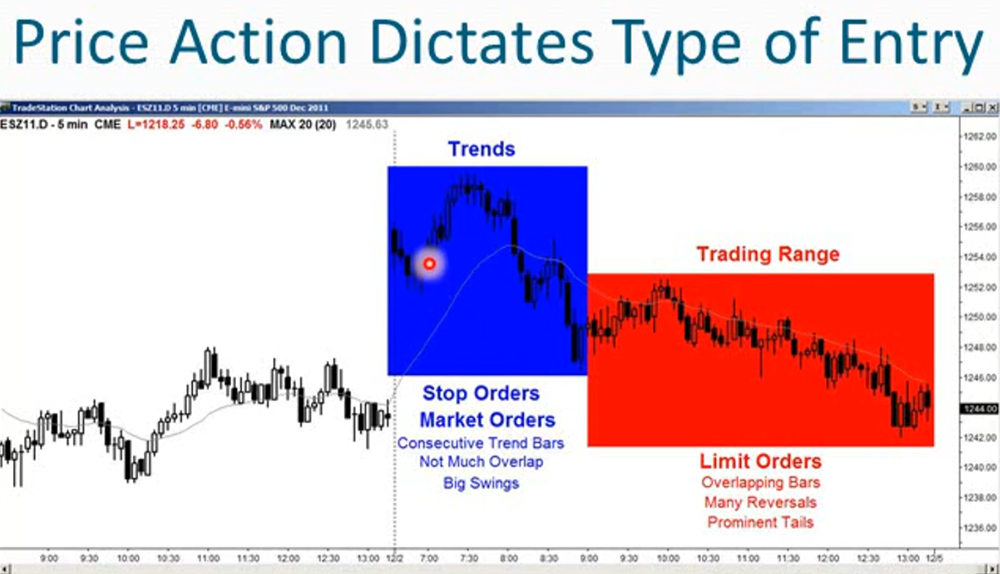
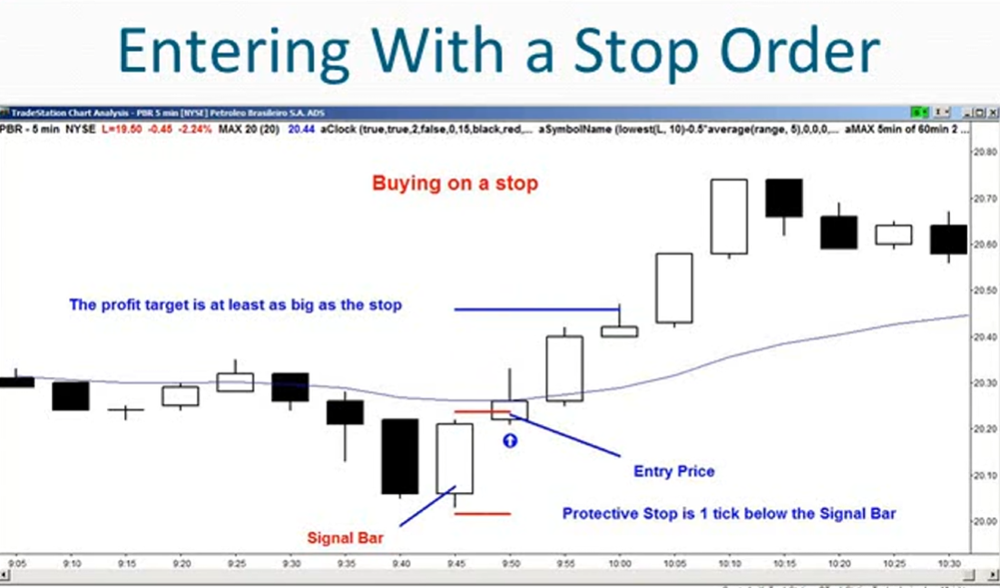
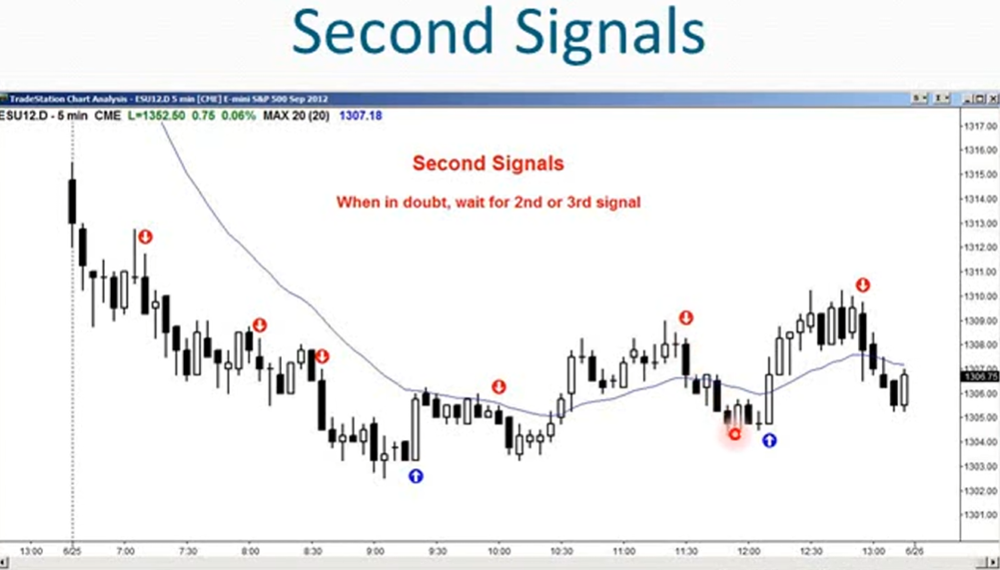
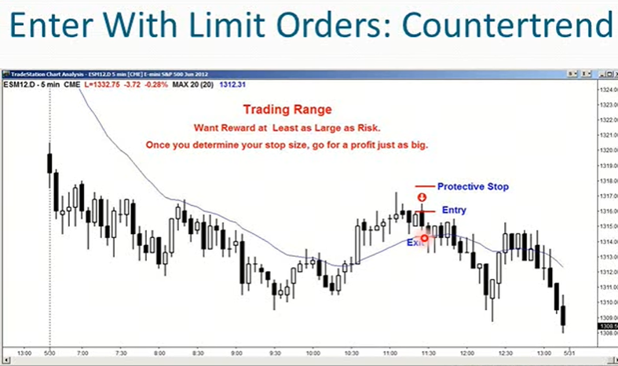
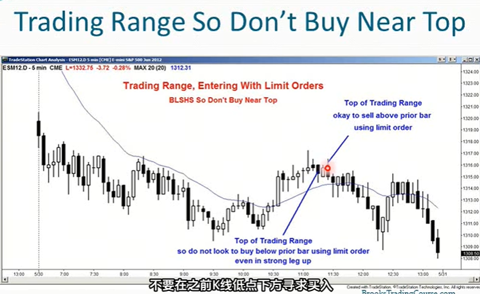
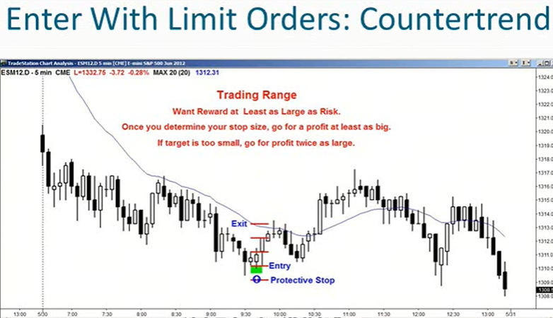
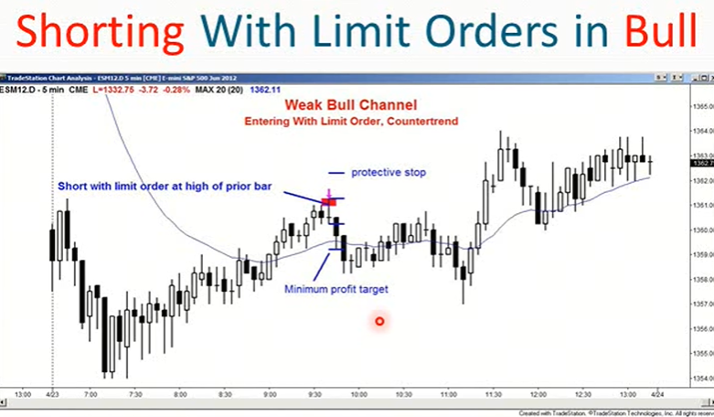
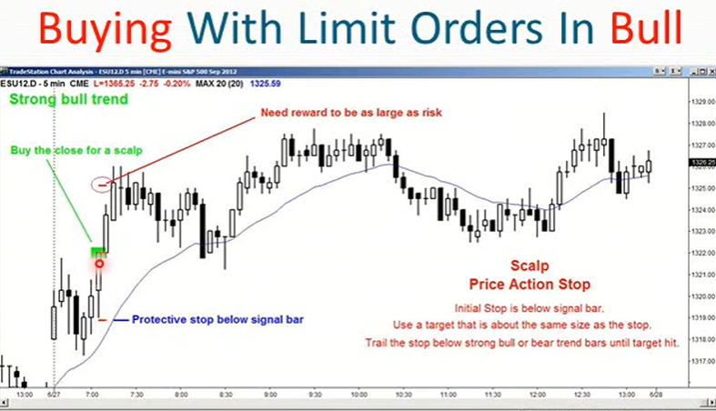
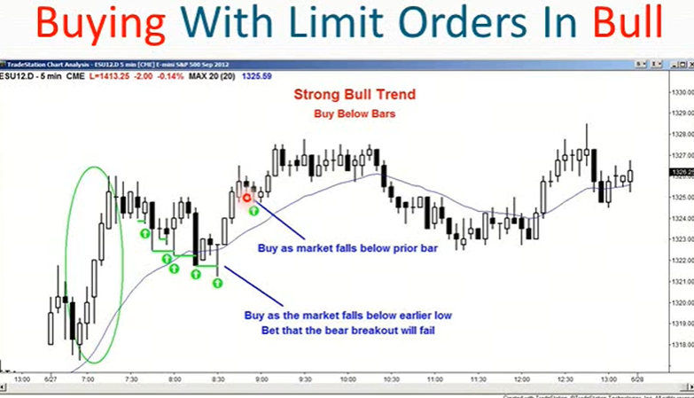
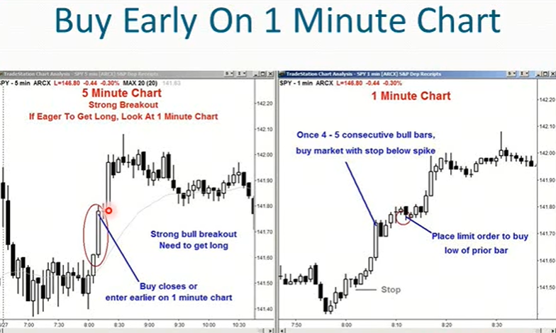

1. 对于入场订单，初学者应仅在止损位入场，你希望借助市场动能入场
2. 如何在止损位入场？
    - 买入或卖出前一根k的突破点
    - 市场处于趋势时，这是一种很棒的交易方式
    - 市场处于窄幅横盘时，这是一种糟糕的交易方式
3. 当市场处于窄幅交易区间时，不要使用止损单入场，实际上初学者不应该在窄幅交易区间进行交易
4. 有经验的交易者可在非常强劲的突破行情中使用市价单入场
5. 使用限价单可使用强劲突破行情也可在交易区间中进行操作（包括窄幅交易区间），有经验的交易者会在前一根k的低点买入，寻求超短线上涨机会
6. 当使用限价单入场时，记住开仓方向要和最近的报价方向相反，
    - 举例：在最近的报价时下跌时买入，所以你是在赌这次突破会失败
    - 在低于前一根k低点的价位买入或在高于前一根k高点的价位卖出
    - 只有当你对自己解读图标的能力非常有信心时才应该这么做
7. 如何使用限价单交易？
    - 每根带影线的k线都是一次失败的突破尝试，换句话说这是一种盘整区间形k线
    - 如果有很多k线都带影线，那么押注突破失败会更好
    - 如果市场中有很多带影线的k线，这意味着每次市场上涨都会遇到卖方，每次市场下跌时都会遇到买方
        - 如果你处于一个有很多影线的横向盘整市场中，你就不想以止损单进场。预期压住突破会持续下去，不如突破会失败并朝相反方向发展
        - 有经验的交易者不会在高于前一根k高点一个tick处设置止损买单，而是会在前一根k高点处挂限价卖单，押注突破会失败
        - 如果大部分k都带有影线且重叠部分较多，那么突破将会失败
        - 此时止损单入场很糟糕，但限价单很合适，压住突破失败，市场将反转 
10. 选择止损单还是限价单进行交易？
    - 止损单押注突破会成功，限价单押注突破会失败
    - 你必须观察价格走势
11. 当你开始看到连续的趋势k，重叠较少且波动较大时这是设置止损单的绝佳环境，也是设置市价单的理想情况
    
12. 如何使用止损单入场？
    - 在先前k线高点处上方一个tick设置买入止损订单，那个先前k线就是信号k。如果你成交了，你成交时的k线就是你的入场k
    - 你希望市场朝着你预期的方向发展，从而推动你进入交易
    - 初始保护性止损，位于信号k下方一个tick处，且盈利目标至少要和止损幅度一样大，最好是止损幅度的两倍
    
13. 如果你打算以止损单入场，但怀疑信号或形态是否足够强劲时
    - 不要入场
    - 等待第2个信号/第3个信号，再考虑是否入场交易，这会增加成功的概率
    - 有疑虑时一定要按兵不动
    
14. 如何使用限价单入场？
    - 只有经验丰富的交易者才建议使用限价单入场，对新手而言是一个心理问题因为要逆势
    - 限价单是逆势交易。限价卖单，市场必须上涨才能成交；限价买单，市场必须下跌才能成交
    - 本质是赌上一根k的突破会失败
    - 如果是在趋势行情中交易，赌反转会失败很合适使用限价单
        1. 如果你处于强劲的牛市突破行情中，不会想在k线高点上方卖出
        2. 然后当你看到3-4根牛市k线，然后出现一根反转k线，你可以在那根熊市k线的底部挂限价单，大多数趋势中的反转尝试都将失败
    - 当市场处于交易区间顶部或底部时，任何突破尝试都很可能失败
        1. 如果市场快速涨至交易区间顶部形成一个小牛市旗形，那个牛市旗形的突破很可能失败
        2. 有经验的交易者会在之前那根k的高点上方挂限价单做空，赌市场不会突破
    - 当通道变弱并演变成交易区间时
        1. 如果你遇到一个弱势下跌通道有明显的买盘压力，同时底部正好有一个简单的旗形
        2. 有经验的交易者会在之前那根k的低点挂限价单买入，赌突破会失败
        3. 当市场处于交易区间顶部时，有经验的交易者会在弱势买入信号k的高点上方卖出，赌突破会失败
        4. 当市场处于交易区间底部时，有经验的交易者会在弱势卖出信号k的低点下方买入，赌突破会失败
        5. 如果市场在交易区间底部，跌破先前的低点，交易者也会在该先前低点处挂限价单买入，押注突破会失败
        
        
        
15. 如何使用限价单入场弱势趋势？
    - 当一个强劲的通道开始出现大量双向交易，并且现在接近通道顶部，出现一个弱的买入信号，比如阳线旗形：十字星k
    - 经验非常丰富的交易者会押注市场将下跌，并且市场将开始抛售进入一个交易区间
    - 如果一个通道看起来正在演变成一个交易区间，比如一个牛市通道，已经处于顶部，交易者会在之前k线的高点处挂限价单做空，押注如果市场突破先前k的高点，这次突破会失败
    - 比如一个熊市通道，市场正在下跌，此时出现一个小的熊市旗形，交易者会在之前k线的低点处使用限价单买入，作为做空的信号k，押注这次做空将会失败
    
    
    
16. 如果市场正在突破，而你又极其渴望入场时
    - 假设是5min图标，你不想等待收k入场，因为这样k线太大，止损位也很远
    - 查看1min图表，如果1min图表上有连续4-5分钟不错的阳线，假设在牛市突破行情中，直接以市价买入，并在1min尖峰行情的底部设置止损单
    - 另外一种方法，不使用市价买入。在之前1mink线最低价处设置限价单买入，赌任何反转尝试都会失败，同样将保护性止损设置在1min尖峰行情底部
    
