1. 保护性止损的目的是为了保护你自己
2. 情绪会不断影响你的决策，有时你会任由损失扩大，保护性止损避免你犯这样的错误
3. 如果你担心亏损，你就会亏损，你的情绪会影 响你的交易决策
4. 如果你使用大的止损，那么一定要交易小的仓位，因为你所冒的风险会远超平时，会让你紧张从而无法客观管理交易
5. 假设你的止损幅度是平时的三倍，那么你的回报至少要和风险一样大，要比平时大3到6倍，你的仓位应当也只有平时的1/3
6. 趋势行情时，可以部分或全部进行波段交易，波段交易意味着追求大幅波动和高额回报，波段交易时回报至少应当是风险的两倍
7. 在所有交易中，必须确保盈利目标至少与止损幅度相当
8. 牛市趋势中
    - 更高的高点、更高的低点
    - 价格处于上升通道内
    - 通道底部是牛市趋势线
    - 只要市场持续创出更高的高点和更高的低点，就仍处于趋势中。若不在创出更高的高点和低点，则趋势不再延续
    - 如果你基于趋势延续的前提进行波段持仓，如果价格跌破最近的更高低点，则趋势不再延续（即价格正在形成更低的低点）
    - 大多数交易者，大多数波段交易者通常将止损设置在最近的更高低点下方，每当市场创出新高或新低时，他们会将追踪止损设置到最近的更高低点下方
    - 如果价格跌破最近的更高低点，他们的交易前提将不再成立，市场不再处于趋势之中，市场可能进入盘整区间，趋势可能已经结束
9. 对于波段交易者来说，只要交易前提仍然成立，就可以继续持仓
10. 如果你观察市场，发现市场走势与预期相反，并且你认为开仓时的判断已不再正确，不要等着止损单被触发，立刻离场，继续持仓毫无意义
11. 波段交易者来说，止损单能保护你，但你也应主动保护自己
12. 如果市场方向改变或发生了某些事，让你觉得自己的交易不再合理，就别等止损位触发，直接平仓并承担损失
    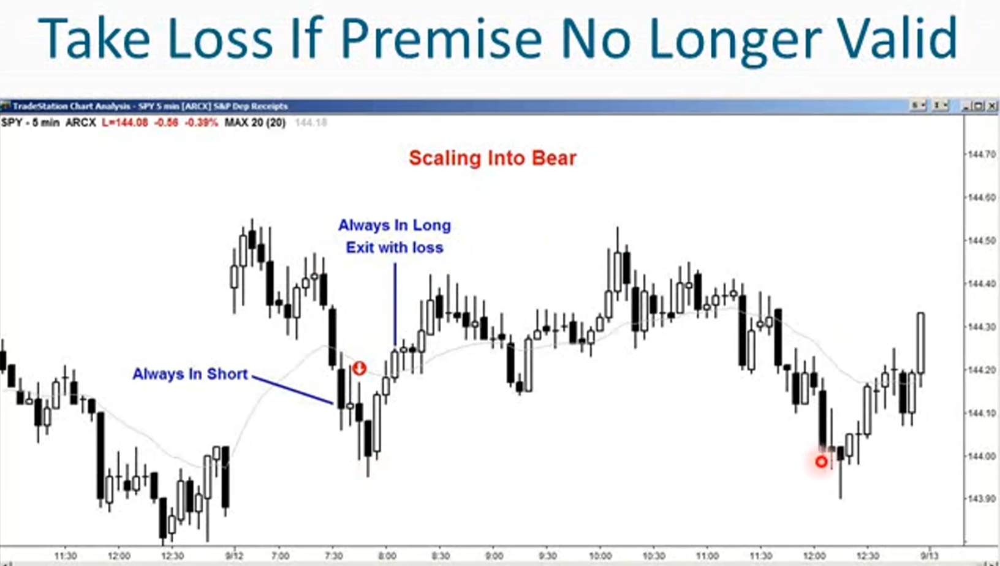
13. 交易区间的特点：触发止损价格跌破摆动低点后反转向上，价格突破摆动高点后反转向下
14. 保护性止损的三种选择：
    1. 价格行为止损：设置在信号k之外
    2. 资金止损：从入场价位开始设置一定数量的价位
    3. 测量移动止损：买入回调行情时，不确定回调何时结束，会基于回调幅度计算测量移动并设置保护性止损
15. 价格行为止损：
    - 如果正在买入牛市反转，将止损设置在信号k底部下方一个价位处
    - 如果正在顶部卖出，并且有一根明确的反转k线，在信号k下方做空，止损设置在信号k上方一个价位处
    - 假设遇到一根很大的信号k，交易者不愿意在信号k之外冒那么多风险，但他们可能愿意在信号k中点之外冒风险
    - 设置方法1：将信号k设置到信号k中间位置，并在此基础上再超出1-2个点的亏损
    - 设置方法2：使用资金止损，在入场价格基础上设置10-50个点的止损
    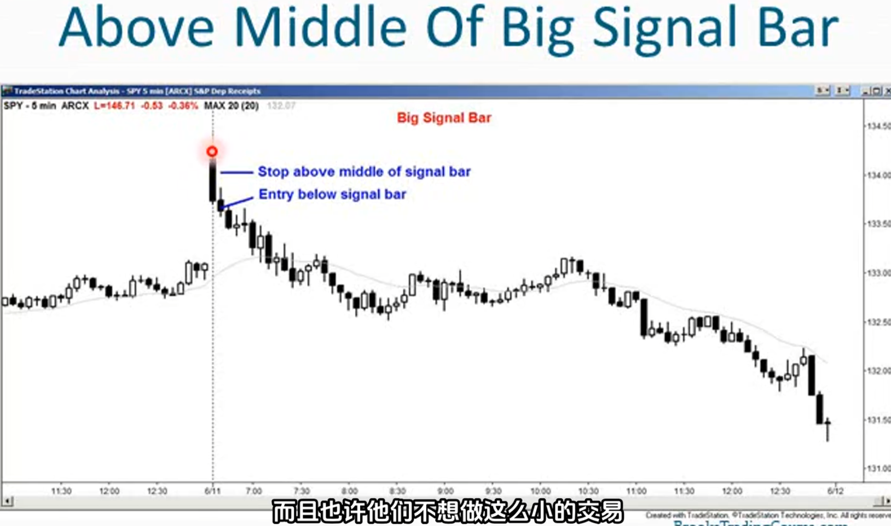
    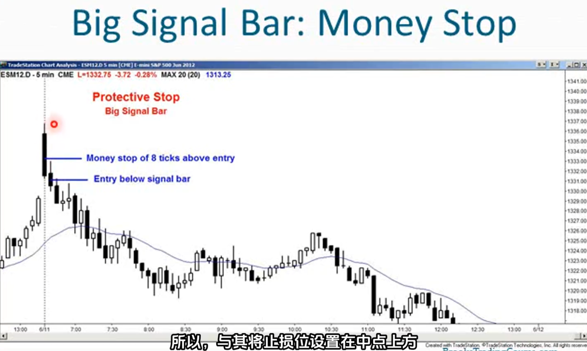
    - 假设你遇到一个扩张三角形底部，这是MTR的表现，最低目标位于三角形顶部上方，回报通常远大于风险
    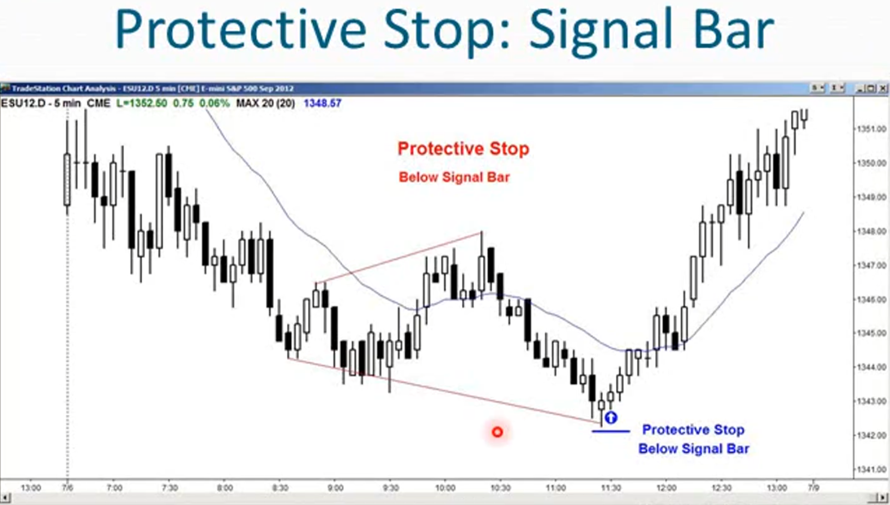
16. 资金止损：
    - 一般的止损幅度是平均k线的大小，这约为日内波段范围的10%-20%
    - 很多交易者认为自己很擅长判断底部，但不太擅长判断实际底部。经常的情况是比信号k下跌几个点，你如果根据价格行为设置止损就平仓了，但是市场然后反弹
    - 判断自己通常承担的是几个tick的风险，就将止损设置在10个tick的位置，允许市场价格跌破信号k，但不允许跌破入场价格的10个tick
    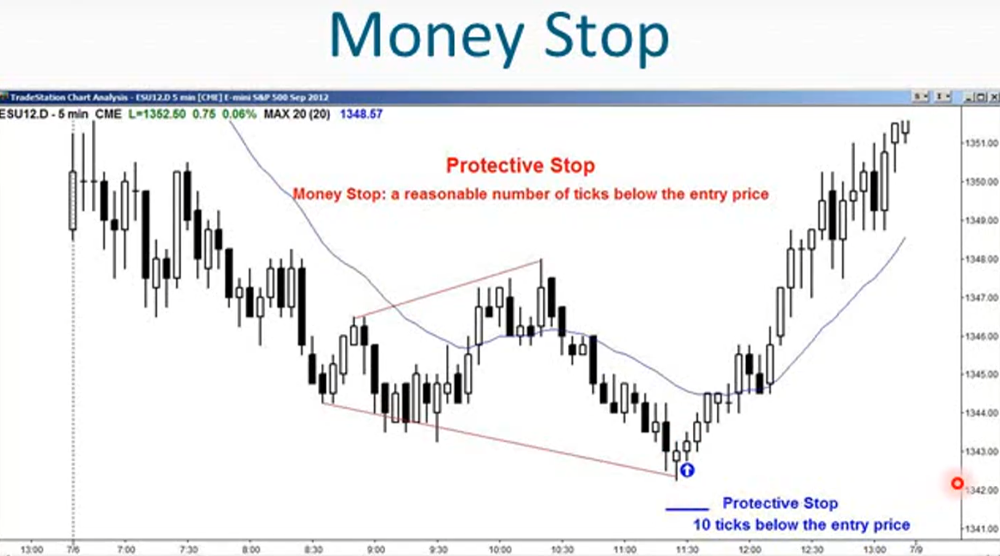
17. 测量移动止损：
    - 基于多种测量移动来设置止损
    - 信号k的高度、形态内的某种缺口、基于盈利目标有多远
    - 基于信号k的高度设置移动止损目标位，是合理的方法，但大多数交易者并不采用这种方法
    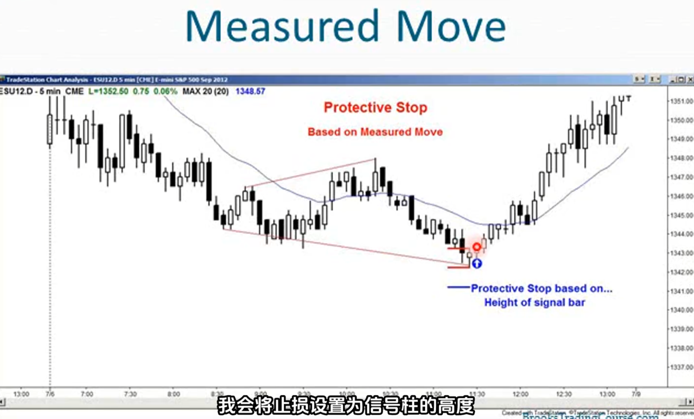
    - 基于缺口产生的波动高度设置测量移动目标，是合理的方法，但大多数交易者并不采用这种方法
    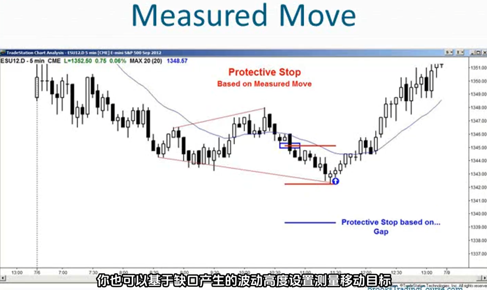
    - 使用极端止损，即非常大止损。使用宽止损的人，不会简单进行点位交易，等着看止损被触发前止盈能否被触发成交
    - 他们如果看到连续几根下跌趋势k，就会认为底部支撑失效，且市场很可能跌至下方的么测量移动位，他们就不会坐等保护性止损被触发，他们会立即离场
    - 使用宽幅止损的人，很少会让止损单被触发，他们会提前很久就离场，宽幅止损只是为了以防市场突然快速波动，来不及思考决策
    - 一旦市场沿着他们预期的方向走出一段距离，他们就会将宽止损设置在信号k下方
    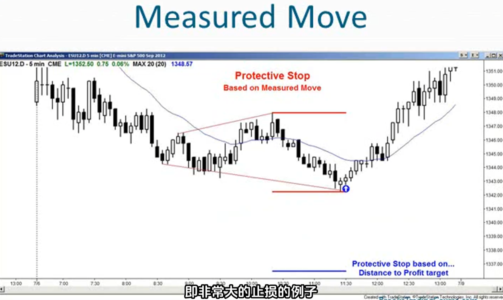
18. 使用宽止损
    - 很多交易者觉得自己不擅长精准判断顶部或底部，所以会在信号k之外设置更大的止损
    - 只要他们的交易前提仍然成立，他们会允许市场暂时和他们的持仓方向相悖，并打赌市场会很快朝着他们预期的方向发展
    - 当使用宽止损时，必须减少持仓规模，使得你面对的总风险资金不变
    - 如果你的止损位非常宽，一定要获利了结，逐步减仓以缩小持仓规模
19. 对于同时交易股票和期权的人来说，有更多策略用于解决止损位太宽的问题
20. 初始保护性止损：你最初承受的风险大小，这也决定了你最初的最低盈利目标，至少要与初始风险一样大
    - 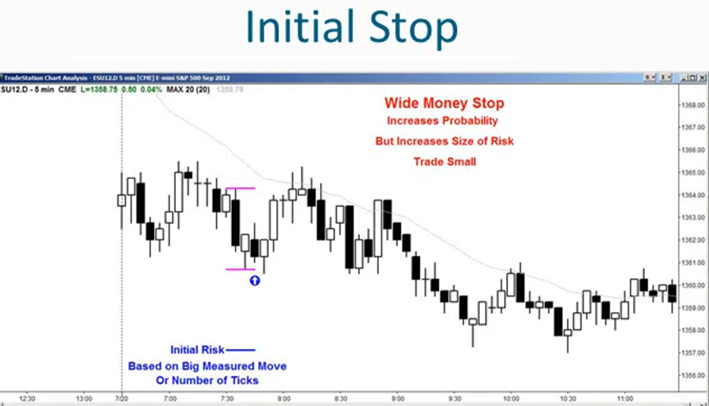    
    - 大多数交易者不会根据初始风险设定盈利目标
    - 市场走势符合预期时，交易者会调整止损位（可做可不做，但有合理性能降低风险、同时也将减少盈利概率）
    - 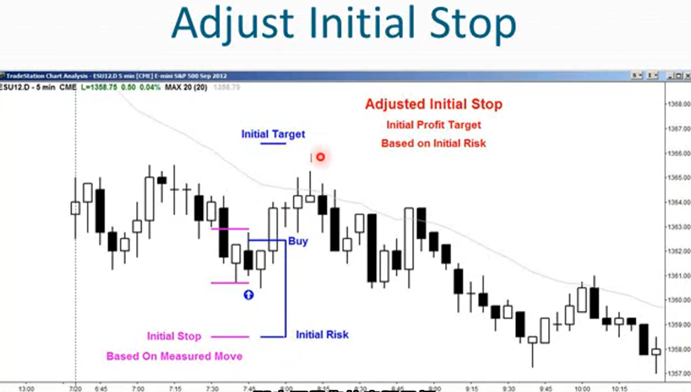
    - 假设你开仓后，市场先小幅逆向波动，然后顺着你的方向走，你就可以计算为避免被止损出局而需设置的止损位，这就是你的实际风险
    - 实际风险总是最多和初始风险一样小，通常比初始风险更小
21. 当两倍初始风险的目标太大时，需要考虑其他获利方式
    - 这在交易区间很常见，入场后行情常出现回调，信号k有时较大，两倍初始风险的目标根本不现实
    - 减小2倍的风险目标（当然，同时止损位必须也相应改变），如果可能性很高时，可以在1倍风险时平仓
    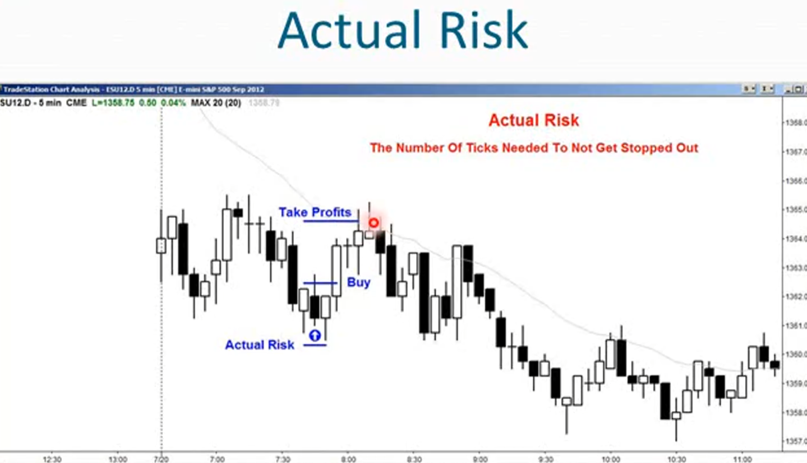
    - 很多交易者会在第二信号k加仓买入，交易者不希望第三次下跌，大多数交易者会在第二个信号k下方离场 
    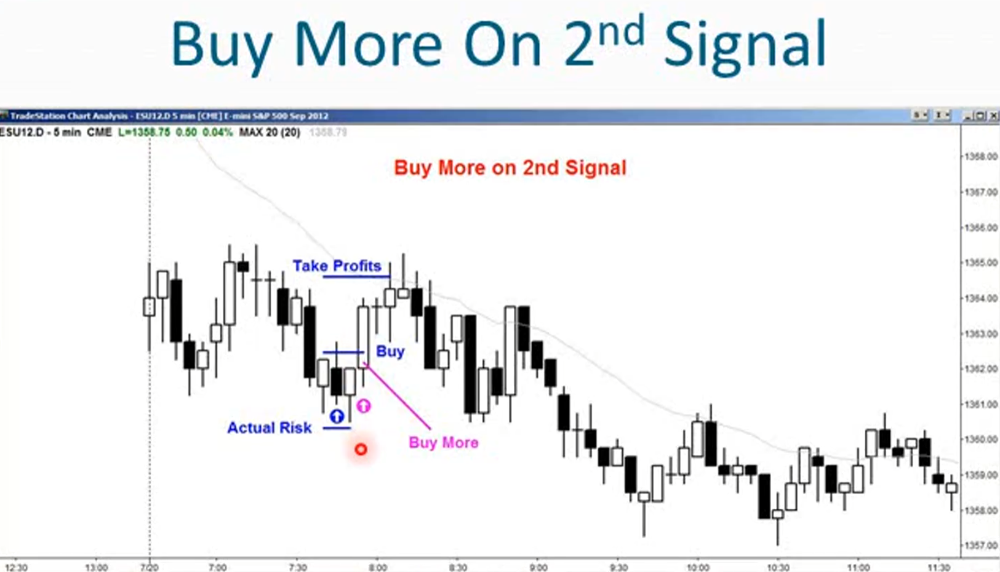
22. 一般来说，每当你需要高概率交易时，你需要一个较宽的止损，获利的概率越高，承担的风险也就越大
    - 交易者们基于不同的看法设置止损点，都是合理的
    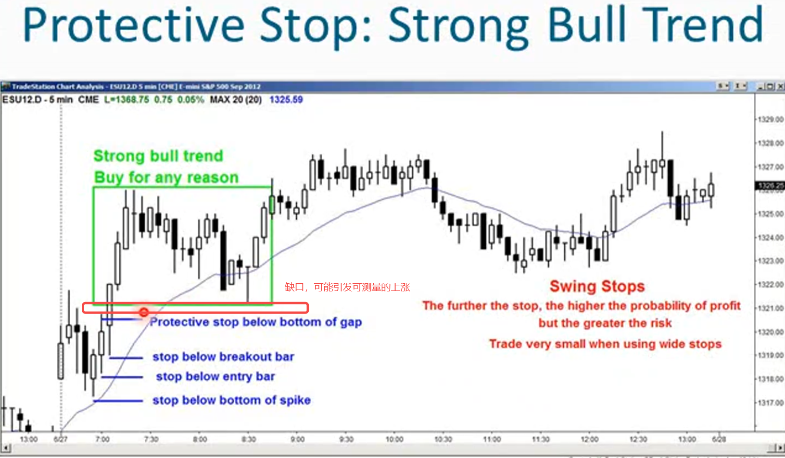
23. 如果止损位是你平时的两倍，那就将你的仓位减半。如果止损位是你平时止损位的4倍，那就将你的仓位减至1/4
    - 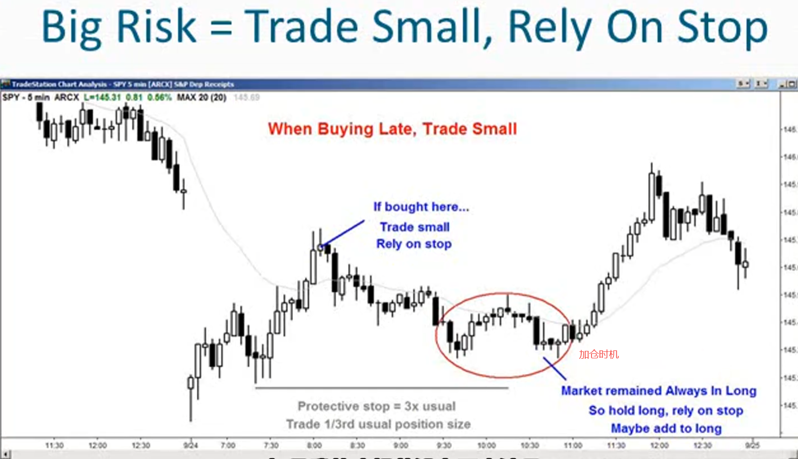
    - 一旦交易前提没有了，就立刻平仓，不要等着止损倍触发，图中出现了MTR，更低的高点
    - 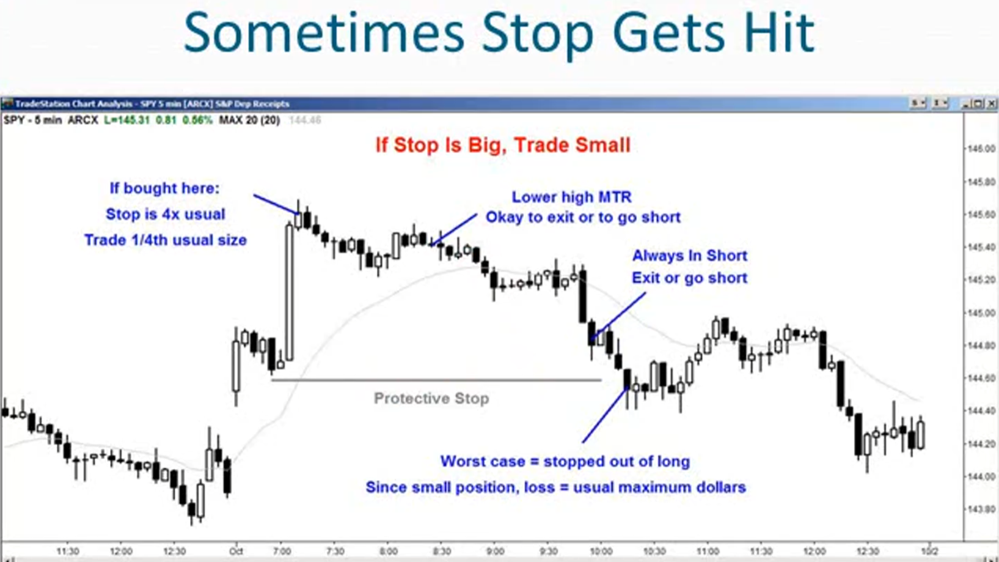
24. 高2和低2为什么有效？
    - 假设市场处于牛市趋势，然后空头做空，市场上涨形成高位1
    - 假设他们再次做空，形成高位2，市场两次下跌
    - 如果市场第二次上涨，大多数空头会放弃并平仓他们的空头头寸，一段时间内不会做空，他们会买入，而这正是多头买入做多的好位置
    - 交易者通常不会让市场与他们的预期相反两次，他们会放弃并认为趋势即将恢复，然后退出逆势交易
    - 加入高2形态的信号k是一根强劲的牛市k线，就更可靠交易胜率更高
    - 当在下跌趋势，做多买入时，如果低2被触发，就直接立刻离场
    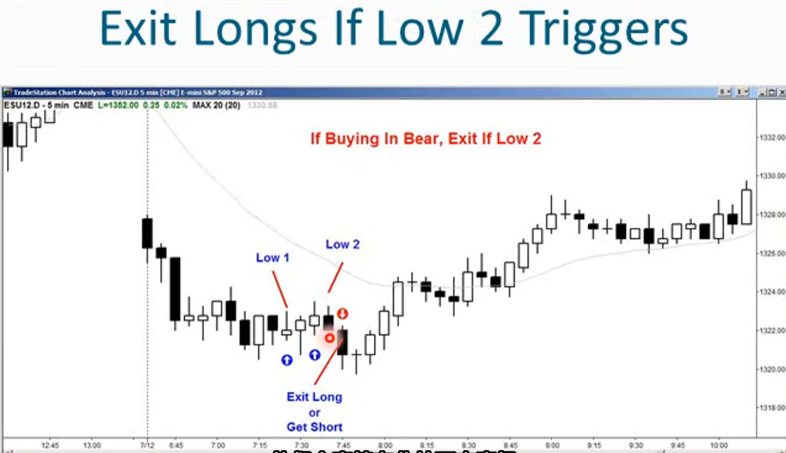
25. 在强劲上涨趋势中使用跟踪止损：
    - 随着市场朝着有利方向发展，必须不断调整止损位，避免风险过大
    - 每次市场创出新高，如果超过了之前的高点，就收紧止损，将止损位设置在最近的更高低点下方
    - 如果牛市趋势有效且持续，就应该会形成更高的高点和低点
    - 如果市场跌破了之前的低点，它可能现在处于盘整区间，而非强劲的上升趋势
    - 如果最近的更高低点距离当前价位过远，而且市场正在快速上涨，交易者不会将止损位设置到更高低点下方那么远
    - 他们会观察最近出现的非常强劲的多头趋势k线，并将止损位设置在其下方，或者寻找其他支撑位（如趋势线）并将止损位设置在该支撑位下方几个tick
    - 或者使用资金止损，在趋势中最近高点下方20个tick处设置止损
    - 在某个时刻，他们会将止损位移到盈亏平衡点
    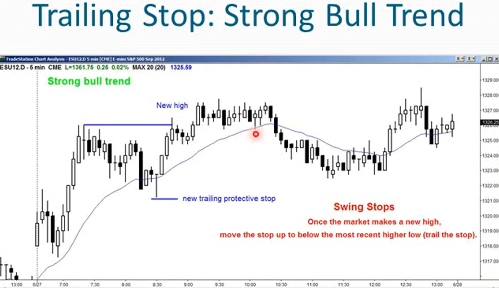
26. 一旦市场进入盘整区间，就要按照盘整区间的方式交易
    - 低买高卖
    - 进行超短线交易，不要使用趋势止损，不要使用过宽的止损
    - 如果你在盘整区间低位建立了多头仓位，现在出现了卖出信号，不必卖空，但应平掉多头仓位
27. 很少有 交易者喜欢反手操作，也很少有人能反手成功
    - 如果你持有多头仓位，而市场给出卖出信号，大多数交易者会利用该信号平掉仓位，而不是反手做空
    - 当市场始终处于多头时，即使有卖出信号，那也只是超短线交易机会，与风险相比利润并不多
    - 当市场始终处于多头时，一般只寻找买入信号，而不考虑卖出信号，除非卖出信号特别强烈 
    - 大多数交易者都喜欢先平掉多头仓位，然后再过几个k线周期后再考虑做空
    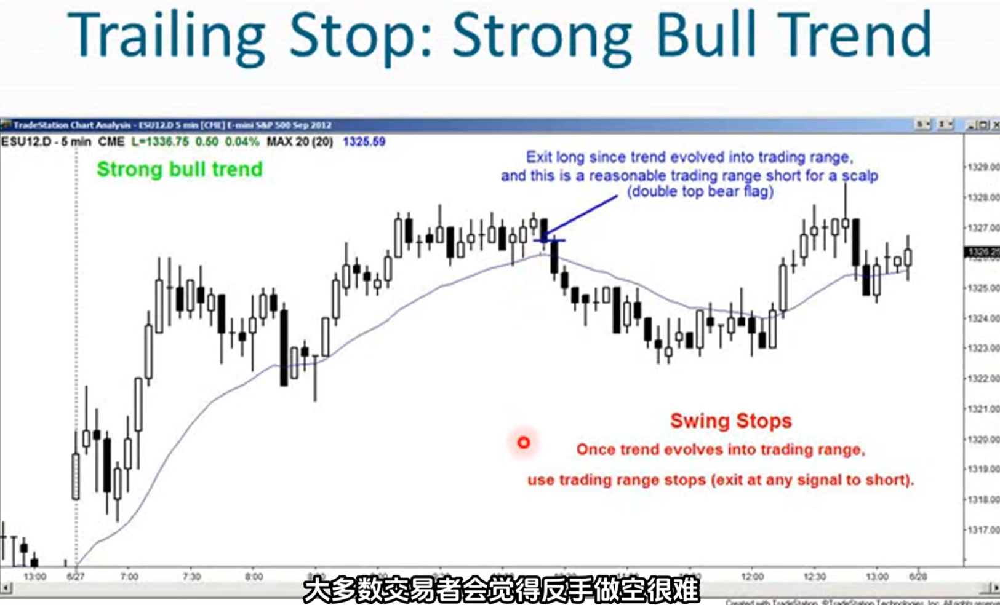
28. 在强劲的牛市通道中设置保护性止损：
    - 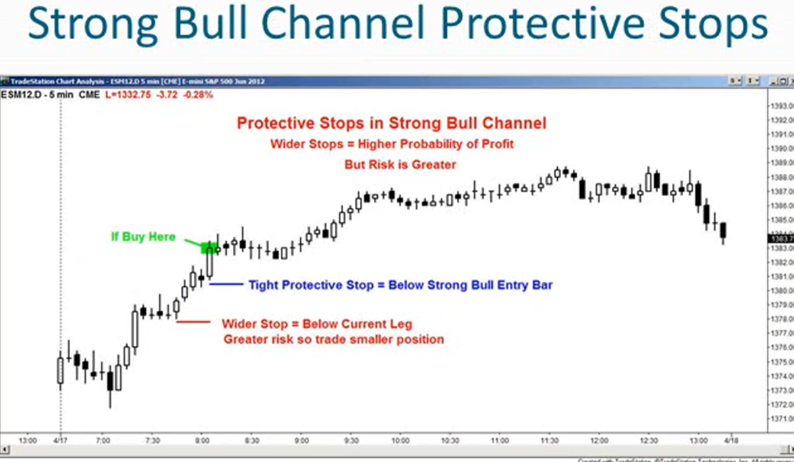
    - 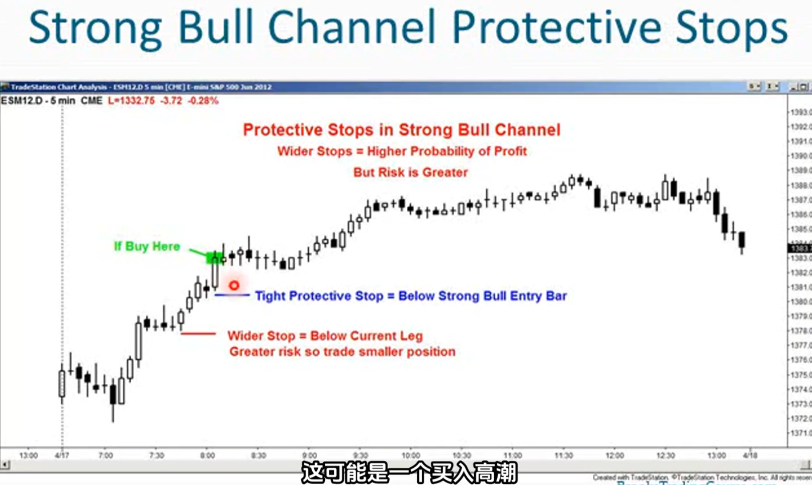
    - 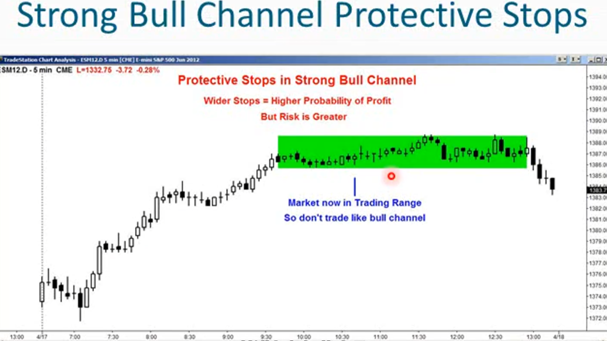
29. 保本止损： 
    - 假设在牛市区间中买入，很多交易者会看到市场小幅上涨，会允许市场回调至其入场价格一次，并继续依赖入场止损位。但一旦市场趋势恢复，他们就会将止损位移到保本点
    - 交易者们不会让市场朝着他们预期相反的方向走两次
30. 完美测试保本止损：
    - 很多时候，市场会回调至入场价格，但就是始终差那么一点到不了。会差一个点没到，然后又朝着你预期的方向继续发展了
    - 这是强劲牛市的信号，空头试图触及那个止损位，且已逼近只差一个点。但在最终那一刻多头压倒了空头，这是实力的象征
    - 如果市场再次开始上涨，他们会在该测试k的高点上方买入，那次测试是一次对最初突破的一次检验。交易者会在那根k高点上方一个tick处设置止损单买入
    - 这是趋势中的一个可靠的二次入场/加仓信号
    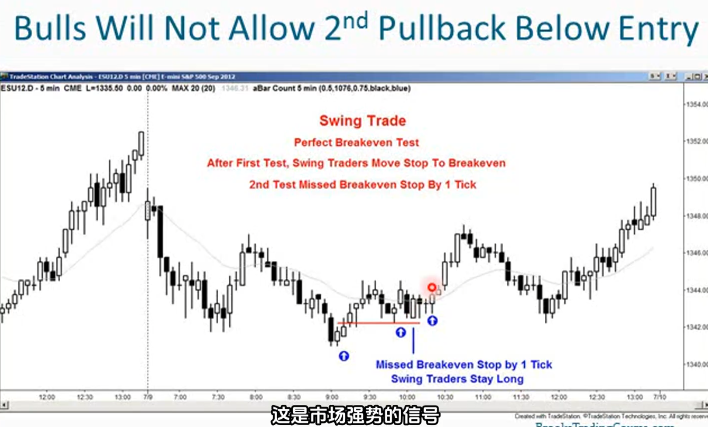
31. 在交易区间内进行超短线交易：
    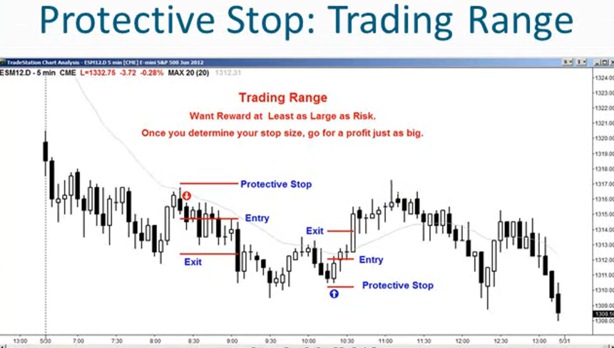
32. 你认为你的判断是正确的，概率能达到90%：
    - 如果你在强劲的趋势中，设置了限价单止盈，市场触及你的限价单，然后停顿或回调了1-2个价位，你的限价单一直没有成交。在这种情况下，你应该直接平仓止盈
    - 否则对你来说，盈利才1-2个价位，但止损很远，这并不划算，只有在90%概率时才能继续持有多头仓位，等待止盈限价成交

