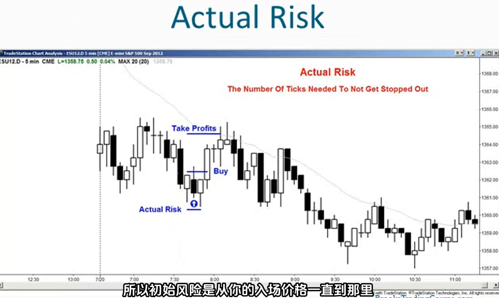

1. 始终假设概率在40-60%之间
2. 当一笔交易看起来不错时，假设它有60%成功可能性。这种情况下，至少需要和风险一样大的回报才能实现盈利策略
3. 最坏的情况是，概率只有40%。这种情况下，需要至少两倍于风险的回报才能实现盈利策略
4. 交易机会的定义：
    - 我觉得是明显的好机会，60%盈利概率
    - 我觉得还行，但我不确定，50%盈利概率
    - 我不知道，但我理解背后的交易逻辑，但我觉得可能没那么好，40%盈利概率、
5. 风险假设：
    - 大多数时候会将初始止损设置在信号K的下方
    - 一旦交易朝着对自己有利的方向发展，调整止损位确定实际风险是多少
6. 确定最小获利目标：当你犹豫不决时，在2倍实际风险处获利了结
7. 当你不确定在哪里获利了结时，就以2倍实际风险作为目标，这是实现盈利的最低标准
8. 你应该始终设定一个至少和新的较小风险（实际风险）一样大的目标
9. 一般来说，让佣金占盈利的比例控制在约5%
10. 当初始2倍盈利的风险过高时
    - 这在交易区间中很常见
    - 将目标盈利降低到实际风险的2倍，不要使用初始风险，使用实际风险然后调整你的目标
    - 如果概率足够高，可以在达到1倍实际风险时离场
    
11. 