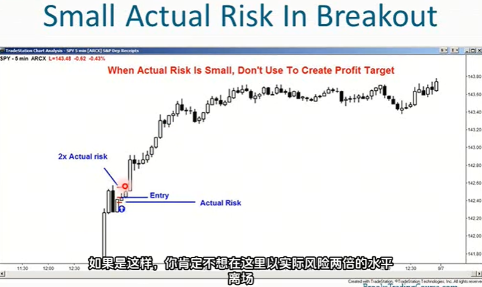
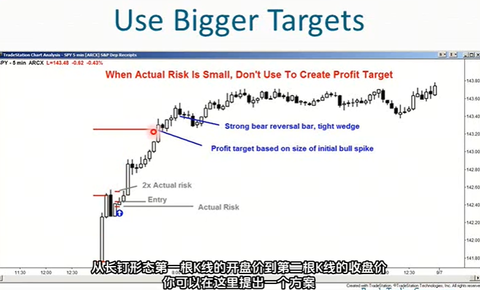
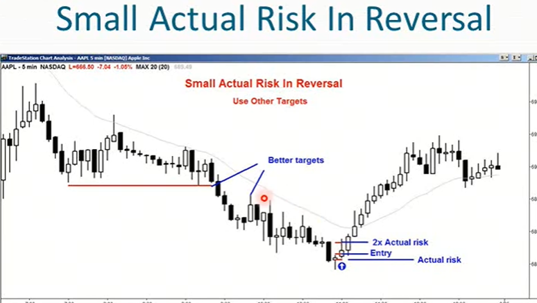
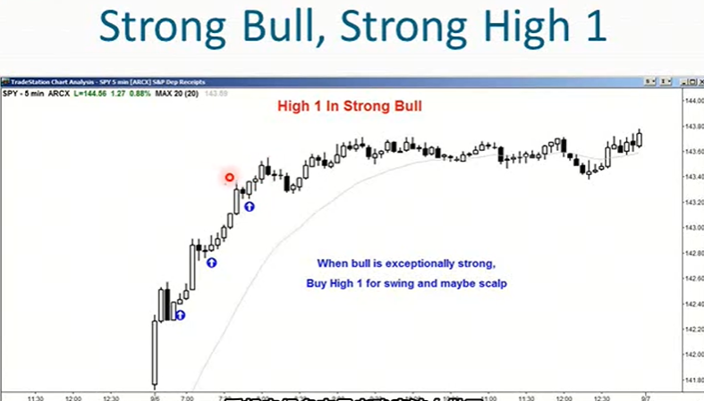
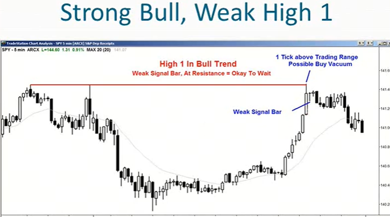
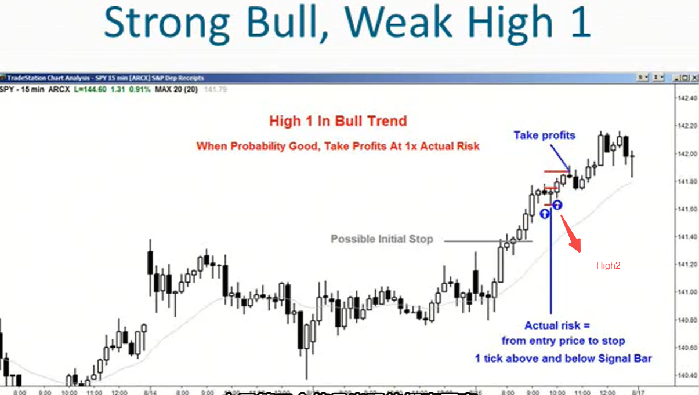
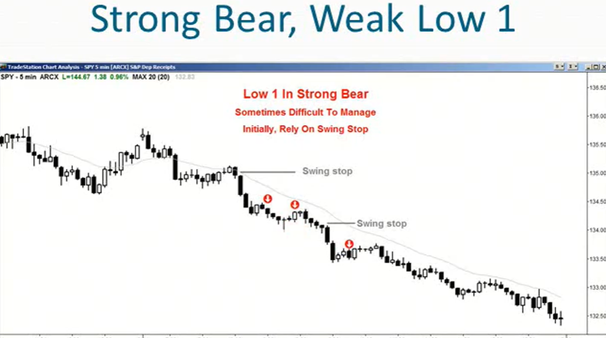
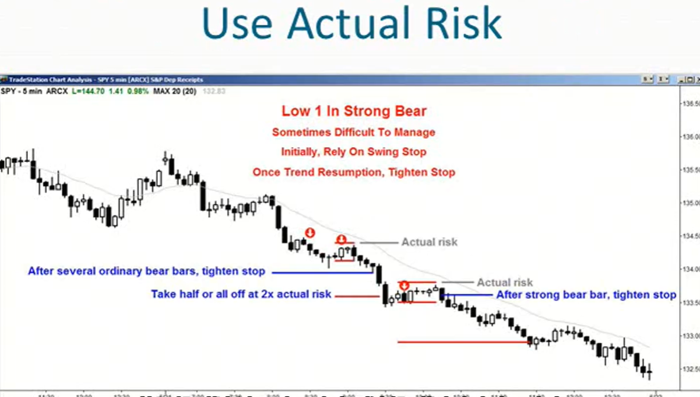

1. 始终假设概率在40-60%之间
2. 当一笔交易看起来不错时，假设它有60%成功可能性。这种情况下，至少需要和风险一样大的回报才能实现盈利策略
3. 最坏的情况是，概率只有40%。这种情况下，需要至少两倍于风险的回报才能实现盈利策略
4. 交易机会的定义：
    - 我觉得是明显的好机会，60%盈利概率
    - 我觉得还行，但我不确定，50%盈利概率
    - 我不知道，但我理解背后的交易逻辑，但我觉得可能没那么好，40%盈利概率、
5. 风险假设：
    - 大多数时候会将初始止损设置在信号K的下方
    - 一旦交易朝着对自己有利的方向发展，调整止损位确定实际风险是多少
6. 确定最小获利目标：当你犹豫不决时，在2倍实际风险处获利了结
7. 当你不确定在哪里获利了结时，就以2倍实际风险作为目标，这是实现盈利的最低标准
8. 你应该始终设定一个至少和新的较小风险（实际风险）一样大的目标
9. 一般来说，让佣金占盈利的比例控制在约5%
10. 当初始2倍盈利的风险过高时
    - 这在交易区间中很常见
    - 将目标盈利降低到实际风险的2倍，不要使用初始风险，使用实际风险然后调整你的目标
    - 如果概率足够高，可以在达到1倍实际风险时离场
    
11. 当实际风险非常小时该怎么做？
    - 不要根据实际风险来调整目标，因为对于市场状况而言，差别很小
    - 必须用其他方法来确定何时开始部分获利
    - 可以根据初始风险来部分获利、如果概率很高，达到一倍初始风险就开始获利了结
    - 如果概率很高，看起来很强劲，可以设置2倍初始风险或根据支撑位和阻力位进行获利了结
    - 并非基于实际风险或初始风险决策，而是基于价格走势
    
    
    
12. 假设出现强劲的趋势，会看到High1和Low1，会存在一些疑问：
    - 也许之前有了一根K形成了最终旗形，也许信号K是一根小十字星，你会怀疑市场是否开始形成一个窄幅交易区间
    - 所以在牛市趋势中会出现High1弱势买入形态，在熊市趋势中会出现Low1弱势卖出形态
    - 对于上述情况，可以根据实际风险设定盈利目标
    - 如果形态不清晰的话，设置2倍基于实际风险的盈利目标
    - 在牛市阻力位的弱势信号k，High1并不足以成为买入的理由，该等一等
    - 当概率很大时，可以一次性平仓以应对实际风险
    
    
    
    
    
13. 
