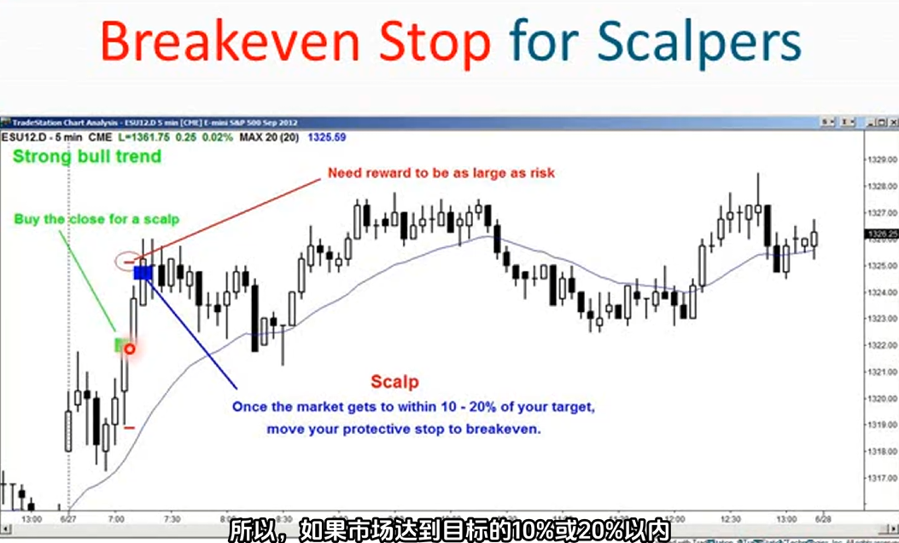
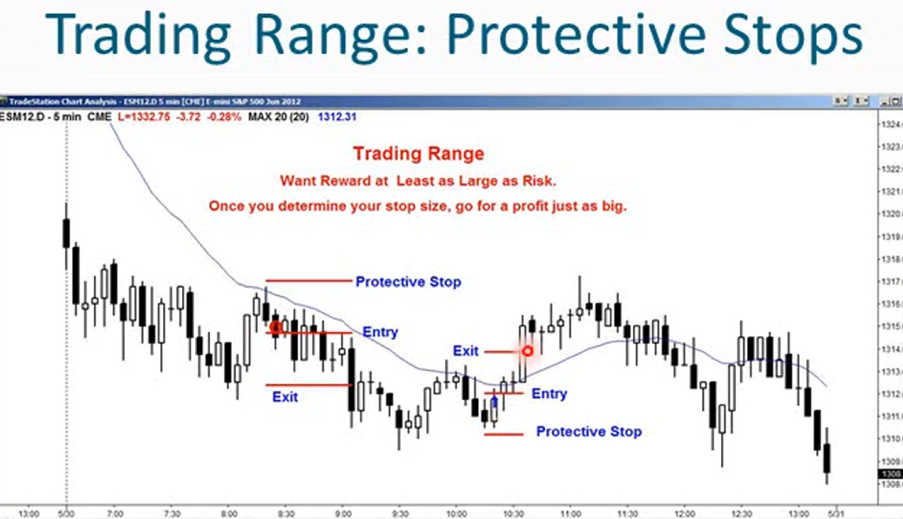

1. 超短线意味着小的盈利目标，通常交易者不允许回调，只允许小幅回调
2. 超短线交易者的预期收益必须为正，追求小利润、高盈利、高概率的交易
3. 交易核心原则：确保回报至少和风险一样大
4. 超短线交易需要高概率的交易机会，并且设置不超过目标的止损，一旦确定了止损的位置，必须确保目标至少和止损一样大
5. 如果市场接近你的目标，就将止损移动到盈亏平衡点，即使被止损出局也不会为此担忧
6. 不要冒10个点的风险去赚取2个点的利润，盈利目标至少要和风险相当
7. 对于剥头皮交易，可以采用资金止损法（固定的tick数）和价格行为止损法
8. 基于价格行为的剥头皮止损：
    - 假设在牛市中，信号K是一根牛市反转K
    - 考虑将止损设置在信号K下方一个tick处
    - 根据信号K的高度或信号k上方某个缺口来测量移动目标（很少有人这么干）
    - 大多数交易者会使用价格行为止损或固定资金止损
9. 如果市场达到目标的10%或20%以内，将止损位移到盈亏平衡点
    
    