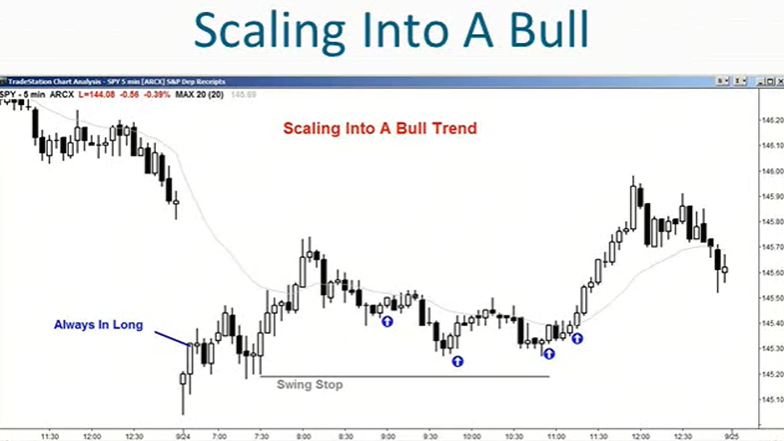
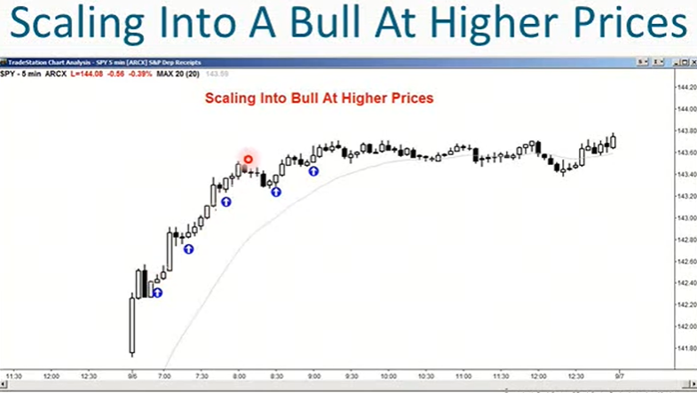
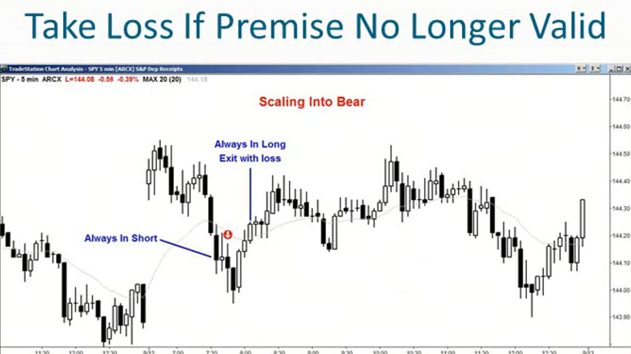
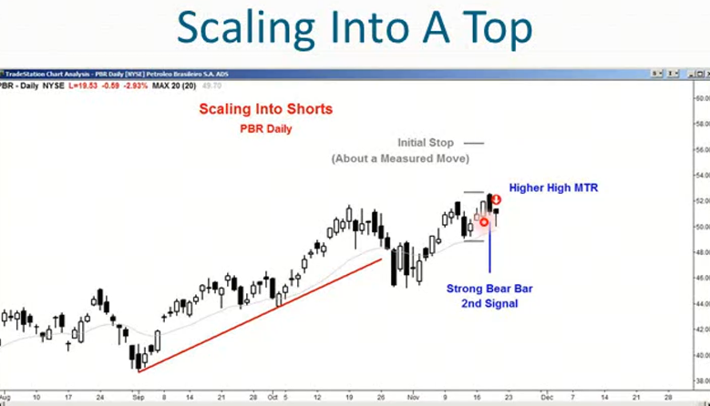

1. 逐步减仓交易：逐步增加你当前的头寸，并且你有信心这笔交易很快会朝着对你有利的方向发展，尽管你还不确定市场是否已经朝着你预期的方向移动 
2. 逆势加仓-假设你处于一个牛市趋势中：
    - 市场出现回调，并出现买入信号
    - 你根据买入信号进行操作，但你不确定回调是否已经完全结束，但你愿意依靠牛市尖峰底部下方的摆动止损
    - 市场朝着对你有利的方向走了1-2根k，然后跌破了你的入场价格，也跌破了信号k的低点
    - 由于你的止损设置在尖峰底部下方，假设止损比当前价格低几个点
    - 你仍然持有仓位，因为你相信你的前提是正确的，即：牛市趋势仍然完好
    - 你可以做的是：如果出现另一个信号，位于交易的价格水平，是一个多头反转k
    - 你可以加仓，这是一种逆势加仓的方式
 3. 趋势加仓-假设你处于一个空头趋势中：
    - 你已经部分获利了结，并且继续持有部分仓位进行波段操作
    - 而市场回调，并给出了类似Low2的做空信号，你可以加仓，建立超短线仓位
    - 当空头趋势恢复时，你对超短线仓位进行平仓，进行持有波段仓位
    - 当你增加超短线仓位时，你在波段交易部分已经盈利，你只是想再做一笔超短线交易
    - 如果市场继续下跌，你仍然持有波段交易部分的仓位，并且可以再次建立超短线仓位
4. 如果你打算逐步加仓进行超短线交易，必须保证每次交易的风险资金总额相同
    - 你必须进行极小额交易
    - 你需要设置较宽的止损
5. 逐步加仓交易不适合新手，只有持续盈利的交易者才应考虑将其纳入交易方法
6. 大多数交易者不应考虑该方法，新手应该有简单的规则和简单的计划，并且尽可能进行少的决策，尤其是持仓期间
7. 牛市趋势中的回调，随着回调的幅度越来越大，有很多逐步建仓的方法
    1. 当你考虑入场时，首先决定摆动止损位在哪里
        - 假设你每次交易通常使用20美分止损，确定摆动止损位距离你想入场的位置有40美分
        - 你看到了一个买入机会，但摆动止损位在下方40美分处
        - 你应该做的是，首次入场时交易1/4的仓位（如果你不采用逐步加仓法，且止损幅度翻倍，你应当交易1/2仓位，若你被止损出局，损失的是正常亏损额）
        - 如果市场持续下跌，你的持仓前提仍然成立，那么你可以：
            - 方法1：在牛市回调50%处，以限价单再次买入1/4仓位
            - 方法2：在第二个信号k处，继续买入1/4仓位（第二个信号可能低于第一次入场价位，或者相同，甚至略高）
    2. 如何止损
        - 无论出现什么情况，一旦触及摆动止损位，就全部平仓离场
        - 如果你认为你的买入前提不再成立，也立刻全部平仓离场
            - 例如，你买入认为这是一个强劲的趋势，但现在演变成一个盘整区间，而且你认为可能跌破摆动止损位后反弹，不要等待摆动止损位平仓，而是立刻平仓
        - 如果你看到一个有说服力的卖出信号，也直接全部平仓离场（特别是那种足以使市场一直处于空头状态的信号）    
    
    
    
8. 在交易中逐步加仓：
    - 必须有一个交易计划，加仓多少次，什么时候加仓，每次加仓规模多少，每次都加相同仓位还是后续逐步加大仓位？
    - 可以在交易对你不利时加仓，也可以在交易对你有利时加仓
    - 假设你进行一次摆动交易而买入，市场如你预期上涨时，可部分获利了结。市场稍有回调，而你仍有盈利，可恢复原有仓位。在已有盈利的仓位上进行加仓
    - 假设你试图抓住牛市回调的终点，但市场走势与你预期稍有背离，仍坚信牛市将会延续。便在低于初始交易的价格上进行加仓。这是在亏损仓位上加仓
9. 加仓方式有很多种：
    - 牛市中买入回调，且触发了交易信号，你进行买入
    - 接着市场跌破信号k低点，又形成另一根信号k（第二个信号），可以在此处买入。
    - 假设市场再次下跌，出现了第三个信号，你也可以在此处买入
    - 你还可以按照固定的跳动点数进行加仓，买入后，在计划在价格每下跌一个点时继续加仓
10. 如果你计划逐步建仓，但交易并未与你的预期相悖，而是立即朝着有利方向发展，你就按常规交易方式进行管理。如果你在最初几分钟内就达到了盈利目标，就带着利润离场
11. 逐步建仓应对反转行情：
    - 如果他们在抄底，他们可以买入
    - 如果价格进一步下跌，他们就再买入一些
12. 逐步建仓应对趋势行情： 
    - 如果市场正在下跌，而他们打算做空
    - 若行情进一步背离他们，他们就再增加一些空仓，建立更大的头寸
    

    