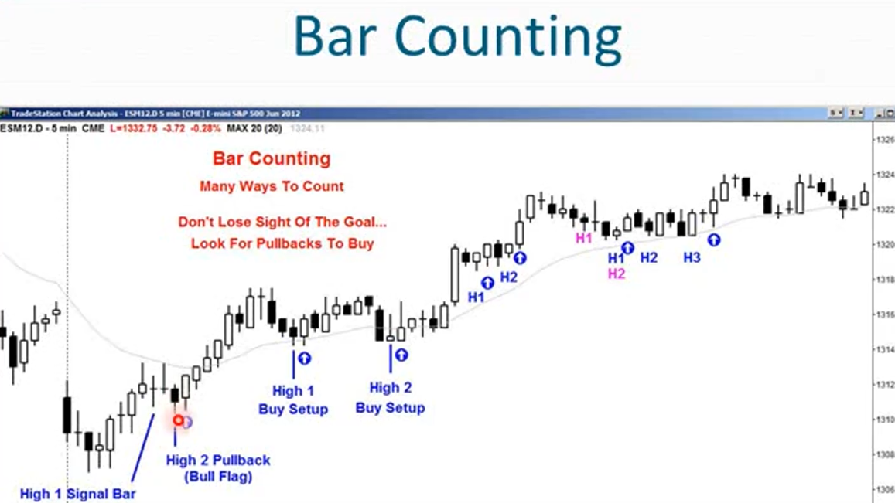
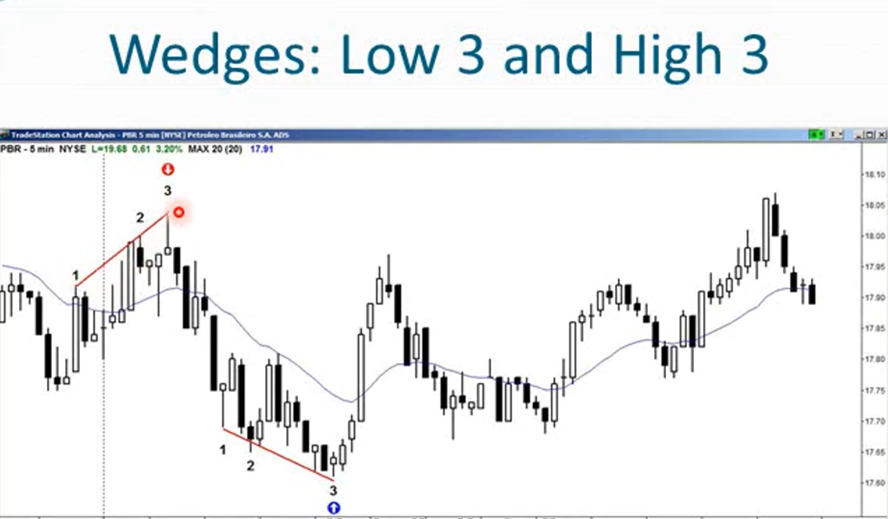
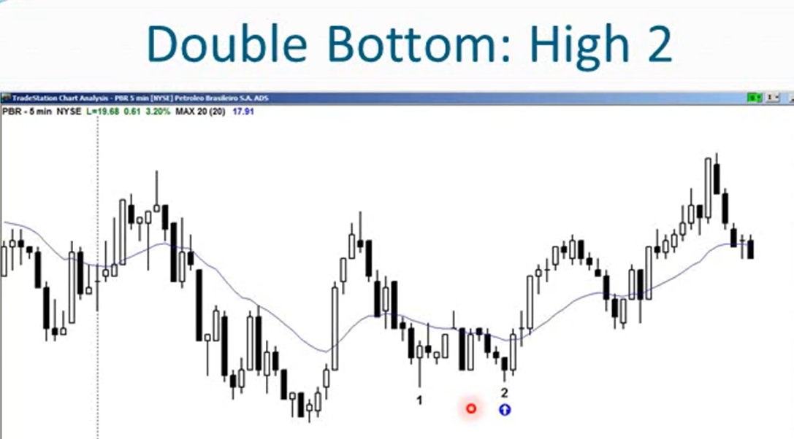
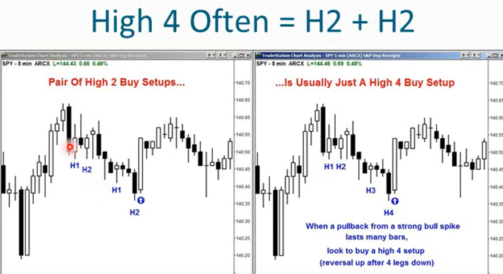
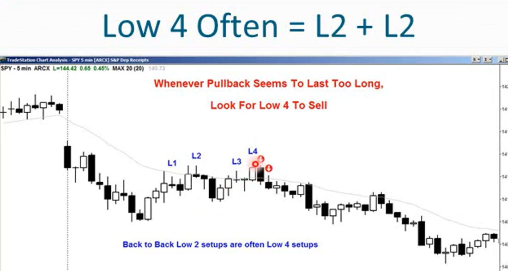
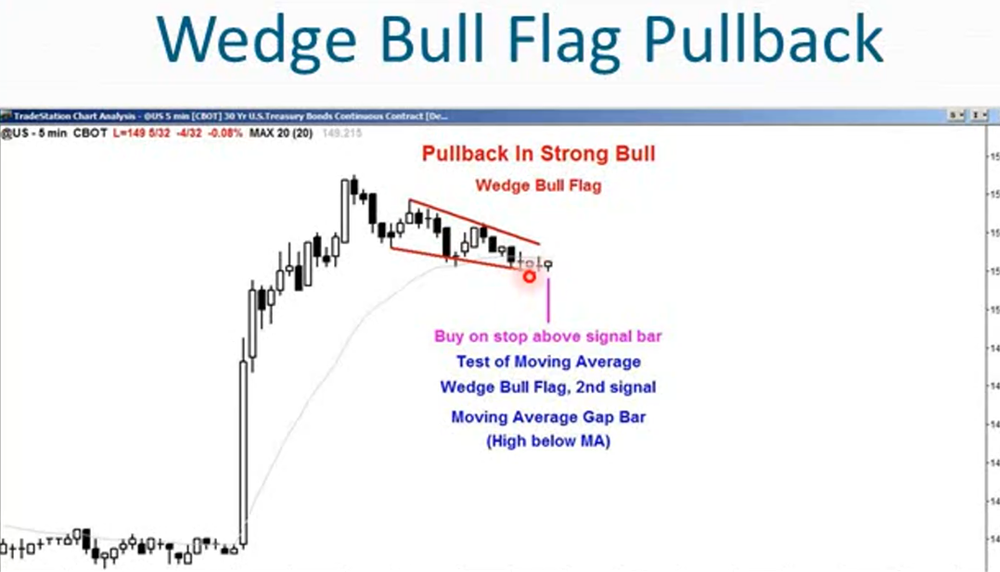
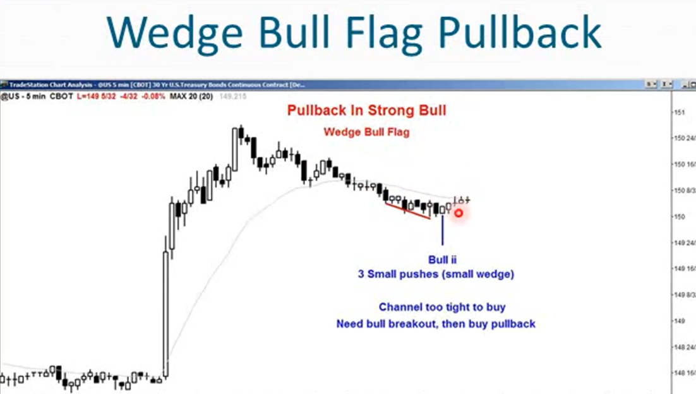
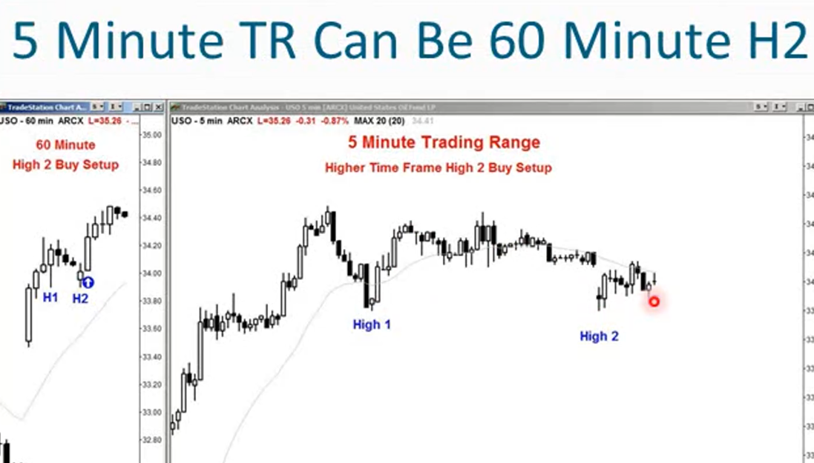
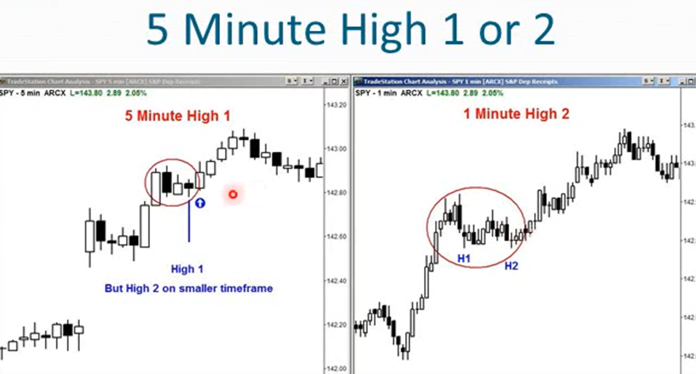
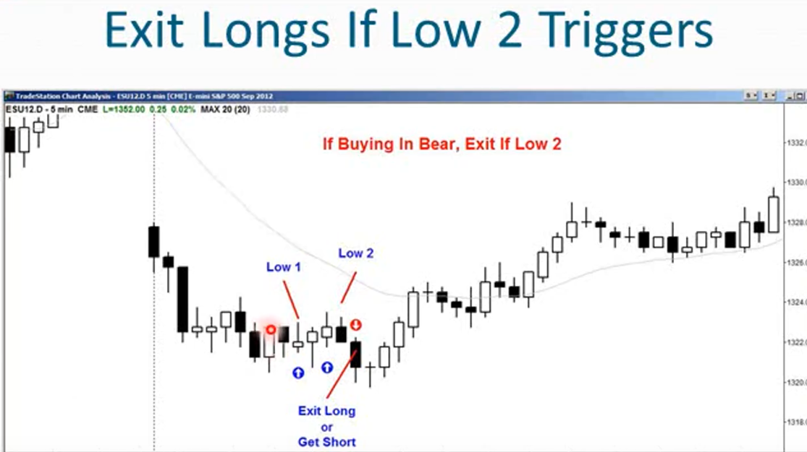

1. PullBack回调是趋势一次停顿，趋势通常会继续，回调提供了高概率低风险的回调机会
2. K线计数是用来寻找回调的一种方法
3. 强劲的趋势中，回调往往只和多头走势反向持续一到两根K线，可能是一根小内包，可能是一根裸K线，可能下跌2-3根K线
4. 在强劲的多头趋势中，在多头趋势恢复之前，第一次回调通常只有一波下跌
5. 在弱势趋势中，交易者通常等待2-3个波段的回调，很少会出现4波下跌
6. ABC整理是有2波回调的一个例子，三角形整理是3波回调的一个例子
7. 回调何时结束？当前K线的最高价比前一根K线的最高价高即可，意味着这波下跌结束
8. 通过K线计数，尝试恢复趋势的次数，这和回调的波数一样
9. 在ABC整理中，B浪下跌后市场试图反弹，那是一个一级高点，市场再次下跌形成第二段下跌行情，当第二次试图再次回升时就是二次高点买入形态
10. 在牛市趋势或交易区间中呈横盘后下跌的市场走势，如果当前K线或下一根K线的高点超过了当前K线的高点，当前K线成为一级高点信号K线（一级高点买入形态/一级高点反转），突破该高点的K线就是一级高点入场K线，这就是入场交易K线。在信号K线高点上方一个价位处设置买入限价单
    - 一级高点信号标志着横向或下跌走势的第一段结束，并可能时强劲牛市趋势中回调的结束，也可能是一个巨大回调（如三角形或楔形看涨旗形中）的第一段下跌的结束
    - 如果市场在一级高点信号后继续横盘或下跌，下一次出现一根K线突破前一根K线高点的情况就是二次高点反转，也就是结束了回调的第二浪
    - 利用一级高点信号或二级高点信号交易的目的是，在强劲的牛市趋势中寻找买入机会
    
    - 牛市趋势途中如果在二级高点信号处继续下跌，第三浪以高位三反转结束，第四浪以高位四反转结束。此时认为属于无趋势状态，必须放弃寻找趋势恢复的机会
11. 如果不是在牛市趋势中，而是在无趋势状态的交易区间内或熊市中横盘向上，则相同的逻辑

13. 三推形态，三推可能成为楔形的作用，即便没有楔形的形态。在交易区间顶部做空低位三推形态，在交易区间底部做多高位三推形态。
15. 双顶和双底形态
    - 所有的双顶形态都是低位二档形态（每当遇到双顶形态都看作低位二档形态）
    - 所有的双底形态都是高位二档形态（每当遇到双顶形态都看作低位二档形态）
    - 狭窄的交易区间会看到大量双顶双底形态，不要入场，除非市场环境合理
    - 在交易区间或多头趋势中寻找高位二档买入机会
    
16. 回调会持续很长时间，会让你怀疑回调是否已经转为反向趋势
    - 高点3之后寻找高点4，低点3之后寻找低点4
    - 一般来说高点4或低点4趋势会很好的恢复
17. 和诺回调都是通道中进行的，而通道通常以四浪结束
    - 上升趋势中的回调，形成高点4然后反弹
    - 下跌趋势中的回调，形成低点4然后回撤
18. 背靠背高2或低2（高4或低4）
    - 高4形态经常是一对连续的高2形态，中间夹带着一次突破
    - 低4形态经常是一堆连续的低2形态，中间夹带着一次突破
    - 通常交易的点在高4或低4时，成功率更高
    
    
19. 每次出现突破时，寻找下一次回调，然后重新进行计数
20. 回调持续扩大的情况，如果在牛市中出现回调形成能第四个高点，而市场继续下行，回调的趋势可能转变为相反方向的趋势。

21. 低位1和低位2适用于交易区间或熊市趋势中的做空操作，而非牛市趋势
22. 交易时要考虑更高的时间框架，有时市场在5分钟图表上可能处于交易区间，持续数小时。但在60分钟图标的形态上可能只是在形成高位2的买入形态，此时可以在5分钟的图表上发现更早的入场点，比在60分钟图标上的入场点更早

23.  交易时也要考虑更低时间框架的情况，有时市场会在5分钟图标上形成首次触及高位（高点1）的形态，但是它可能在一分钟图表上形成一个高点2形态

24. 为什么高位2浪形态和低位2浪行为有效？
    - 因为在逆势交易时，大多数交易者会允许市场和自己的预期相悖一次，但不会允许出现第二次
    - 高位二浪回调是恢复牛市趋势的第二次尝试，如果做空失败大部分看跌者都会平仓离场，而看涨者如果处于空仓状态他们会以相同价格买入。所以看涨者买入做多，而做空者会买入以平仓空头头寸，所以就没人再抛售了，市场必须上涨才能找到卖家

Low2后的那根大阴线，非常适合超短做空

