1. 市场无时无刻不处在通道中
2. 通道被两条线所包含
3. 任何包含图标某一个部分的两条线都是一个通道，这些线可以是平行的、收敛的、发散的
4. 通道可以像牛市趋势上升，也可以像熊市趋势下降
5. 通道是一种较弱的趋势，也可能很强劲，但不如突破强劲
6. 趋势要么非常强劲，要么就是通道
7. 对于多头通道来说，下方的线是多头趋势线，上分是多头趋势通道线
8. 一旦你看到趋势线或趋势通道线，市场就处于通道中。即使看起来并不像常规那样的通道，甚至完全看不到通道，但总会有一条相对的线
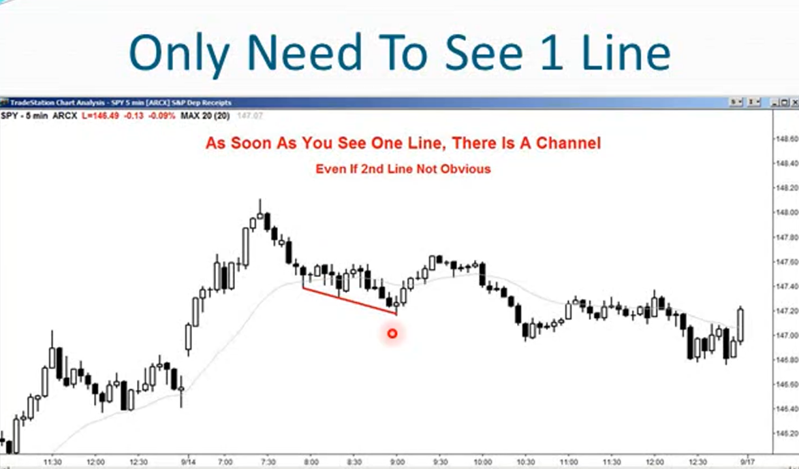
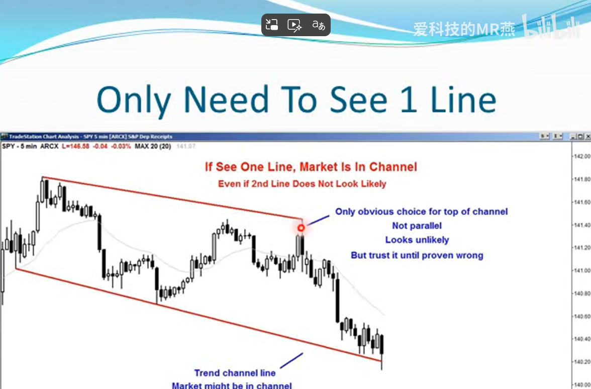
10. 在每次市场突破通道线或通道趋势线失败反转回通道内部时，要利用突破通道极值点，重新绘制通道线。通道往往会变的更平缓，更水平，范围更广，通道线之间距离更远。最终通道会演变成一个交易区间
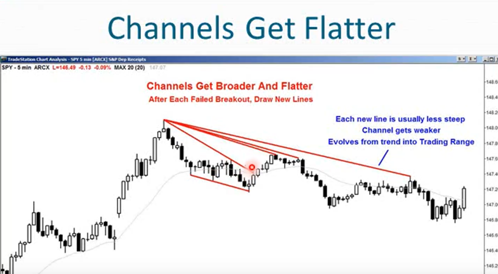
11. 当市场到达通道的顶部或底部时，将会为交易者提供交易机会，无论哪种都能找到回报远大于风险的交易机会，建议在反转点寻找入场机会，然后预期市场会测试通道另一侧，而不是盲目追逐突破
    - 市场可能突破并进入突破阶段（强劲趋势阶段）
    - 市场可能反转
12. 市场是一个不会停止的循环
    - 趋势突破
    - 趋势通道（通道通常会演变成为交易区间的一部分）
    - 交易区间
    - 向另一方向突破（这样又回到了趋势阶段）
13. 通道是一种混合阶段，是强势趋势阶段/急涨阶段/突破阶段和交易区间阶段的过度形态
14. 大多数上升通道（即向右上方延申的通道）会向下突破，应该始终被视作做看跌旗形，即便是最强劲的上升通道也和看跌旗形相同，必须预计到它最终会向下突破
15. 大多数下降通道（即向右下方延申的通道）会向上突破，无论他们是否属于趋势的一部分，都应该始终视为看涨旗形，因为大多数最终都会向上突破
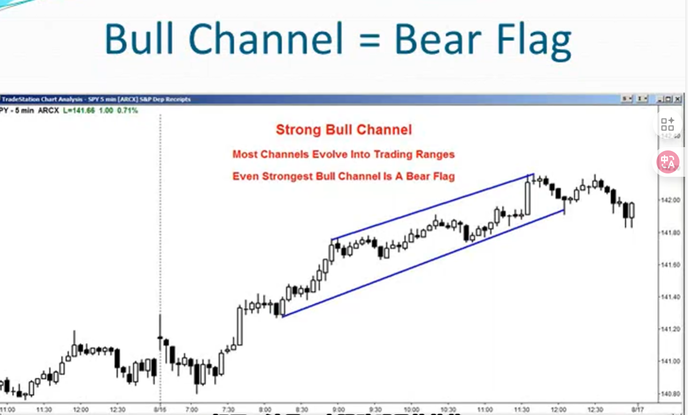
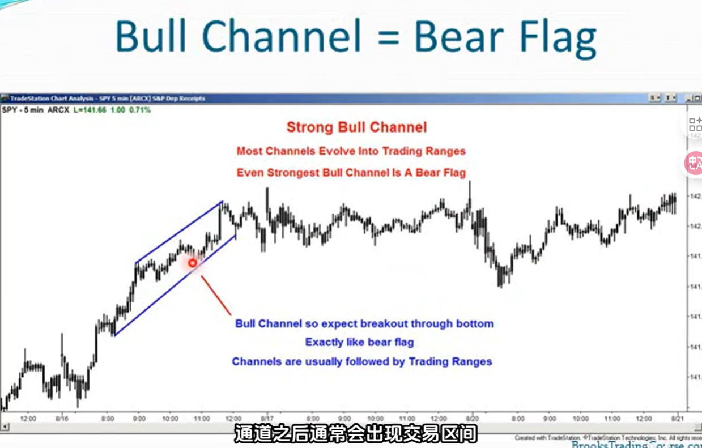
16. 通道最终会演变成为交易区间的一部分，交易区间最终会演变成趋势
17. 在趋势中，市场一开始会以尖峰或突破的形式发展，然后出现回调，会有一些双向交易发生，接着进入通道阶段
18. 在多头行情早期，多头正在持仓等待波段机会，他们预计市场将会有更大的涨幅。在通道初期，多头仍预计市场将有更大的涨幅，他们主要进行波段交易持仓等待大幅波动。当通道持续了10，20，30根K线后，多头开始担心趋势可能不会持续太久，趋势可能所剩不多，开始提前获利了结。然后他们开始买入，然后进行超短线交易离场，导致小幅回调，每次价格上涨，他们就卖出。突然之间，你会发现越来越多的K线顶部带有上影线，价格走势也更加横向波动。空头开始意识到，如果他们卖出，可能会有获利机会，他们开始超短线卖出操作，于是他们开始小幅下探卖出，再回购获利。多头也是如此，在进行超短线操作离场后，会在回调时，重新进行超短线操作，结果导致价格再次上扬。最终会形成某种顶部形态，如主要趋势反转，然后多头停止操作，回调时不再买入，空头也停止获利了结，而是继续持仓，他们开始波段操作，这时就可能出现趋势反转。起初多头会从波段操作变为超短线操作，而这通常是牛市趋势、牛市通道向盘整区间转变的开始
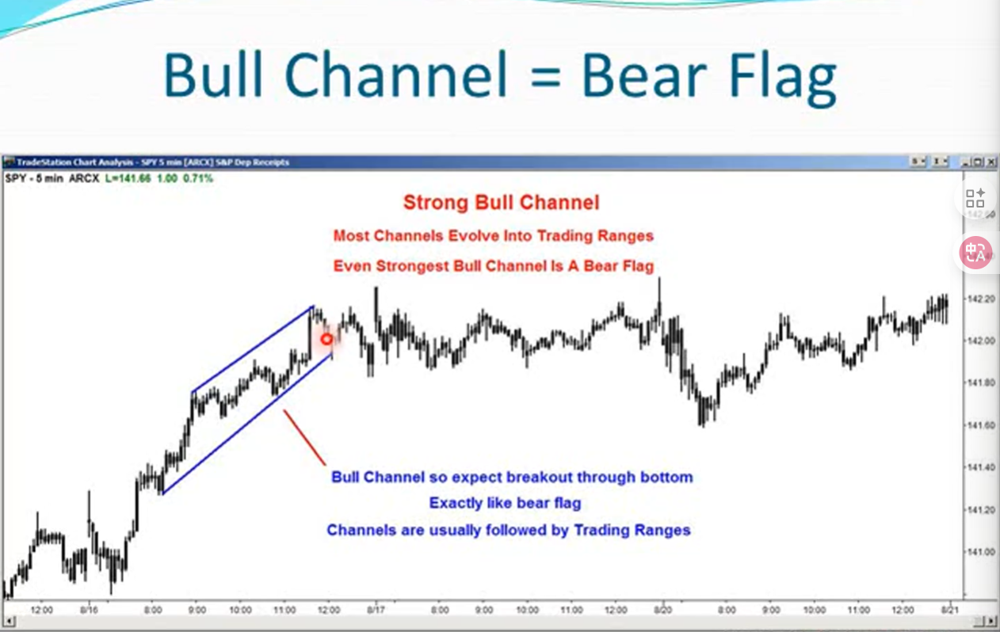
19. 在多头趋势变为交易区间时，多头对行情上升信心减弱时，他们会开始更多的scalp剥头皮交易，而不是持仓较久的波段交易。空头看到价格上涨乏力，有利润空间时，他们会开始短线卖出（sell for scalps），从局部波动中获利
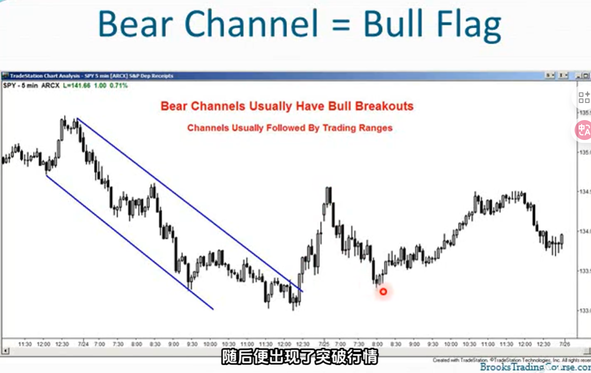
20. 通道的趋势反转突破很少成功
    - 多头通道很少会出现成功的向上突破，即突破通道上沿
    - 空头通道很少会出现成功的向下突破，即突破通道下沿
    - 更多是失败进入盘整或反转
21. 通道的顺势突破往往是假突破
    - 通道的顺势突破通常会在5根K线内失败
    - 市场会反转回到通道内
    - 并当遇到假突破时，反转通常会一路下行到通道另一侧
22. 通道的顺势突破，通常是行情从趋势过度到交易区间，顺势突破往往不是趋势延续，而是趋势的最后冲刺阶段，是一次加速趋势失败的尝试，最终会导致趋势结束，市场进入震荡整理。这类突破失败后，反转交易往往比较可靠，价格通常会下跌到通道的另一侧
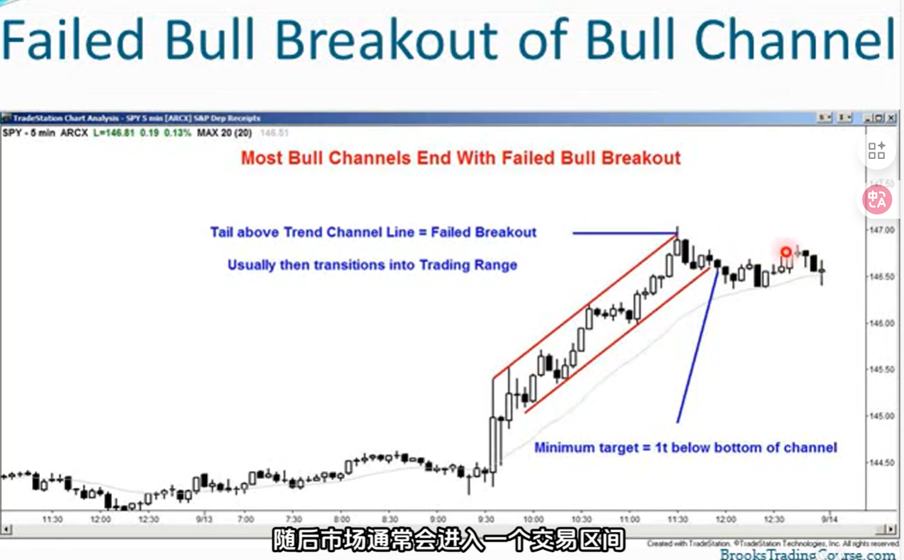
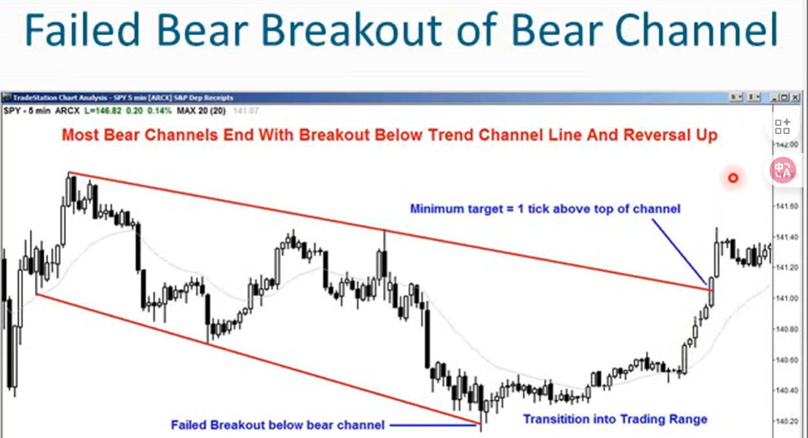
23. 当你在上涨趋势中看到一个没有明显趋势的通道时，它往往不是一个新的下降趋势，而是牛市旗形的整理阶段
24. 很多时候，两条通道线并不平行
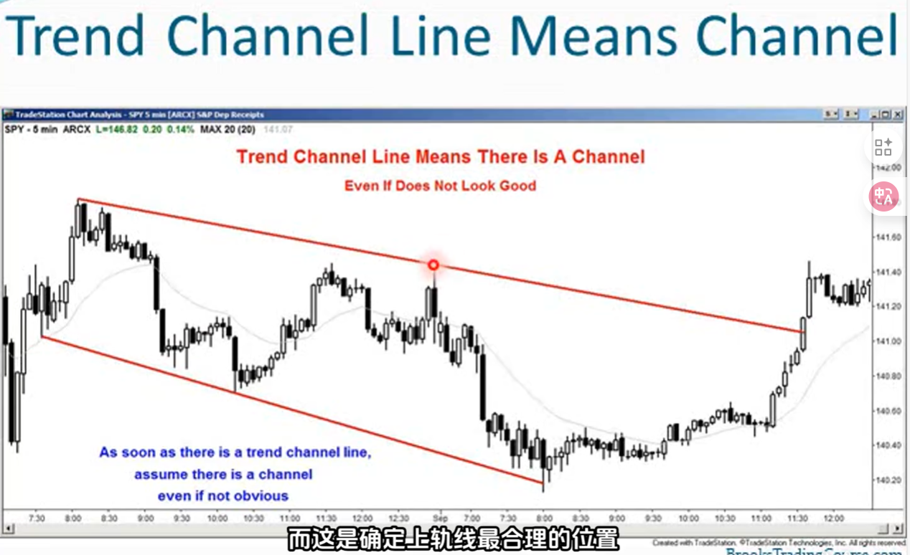
25. 通道小到可能只包含2根K线，也可能很大包含整个图表
26. 通道也可能非常宽泛，中间有很多K线上下波动，类似于交易区间。也有可能非常陡峭，非常狭窄和突破形态类似
27. 通道的分类
    - 水平通道（也就是交易区间，交易区间也是通道）
    - 倾斜通道（例如，趋势通道和楔形），两条平行的倾斜线
    - 扩展通道（例如，扩张三角形），喇叭状，上下轨向外发散
    - 收缩通道（例如，三角形和楔形），上下轨向内收敛
28. 市场宗师处于很多通道中，大多数只能在其他时间框架内被发现
29. 一个时间框架内明显的通道，在另一个时间框架内，可能只是一个平淡通道的一部分
30. 每个趋势要么处于急涨急跌阶段，要么处于突破阶段，要么处于通道阶段
31，急涨急跌后的突破，呈现单边交易，没有回调。然后就会进入通道阶段，此时双边交易增多，且出现回调。较少出现的情况是，K线有轻微重叠但无实际回调（微通道）
32. 牛市趋势中回调的最低要求：
    - 当前K线的低点低于前一根K线的低点，当前K就是回调（这可能是单根K线的回调，也可能是大幅回调的开始，会持续多根K线）
33. 熊市趋势中回调的基本要求：
    - 当前K线的高点高于前一根K线的高点，当前K就是回调
34. 尖峰（Spike）和突破（Breakout）是两个完全相同的术语，即非常强劲的趋势
35. 每根趋势K线都是一个尖峰，也是一个小趋势，大多数时候，市场最终会横向盘整，成为交易区间的一部分。然而如果尖峰强劲且市场环境合理，它可能会引发趋势
36. 一旦突破开始回调，假设出现多头突破，这就是双向交易的迹象，也表明极速上涨阶段可能即将结束，而通道阶段即将开始。然后通道走完其过程，演变成一个交易区间
37. 回调可能小到一根K线（在非常强劲的趋势中），也可能包含多根K线（弱趋势或交易区间）
38. 如果回调包含多根K线，那么趋势就较弱，可能是交易区间的开始
39. 一旦出现回调，可能开始形成
    - 一个通道
    - 交易区间
    - 另一次极速上涨（情况较少，标志着非常强劲的趋势）
40. 强势通道的最低要求，一系列更高的（高点、低点），更低的（高点、低点）
41. 新手有时很难看出通道，尤其是通道线不明显的时候，但要记住市场总是处在通道中，只要看到趋势线或趋势通道线的任何一条都是在通道中，即便看不到另一条
42. 通道可能很强劲和Spike类似，也可能很弱和交易区间类似。这两者都属于趋势，但是动能会比尖峰阶段弱
43. 强劲的通道仍然属于是一个弱的趋势，没有breakout动能强劲
    - 线条可能会非常陡峭且密集，回调幅度极小
    - 出现这种情况时，在更高时间维度图表上表现是一次spike
    - 当遇到强劲的通道时，应该只顺着趋势方向交易
44. 疲软的通道是一个弱趋势
    - 波动剧烈，形态类似楔形或阶梯形态
    - 通道上下沿间隔较远
    - 通道接近水平
    - 通道行为表现更像一个交易区间，应该双向交易
45. 狭窄tight通道回调幅度非常小呈现出极度的单边走，极端例子：微通道
46. 微通道：一系列K线相互重叠，但没有一根K线跌破前一根K线的低点
47. 狭窄tight通道是最强劲的通道类型
    - 更类似突破走势
    - 在更高时间维度上是尖峰或突破形态
    - 只顺着趋势方向交易
48. 狭窄tight通道回调极小，市场一边倒，卖压极轻，空头仅短暂间歇性掌控局面。其幅度刚好满足通道的定义，而非spike尖峰
49. tight通道和spike区别：
    - 尖峰spike走势几乎没有回调，多头spike走势会直线上升
    - tight通道上行并出现单根K线回调，然后再次上下，又是单根K线回调
50. 当没有回调的通道，称为微通道。有回调的不是微通道
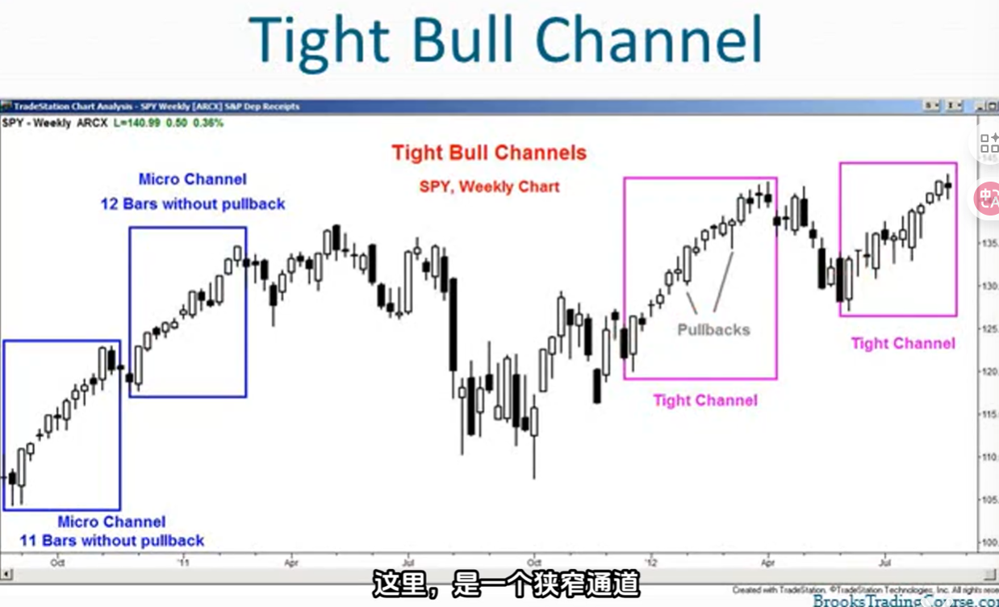
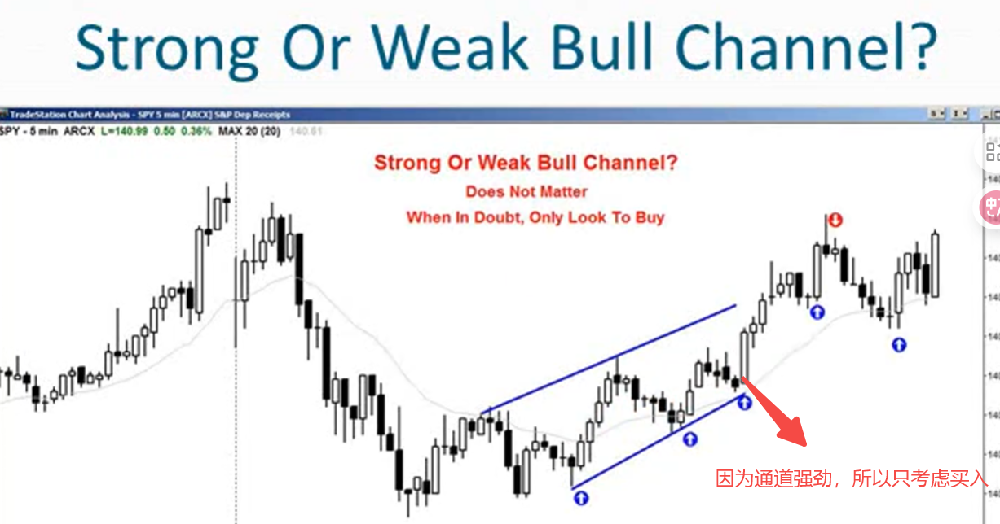
51. 如果是一个weak的通道且波动较大，可以双向交易。如果是强劲的且回调非常小，应该只考虑买入 。无论何时，如果你无法确定行情时，如果行情不够疲软不够双向交易，那就只做买入交易，拿不准时只考虑买入，牛市通道就是牛市趋势。
52. 如果你在想行情是否疲软到足以成功做空，如果需要思考这个问题，那就不要做空，只做买入交易
53.当很难抉择这个交易通道是强势还是弱势的，那就假设是强势的，只进行买入
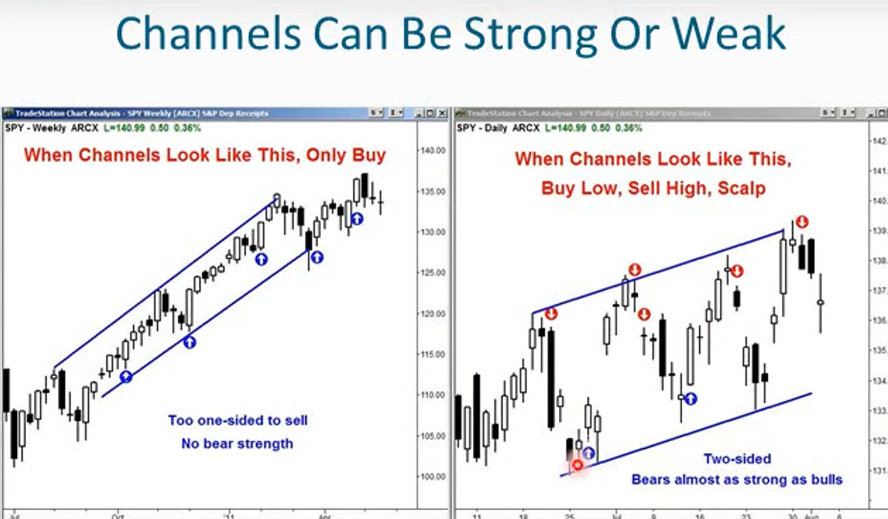
54. 如何识别弱势上升通道
    - K线重叠
    - 当出现一根代表上涨动能的阳线（牛市趋势线）后，接下来的K线未能延续这种强势
    - 许多K线顶部带有上影线
    - 许多K线是阴线
    - 价格频繁出现明显的回调（一根K线低点低于前一根K线）且波动幅度很大
    - 看起来像一个向上倾斜的交易区间
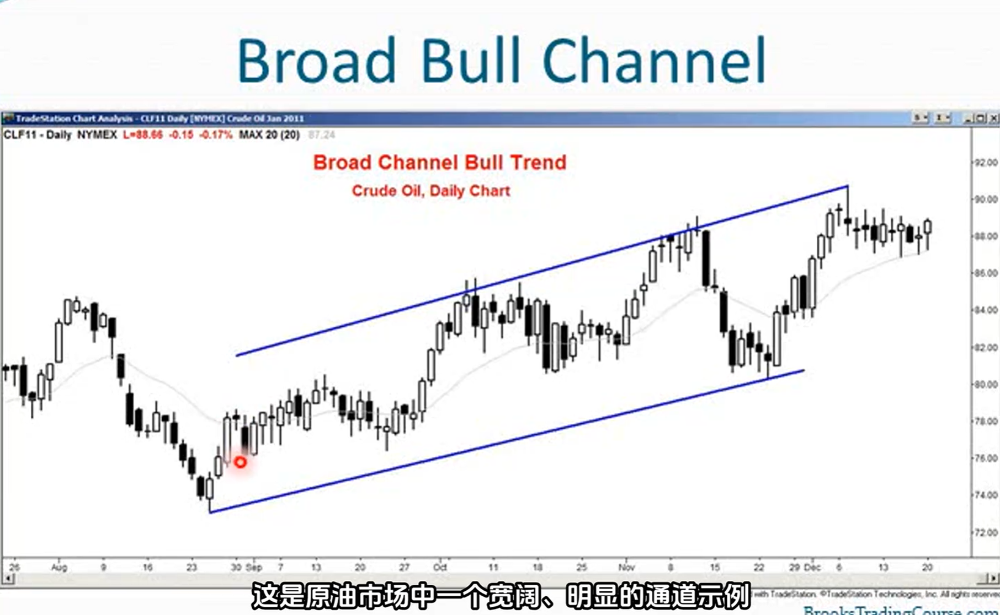
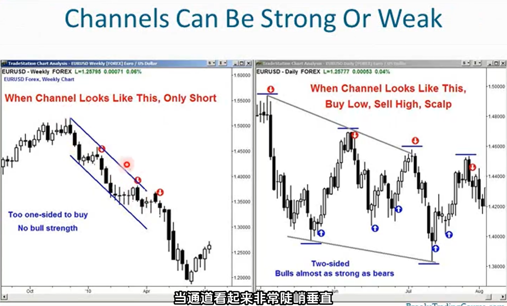
55. 嵌套模式，大模式中包含小模式
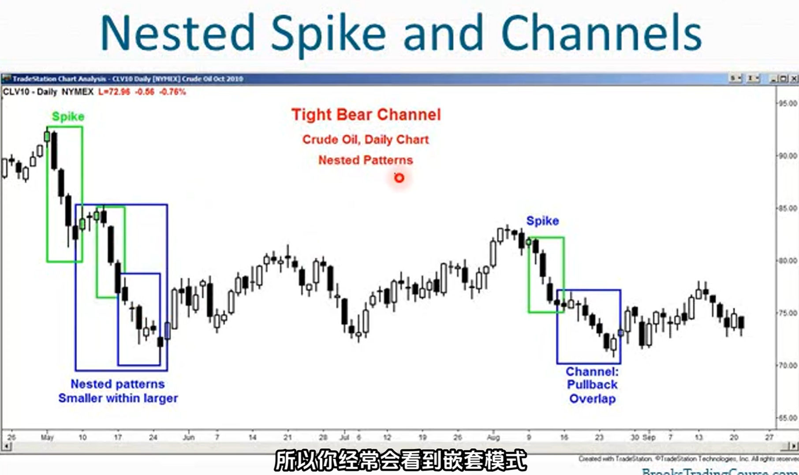
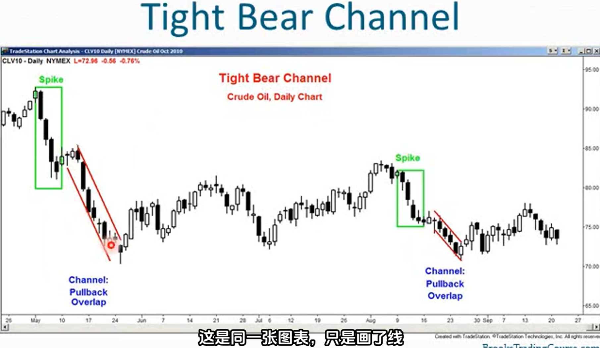
56. 大多数弱势通道最初都是交易区间，所以市场常常处于交易区间内，又处于通道中。并且市场正在从交易区间过渡到通道
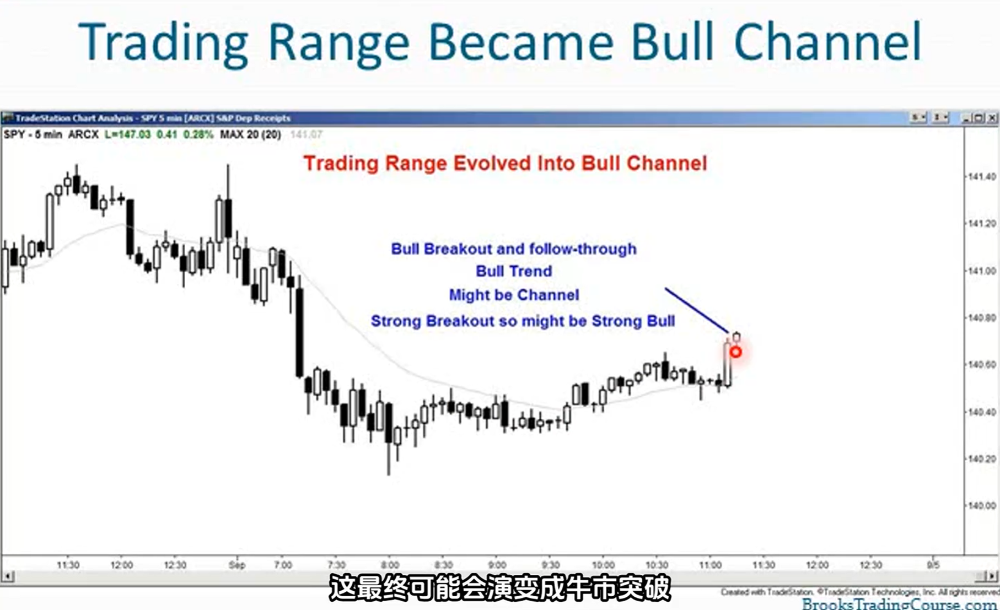
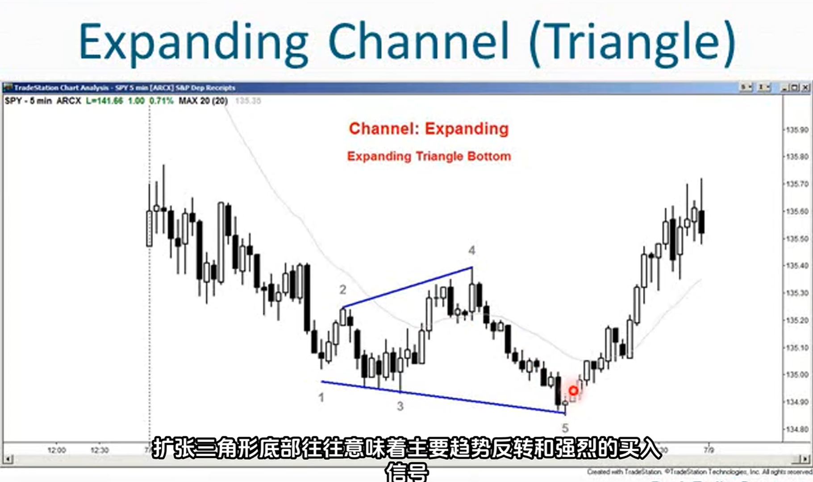
57. 市场中总是存在层层嵌套的通道，甚至反向通道

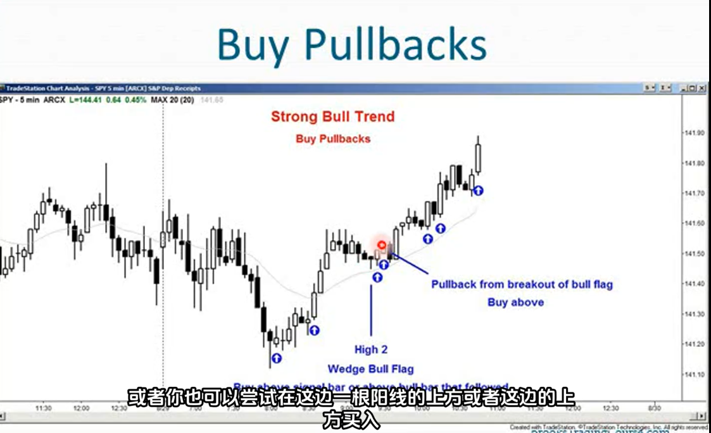
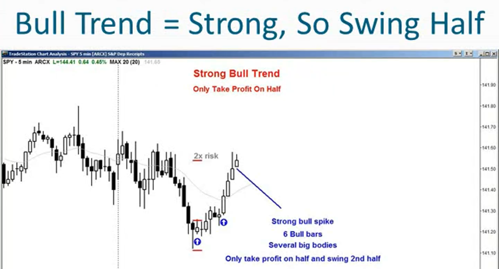
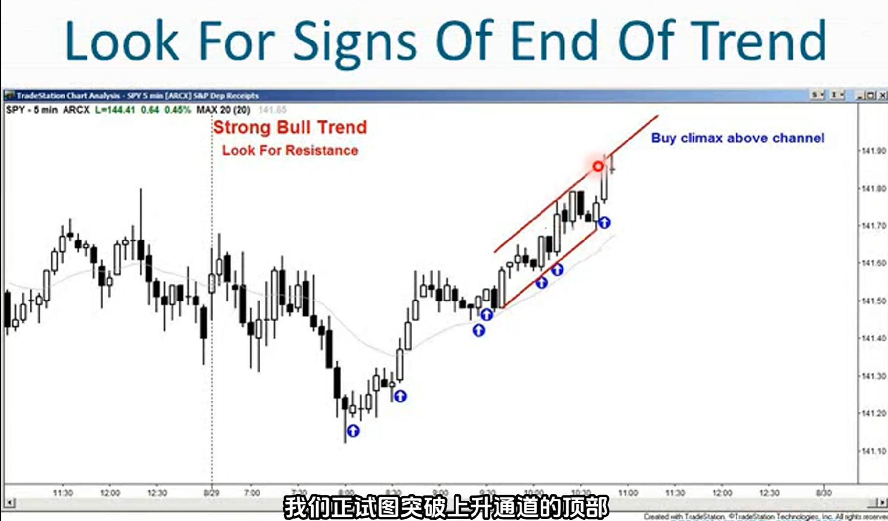
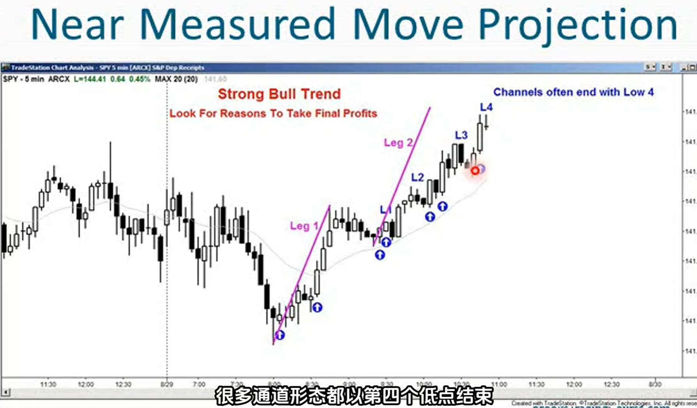
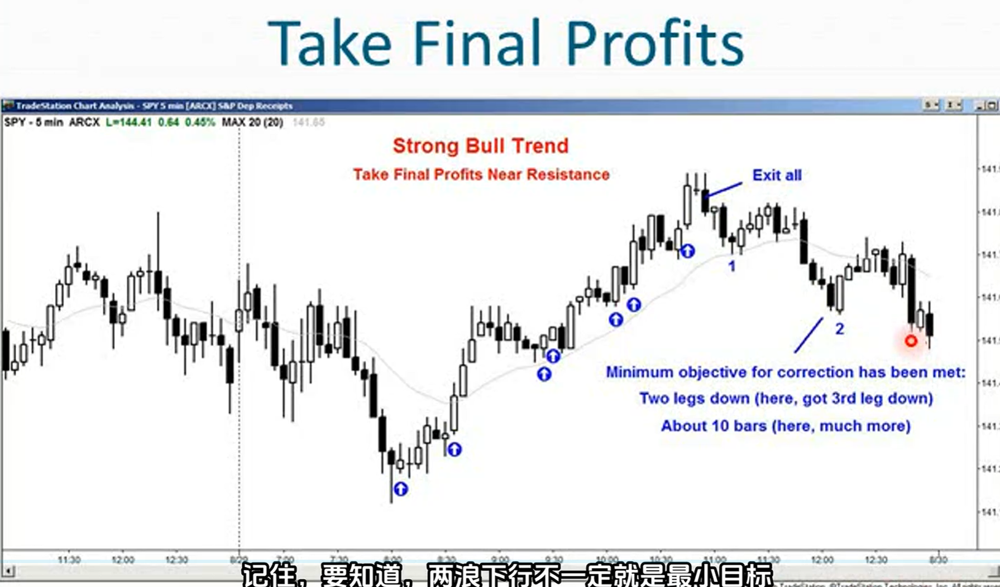