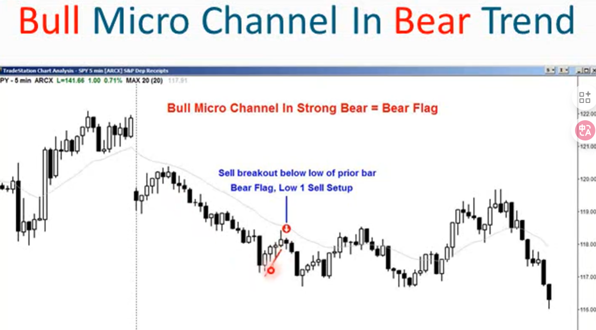
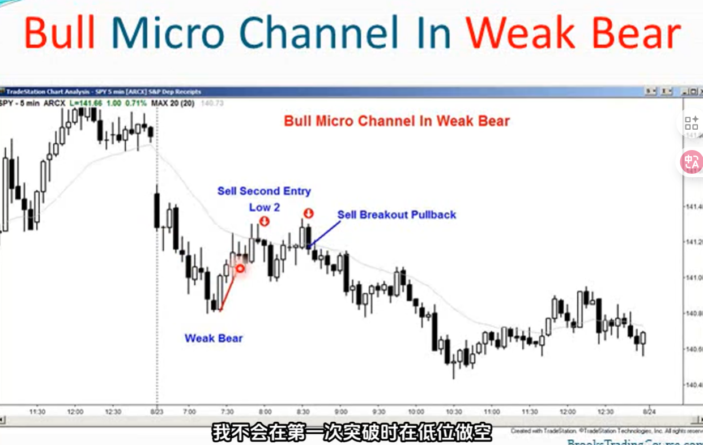
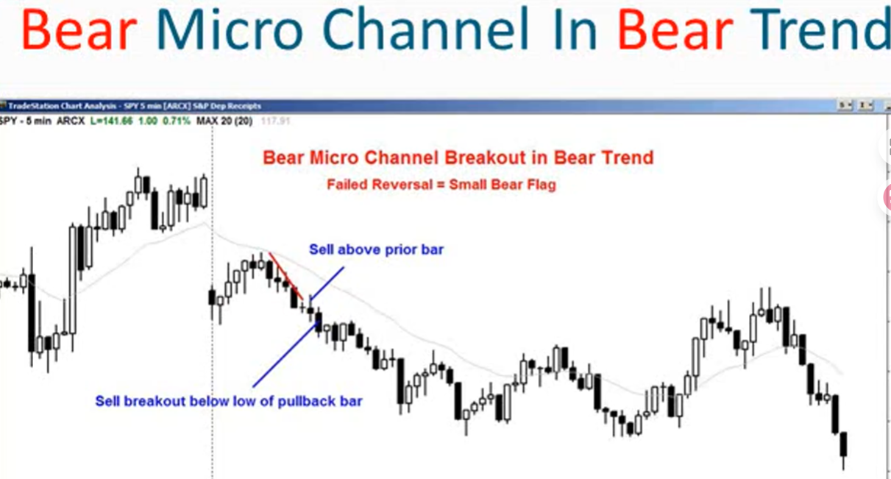
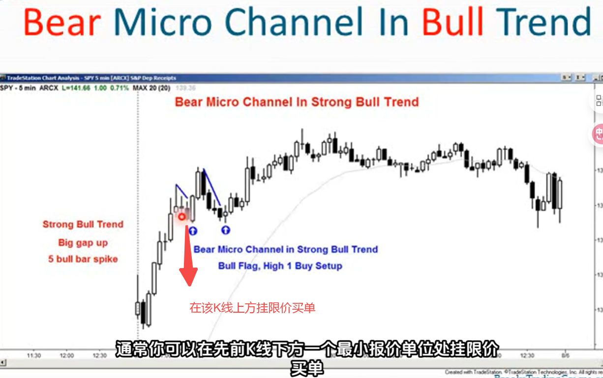
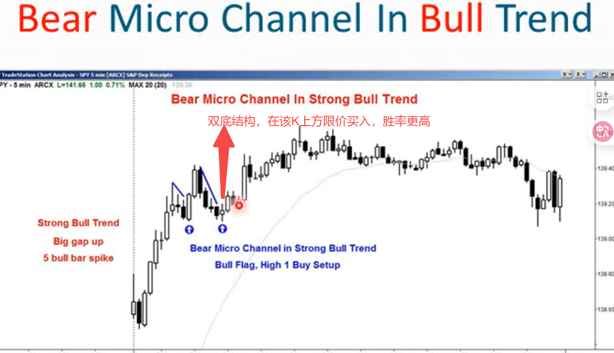
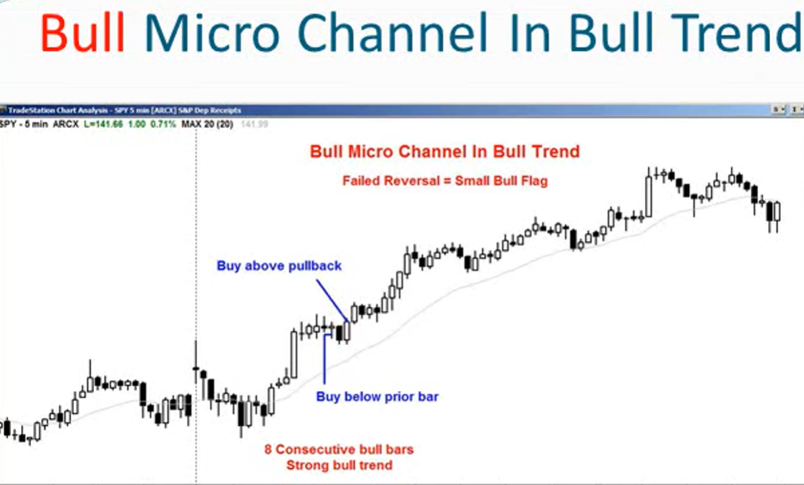
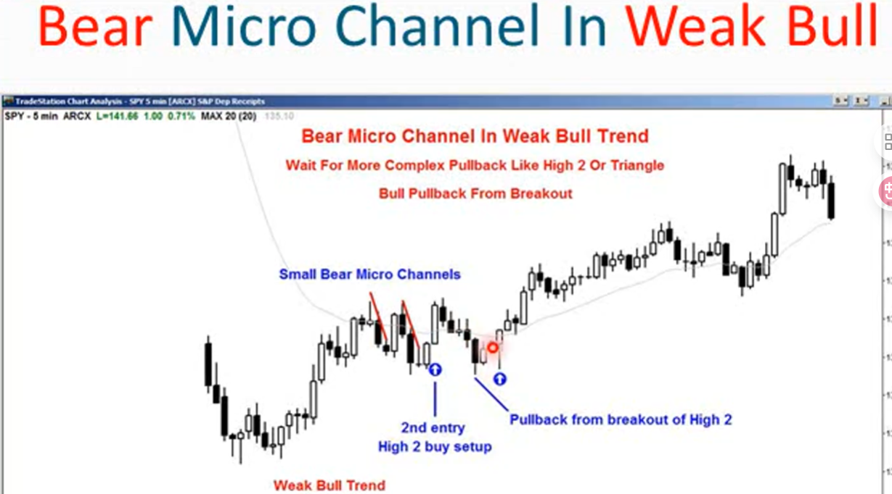
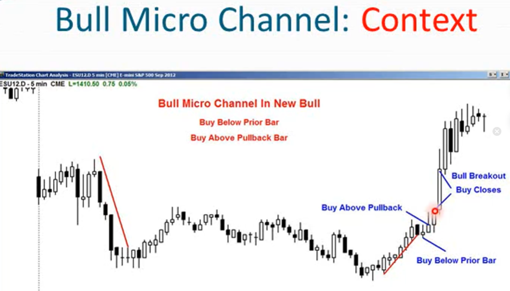

1. 微型趋势线是指在任何时间框架上，可以连接大约2-10根K线绘制而成的趋势线，其中大部分K线触及或接近该趋势线，通常这些K线相对较小
2. 一旦绘制出一条微型趋势线，然后绘制一条平行线，使其恰好接触K线相对的另一端，从而形成一个微型通道（例如，在上升趋势中，平移后的线接触一系列价格高点），这个通道非常非常狭窄。20年前，人们认为这是程序化交易的结果
3. 实际上，只需要使用趋势线即可，不必绘制第二条线。因为交易是基于趋势线进行的，不必绘制第二条线才进行交易
4. 出现多头微型通道时，是买盘压力的信号，出现空头微型通道时，是卖盘的信号
5. 微型通道的一个特点是没有回调，K线持续上涨，当前K线的低点不会低于前一根K线的低点，一旦突破，通道即结束（只要没有回调就可以成为微通道，即使像一个台阶那样）
6. 和传统通道不同，微通道的发展没有回调
7. 微通道有时会出现一次回调，然后继续微通道延续5-10根K线，这被成为连续微通道或tight通道。总之，这是价格强力走势的信号
8. 如何交易微通道？取决于微通道出现的位置。多头和空头微通道都可能发生向上或向下的突破。如：牛市微型通道（向上倾斜的窄通道）通常意味着强烈的买盘。但如果它向下突破，则是一个极其强烈的趋势反转信号，表明买盘突然枯竭
9. 多头微通道在熊市趋势中
    - 这可能是一次反转尝试，所以很可能失败，最终演变成空头旗形
    - 这形成了一个Low1的做空形态
    - 所以可以在先前低点下方挂限价卖单
    - 随着微通道K线继续上行，某一时刻会有一根K线的价格低于之前K线的低点，这将触发做空，此时进入空头头寸
    
10. 在一个强劲的熊市趋势中，多头微通道在第一次下跌突破时做空
11. 在一个弱势的熊市趋势中
    - 多头微通道最好等待二次入场时机做空，其形式可能是Low2或三角形形态
    - 等待突破后的回调，当价格第一次向下突破微通道后，可能会有一个回抽动作，再次测试通道下轨（此时已变为阻力位）。当价格在回抽到这个阻力位并显现出弱势时，是理想的做空时机。
    
12. 单纯的微通道在单纯的趋势中（如空头微通道在熊市趋势中）
    - 牛市突破是一次反转尝试，由于单纯趋势+单纯通道所以趋势很强劲，反转尝试大概率会失败
    - 交易者应该在反弹失败、趋势恢复的时刻入场做空
    - 激进做空点：在反弹过程中，当一根K线突破了前一根K线的高点，但随即显示出无力继续上涨的迹象时
    - 稳健做空点：等待反弹结束，价格开始回落，并跌破了“回抽K线”（即反弹结束后的第一根下跌K线）的低点。
    
13. 空头微通道在多头趋势中
    - 由于属于多头趋势中，所以空头微通道（即使是最强的通道类型）属于反转，也应该失败
    - 观察到多头信号（也就是上升旗形），High1买入形态
    - 在前一根K线高点上方买入
    
    
14. 牛市微通道在牛市趋势中
    - 牛市通道中任何K线的突破都是试图扭转牛市趋势的信号，而在强劲趋势中，总是会失败
    - 在微通道上涨过程中低于前一根K线的最低点限价买入  
    
15. 牛市通道在弱牛趋势中
    - 最好等待第二次入场机会，也就是High2或三角形
    - 或者等待突破后在回调时买入
    
    