1. 交易区间是无休止的回调
2. 当回调时间过长时，如果无法判断突破向上还是向下，就回调就成为了交易区间
3. 回调成为交易区间后，原来的的趋势将失去影响
4. 在熊市趋势中发生了回调，交易者会认为出现熊市突破，并恢复趋势，回调是趋势的一部分
6. 趋势回调持续了20根或更多K线时，熊市就会成为遥远的过去，对当前的走势失去影响。交易者不在认为是回调，而是交易区间
7. 交易区间中，向上突破和向下突破的概率相同
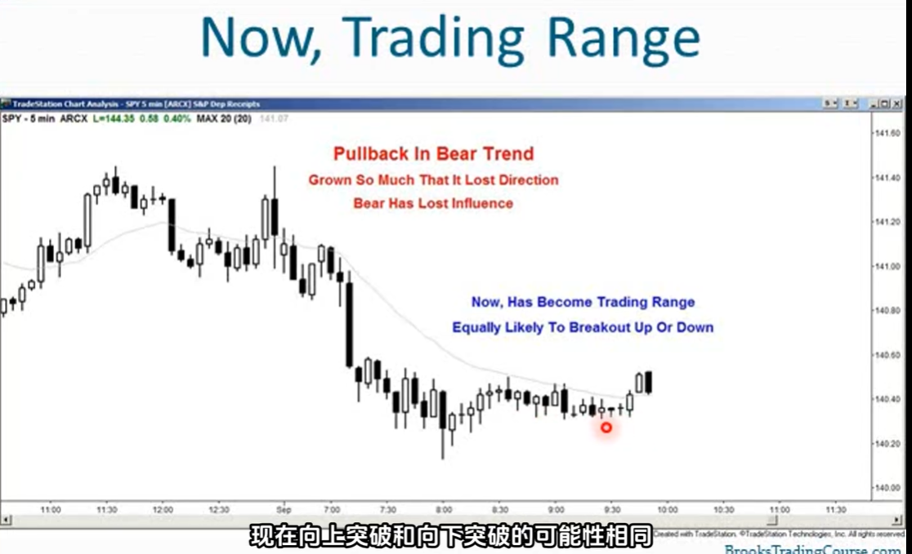
8. 交易区间总是试图突破，价格急剧上涨到顶部，又迅速跌到底部看起来要突破，但大多数都会失败，最终会迎来一次成功的突破
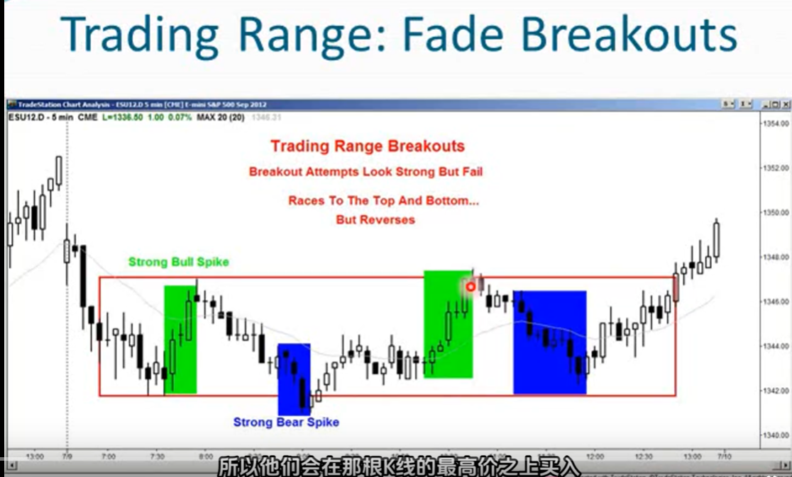
9. 在盘整区间内，市场会极速冲向顶部，也会极速跌至底部然后反转，应当按照这种规律进行交易
10. 在交易区间内，总是在试图突破，多空双方最终一方获胜，另一方失败，结果明朗之前，双方都会进行多次尝试
11. 趋势的起点实际发生在交易区间内（非常重要）
12. 交易区间内大多数趋势都会失败，最终有一个成功
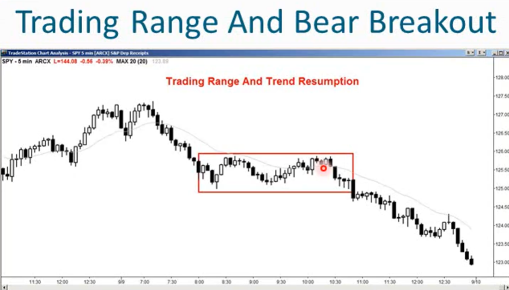
13. 在交易区间形成的时候，往往有迹象显示突破的方向，如一系列阳线或阴线
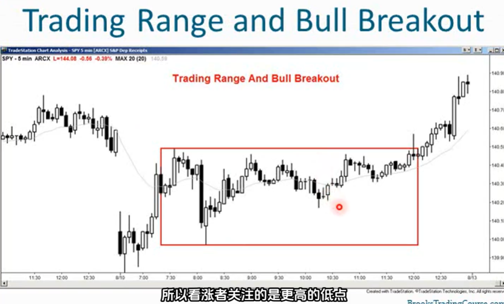
14. 非常强劲的趋势突然反转时 ，这并不是新闻导致的
    - 这是技术性的，但是你需要去知道目标位
    - 市场会迅速受到支撑位和阻力位的吸引就像磁铁一样
    - 市场离目标位越近，移动速度越快。当市场朝着目标位移动时，会看到越来越大的趋势k
15. 真空效应，支撑位和阻力位会迅速将市场吸引过去
    - 趋势线
    - 前高和前低
    - 测量走势目标位（交易区间的高度、钉子K线的高度、测量缺口位）
16. 假设市场从一个交易区间向上突破，那么市场会基于该交易区间的高度快速上涨至一个测量走势目标位
17. 假设市场出现一个强劲的光头长钉形态，那么市场通常会回调，回调的点数和长钉的高度相等
18. 市场上行后突然突破，这个突破可能会形成一个测量缺口，市场可能会在该缺口上方上涨和到达该缺口相同的幅度
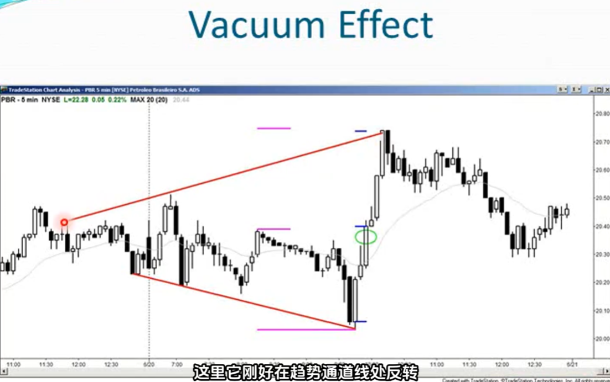
19. 一旦市场接近交易区间的顶部或底部，就处于区间边缘的引力场边缘范围内。越靠近顶部和底部磁力就越强，市场的走势会越来越快。此时市场看起来走的非常强看起来要突破的样子
20. 新手交易者们会看到由真空效应形成的大趋势线后，在每一个小回调形成时买入，然而80%这些很强的大趋势K试图突破交易区间，总是会失败。市场会反转，然后测试相反方向的目标位
21. 一旦市场触及磁力点，磁力会消失，然后市场会大概率反转
22. 新手交易者们看到了如此强的趋势k，他们会想在回调时买入，然后捉住second leg，他们迫不及待参与突破中，然后市场涨一根K线，形成一个小双顶，然后下跌，他们被困住了
23. 新手交易者被困住后，回调幅度越来越大，交易者们止损后助推了回调的速度，直到市场来到真空区间到达交易区间的另一端，然后重复这一过程
24. 在交易区间接近顶部的地方出现强劲的Bull Spikes（但尚未到达顶部），空头们看到了交易区间的顶部，认为市场还会再涨一点，就会停止做空，等到达到顶部才开始做空。多头们也是同样的情况，他们等待获利了结。一旦市场涨到顶部，多头就会获利了结，空头们也会开始做空，这都会导致反转下跌
25. 这就是为什么区间顶部会出现大阳线，区间底部会出现大阴线
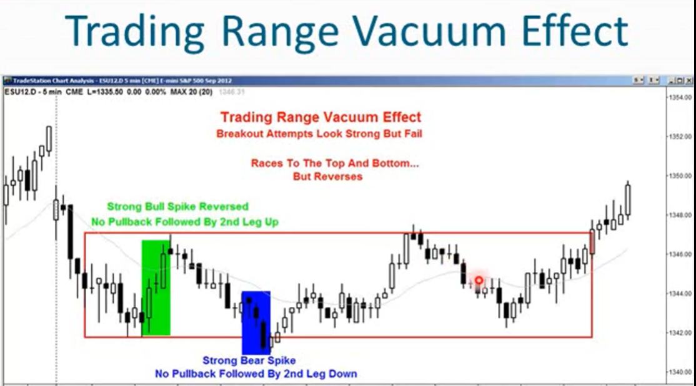
26. 真空效应造成了买入失衡，没有人想卖出，市场会迅速攀升至某个价位。当市场来到某个价位时，卖家就会突然出现。上涨的过程中，市场可能会以1-3根非常大的多头趋势K的形式急速上涨，市场被推升至阻力位
27. 一旦市场达到阻力位，强大的卖家突然出现，多头强力卖出以平仓所有多头头寸，空头强力卖出以建立空头头寸。在区间顶部价位已经没有人愿意买入，即使此前上涨极为强劲，市场也会反转，市场被打压至区间底部，然后这个过程再次向相反方向重复
28. 不要压住突破行情
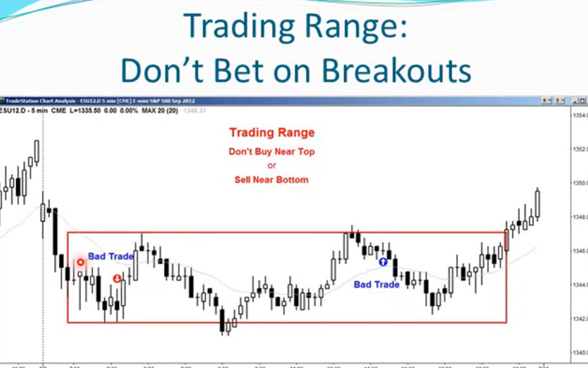
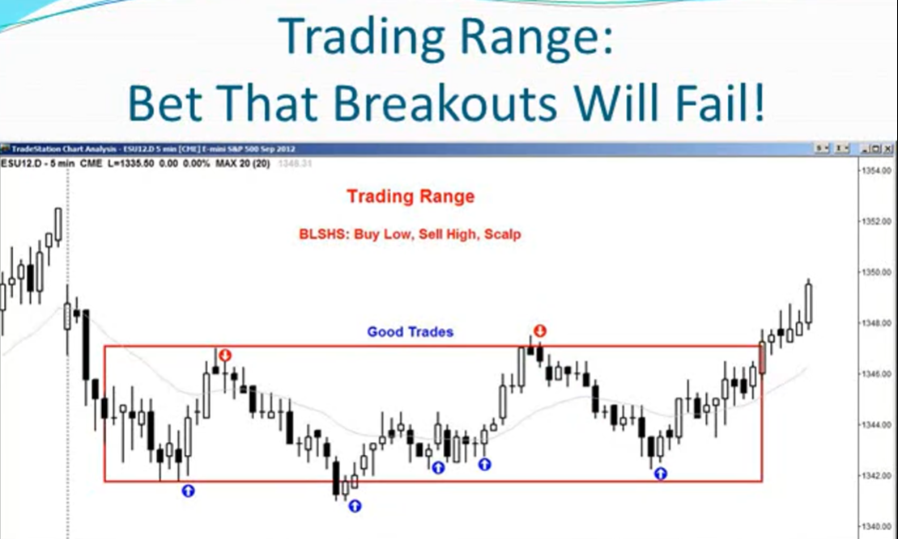
29. 交易区间内要逢低买入，逢高卖出，寻找反转信号，多利用限价单
30. 最终，交易区间迎来一次成功的突破。等待看突破是否强劲总是更好的操作手法。判断真突破的特征：
    - 很大的突破K或者趋势K，直接突破交易区间的上沿 
    - 突破方向没有影线
    - 市场环境必须有利，突破必须合乎逻辑
    - 后一根或后两根k要有跟随
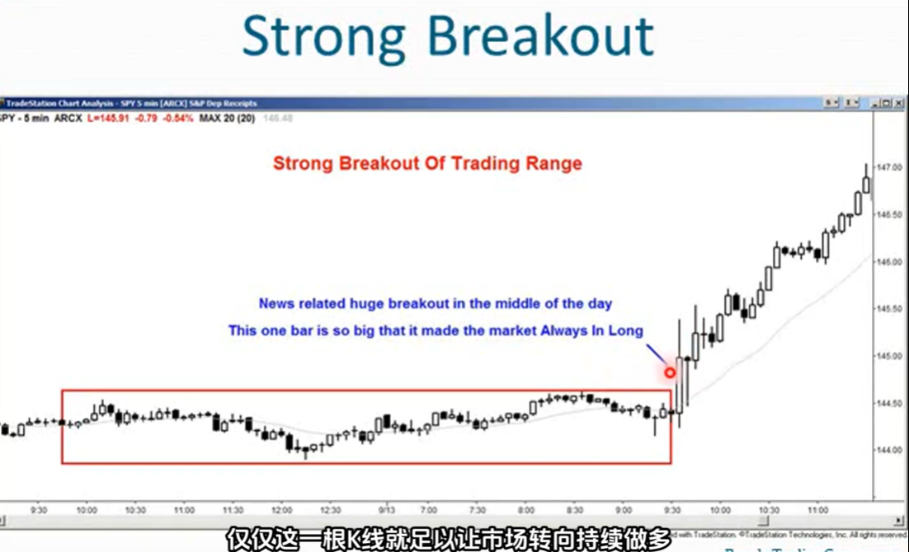
31. 突破可能是一个强劲的突破，也可能是缓慢过渡到一个通道
32. 市场常常同时处于交易区间和通道中，通道交易者（认为市场正在向趋势转变的交易者）常常会提前开始布局 
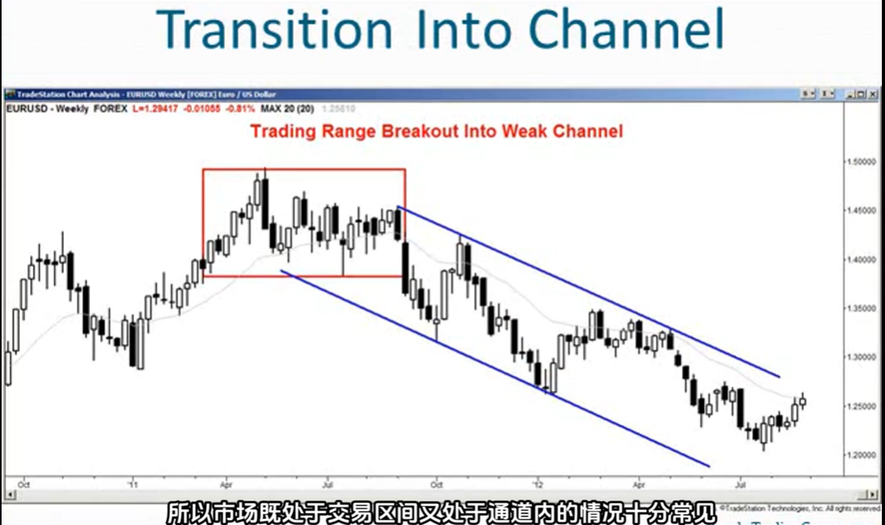
33. 所有交易区间最终都会突破形成趋势，通常买入和卖出压力之间存在不平衡，这为突破的方向提供线索，这常常使交易者能够在突破前进行波段交易   
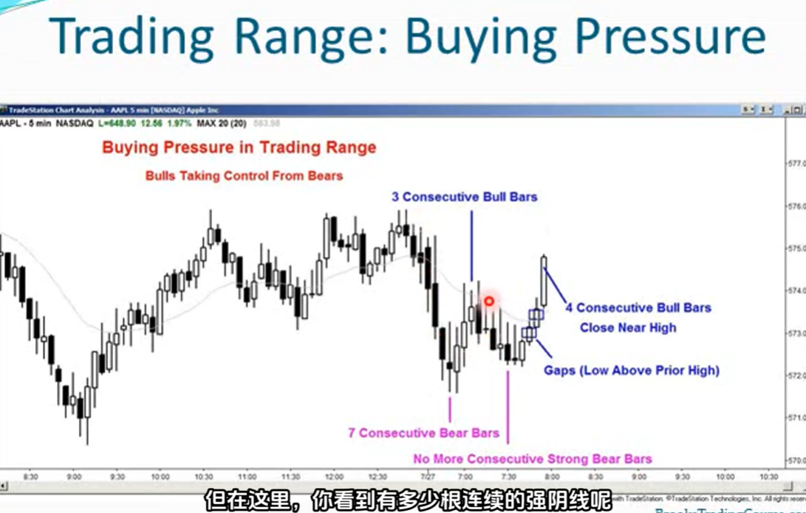
34. 即便图表处于强劲趋势的阶段，也会有双向交易的阶段，当这些阶段短暂就是回调，预期趋势会恢复。当时间较长10-20-30根K线时，称之为交易区间，此时左边的趋势离它太远对它失去了影响力
35. 所有回调在当前查看的图标上都是小的交易区间，所有交易区间在更高的时间框架上都是回调
36. 不确定性是交易区间的标志，一旦你感到无法确实市场的趋势是恢复还是向上或向下突破，市场就进入了盘整区间
37. 每当对市场感到困惑时，就是处于交易区间，此时该逢低买入，逢高卖出做超短线
38. 每当市场在区间底部进行抛售时，多头希望跌的更低，但又怕他不跌，开始少量买入。很多时候市场没有跌到他们期望的低位，然后就开始反转上涨
39. 市场在交易区间中时，大部分时间位于中间价位，在底部和顶部停留的时间极少。价格不断被推回到区间中部，因此明智的操作手法是：在底部附近买入，在波动区间上半部分获利了结，然后在顶部附近寻找卖出机会，在波动区间下半部分获利
40. 如何判断当前是一个震荡交易日：很多时候当前的第一根K线，又或者前10根K会给出一个信号，表明区间震荡。所以必须留意第一根k线、前2根、前5根、前10根。 
    - 第一根K是十字星
    - 第一个小时内多跟十字星
    - 第一个小时内出现多次反转
    - 很多重叠的k线
    - 很多阳线和阴线交替出现
    - 移动平均线水平
    - 没有跳空缺口
    - 昨天是一个震荡交易日
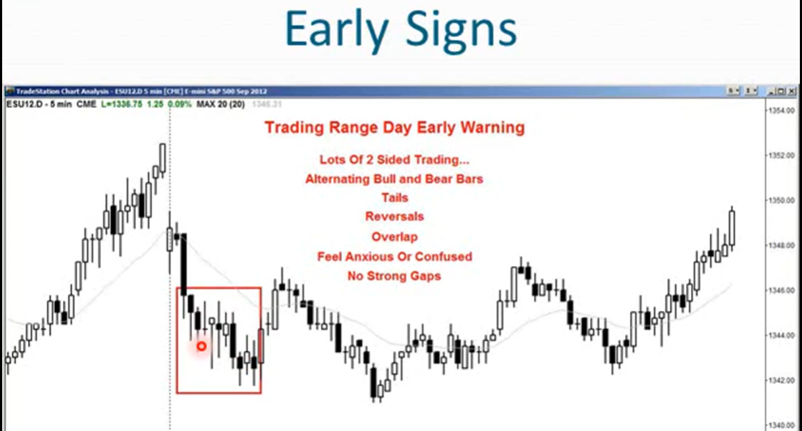