1. 急速接通道，通道看反转，反转接0.5回撤或者通道起点
2. 通道会有75%概率形成区间，只有25%概率延续通道方向俗称过冲，过冲通常在10根以内跌下来（2腿）或者5根（1腿）
3. 在通道0.5回撤，可以接，买一个趋势恢复
4. 区间高抛低吸是一个宽止损的交易，盈亏比不要超过2
5. 区间突破3-5根不回头，手动止损，一般3根不会到区间直接走人
6. 剥头皮是快速获利，通常1-5根k内平仓，趋势交易拿两腿，通常是15-20根k左右
7. 上下影线都很长的K线看成是交易区间
8. 市场三大原则：惯性（趋势很难被反转、区间很难被突破）、磁吸、对称
9. 市场的目的是为了促进交易（收敛就会导致大的单边）
10. 每次价格创出新低，交易量都在减少。这是反转的迹象，因为市场的目的是促进交易
11. 如果交易新闻？先轻仓观察款止损，市场选完方向了追涨杀跌即可。市场往下走之前通常会往上涨诱骗你
12. 所有大的亏损都来自于你不愿意认输
13. 如何交易回调？在回调方向的人亏损并退出时沿着趋势方向做
14. 两种力量控制着市场：市场环境和动能
15. 一个支撑位最多能撑着3次，一般2次
16. 大的突破一般走7根大K线左右，两段式10根，复杂回调15根
17. 左侧进场1.5盈亏比，右侧进场3-4的盈亏比
18. 如何交易假突破（假设多头假突破），看到当前k超过前高了，立刻在前一根k阳线的开盘价挂止损做空单
    - 如果真突破了，空单不会成交
    - 如果假突破了，空单正好入场
19. 强势空头信号K：低于前一根k的，俗称吞没
20. 信号k之后，没有跟随，是十字星、内包k都是弱势的表现，跟随不好
21. 很强的空头趋势中，看到不强的阳线，直接收盘开空，占便宜拿到更好的点位
22. 内包k作为信号k，也是很不错的
23. 外包k包的越多越有用，后续回到外包k低点，可以形成支撑
24. 大的外包k线有时是突破和进场k，因为是吞没。因为收盘在区间外，因此可以直接收盘做空
    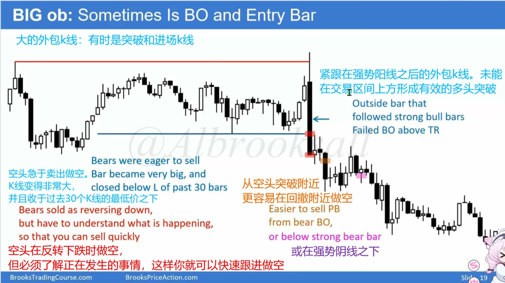
25. 一根大阳线，后面的几根k都在大阳线内部，看下跌。因为这其实是一个楔形/三推/末端旗形
    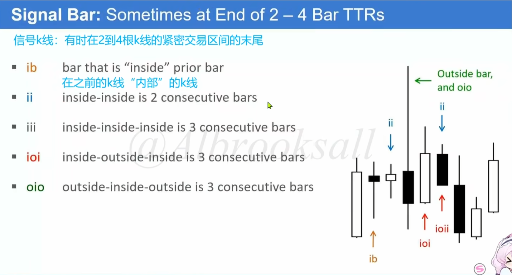
26.  牛市末期的扩张三角形，大概率是最终旗形，看反转，俗称钻石反转
    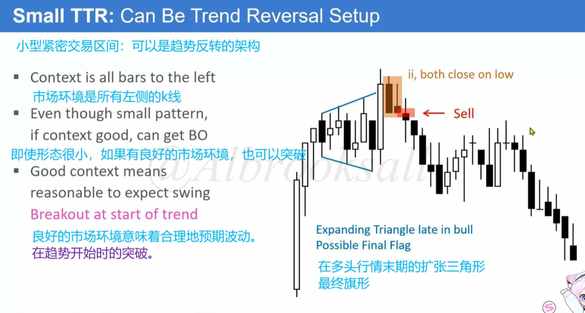
27. 在突破后的ioi形态，看回调是一个旗形
    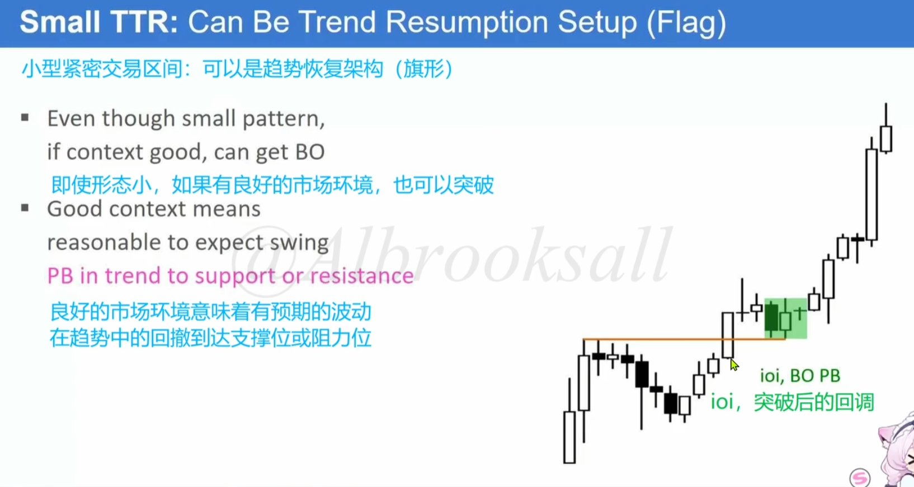
28. 其实后期，大k线之后，迟迟未形成突破，可能导致反转
    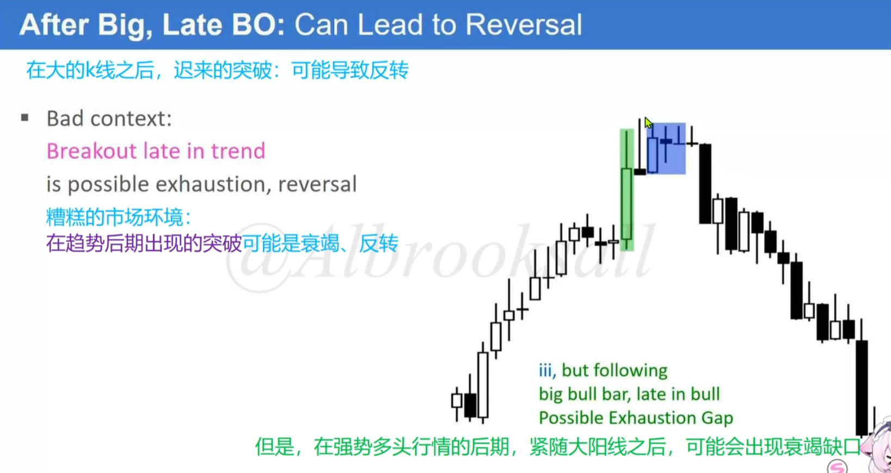
29. 大的外包k，用限价单赌交易区间突破失败更好，尤其上下影线很长的。因为外包k通常是紧密交易区间的一部分
    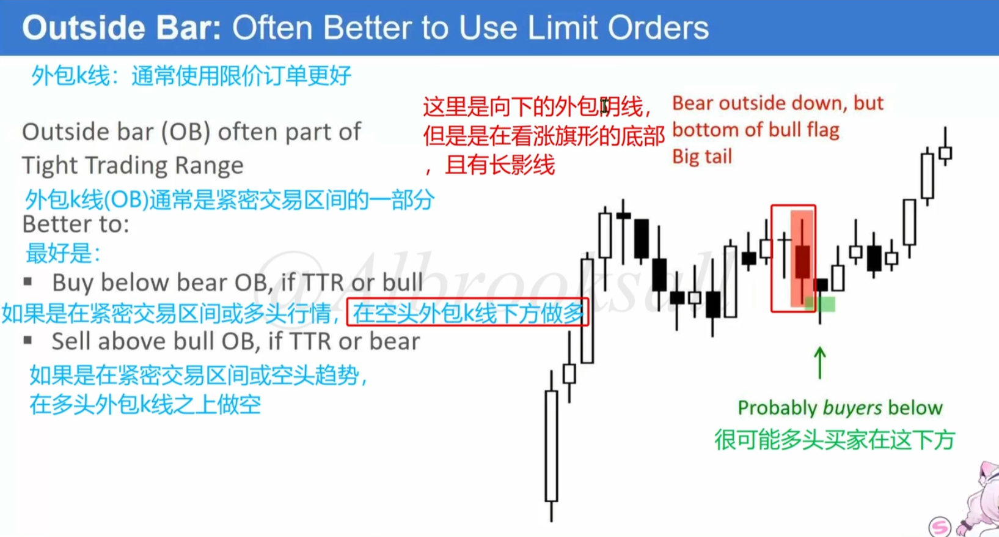
30. 如果外包k前一根k也很大，可以看双k反转，趋势延续
    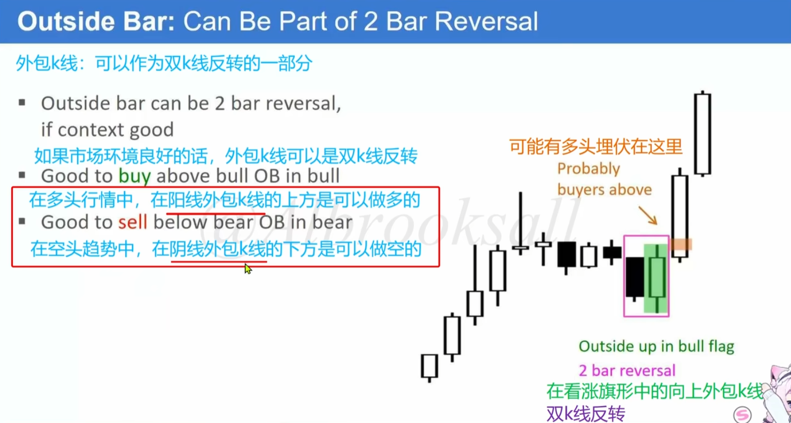
31. ii是收敛三角形，在ii上方和下方止损单追涨杀跌
    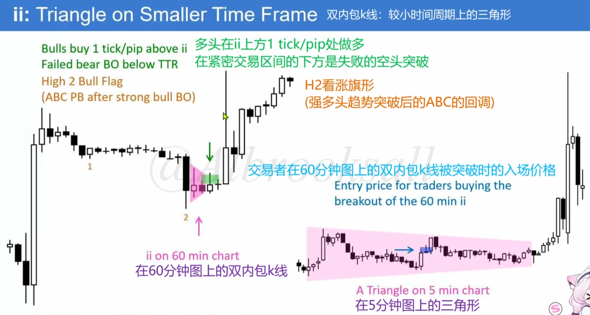
32. 当长上影线形成信号k时，可以在影线50%处直接限价做空
    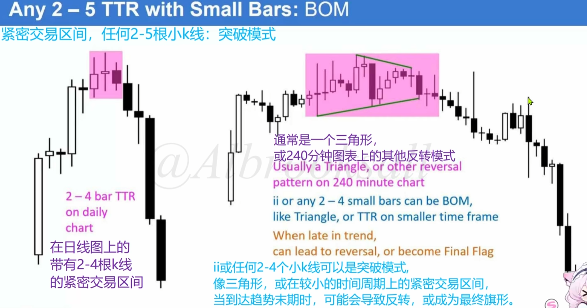
33. 当信号k和市场环境不佳时，采用款止损+分步建仓法，两单赢一单
    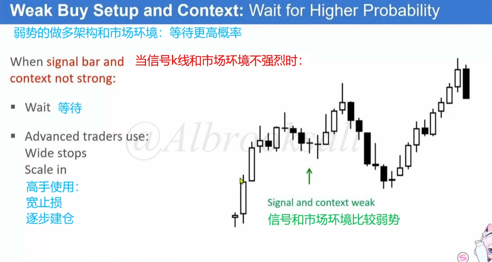
34. 一个趋势回调到了0.5，那么意味着大概率区间了，好的趋势不会回调这么深。一般最多回调0.382，当回调到趋势起点时，因为是区间，可以找机会继续做空。尤其这种从0.5继续下跌，但都没有填补针（针就是fvg），证明趋势很差了，可以寻找做多机会
    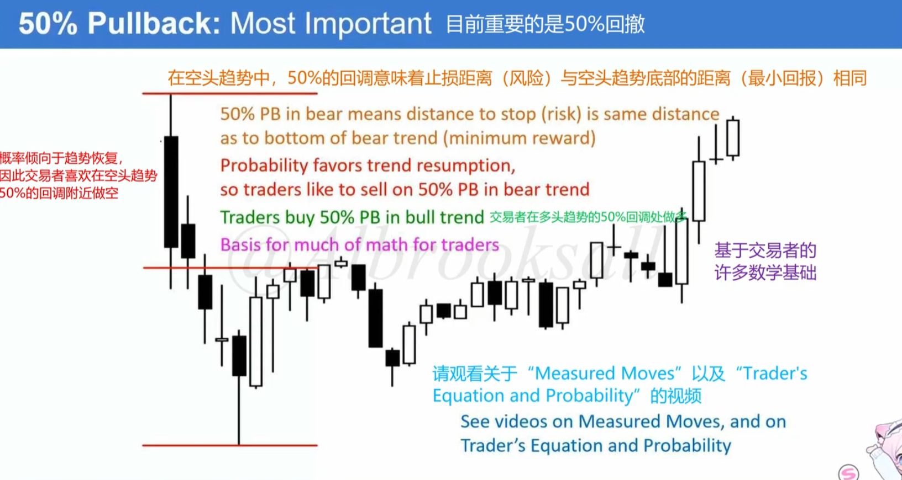
35. 
